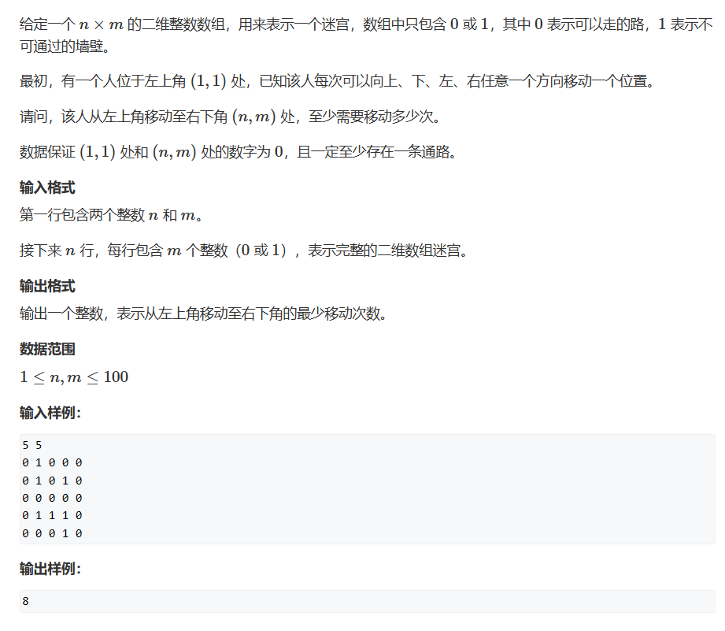
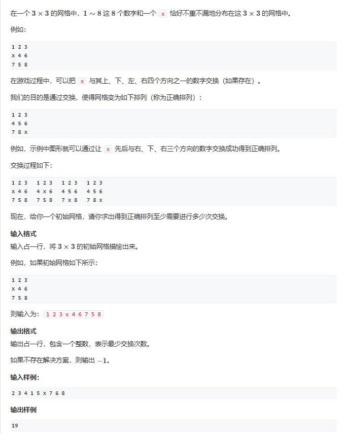
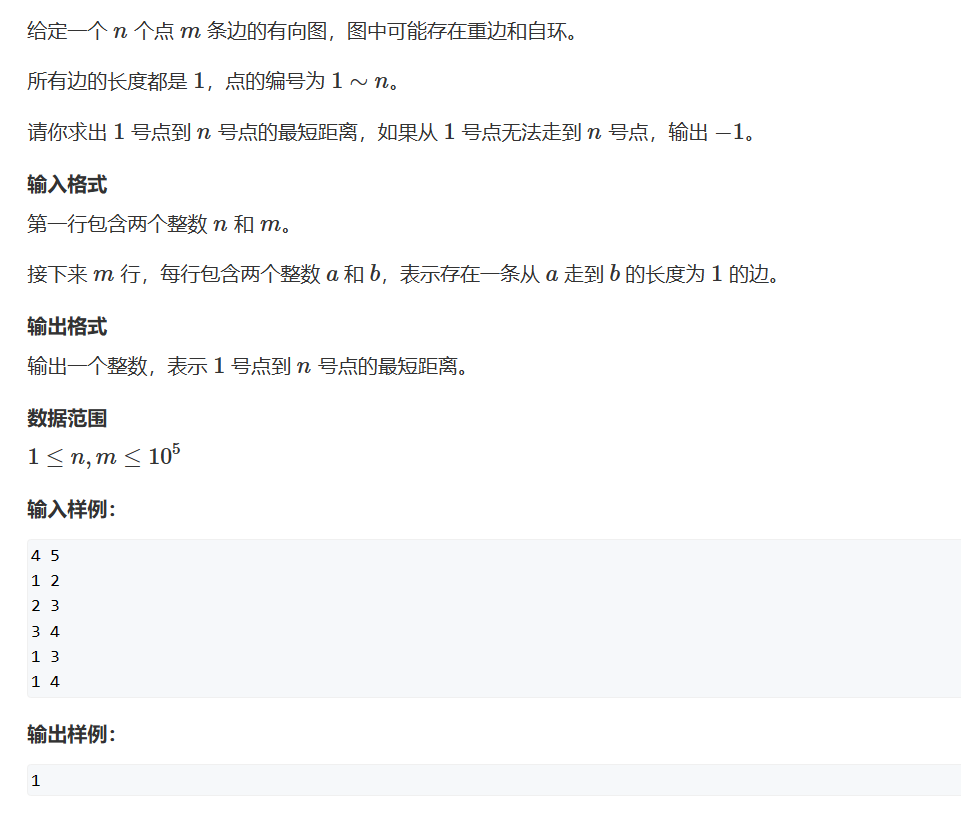

# BFS
BFS为广度优先算法，计算储存所有距离相同的元素。    
只有当所有元素权重相同时才能使用BFS去计算最短路问题。    
BFS一般有固定的框架可以套用：
```cpp
queue = 初始化;
while(queue.empty())
{
    auto t = queue.front();
    扩展t;
}
```
## 题一

```cpp
#include <iostream>
#include <utility>
#include <queue>
#include <cstring>
const int N = 110;
using PII = std::pair<int, int >;
int n, m;
int g[N][N], d[N][N];
std::queue<PII> ifWay;
int bfs()
{
	ifWay.push({0,0});      //记录起点
	std::memset(d, -1, sizeof d);       //将距离初始化为-1表示没有走过
	d[0][0] = 0;    //此时我们进入了起点，走过了+1，也就是=0
	int dx[4] = { -1,0,1,0 }, dy[4] = { 0,1,0,-1 };     //定义四个方向向量
	while(!ifWay.empty())       //判断我们的路是否走完
	{
		auto t = ifWay.front();
		ifWay.pop();            //取出最前面的路
		for(int i =0;i<4;i++)   //判断四个方向是否可走且将可走的路存入队列中
		{
			int x = t.first + dx[i], y = t.second + dy[i];
			if(x>=0&&x<n&&y>=0&&y<m&&g[x][y]==0&&d[x][y]==-1)
			{
				d[x][y] = d[t.first][t.second] + 1;
				ifWay.push({ x,y });
			}
		}
	}
	return d[n - 1][m - 1];     //输出终点到起点的距离，为什么会最短呢？手写一遍就知道啦！其实本质就是我们每次走到的路打下的标都是到起点的最短距离，如果用深度优先搜索就会出现其他值，因为我们存入的数并不是最短距离
}
int main()
{
	std::cin >> n >> m;
	for (int i = 0; i < n; i++)
		for (int j = 0; j < m; j++)
			std::cin >> g[i][j];
	std::cout << bfs() << std::endl;
}
```
## 题二

```cpp
#include <iostream>
#include <queue>
#include <string>
#include <unordered_map>
#include <algorithm>

int bfs(std::string start)
{
	std::string end = "12345678x";
	std::queue<std::string> q;
	std::unordered_map<std::string, int> d;

	q.push(start);
	d[start] = 0;
	int dx[4] = { 1,0,-1,0 }, dy[4] = { 0,1,0,-1 };
	while(q.size())
	{
		auto t = q.front();
		q.pop();
		if (t == end) return d[t];
		int distance = d[t];
		//状态转移
		int k = t.find('x');
		int x = k / 3, y = k % 3;	//将一维数字转换为二维坐标的常用技巧，x = k / n, y = k % n;
		for(int i =0;i<4;i++)
		{
			int X = x + dx[i], Y = y + dy[i];
			
			if(X>=0&&X<3&&Y>=0&&Y<3)
			{
				std::swap(t[k], t[X * 3 + Y]);
				if(!d.count(t))
				{
					d[t] = distance + 1;
					q.push(t);
				}
				std::swap(t[k], t[X * 3 + Y]);
			}
		}
	}
	return -1;
}
int main()
{
	
	char s[2];

	std::string state;
	for (int i = 0; i < 9; i++)
	{
		std::cin >> s;
		state += s;
	}

	std::cout << bfs(state) << std::endl;
}
```

## 树与图的广度优先算法（无权图最短路）



```cpp
#include <cstring>
#include <iostream>
#include <queue>

const int N = 100010, M = 2 * N;
int n,m, idx;
int h[N];	//下标为图节点的编号，值为该编号的节点在数组的哪个位置
int e[M];	//储存值，此题就是节点的编号，下标是在数组中的位置
int ne[M];	//储存next值，下标是在数组中的位置
int d[N];	//记录到根节点的距离，下标表示编号
void add(int a, int b)
{
	e[idx] = b, ne[idx] = h[a], h[a] = idx++;
}

int bfs()
{
	memset(d, -1, sizeof d);	//另所有的d等于-1代表没有走过
	d[1] = 0;					//根节点到根节点的距离为0
	std::queue<int> q;			//储存编号的队列
	q.push(1);					//以1为根节点开始遍历

	while(q.size())
	{
		int t = q.front();	//记录路径
		q.pop();
		for(int i = h[t];i!=-1;i=ne[i])		//i为图中元素在数组模拟中的下标位置
		{
			int j = e[i];					//取出它在图中的编号
			if(d[j]==-1)					//判断是否走过这个点
			{
				d[j] = d[t] + 1;
				q.push(j);
			}

		}
	}
	return d[n];		//输出最后一个编号距离根节点的距离
}
int main()
{
	std::cin >> n>>m;
	memset(h, -1, sizeof h);
	for (int i = 0; i < m; i++)	
	{
		int a, b;
		std::cin >> a >> b;
		add(a, b);		//因为是有向图，所有我们在模拟中只记录被指向的元素
	}
	
	std::cout << bfs();
}
```

