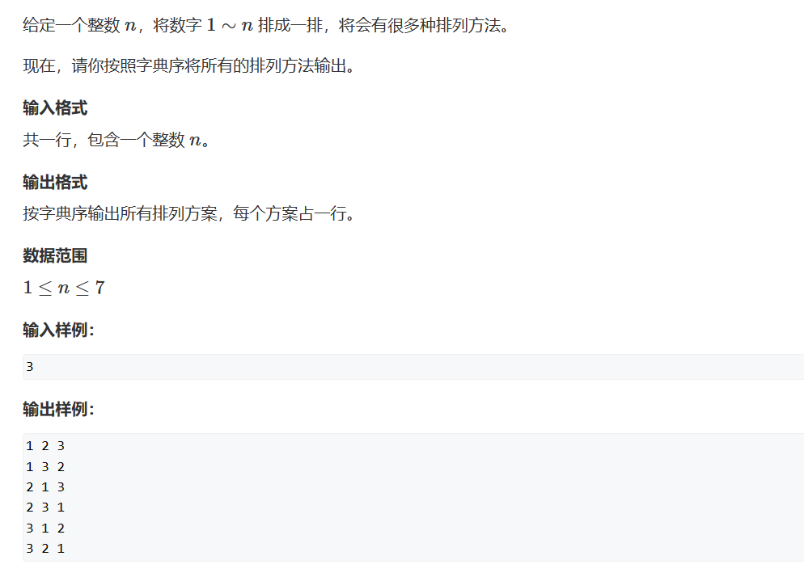
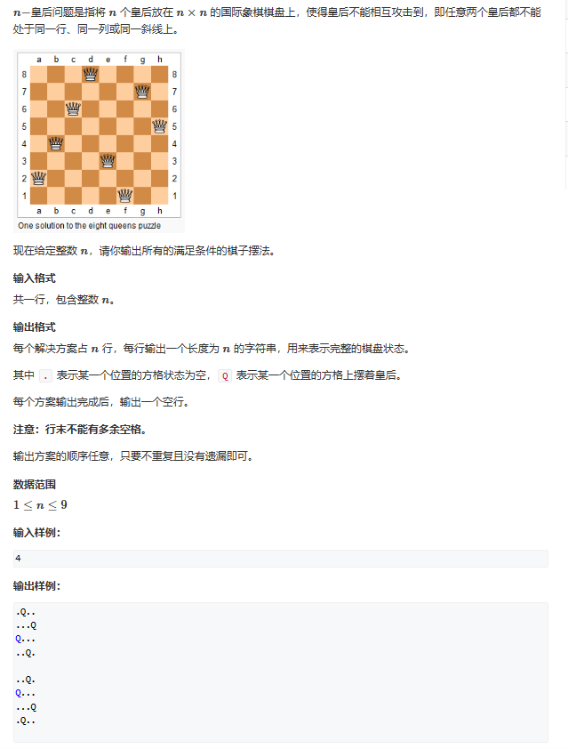
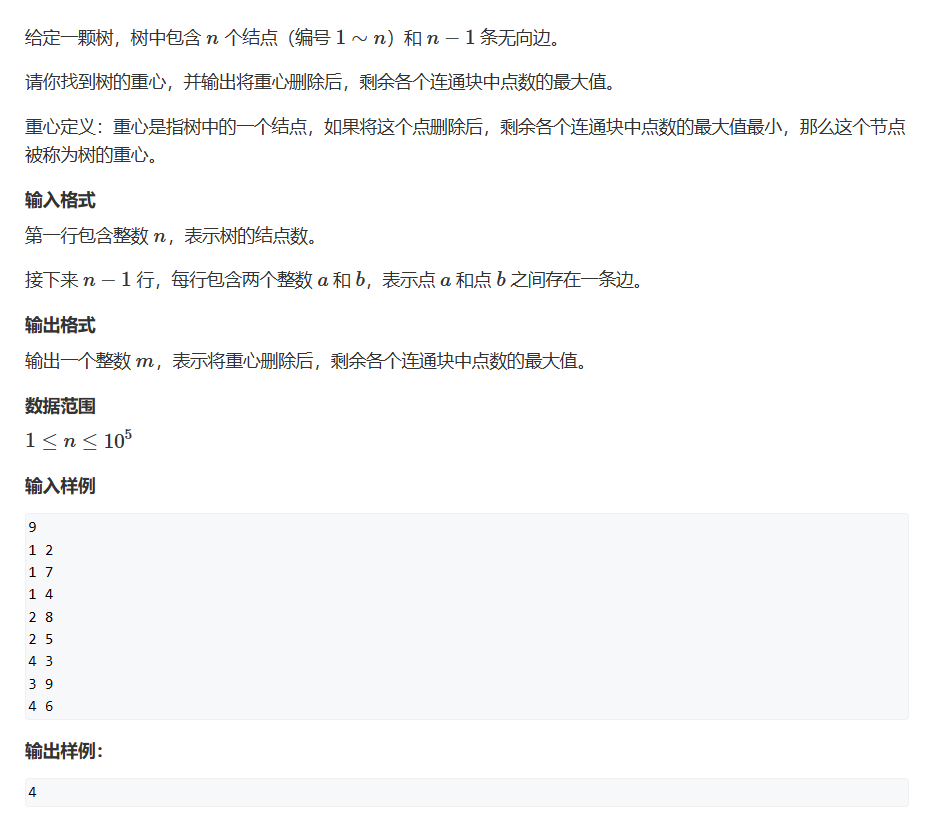
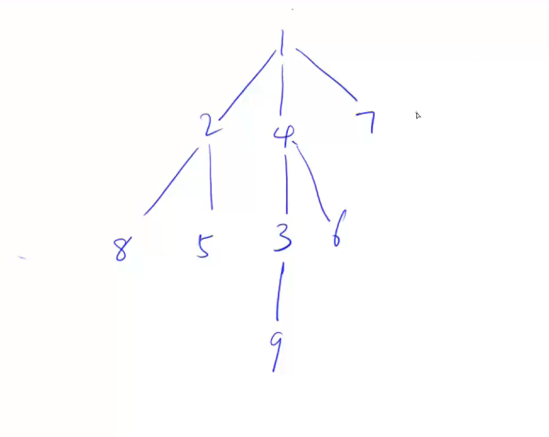

# DFS

## 题一


```cpp
#include <iostream>
const int N = 10;
int numbers[N][4];
int path[N];
int n;
bool st[N];
void dfs(int u)
{
	if(u==n)
	{
		for (int i = 0; i < n; i++) std::cout << path[i] << " ";
		std::cout << std::endl;
	}
	else
	{
		
		for(int i = 1;i<=n;i++)
		{
			if (!st[i])
			{
				path[u] = i;
				st[i] = true;
				dfs(u + 1);
				path[u] = 0;
				st[i] = false;
			}
		}
	}
	
	
}
int main()
{
	std::cin >> n;
	dfs(0);
}
```


和树很像
## 第一种搜索顺序
按列搜索，我们每一列必定要放一个
```cpp
#include <iostream>
const int N = 20;
int y[N],dg[N],rdg[N];
char game[N][N];
int n;
void dfs(int u)
{
	if(u==n)
	{
		for (int i = 0; i < n; i++)
		{
			puts(game[i]);
		}
		puts("");
	}
	else
	{
		for(int i = 0;i<n;i++)
		{
			if (!y[i]&&!dg[i-u+n]&&!rdg[i+u])
			{
				game[u][i] = 'Q';
				y[i] = dg[i - u + n] = rdg[i + u] = true;
				dfs(u + 1);
				y[i] = dg[i - u + n] = rdg[i + u] = false;
				game[u][i] = '.';
			}
		}
	}
	
	
}
int main()
{
	std::cin >> n;
	for (int i = 0; i < n; i++)
		for (int j = 0; j < n; j++)
			game[i][j] = '.';
	dfs(0);
}
```

## 第二种搜索顺序
按位搜索
```cpp
#include <iostream>
const int N = 10;
bool X[N],Y[N], dg[N*2], rdg[N*2];
char game[N][N];
int n;
void dfs(int x,int y,int s)
{
	if(s>n) return; //s会越界，当我们的皇后多于s后需要终止递归
	if (y == n) y = 0, x++;     //y值会越界，当越界时我们指向下一行的第一个

	if (x == n)     //到了最后一行
	{
		if(s==n)    //此时如果皇后等于n，那么满足条件输出
		{
			for (int i = 0; i < n; i++)
				puts(game[i]);
			puts("");
		}
		return;
	}
    //初始化
	game[x][y] = '.';   
    //不放皇后
	dfs(x, y + 1, s);
    //放皇后
	if(!X[x]&&!Y[y]&&!dg[x+y]&&!rdg[x-y+n])
	{
		X[x] = Y[y] = dg[x + y] = rdg[x - y + n] = true;
		game[x][y] = 'Q';
		dfs(x, y + 1, s+1);
		X[x] = Y[y] = dg[x + y] = rdg[x - y + n] = false;
		game[x][y] = '.';
	}
}
int main()
{
	std::cin >> n;
	dfs(0,0,0);
}

```
## 树与图的深度优先遍历

树是一种特殊的图，所以我们一并使用图的思路来做。而图的深搜有一定的框架：
```cpp
//树和图深搜的基本框架
void dfs(int u)
{
	ifMeet[u] = true;
	for(int i = h[u];i!=-1;i=ne[i])
	{
		int j = e[i];
		if (!ifMeet[j]) dfs(j);
	}
}
```
现在我们回到题目，题目让我们求得值是什么意思呢？比如当我们把书画出来后，我们将4删除得话就只剩下 1-7-2-8-5、3-9和6是连在一起的，此时他们个数的最大值是5，也就是第一个连通块，我们要求的就是最小的这个最大值。

```cpp
#include <cstring>
#include <iostream>
#include <algorithm>

const int N = 100010, M = 2 * N;
int n, idx,ans = N;
int h[N];	//记录编号为下标的节点在数组的哪个位置
int e[M];	//储存值，此题就是节点的编号
int ne[M];	//储存next值
bool ifMeet[N];		//是否遍历过这个位置
void add(int a,int b)
{
	e[idx] = b, ne[idx] = h[a], h[a] = idx++;
}
//树和图深搜的基本框架
/*
void dfs(int u)
{
	ifMeet[u] = true;
	for(int i = h[u];i!=-1;i=ne[i])
	{
		int j = e[i];
		if (!ifMeet[j]) dfs(j);
	}
}
*/
// 返回以u为根的子树中 点的数量，这里本质上是从最后的叶开始计算，一层一层计算上来最后得出我们的ans值
int dfs(int u)
{
	ifMeet[u] = true;	//被去掉了嘛，那就是遍历不到了

	int sum = 1, res = 0;	//sum 是以u为根的子树中 点的数量，res是u以下所有连通块中点数量最多的
	for (int i = h[u]; i != -1; i = ne[i])
	{
		int j = e[i];
		if (!ifMeet[j])
		{
			int s = dfs(j);	//计算出下一个枝的点总数
			res = std::max(res, s); //因为res是u以下所有连通块中点数量最多的，所以计算完后更新res值
			sum += s;
		}
	}
	res = std::max(n - sum, res);	//因为结点u上面的连通块点的数量就等于总的减去下面的，所以上面连通块的点数为n-max
	ans = std::min(ans, res);		//计算出此时的最小值为多少
	return sum;
}
int main()
{
	std::cin >> n;
	memset(h, -1, sizeof h);
	for(int i = 0;i<n-1;i++)	//对于一棵有n个节点的树，它的边只有n-1个
	{
		int a, b;
		std::cin >> a >> b;
		add(a, b);
		add(b, a);		//无向树，需要加入两条边
	}
	dfs(1);
	std::cout << ans;
}
```