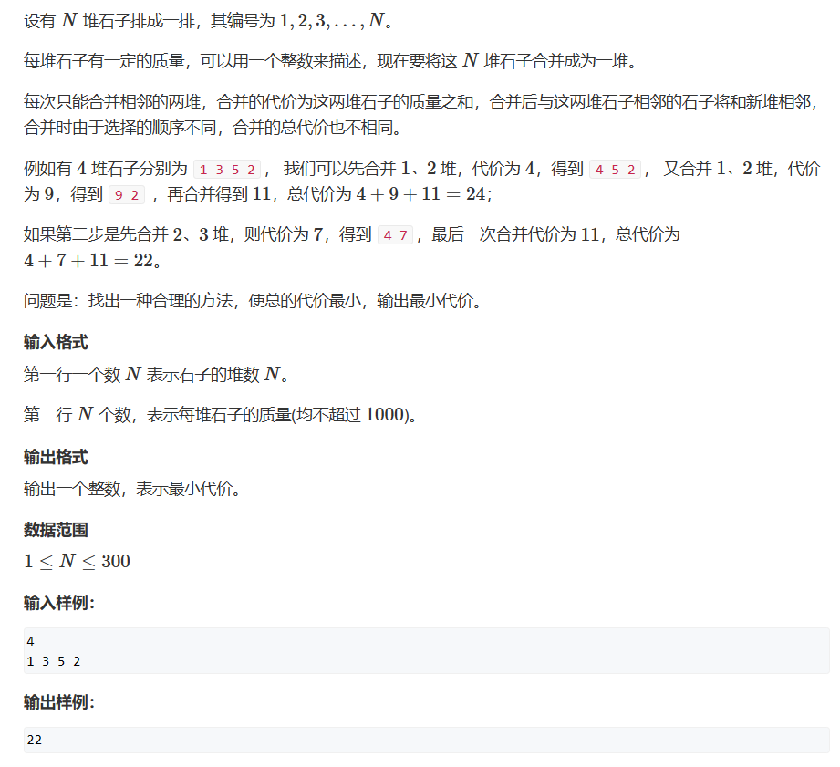
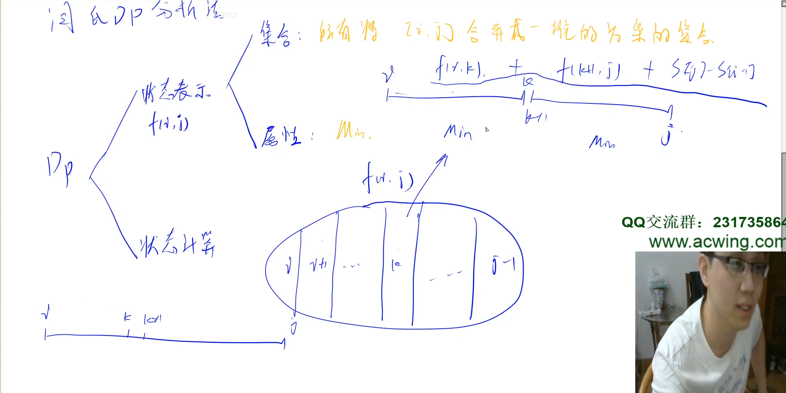

# 区间DP

## 题一



此题我们需要发现，我们的合并是相邻两个区间的合并，所以最后，我们一定是左边的一个大区间与右边的一个大区间合并成最终的区间

再者，我们一共会有$(n-1)!$种选择方案，我们题目给定N<=300，那就是最差的情况下有$299!$种方案，如果使用枚举那必定超时，此时我们就可以考虑使用DP来做这道题目，而这道题目能够转换为DP的关键点就在于**区间的合并必须满足连续**，那么我们就可以使用前缀和去优化我们的数据

y氏分析法：

1. 状态表示：
   1. 集合：dp[i][j]指所有将[i ~ j]合并成一堆的方案的集合
   2. 属性：Min
2. 状态计算：假设最后我们的左半边只有一个集合组成、两个集合组成、三个集合组成...那么我们就可以分成N-1类，假设我们左边由k个集合组成，那么我们可以知道，1 ~ k与k+1 ~ n之间是没有任何关系的，是可以分开单独求值的（分治思想）。此时我们合并的值其实就等于dp[1][k] + dp[k+1][n] + s[n] - s[0]，如此我们递归下去求与更新之前的min值即可得到我们的答案。



法一：

```cpp
#include <iostream> //按长度枚举
#include <algorithm>

const int N = 310;
int dp[N][N];
int nums[N];
int n;

int main()
{
	std::cin >> n;
	for (int i = 1; i <= n; i++) std::cin >> nums[i];
	for (int i = 1; i <= n; i++) nums[i] += nums[i - 1];
	for(int len = 2;len<=n;len++)
		for(int i = 1;i + len -1<=n;i++)
		{
			int l = i, r = i + len - 1;
			dp[l][r] = 1e9;
			for (int j = l; j < r; j++)
					dp[l][r] = std::min(dp[l][r], dp[l][j] + dp[j + 1][r] + nums[r] - nums[l-1]);

		}
	std::cout << dp[1][n];
}
```

法二：

```cpp
#include <iostream>     //从最后一个集合开始枚举，这样就保证了dp[i][k]与dp[k+1][j]在dp[i][j]被计算出来之前就被计算出来了
#include <algorithm>

const int N = 310;
int dp[N][N];
int nums[N];
int n;

int main()
{
	std::cin >> n;
	for (int i = 1; i <= n; i++) std::cin >> nums[i];
	for (int i = 1; i <= n; i++) nums[i] += nums[i - 1];
	 for (int i = n; i >= 1; i--) { 
        for (int j = i+1; j <= n; j++) {    //j从i+1开始是为了省去考虑合并一个集合的特例，这个情况下我们不需要开销，C++数组默认赋值0
            dp[i][j] = 1e9;     //一个巨大的数，防止我们无法更新我们的值
            for (int k = i; k < j; k++) {
                dp[i][j] = std::min(dp[i][j], dp[i][k] + dp[k + 1][j] + nums[j] - nums[i - 1]);
            }
        }
    }
	std::cout << dp[1][n];
}
```

法三：

```cpp
#include <iostream>     //递归 + 记忆化搜索，比较好想
#include <algorithm>
#include <cstring>


const int N = 310;
int dp[N][N];
int nums[N];
int n;

int find(int l,int r)
{
    if(l == r) return 0;
    if(dp[l][r]!=-1) return dp[l][r];
    
    dp[l][r] = 1e9;
    
    for(int i = l;i+1<=r;i++)
    {
        dp[l][r] = std::min(dp[l][r], find(l,i) + find(i+1,r) + nums[r] - nums[l-1]);
    }
    return dp[l][r];
}
int main()
{
	std::cin >> n;
	for (int i = 1; i <= n; i++) std::cin >> nums[i];
	for (int i = 1; i <= n; i++) nums[i] += nums[i - 1];
	memset(dp,-1,sizeof dp);
	
	std::cout << find(1,n);
}
```