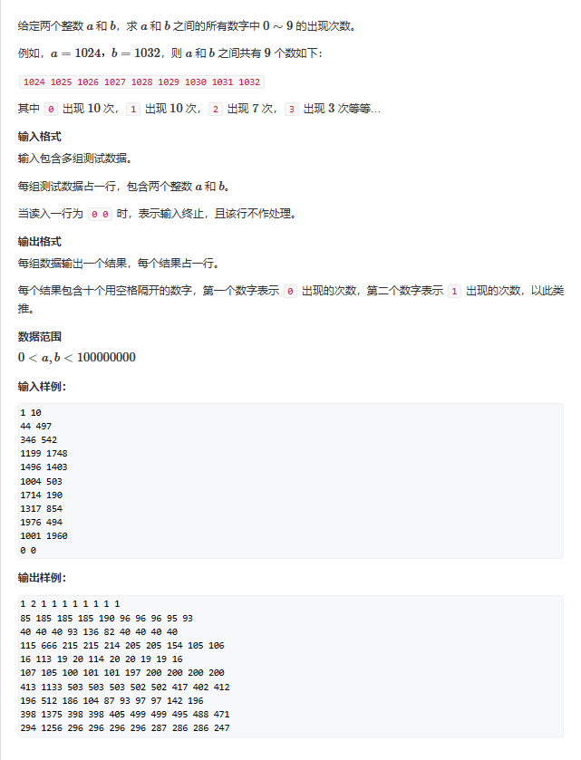

# 数位统计

## 题一



此题如果用枚举，那么计算次数一定超过$10^8$，在C++中肯定是TLE了，所以我们介绍这题按位计算的方法。

假设我们有一个7位数 —— a bcd efg，我们求k能以第4位元素的身份在 1 ~ abcdefg中可以出现几次，此时我们将其分为三个部分

1. $abc$    第4位元素左边的数
2. $d$      第4位元素
3. $efg$    第4位元素右边的数

此时我们就可以分类讨论了：

一、 0 <= 左边的数 <= abc-1

   1. k != 0 ：此时我们高位一定高于最大数的高位，无论a等于什么所有的选法都是合法的，故有（0 ~ abc-1）*（0 ~ 999）共abc * 1000个数字在第4位出现 a
   2. k = 0 ：这时我们需要小心，因为在我们定义当中我们找的值必须是有意义的，如果abc此时等于0，那么我们就统计了一个0edf的三位数，前缀0是没有统计意义的，所以我们不予统计，另作一类可能

二、 1 <= 左边的数 <= abc-1

   1. 此时就是我们所谈到的那个可能，我们将k = 0时拿出来单独讨论，发现它在第一类可能中时需要去除abc = 0的可能，那么少了一种可能，那就共有 （1 ~ abc - 1）*（0 ~ 999）种共 （abc-1）* 1000个数字在第4位出现a
   
三、 左边的数 = abc

   1. 第四位元素 < k ：无解
   2. 第四位元素 = k ：此时右边的数有0 ~ efg 种取法，共efg + 1
   3. 第四位元素 > k ：此时右边的数可以任选，那就是 0 ~ 999 种取法，共1000种

集合图解

最后，我们只需要计算a在1 ~ 最高位出现的次数并求和就可以了！
```cpp
#include <iostream>
#include <algorithm>
#include <cmath>

int dgt(int x)
{
	int res = 0;
	while(x)
	{
		x /= 10;
		res++;
	}
	return res;
}
int n, m;
int count(int a,int number)	//计算1 ~  numbers, a出现几次
{
	if (number == 0) return 0;
	int sum = 0;
	const int DGT = dgt(number);
	for(int i = 1;i<=DGT;i++)
	{
		int p = (int)std::pow(10, i - 1);
		int d = number / p % 10;
		int abc = number / p/10;
		int efg = number % p;

		if (a) sum += abc * p;
		if (!a && abc) sum += (abc - 1) * p;
		if ((d > a)&& (abc||a)) sum += p;
		if ((d == a) && (abc || a)) sum += efg+1;
	}
	return sum;
}

int main()
{
	while(std::cin >> n >> m, n)
	{
		if (n > m) std::swap(n, m);
		for(int i = 0;i<10;i++)
		{
			std::cout << count(i, m) - count(i, n - 1)<<" ";
		}
		std::cout << std::endl;
	}
}
```