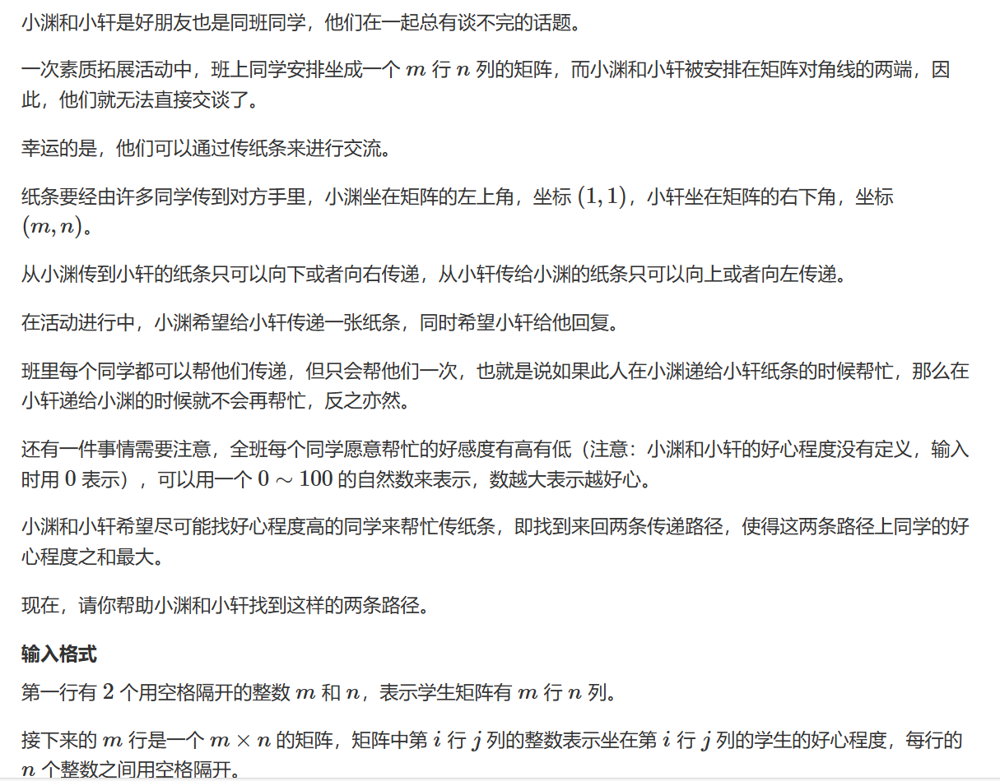

# 数字三角形模型

## 题一

   


此题是非常经典的线性动态规划问题，跟着y总来分析：
***
一、 状态表示

1. 集合：dp[i][j]代表从map[1][1]走到dp[i][j]的所有路线
2. 属性：max
   
二、 状态计算

我们到map[i][j]要么从北边过来，要么从西边过来，所以我们能确定的是从map[1][1]走到 map[i][j]要么经过map[i][j-1]，要么经过map[i-1][j]，而从map[1][1]到map[i-1][j]和map[i][j-1]的路径是不定的，但是根据我们对dp[i][j]的定义，我们能确定dp[i][j-1]和dp[i-1][j]的值一定是到达map[i][j-1]和map[i-1][j]的最大值。所以我们可知
$$dp[i][j] = max(dp[i][j-1], dp[i-1][j]) + map[i][j]$$

    

***

```cpp
#include <iostream>
#include <cstring>
#include <algorithm>

const int N = 110;

int map[N][N];
int dp[N][N];
int n;

int main()
{
    scanf("%d",&n);
    while (n -- )
    {
        int n,m;
        scanf("%d%d", &n, &m);
        for(int i = 1;i<=n;i++)
            for(int j = 1;j<=m;j++)
                scanf("%d",&map[i][j]);
        for(int i = 1;i<=n;i++)
            for(int j = 1;j<=m;j++)
              dp[i][j] = std::max(dp[i-1][j],dp[i][j-1]) + map[i][j];
              
        printf("%d\n",dp[n][m]);
    }
}
```

根据y总的方法，此时我们需要考虑一下算法的空间复杂度是否有优化的空间


从图和代码中我们发现，我们只使用到了i以及i-1行，并且我们的j使用到了第i行的j-1列，也就是前面的数据，那就代表着我们使用的数据一个是更新过的，一个是未更新过的，未更新的就是上一层继承下来的数据，所以，我们直接删掉行维度即可。

注意，此题每次计算完需要重置dp数组，否则我们上一次dp的数据会污染新的数据。

```cpp
#include <iostream>
#include <cstring>
#include <algorithm>

const int N = 110;

int map[N][N];
int dp[N];
int n;

int main()
{
    scanf("%d",&n);
    while (n -- )
    {
        int n,m;
        scanf("%d%d", &n, &m);
        for(int i = 1;i<=n;i++)
            for(int j = 1;j<=m;j++)
                scanf("%d",&map[i][j]);
        for(int i = 1;i<=n;i++)
            for(int j = 1;j<=m;j++)
                  dp[j] = std::max(dp[j],dp[j-1]) + map[i][j];

        printf("%d\n",dp[m]);
        std::memset(dp,0,sizeof dp);
    }
}
```

***
课堂小结：在课堂讲解中，y总提到我们大部分时候是从最后一个状态计算回头看，其实这个思想和递归是一样的，很多同学理解递归代码的时候总是从最外层往最里层钻，这样的话我们自然会因为忘记前一层和后一层递归而把自己弄得糊里糊涂，从最里层往外剖析得好处就是，我们不需要考虑下一层，少了一个方向，我们自然就能更简单地去理解上一层和这一层的关系。
***

## 题二

    


此题的题眼在于限制了商人必须在$2N-1$个时间单位到达右下角，巧合的是$2N-1$也恰好是从左上角到右下角的最短路，也就是说我们不能走回头路，只能往右或向下，否则花费时间一定超过$2N-1$。


这样，此题就被我们破解辣！但是我们仍然需要注意一个问题，在这题中，我们状态表示的属性是 $min$ ，这回导致我们需要特别小心地处理边界问题（其实所有题目都需要特别考虑边界问题），因为C++初始化数组值为0，如此我们很可能导致边界被我们错取。

```cpp
#include <iostream>
#include <algorithm>

const int N = 110;

int n;
int dp[N][N];
int map[N][N];

int main()
{
	scanf("%d", &n);
	for (int i = 1; i <= n; i++)
		for (int j = 1; j <= n; j++)
			scanf("%d", &map[i][j]);
	for (int i = 1; i <= n; i++)
		for (int j = 1; j <= n; j++)
		{
		    if(i==1&&j==1) 	dp[1][1] = map[1][1];   //初始化
			else if (i == 1)    //特别考虑边境问题，当我们在第一行处理时不能从上到下
				dp[i][j] = dp[i][j - 1] + map[i][j];
			else if (j == 1)    //特别考虑边境问题，当我们在第一列处理时不能从左到右
				dp[i][j] = dp[i - 1][j] + map[i][j];
			else
				dp[i][j] = std::min(dp[i][j - 1], dp[i - 1][j]) + map[i][j];
		}
	printf("%d", dp[n][n]);
}
```

## 题三

    


题意：两次从左上角出发到达右下角能经过数字的和最大值，经过该值时取走该值，求两次值和最大

***
通过单路问题我们可以简单推出双路问题的状态表示：

$f[i_1, j_1, i_2, j_2]$ 表示所有从（1，1）分别走到点$（i_1，j_1）（i_2，j_2）$路径的的最大值。

其中状态计算的主要问题是如何处理 **“同一个格子不能被重复选择”** 

那么，当两者一起走的时候，一定存在 $i_1 + j_1 = i_2+j_2 = k$，当然，这只是一个必要条件，因为当$i_1 + j_1 = i_2+j_2 = k$时，并不能推出两者走到了同一个格子，那么此时我们的状态表示就可以被这个等式优化。

优化后：

$f[k, i_1, i_2]$ 表示所有从（1，1）分别走到$（i_1,k - i_1）、（i_2,k-i_2）$路径的最大值

***

y总分析法：

一、状态表示

1. 集合：$f[i1, j1, i2, j2]$ 表示所有从（1，1）分别走到$（i1，j1）（i2，j2）$路径的集合    
$k$ 表示当前状态下格子的横纵坐标之和（ $i_1 + j_1 = i_2+j_2 = k$）
1. 属性：max

二、状态计算


根据图解，我们首先能把到达$map[k, i_1,i_2]$的状态不重不漏地分成以上四种

    


我们挑第一种情况来分析，其他的就同理可得咯：

一、如果$i_1和i_2$不重合：   
当对于$i_1和i_2$均是由从上方走到来看，两个方格里的数字我们都能取走

$$dp[k][i_1][i_2]=dp[k-1][i_1-1][i_2-1] + map[i_1][j_1] + map[i_2][j_2]$$ 

二、如果如果$i_1和i_2$重合：   
当对于$i_1和i_2$均是由从上方走到同一个点来看，我们只能取一次这个方格的值

$$dp[k][i_1][i_2]=dp[k-1][i_1-1][i_2-1] + map[i_1][j_1]$$
***
为什么是$k-1$？

因为 $i_1 + j_1 = i_2+j_2 = k$ => $(i_1 -1) + j_1 = (i_2-1)+j_2 = k-1$ 下面几种情况同理，不是$i$行$-1$就是 $j$列$-1$
***

    
    
    


```cpp
#include <iostream>
#include <cstring>
#include <algorithm>

const int N = 15;

int n;
int dp[N * 2][N][N], map[N][N];

int main()
{
	scanf("%d", &n);
	int a, b, c;
	while (std::cin >> a >> b >> c, a || b || c) map[a][b] = c;

	for (int k = 2; k <= 2 * n; k++)
		for (int i1 = 1; k - i1 > 0&&i1<=n; i1++)       //我们同时出发的等式在此处体现，我们控制了j值的区间
			for (int i2 = 1; k - i2 > 0&&i2<=n; i2++)
			{
				int j1 = k - i1, j2 = k - i2;
				int t1 = map[i1][j1], t2 = map[i2][j2];
				if (i1 != i2) t1 += t2;
                //列举各个可能性
				dp[k][i1][i2] = std::max(dp[k - 1][i1 - 1][i2 - 1] + t1, dp[k][i1][i2]);
				dp[k][i1][i2] = std::max(dp[k - 1][i1 - 1][i2] + t1, dp[k][i1][i2]);
				dp[k][i1][i2] = std::max(dp[k - 1][i1][i2 - 1] + t1, dp[k][i1][i2]);
				dp[k][i1][i2] = std::max(dp[k - 1][i1][i2] + t1, dp[k][i1][i2]);
			}
	std::cout << dp[2 * n][n][n];
}
```

***
最后我们来回答一个问题，为什么不能分两次走呢？

因为如果我们分开走，每次走都只是对于自己取最大，可以理解为这个小孩子很自私，只顾着自己拿最多的糖，导致下个男孩能取到的糖的最大值逐渐减少，最终导致了两个男孩拿到的糖加起来不是最多。
***

## 题四（神奇的数组越界问题）

   


此题与上题基本上是一模一样的，所以这里简单解释一下即可，我们之后重点讨论一下此题出现的一个数组越界问题：

就如其他题解所说，此题其实不允许两个人传纸条的路径有所交叉，但是其实每一个交叉的路径都会对应一条不交叉的路径，所以在思维和计算上这是不影响的，直接套用上题代码即可，另一个类似思路的题目是求组合数Acwing.889题


```cpp
#include <iostream>
#include <algorithm>

const int N = 55;
int dp[N * 2][N][N];
int n,m;
int map[N][N];

int main()
{
	scanf("%d%d", &n,&m);
	for(int i = 1;i<=n;i++) 
	    for (int j = 1; j <= m; j ++ )
	        scanf("%d",&map[i][j]);
	        
	for (int k = 2; k <= m + n; k++)
		for (int i1 = 1;i1<=n&&i1<k; i1++)
			for (int i2 = 1;i2<=n&&i2<k; i2++)
			{
				int j1 = k - i1, j2 = k - i2;
				int t1 = map[i1][j1], t2 = map[i2][j2];
				
				if (i1 != i2) t1 += t2;
				
				dp[k][i1][i2] = std::max(dp[k - 1][i1 - 1][i2 - 1] + t1, dp[k][i1][i2]);
				dp[k][i1][i2] = std::max(dp[k - 1][i1 - 1][i2] + t1, dp[k][i1][i2]);
				dp[k][i1][i2] = std::max(dp[k - 1][i1][i2 - 1] + t1, dp[k][i1][i2]);
				dp[k][i1][i2] = std::max(dp[k - 1][i1][i2] + t1, dp[k][i1][i2]);
			}
	std::cout << dp[n+m][n][n];
}
```