# 最长上升子序列模型LIS

回想第一次做算法题，遇到的第一题是LCIS，最长公共上升子序列，当时给我整崩溃了，两天从DP的基础啃，啃了LIS和LCS，然后再看着其他人的题解理解了那题和那题的做法，现在开始系统地学习算法了，终于又遇到它啦！

## 题一

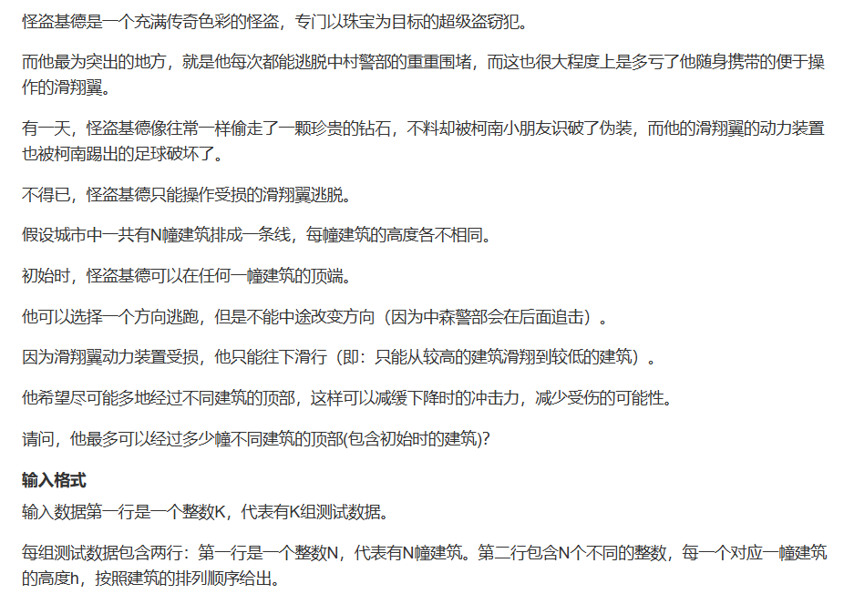
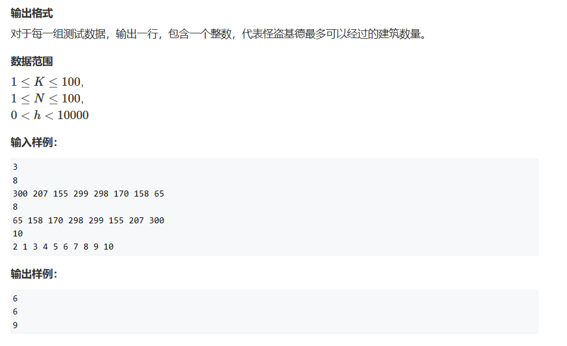

这题很简单，就是求最长上升子序列和最长下降子序列，然后取两者最大值，是一个模板题

y氏分析法：

一、状态表示：

1. 集合：dp[i]代表以numbers[i]结尾的下降子序列的集合
2. 属性：Max

二、状态计算

根据我们的状态表示，我们只更新dp的最大值就行，LIS是线性DP的问题，我把那里的题解再贴下来

y氏分析法：
1. 状态表示：dp[i]
   1. 集合：所有以nums[i]**结尾**的上升子序列
   2. 属性：最长上升子序列，Max
2. 状态计算（j < i）：
   1. 包含i：   dp[j] + 1 
   2. 不包含i： dp[i] = 1
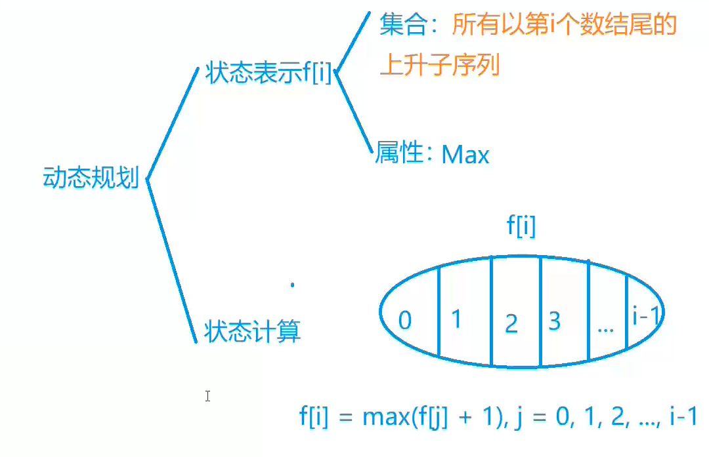

```cpp
#include <iostream>
#include <algorithm>
#include <cstring>

const int N = 110;

int k, n;
int h[N];
int dp[N];

int main()
{
	scanf("%d", &k);
	while (k--)
	{
		scanf("%d", &n);
		for (int i = 0; i < n; i++) scanf("%d", &h[i]);

	    std::memset(dp, 0, sizeof dp);
	    int res = 0;
	    for(int i = 0; i < n; i++)
	    {
	        dp[i] = 1;
	        for(int j = 0; j < i;j++)
	        {
	            if(h[i] < h[j]) dp[i] = std::max(dp[i],dp[j]+1);
	        }
	        res = std::max(dp[i], res);
	    }
	    std::memset(dp, 0, sizeof dp);
	    for(int i = 0; i < n ;i++)
	    {
	        dp[i] = 1;
	        for(int j = 0; j < i; j++)
	            if(h[i] > h[j]) dp[i] = std::max(dp[i], dp[j] + 1);
	        res = std::max(dp[i],res);
	    }
		printf("%d\n", res);
	}
}
```

## 题二

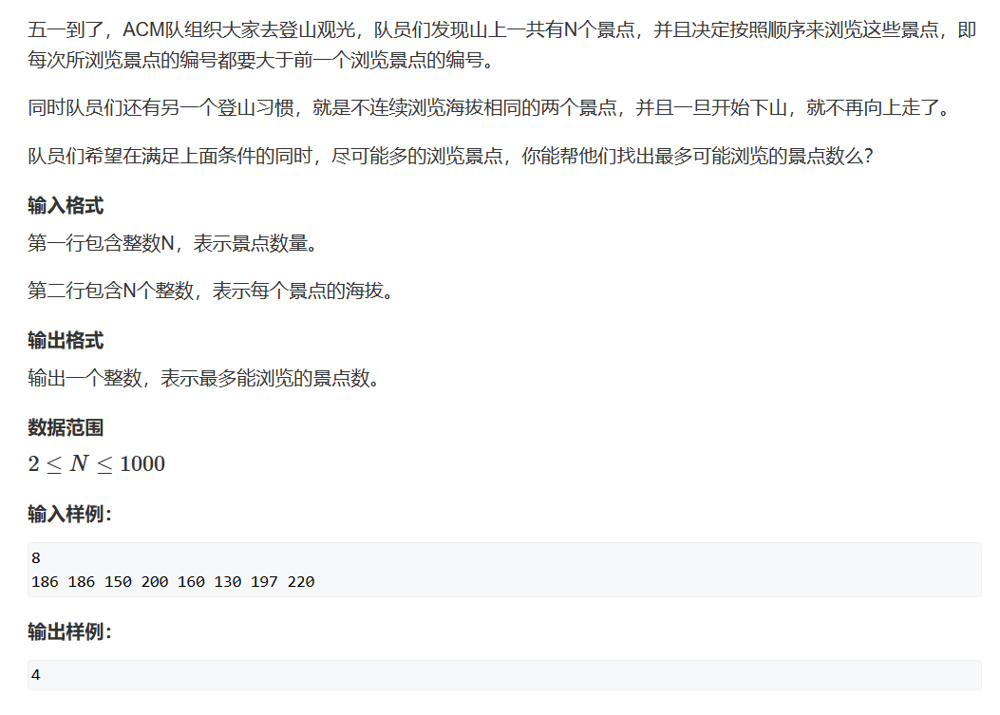

此题与上题是相似的，为什么说是相似的呢？

两题都是寻找最长的顺序序列，但此题规定了必须是先上后下，并且我们在下的过程一定是从左向右，也就是说此题我们在寻找下山路径时必须是从后往前搜索，否则我们的dp2[i]的含义会变成以从0 ~ i中以numbers[i]结尾的LIS，不符合题意。

***

y氏分析法：

1. 状态表示：dp1[i]、dp2[i]
   1. 集合：所有从0 ~ i以nums1[i]**结尾**的上升子序列；所有从i ~ n-1以nums2[i]**结尾**的下降子序列
   2. 属性：最长上序列，Max
2. 状态计算（j < i）：
   1. 包含i：   dp[j] + 1 
   2. 不包含i： dp[i] = 1

我们的答案就是以i为上顶的最长上升+下降子序列的长度

```cpp
#include <iostream>
#include <algorithm>

const int N = 1010;

int h[N],dp1[N],dp2[N];

int main()
{
    int n;
    scanf("%d", &n);
    
    for(int i = 0;i<n;i++) scanf("%d",&h[i]);
    
    int res = 0;
    for(int i = 0;i<n;i++)
    {
        dp1[i] = 1;
        for(int j = 0;j<i;j++) 
            if(h[j]<h[i]) dp1[i] = std::max(dp1[i],dp1[j] + 1);
    }
    
    for(int i = n-1;i>=0;i--)
    {
        dp2[i] = 1;
        for(int j = n-1;j>i;j--) 
            if(h[j]<h[i]) dp2[i] = std::max(dp2[i],dp2[j] + 1);
    }
    //山顶被加了两次，注意将多加的减掉
    for(int i = 0;i<n;i++) res = std::max(res, dp1[i] + dp2[i] - 1);
    
    printf("%d",res);
}
```

## 题三

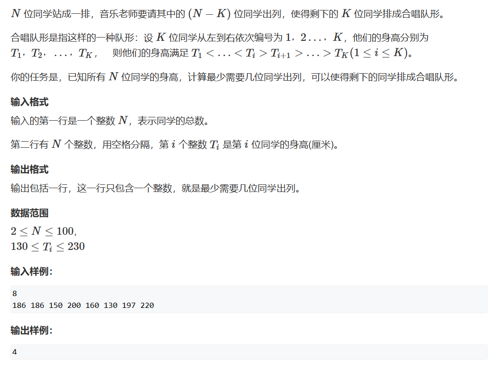

与上题完全相同，但是答案需要取被去掉的人数。

y氏分析法：

1. 状态表示：dp1[i]、dp2[i]
   1. 集合：所有从0 ~ i以nums1[i]**结尾**的上升子序列；所有从i ~ n-1以nums2[i]**结尾**的下降子序列
   2. 属性：最长上序列，Max
2. 状态计算（j < i）：
   1. 包含i：   dp[j] + 1 
   2. 不包含i： dp[i] = 1

我们的答案就是总数 - 以i为上顶的最长上升 + 下降子序列的长度

```cpp
#include <iostream>
#include <cstring>
#include <algorithm>

const int N = 110;

int n;
int h[N];
int dp1[N],dp2[N];
int main()
{
    scanf("%d", &n);
    
    for(int i = 0;i<n;i++) scanf("%d",&h[i]);
    
    
    for(int i = 0;i<n;i++)
    {
        dp1[i] = 1;
        for(int j = 0;j<i;j++)
            if(h[i]>h[j]) dp1[i] = std::max(dp1[i] , dp1[j] + 1);
    }
    for(int i = n-1;i>=0;i--)
    {
        dp2[i] = 1;
        for(int j = n-1;i<j;j--)
            if(h[i]>h[j]) dp2[i] = std::max(dp2[i], dp2[j] + 1);
    }
    int len = 0;
    for(int i = 0;i<n;i++) len = std::max(len, dp1[i] + dp2[i] - 1);
    printf("%d",n - len);
}
```

## 题四

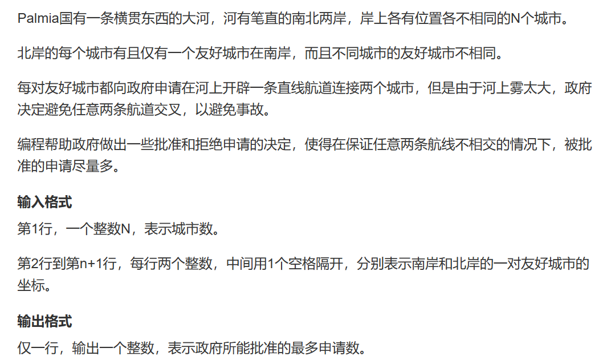   
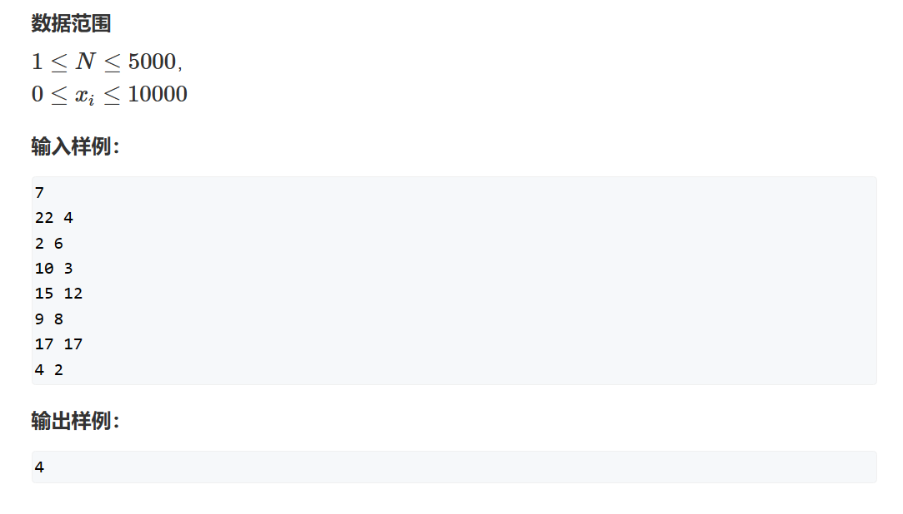   

题意大致如下，在河中建桥，每对希望建桥的城市之间只能建一座桥，并且桥不能交叉建：

条件一：每个城市上只能建立一座桥且只能是友好城市之间    
条件二：所有桥与桥之间不能相交

目标：最多可以建多少座桥

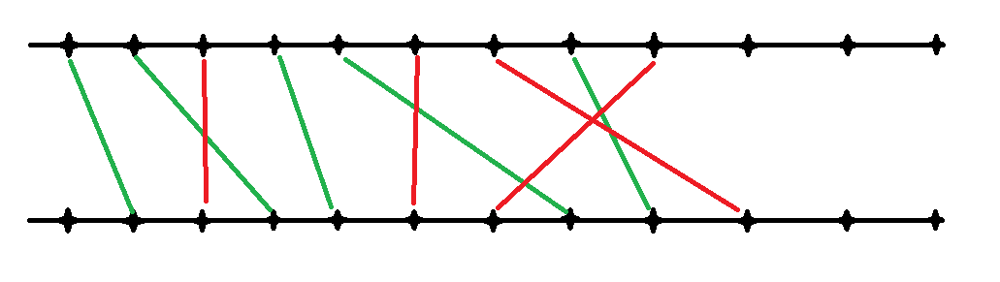
（如果只建绿色桥是合法的一种方案，但凡有红色桥出现和其他桥相交就是非法的）

那我们如何将问题转换为LIS呢？

很妙的方法就是将友好城市对以其中一岸为升序排列。如此，如果我们另一岸出现了降序排序，就一定会导致修建的桥相交。

假设友好城市对：1 <--> 11 、 2 <--> 17
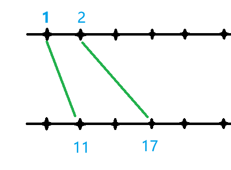   
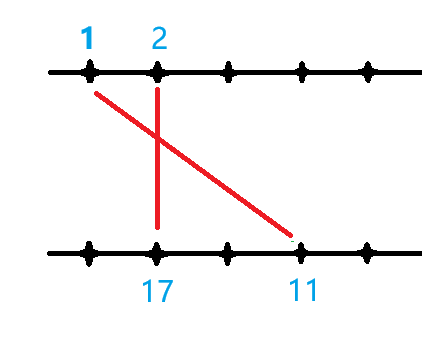

```cpp
#include <iostream>
#include <algorithm>

const int N = 5010;

struct mPair
{
	int l;
	int r;
	bool operator<(const mPair& other) const
	{
		return l < other.l;
	}
}mPairs[N];

int n;

int dp[N];

int main()
{
	scanf("%d", &n);
	for (int i = 0; i < n; i++) scanf("%d%d", &mPairs[i].l, &mPairs[i].r);
	std::sort(mPairs, mPairs + n);
	int res = 0;
	for(int i = 0;i<n;i++)
	{
		dp[i] = 1;
		for (int j = 0; j < i; j++)
			if (mPairs[i].r > mPairs[j].r) dp[i] = std::max(dp[j] + 1, dp[i]);
		res = std::max(res, dp[i]);
	}
	printf("%d", res);
}
```

## 题五

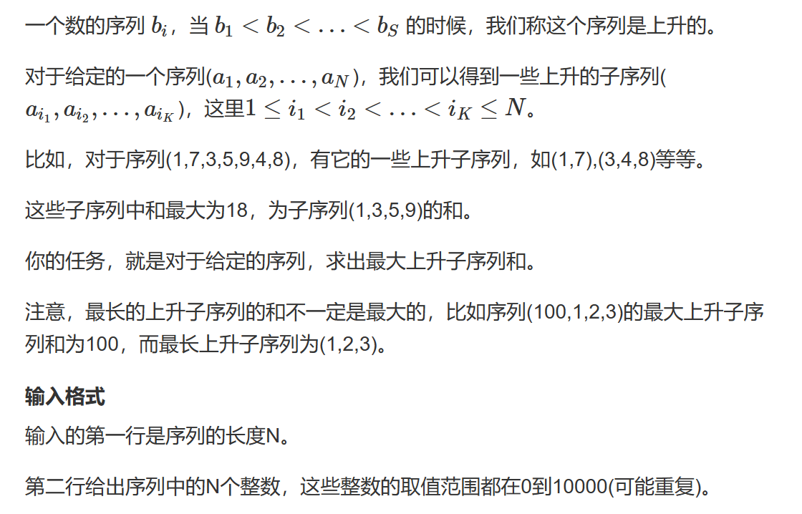   


此题求得是**最大**上升子序列**和**，而不是**最长**上升子序列，但其实两者是一致的，大家回忆一下LIS的思路，状态计算是长度的变化，那**最大**上升子序列**和**的状态计算就是和的大小的变化，所以我们只需要把LIS的代码中状态计算的逻辑变化一下就行。

```cpp
#include <iostream>
#include <algorithm>

const int N = 1010;
3
int q[N];

int n;

int dp[N];

int main()
{
	scanf("%d", &n);
	for (int i = 0; i < n; i++) scanf("%d", &q[i]);

	int res = 0;
	for(int i = 0;i<n;i++)
	{
        //注意此处初始化就应该是其q值
		dp[i] = q[i];
        
		for (int j = 0; j < i; j++)
        //此处状态计算的变化，不再是长度的+1而是加上结尾的值
			if (q[i] > q[j]) dp[i] = std::max(dp[j] + q[i], dp[i]); 
            
		res = std::max(res, dp[i]);
	}
	printf("%d", res);
}
```

## 题六

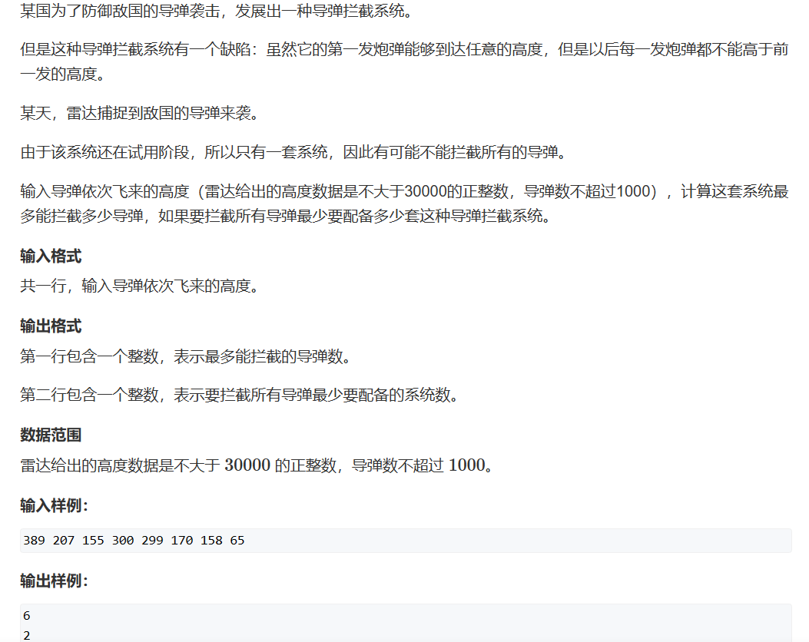

此题一共有两问：

一、求最长下降子序列

二、求最少能分成几组最长下降子序列

***
对于第一问不多解答，我们来考虑第二问

第二问我们可以选择贪心的思想来求：    
贪心思想核心：   
**1.对于一发新的导弹，我们将其划归于已有的导弹系统中刚刚拦截了大于等于这颗导弹高度最小的那套系统**   
**如果当前系统均不满足，配备一套新的系统去拦截它**

***
证明：最优解做法下拦截系统个数 = 贪心做法下拦截系统的个数

一、首先，可以确定的是最优解做法下拦截系统的个数一定  >=  贪心做法下拦截系统的个数

二、再者，我们需要来证明最优解做法下拦截系统的个数  <=  贪心做法下拦截系统的个数

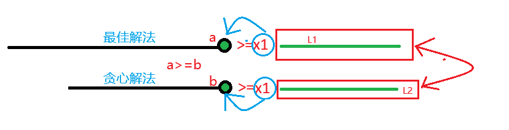

假设我们将新的导弹划归“最佳解法”，那么最佳解法之前最后一颗需要拦截导弹的高度一定大于等于新的，同理根据贪心思想核心我们也可以接到贪心解法里。

此时如果让“最佳解法”和“贪心解法”中x1后面的导弹互换，那么依然是一个合法的拦截方案，所以我们可知所有贪心解法均可以调整为一种最佳解法，所以我们证得最优解做法下拦截系统的个数  <=  贪心做法下拦截系统的个数

最后由一、二可得，**最优解做法下拦截系统的个数  ==  贪心做法下拦截系统的个数**

以上推理过程被称为 **调整法**

反链定理（Dilworth定理）

***

此题实际上就是基础课中LIS一和二的题目简单融合，这里我们多做了一个证明的工作。

```cpp
#include <iostream>
#include <algorithm>

const int N = 1010;

int dp[N];
int h[N],q[N];

int main()
{
    int n = 0;
    while(std::cin>>h[n]) n++;
    
    int len = 0,res = 0;
    
    for(int i = 0;i<n;i++)
    {
        dp[i] = 1;
        for(int j = 0;j<i;j++)
            if(h[j]>=h[i]) dp[i] = std::max(dp[i], dp[j] + 1);
        res = std::max(res,dp[i]);

        int k = 0;
        while(k<len&&q[k]<h[i]) k++;
        if( k== len) q[len++] = h[i];
        else q[k] = h[i];
		//如此建立出的数组一定是一个单调递增的数组
    }
    printf("%d\n", res);
    printf("%d\n", len); 
}
```

## 题七

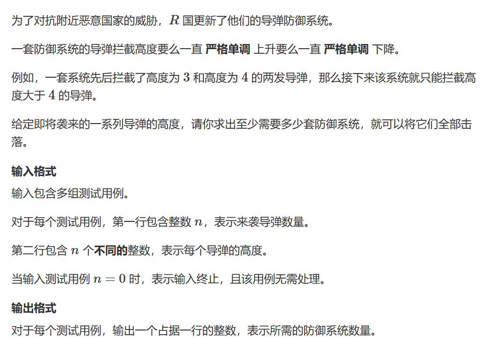
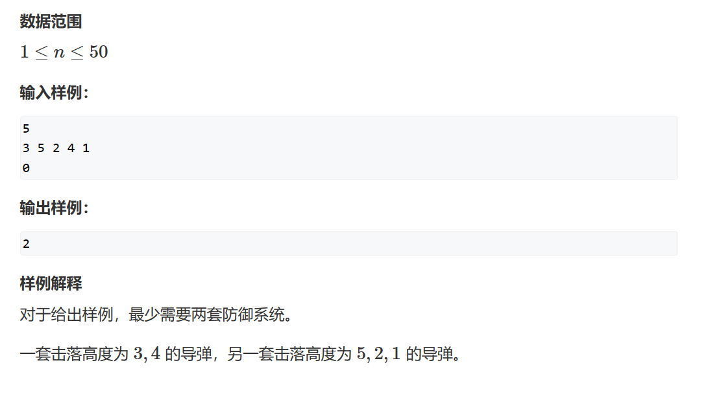

此题虽然分在DP一章，但其实它的做法是DFS，作为类比题目加于此处。

我们先回忆一下DFS的基本做法：

1. 设置递归终点
2. 更新当前状态
3. 递归下一状态
4. 恢复上一状态

注：同样的，只要涉及到递归的地方，就一定要特别考虑递归终点

***

DFS求最小值的两种做法：

1. 记一个全局变量并不断更新
2. 迭代加深：一般平均答案深度较低时可以采用这种方式。

***

### 法一（全局变量法）

```cpp
#include <iostream>
const int N = 55;
//up[i]和down[i]分别表示第i个递增序列和和递减序列的末尾元素
int up[N],down[N];
int h[N];
int n;
int ans;

//u 是我们当前枚举到了第几个数
//su是当前上升子序列的个数
//sd是当前下降子序列的个数
void dfs(int u,int su, int sd)
{
	//如果序列总数大于导弹系统数，无法完全拦截导弹，失败
	if(su + sd >= ans) return;
	//递归到了最后一个数后面的数，也就是递归完了所有的数
	//更新ans并且返回
	//因为排在后面，所以能保证su + sd < ans
	if(u==n)
	{
		ans = su + sd;
		return;
	}
	//情况1：将当前数放到上升子序列中
    //找到我们贪心核心中LIS的末尾最小值
	int k = 0;
	while (k < su && up[k] >= h[u]) k++;
	int t = up[k];
	up[k] = h[u];
	//如果找到了这个值，那我们进入下一层递归，
	//以更新后的状态去枚举其他方案
	if (k < su) dfs(u + 1, su, sd);
	//如果没找到，我们追加一套上升拦截系统，
	//然后枚举这个状态下的其他方案
	else dfs(u + 1, su + 1, sd);
	//恢复进入此层递归的原态，因为是全局变量
	//否则讨论情况二和其他层时会污染数据
	up[k] = t;

	//情况2：将当前数放到下降子序列中，
	//理解方式同情况一
	k = 0;
	while (k < sd && down[k] <= h[u]) k++;
	t = down[k];
	down[k] = h[u];
	if (k < sd) dfs(u + 1, su, sd);
	else dfs(u + 1, su, sd + 1);
	down[k] = t;
}

int main()
{
	while (std::cin >> n,n)
	{
		for (int i = 0; i < n; i++)
			scanf("%d", &h[i]);

		ans = n;

		dfs(0, 0, 0);

		std::cout << ans <<std::endl;
	}
}
```

### 法二（迭代加深法）

```cpp
#include <iostream>

const int N = 55;

int n;
int h[N];
int up[N], down[N];

//depth：当前系统个数
//u：当前枚举到第u个导弹
//su：最长上升子序列个数
//sd：最长下降子序列个数
bool dfs(int depth,int u ,int su,int sd)
{
	if (su + sd > depth) return false;
	//当我们枚举完所有的导弹后，
	//我们的系统足够拦截所有导弹
	//那么我们就成功拦截
	if (u == n) return true;

	//枚举所有放到上升子序列的选法
	//flag用来记录我们是否将此导弹分配给某个已有系统中去
	//后面思路和法一基本一样，但注意我们在递归过程中不更新depth!
	//只是尝试在这个拦截系统数量下我们是否能完成任务
	bool flag = false;
	for(int i = 1;i<=su;i++)
		if(up[i]<h[u])
		{
			int t = up[i];
			up[i] = h[u];
			if (dfs(depth, u + 1, su, sd)) return true;
			up[i] = t;
			flag = true;
			break;
		}
	if(!flag)
	{
		up[su + 1] = h[u];
		if (dfs(depth, u + 1, su + 1, sd)) return true;
	}

	//枚举所有放到下降子序列的选法
	flag = false;
	for(int i = 1;i<=sd;i++)
		if(down[i]>h[u])
		{
			int t = down[i];
			down[i] = h[u];
			if (dfs(depth, u + 1, su, sd)) return true;
			down[i] = t;
			flag = true;
			break;
		}
	if (!flag)
	{
		down[sd + 1] = h[u];
		if (dfs(depth, u + 1, su, sd+1)) return true;
	}
	return false;
}

int main()
{
	while (std::cin >> n,n)
	{
		for (int i = 0; i < n; i++)
			scanf("%d", &h[i]);

		int depth = 0;
		//如何理解迭代加深法？
		//我们用系统数去带，一套系统不行，
		//我们加一套，再不行，
		//我们再加一套。
		//因为函数中我们没有递归增加depth的值，
		//那么每次调用depth都是固定的，
		//我们每增加一套系统，我们的dfs递归就会多加深一层，
		//所以叫做迭代加深
		while (!dfs(depth, 0, 0, 0)) depth++;

		std::cout << depth << std::endl;
	}
}
```

### 两个方法的区别

两个方法其实都很妙，他们分别用两种方式去更新我们的系统数。前者通过递归过程中不断减少系统数来达成，后者通过递增系统数至能够完成拦截任务来达成。

***
碎碎念：不知道大家看过《洛基》个人剧没有，dfs就像剧集中的多元时间线，每一次递归都出现新的时间分支，出现新的可能，祝大家在未来的每次“递归”都能返回true！
***

## 题八（LCIS）

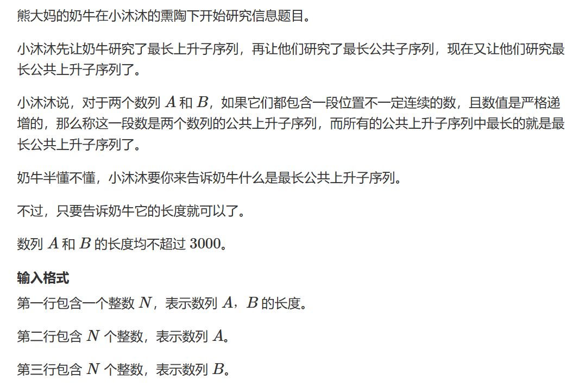   
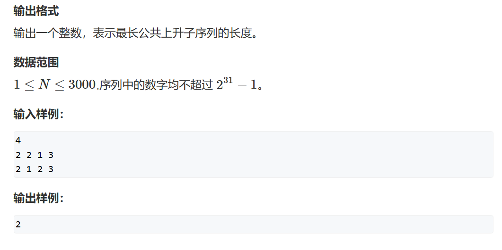

又是熟悉的题目，就当旧题新做啦！

题目很裸，就是就最长公共上升子序列（LCIS），是一道经典的DP问题，结合了最长公共子序列（LCS）和最长上升子序列（LIS）的思想。

***

y总分析法：

一、状态表示：

1. 集合：dp[i][j]表示考虑A[1 ~ i]、B[1 ~ j]中以**B[j]结尾**的公共子序列集合
2. Max，最长

二、状态计算

将集合分为包含A[i]和不包含A[i]两种不重不漏的区间。不包含A[i]自然就是dp[i-1][j] 以B[j]结尾的考虑A[1 ~ i-1] 和B[1 ~ j]的LCIS。

如果不包含A[i]，那么这半边集合我们又可以分为以B[k]最为倒数第二个树，不重不漏的区间。
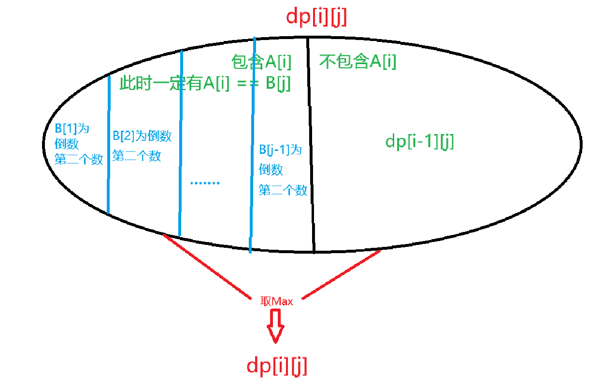    

***

朴素法 TLE

```cpp
#include <iostream>
#include <algorithm>

const int N = 3010;

int dp[N][N];
int n;
int number_A[N], number_B[N];

int main()
{
	scanf("%d", &n);
	for (int i = 1; i <= n; i++) scanf("%d", &number_A[i]);
	for (int i = 1; i <= n; i++) scanf("%d", &number_B[i]);

	for(int i = 1;i<=n;i++)
	{
		
		for(int j = 1;j<=n;j++)
		{
			
			dp[i][j] = dp[i - 1][j];
			if(number_A[i]==number_B[j])
			{
				int maxlen = 1;
				for (int k = 1; k < j; k++)
					if (number_A[i] > number_B[k])
						maxlen = std::max(maxlen, dp[i - 1][k] + 1);
				dp[i][j] = std::max(maxlen, dp[i][j]);
			}
		}
	}
	int res = 0;
	for(int i = 1;i<=n;i++) res = std::max(res, dp[n][i]);
	
	std::cout << res;
}

```

优化法：

优化思路：重点在于当包含了A[i]时，A[i] = B[j]

并且因为求的是最长公共子序列，假设我们在更新dp[i][j] 时没必要去处理dp[i][j-2]的值，因为满足条件的LCIS序列中B[i]一定大于B[k]我们才进行长度更新

又因为A[i] = B[j]，所以我们完全可以把最大值放到第二层循环外

且本身我们就是从前向后遍历，那么每次我们都只维护dp[i][j]的最大值即可，就没必要每次都重复计算dp[i][j]的最大值从什么地方更新而来，从而将时间复杂度从 $n^3更新到 n^2$

```cpp
#include <iostream>
#include <algorithm>

const int N = 3010;

int dp[N][N];
int n;
int number_A[N], number_B[N];

int main()
{
	scanf("%d", &n);
	for (int i = 1; i <= n; i++) scanf("%d", &number_A[i]);
	for (int i = 1; i <= n; i++) scanf("%d", &number_B[i]);

	for(int i = 1;i<=n;i++)
	{
		int maxlen = 1;
		for(int j = 1;j<=n;j++)
		{
			dp[i][j] = dp[i - 1][j];
			if (number_A[i] == number_B[j]) dp[i][j] = std::max(dp[i][j], maxlen);
			if (number_A[i] > number_B[j]) maxlen = std::max(maxlen, dp[i-1][j] + 1);
		}
	}
	int res = 0;
	for (int i = 1; i <= n; i++) res = std::max(res, dp[n][i]);
	std::cout << res;
}
```