# 状态压缩DP

## 题一

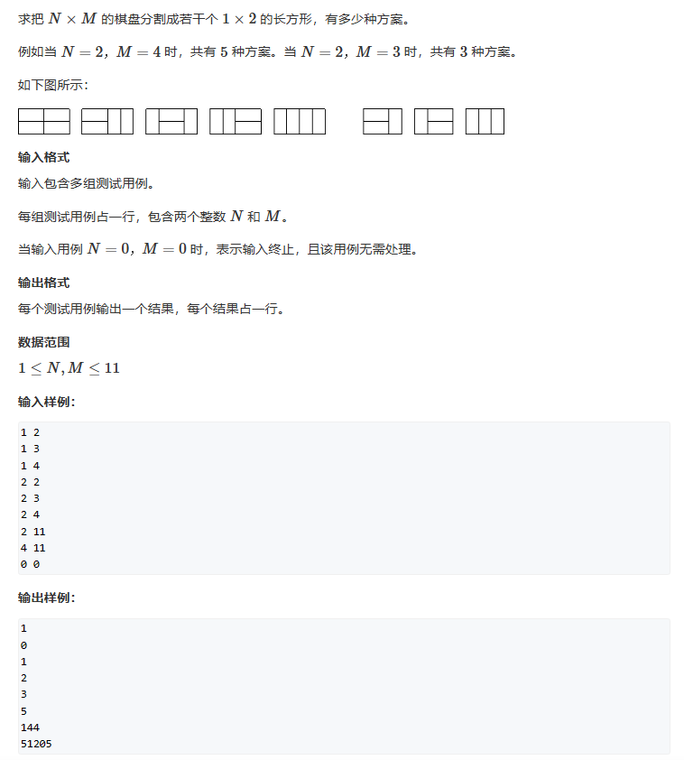

题解核心思想：先放横着的，再放竖着的，而我们的总方案数，等于只放横着的小方块的合法方案数（因为剩下的空格自然只能放竖着的小方块）。

为什么会这样？

我们从组合数角度想，试想一个问题，一个盘子里一共有10颗糖，我们将它们分给A、B 2个人，那么对于A我们选择3-7分，此时对于B来说，他得到的方案是7-3分，但是我们都知道一共只有11种方案，不会因为两个角色而double了，所以只需要从一个人的角度考虑这个问题就行

那么又如何判断当前的方案是否合法呢？只需要判断剩下的空格是否能够填充满竖着的小方块。可以按列去查空格，每一列内部连续空着的小方块必须是偶数个，否则无法放下竖着的小方块。

y氏分析法：
一、状态表示：集合：dp[i][j]表示已经将前i-1列摆好，且从第i-1列，伸出到第i列的状态是j（j代表i列中是否被从i-1横着摆放的小方块占用，如图dp[2][11001]）的所有方案。

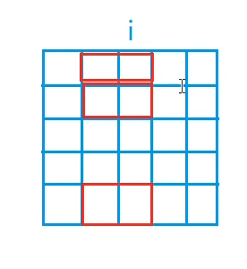

二、状态计算：

我们来看一下我们如何计算我们的状态，我们先来理一下由dp[i][j]我们能够得到的信息：
   1. 我们目前确定了第i列的状态为j，例如dp[5][36]，这里的4需要转换为二进制来看，36 = 0010 0100，此时我们的棋盘状态如下：
   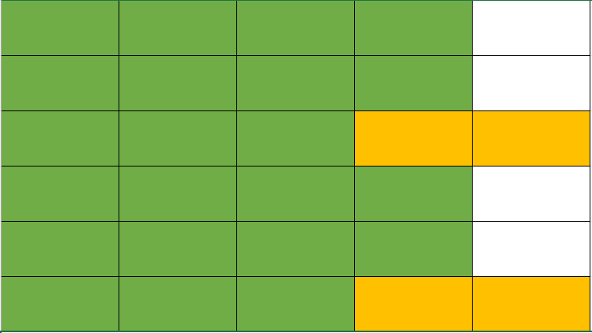   
   绿色代表已被填满区域，但是不清楚其是由横着的小方块和竖着的小方块用什么方式构成    
   黄色代表我们上面所说的从i-1列延申到i列的横着的小方块    
   白色区域是我们确定了没有摆物品的区域
   2. 此时我们的dp[5][36]的值怎么算呢？我们这时看向倒数第二个状态，也就是看向i-2与i-1的关系。    
   我们知道dp[5][36]指这个状态下所有的组合方案，那么我们确定的只有第i列，第i-1列究竟是由几个横着的小方块和竖着的小方块构成呢？下面展示其中两种可能   
   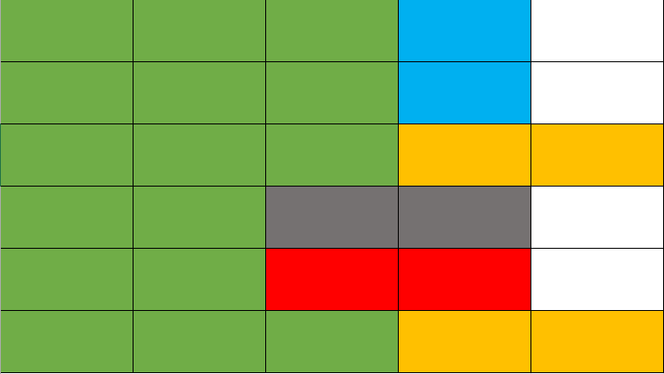    
   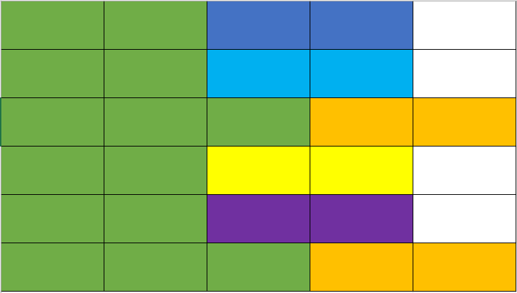    
   那么我们通过集合来看就会有很多很多个这样的dp[i-1][k]（k是满足条件的一个集合）组成   
   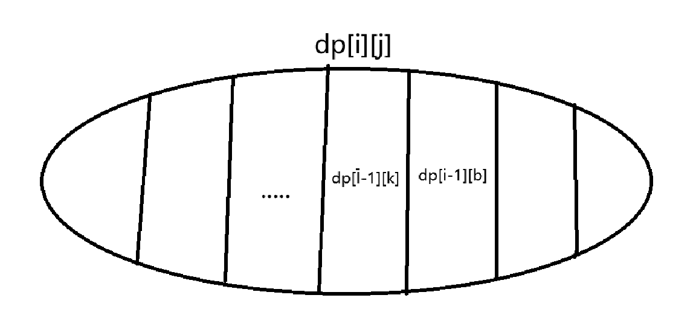    
   这时我们就得寻找满足条件的k，我们发现，如果k随便取，会发生这样的情况    
   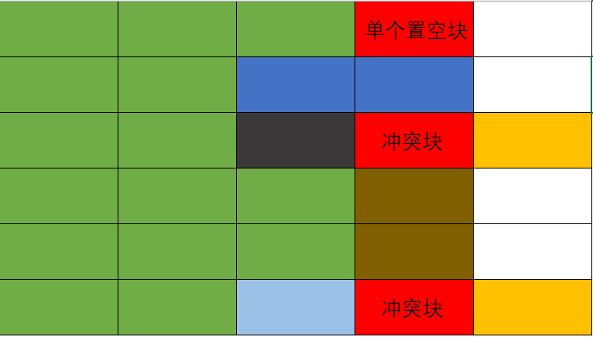   
   如图所示k = 38，也就是二进制10 0110，我们出现了冲突块和单个置空块     
   根据这样的情况我们知道，我们需要使 k & j == 0 且 k中连续空着的小方块长度必须偶数，否则就会出现空置域导致无法填满该处。这样我们才能决定我们的下一步是补全或继续填小方块

最终我们的答案就是：    
dp[m][0] ——> 表示已经将前m-1列摆好，且从第m-1列伸出到第i列的状态是0，也就是我们此时已经将n * m的空间摆满了

但此题如果按照这个思路还是有点慢，卡在超时的边缘，此时我们做一些预处理的优化，避免每次都要去判断k状态是否满足我们的要求。

```cpp
#include <iostream>		//DFS
#include <cstring>
#include <vector>

const int N = 12,M = 1<<N;
int n, m;
long long DP[N][M];
std::vector<int> state[M];
bool st[N];	//判断所有状态是否满足连续空置块长度为偶

int main()
{
	while (std::cin >> n >> m,n||m)
	{
		for(int i = 0;i<(1<<n);i++)	//预处理每个状态下的连续空置空间是不是偶数长度
		{
			int cnt = 0;
			bool is_valued = true;
			for (int j = 0; j < n; j++)	//列举i中的所有位，当遇到1即凸出块时检查之前的空置块是奇数还是偶数
				if (i >> j & 1)	
				{
					if (cnt & 1)
					{
						is_valued = false;
						break;
					}
					cnt = 0;
				}
				else cnt++;
			if (cnt & 1) is_valued = false;
			st[i] = is_valued;
		}
		for(int i = 0;i<(1<<n);i++)		//列举第i（图文的i-1列）列的所有状态
		{
			state[i].clear();
			for(int j = 0;j<(1<<n);j++)	//列举第i-1（图文的i-2列）列的所有状态
			{
				if ((i & j) == 0 && st[i | j])	//此处判断能与i列此状态下构成组合，也就是既不冲突也均是连续偶数空置块
					//这里解释一下i | j，因为第i列是确定的（也就是我们更新的前一列上面图文叙述的i-1列），它是由i与从i-1也就是j（图文中的i-2列）
					//中伸出来的块组成，所以我们需要将它们合成以后才能变成我们需要的i（图文的i-1列）
					state[i].push_back(j);
				//把满足条件的j推给i，这样后面枚举时只需要枚举满足条件的即可
			}
		}
		memset(DP, 0, sizeof DP);
		DP[0][0] = 1;
		for (int i = 1; i <= m; i++)
			for (int j = 0; j < (1 << n); j++)
				for (auto& k : state[j])
					DP[i][j] += DP[i - 1][k];	//把i-1列中满足的方案数加起来
		std::cout << DP[m][0]<<std::endl;
	}
}
```

## 题二

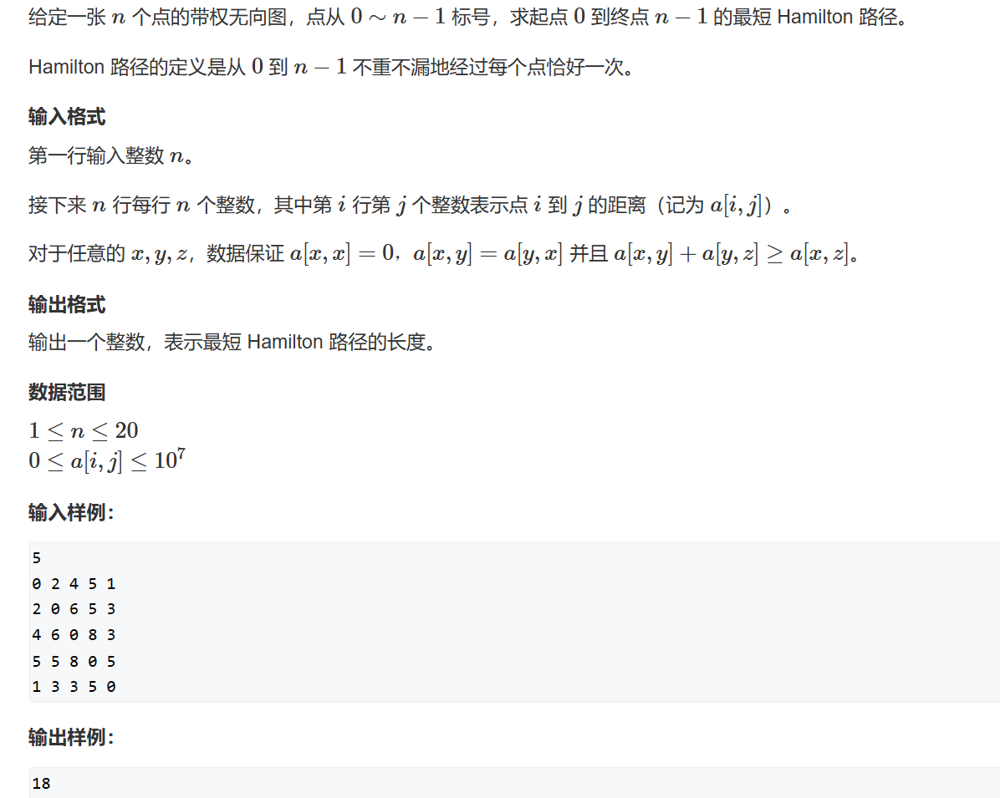

看题设我们可以知道，给的数据一定构成一个没有自环和重边的有权无向图，并且这个无向图保证任意两点之间都有边。那么我们可以简单地将其抽象为一个排列问题，例如20个不同颜色的苹果进行排列，给定了头和尾，那么我们排列的可能性就是$18!$，是一个极其巨大的数字，也就是说我们使用暴力枚举的话是一定会超时的。

所以这题我们需要使用剪枝优化：   

假设我们有0, 1, 2, 3个点，那么我们的0 和3则是固定的头和尾，所以我们有两种路径：   
0 -> 1 -> 2 -> 3    Cost：18   
0 -> 2 -> 1 -> 3	Cost：20   

那么我们在DFS的过程中，我们后续会去遍历没有遍历到的点，也就是说我们在寻找分支的时候并不关心我们遍历到的点的顺序是怎样的，我们只关心我们用了哪些点、下一个是哪个点以及最后我们停在哪个点上。如此考虑我们就能发现，路径二是完全可以被路径一覆盖

那我们一共有哪些状态呢？   
我们考虑：
1. 哪些点被用过
2. 目前停在哪个点上

状态只有用与没用两个状态，那么我们用二进制来表示状态，同时点有20种停留的可能性（当然事实这个值小于20，因为我们的点只能停留在被遍历的可能性上），那我们的运算次数大概 $=2^{18}\ast 20$

y氏分析法：
1. 状态表示：dp[state][j] state表示当前哪些点没被用过，也就是目前的状态，j 表示停留在哪个点上
2. 状态计算：我们遍历，那么dp[state][j] = dp[state_k][k] + map[k][j]，也就是说state_k状态下加上j这个点我们就能得到state这个状态，数学计算就是   
   state_k + (1 << j)，   
   ***
   那么其实state_k这个状态集合就等于   
   state_k = state - (1 << j)，   
   ***
   同时不要忘记state_k这个集合需要包含k（同样的state也需要包含j），也就是   
   (state >> k) & 1 == 1   
   ***

最后亮出我们的代码！
```cpp
#include <iostream>
#include <algorithm>
#include <cstring>

const int N = 20, M = 1 <<20;
int n;
int map[N][N];
int dp[M][N];	//状态是i，停留在j的情况下路径的总长度

int main()
{
	//初始化我们的dp数组，因为要求一个最小值，
	//我们提前将其设置为一个较大的数
	std::memset(dp, 0x3f, sizeof dp);	
	std::cin >> n;
	for (int i = 0; i < n; i++)
		for (int j = 0; j < n; j++)
			std::cin >> map[i][j];
	dp[1][0] = 0;
	//这里进行了优化，我们知道，我们的第一个节点是出发点，
	//那么首位不包含1的状态一定是非法的，
	//这样一来我们就减少了至少一半的运算次数
	//大家可以试试改成完全遍历，AC时间少了将近一半呢！
	for (int i = 1; i < 1 << n; i += 2)		
	{										
		for(int j = 0;j<n;j++)				
		{
			//检查我们的state是否合法
			//注意我们的数组从0开始算，
			//那么第3个点的位置其实数组下标为2，
			//我们需要移动3那么其实就是下标j = 2
			if((i >> j) & 1)	
			{
				for(int k = 0;k < n;k++)
				{
					//检查我们的state_k是否合法
					if ((i - (1 << j)) >> k & 1)	//检查我们的state_k是否合法
						dp[i][j] = std::min(dp[i][j], dp[i - (1 << j)][k] + map[k][j]);
						//枚举出从state_k状态转换为state状态中的最小值
				}
			}
		}
	}
	//那么我们的答案是什么呢？
	//即在所有节点都被选上的情况下
	//停留在最后一个节点的方案
	std::cout << dp[(1 << n) - 1][n - 1];
}
```


## 题三

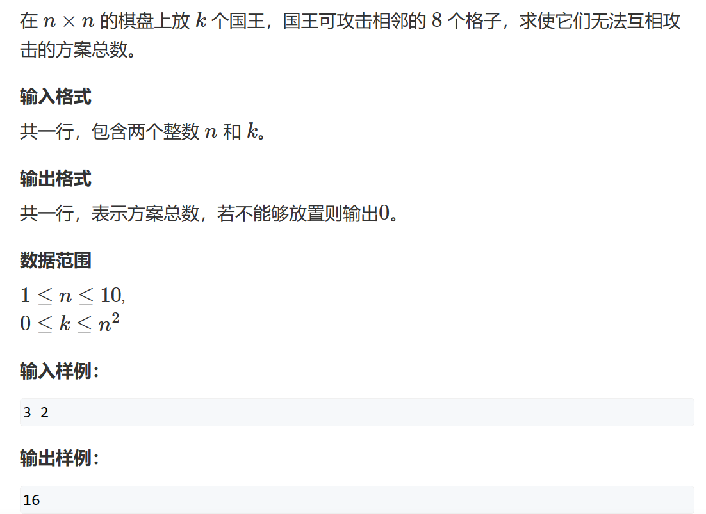

y总分析法：

一、状态表示：

1. dp[i][j][a]：表示前 i 行已经排好，且已经使用了 j 个国王，第 i 行的状态是 a 的合法方案数。
2. 属性：count

二、状态转移： 

题目的思路不难：

只需要注意到每一行的国王摆放的合法方案只取决于上一行的国王摆放方案

1. 使用二进制表示国王是否放置在某个位置
2. 枚举出在同一行中合法的国王摆放方案
3. 类似于状态机，枚举出上一行状态为 $a$ 时，下一行合法的状态 $b$ ，并使用哈希表存储其对应合法状态表的下标。
4. 开始进行 dp 处理，dp 的状态转移其实和背包问题以及状态机很像，转移时注意保证国王的数量不要超过给定值。

```cpp
#pragma GCC optimize(2)
#include <iostream>
#include <vector>

using LL =long long;	//不开long long，三年oi一场梦

const int N = 12, M = 1<<10, K = 110;

LL dp[N][K][M];

std::vector<int> state;		//用于储存同行内合法的状态

std::vector<int> head[M];	//haed[a] 表示储存 i-1 行的状态为 a 时，在state中第 i 行的合法状态所在的下标
int cnt[M];					//记录状态 i 中有几个1，也就是有几个国王
int n,m;

int count(int state)		//计算 state 中有几个1
{
    int res = 0;
    for(int i = 0;i<n;i++)
    {
        if(state>>i&1) ++res;
    }
    return res;
}

int main()
{
    std::ios::sync_with_stdio(false);
    std::cin.tie(0);
    std::cout.tie(0);
    
    std::cin>>n>>m;
    auto check = [&](int state){
        for(int i = 0;i<n;i++) if((state>>i&1)&&(state>>(i+1)&1)) return false;
        return true;
    };		//lambda 函数，用于判断合法的单行状态
    for(int i = 0;i<1<<n;i++)	//状态转移的步骤三
    {
        if(check(i)) 
        {
            state.push_back(i);
            cnt[i] = count(i);
        }
    }
    int size = state.size();    //合法状态的总数量
    for(int i = 0;i<size;i++)
    {
        for(int j =0;j<size;j++)
        {
            int a = state[i], b = state[j];
            if(!(a&b)&&check(a|b))
            {
                head[i].push_back(j);
            }
        }
    }
    dp[0][0][0] = 1;
    
    for(int i = 1;i<=n+1;i++)	//根据我们的dp定义，dp[n+1][m][0]会帮我们统计好之前的所有合法状态，这样可以帮我们省去后面单独加和所有不同的最后一行合法状态的步骤
        for(int j = 0;j<=m;j++)
            for(int a = 0;a<size;a++)
            {
                for(int& b : head[a])
                {
                    int c = cnt[state[b]];
                    if(j>=c) dp[i][j][a] += dp[i-1][j-c][b];
                }
            }
        
    std::cout<<dp[n+1][m][0];
}
```

## 题四

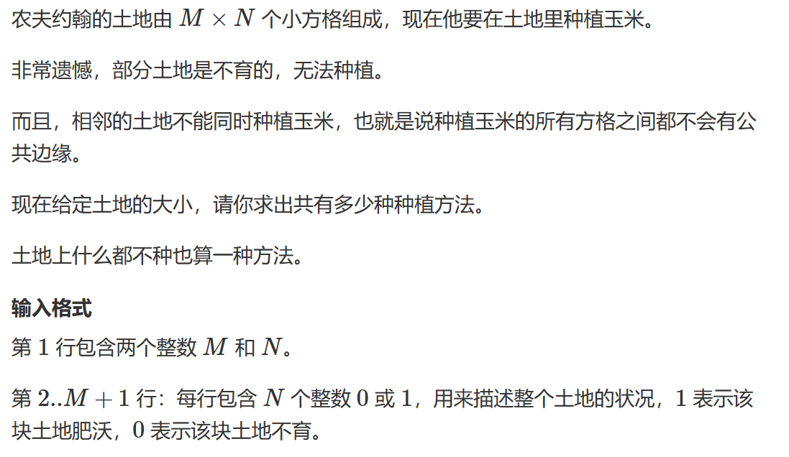
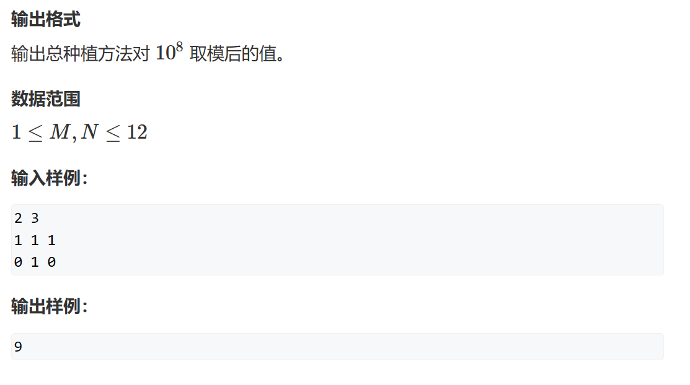

此题比上题简单些，少了一维的dp，但是多了一个需要判断所枚举的状态是否能放到地图中的条件，只需要再判断一下是否满足条件即可。

y总分析法：

一、状态表示

1. dp[i][j] 表示前 i 行已经放好，此时第 i 行的状态是 j 的合法方案数
2. 属性：count

二、状态转移

和上题类似，不再赘述。

```cpp
#pragma GCC optimize(2)
#include <iostream>
#include <vector>
using LL = long long;
const int N = 14,MOD = 1e8;
int map[N][N];
int dp[N][1<<12];   //表示已经拍好了前i排，此时第i排状态为a
int n,m;
int cnt[1<<12];
std::vector<int> head[1<<12];	//这里的head存的是相应状态下标对应的下标，例如head[0]里一定存有下标0，因为state[0] = 00000...是可以互相到达的
std::vector<int> state;

int main()
{
    std::ios::sync_with_stdio(false);
    std::cin.tie(0);
    std::cout.tie(0);
    
    std::cin>>n>>m;
    
    for(int i = 1;i<=n;i++)
    {
        for(int j = 0;j<m;j++)
        {
            std::cin>>map[i][j];
        }
    }
    
    auto check = [&](LL state){
      for(int i = 0;i<m;i++)
        {
            if((state>>i&1)&&(state>>(i+1)&1)) return false;
        }
        return true;
    };
    for(LL i = 0;i < 1 << m;i++)
    {
        if(check(i)) {
            state.push_back(i);
        }
    }
    int size = state.size();
    for(int i = 0;i<size;i++)
    {
        for(int j = 0;j<size;j++)
        {
            LL a = state[i],b = state[j];
            if(!(a&b)) head[i].push_back(j);
        }
    }
    auto check2 = [&](int state,int c){
      for(int i = 0;i<m;i++)
      {
          if((state>>i&1)&&map[c][m-i-1]==0) return false;
      }
      return true;
    };

    dp[0][0] = 1;

    for(int i = 1;i<=n+1;i++)
        for(int j = 0;j<size;j++)
            for(auto& t : head[j])
                if(check2(state[t],i))
                {
                    int c = cnt[state[t]];
                    dp[i][t] = (dp[i][t] + dp[i-1][j])%MOD;
                }

    std::cout<<dp[n+1][0];
}
```

## 题五

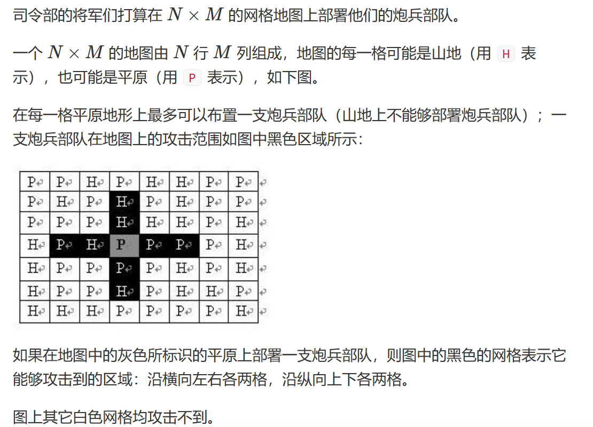
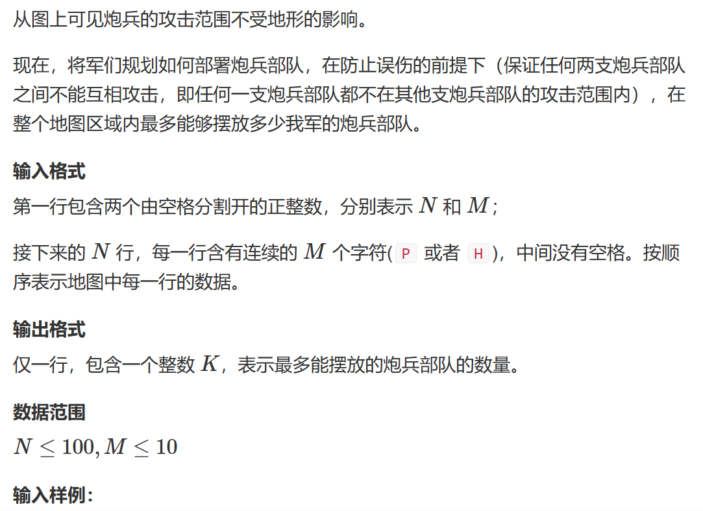
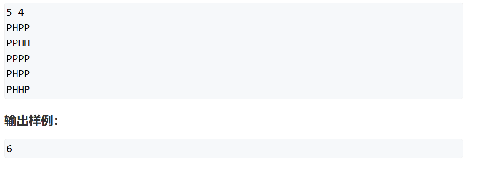

刚开始看此题感觉并不难，理所当然地认为只不过是比上一题多一维度罢了，做到后面发现MLE才知道，这题考的是空间复杂度优化......

y总分析法：

一、状态表示：

1. dp[i][j][k]：前i 行已经排好，且第 i 行的状态是j，第 i-1 行的状态是 k 的情况下炮兵部队的部署数量。
2. 属性：Max

二、状态转移

可以想到的是，dp[i] 第三维状态就是 dp[i-1] 情况下的第二维状态，那么我们只需要考虑在不与地形冲突的状态下我们转移方式就是从上一个状态 + 此时状态下多出来的炮兵部队中取最值。

根据以上我们写出代码：

```cpp
#pragma GCC optimize(2)
#include <iostream>
#include <vector>
#include <cstring>
#include <algorithm>

const int N = 110,M = 15,K = 1<<10;

int dp[N][K][K];
int map[N][M];
int n, m;
std::vector<int> states;
std::vector<int> head[K];
int cnt[K];
int count_lowbit(int state)
{
    int res = 0;
	while(state)
	{
		int lowbit = state & (-state);
		state = state - lowbit;
		++res;
	}
	return res;
}

int main()
{
	std::ios::sync_with_stdio(false);
	std::cin.tie(0);
	std::cout.tie(0);

	std::cin >> n >> m;
	for(int i = 1;i<=n;i++)
	{
		for(int j = 0;j<m;j++)
		{
			char t;
			std::cin >> t;
			if (t == 'P')
				map[i][j] = 0;
			else
				map[i][j] = 1;
		}
	}
	auto check1 = [&](int state)
	{
        return !(state & state >> 1 || state & state >> 2);
	};

	auto check2 = [&](int state,int c)
	{
		for(int i = 0;i<m;i++)
		{
			if ((state >> i & 1) && map[c][m - 1 - i]) return false;
		}
		return true;
	};
	for(int i = 0;i<1<<m;i++)
	{
		if(check1(i))
		{
			states.push_back(i);
			cnt[i] = count_lowbit(i);
		}
	}
	for(int i = 0;i<states.size();i++)
	{
		for(int j = 0;j<states.size();j++)
		{
			if(!(states[i]&states[j]))
			{
				head[i].push_back(j);
			}
		}
	}
	int res = 0;
	for(int i = 1;i<=n+2;i++)
	{
		for(int j = 0;j<states.size();j++)
		{
			if(check2(states[j],i))
			{
				for(int& t1 : head[j])
				{
					for(int& t2 : head[t1])
					{
						if(!(states[j]&states[t2]))
						{
							int c = cnt[states[j]];
							dp[i][j][t1] = std::max(dp[i][j][t1], dp[i - 1][t1][t2] + c);
						}
					}
				}
			}
		}
	}
	std::cout << dp[n+2][0][0];

}
```

然后MLE了，更别说我还开了O2优化...

当然，解决这个问题的办法也很简单，记得在状态机模型中我们是如何优化的吗？注意到这个问题当中我们只使用到了 i 和 i-1 层，并且更新顺序是从前到后，那么我们就可以将其优化掉，优化后的代码如下：

```cpp
#pragma GCC optimize(2)
#include <iostream>
#include <vector>
#include <algorithm>

const int M = 15, K = 1 << 10;

int dp[2][K][K];
int map[N][M];
int n, m;
std::vector<int> states;
std::vector<int> head[K];
int cnt[K];

int count_lowbit(int state)	//这里使用lowbit运算去优化时间其实效果不是很明显，主要原因是state的位数并不是很高，且本身合法状态就少，但如果涉及到类似数1的算法，lowbit也不比一项一项去比难写，万一离AC就差那么几毫秒呢？
{
	int res = 0;
	while (state)
	{
		int lowbit = state & (-state);
		state = state - lowbit;
		++res;
	}
	return res;
}

int main()
{
	std::ios::sync_with_stdio(false);
	std::cin.tie(nullptr);
	std::cout.tie(nullptr);

	std::cin >> n >> m;

	for (int i = 1; i <= n; i++)	//比较习惯这样去存原始状态，当然如果map太大，还是使用y总的方法
		for (int j = 0; j < m; j++)
		{
			char t;
			std::cin >> t;
			if (t == 'P')
				map[i][j] = 0;
			else
				map[i][j] = 1;
		}
	//用于判断同行内的合法与否
	auto check1 = [&](int state)	
	{
		return !(state & state >> 1 || state & state >> 2);
	};

	//用于判断炮兵部署是否与地形冲突
	auto check2 = [&](int state, int c)
	{
		for (int i = 0; i < m; i++)
			if ((state >> i & 1) && map[c][m - 1 - i]) return false;

		return true;
	};

	//提前处理出合法的单行状态
	for (int i = 0; i < 1 << m; i++)
		if (check1(i))
		{
			states.push_back(i);
			cnt[i] = count_lowbit(i);
		}
	//提前处理两行之间合法的状态转移
	for (int i = 0; i < states.size(); i++)
		for (int j = 0; j < states.size(); j++)
			if (!(states[i] & states[j]))
				head[i].push_back(j);

	int res = 0;

	for (int i = 1; i <= n + 2; i++)	//枚举行
		for (int j = 0; j < states.size(); j++)	//枚举第i行的状态
			if (check2(states[j], i))	//判断第i行的状态是否与地形冲突，因为我们的更新顺序，只需要考虑新一行即可
				for (int& t1 : head[j])	//枚举第i - 1行的状态
					for (int& t2 : head[t1])//枚举第i - 2行的状态
						if (!(states[j] & states[t2]))	//判断第 i 行是否与第 i-2 行冲突
						{
							int c = cnt[states[j]];
							dp[i & 1][j][t1] = std::max(dp[i & 1][j][t1], dp[i - 1 & 1][t1][t2] + c);
						}

	std::cout << dp[n + 2 & 1][0][0];
}
```

## 题六

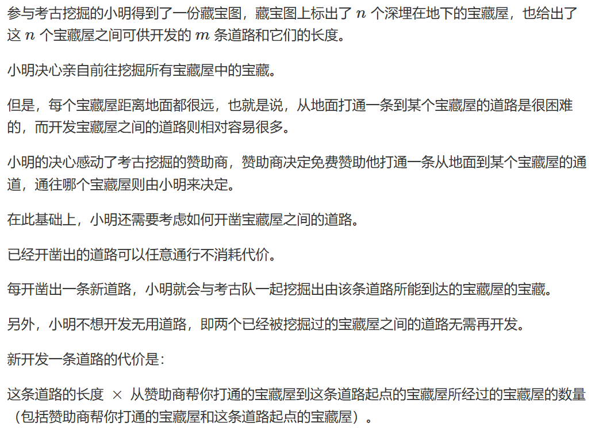
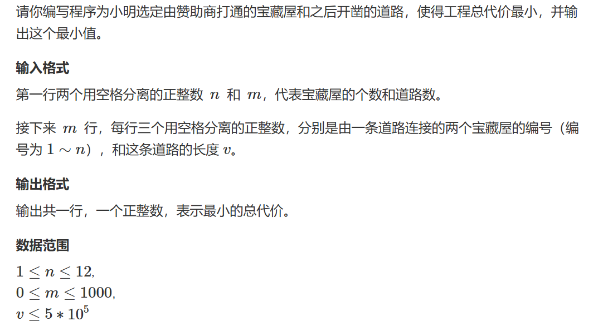

问题翻译：给一个图，选择一个点作为树顶（根节点），生成一个最小代价树，其连接代价为树节点之间的距离$\times$上一个节点深度（根节点深度为1）

如图：

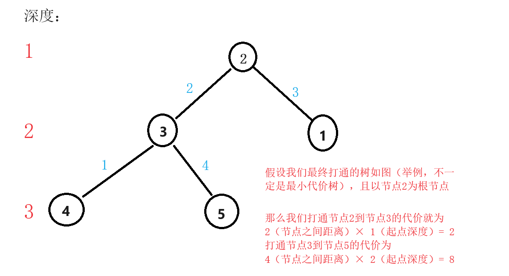

***

此题难点在于问题的转换，如果按照题意进行一个裸的状态压缩去做那么将会有三层循环$2^{36}$的计算次数，是一定会TLE的。

题目可转换为任意两个点之间开辟道路，根据题意似乎只能在有道路的两个节点之间连线，但实际上这个限制条件并不影响找打最小代价。

假设无限制得出的最小代价为$A$，题意限制下得到的最小代价是$B$

证明：假设我们可以在任意两个节点之间开辟道路，那么在题意限制下得到的方案数一定是前者的子集，那么即可得出$A\leq B$

反过来，假设在题意限制下我们得到的最小树如图：

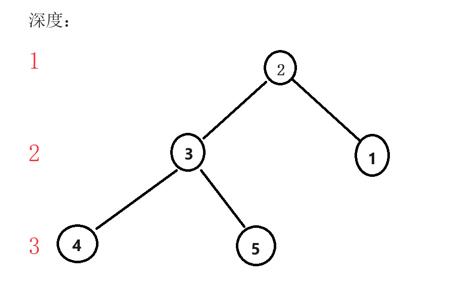

若存在一条更短边使得4可以连向2，那么2-->4的代价会严格变小，因为边长$\times$节点深度时节点深度也在变小，所以得到$B\leq A$

综上1、2，得证$A=B$

***

那么此时开始我们的DP定义

一、状态表示

1. dp[i][j]：表示当前状态为i 时（状态是用2进制表示节点选与不选），树的层数为j 的代价
2. 属性：最小代价

二、状态转移

假设dp[i][j]时第j层的状态为$k$，那么前j层的状态即为$i\oplus k$，此时因为确定了k以及层数，那么代价中k到$i\oplus k$的最小代价即是确定的定值，那么变化的部分就是$i\oplus k$这一部分形态不同导致的，同时根据我们对dp的定义我们可以得到，这一部分的最小值为dp[$i\oplus k$][j-1]。

此时我们即可得出dp[i][j] = min(dp[i][j], dp[$i\oplus k$][j-1])

所以此时我们还需要枚举i的子集来得到k，这里有一个枚举k的技巧：k = (i - 1) & i; k; k = (k - 1) & i

当然，可以提前预处理好第j层状态k的最小代价

```cpp
#pragma GCC optimize(2)
#include <iostream>
#include <cstring>
#include <algorithm>
const int N = 14, M = 1 << 12;
int map[N][N];
int g[N][M];
int dp[M][N];
int n, m;
int main()
{
	std::ios::sync_with_stdio(false);
	std::cin.tie(0);
	std::cout.tie(0);
	std::memset(map, 0x3f, sizeof map);
	std::cin >> n >> m;
	for (int i = 0; i <= n; i++) map[i][i] = 0;
	for(int i = 0;i<m;i++)
	{
		int a, b, c;
		std::cin >> a >> b >> c;
		map[a][b] = map[b][a] = std::min(c,map[b][a]);
	}

	std::memset(g, 0x3f, sizeof g);
	//预处理第i个节点到集合j的最小代价
	for(int i = 1;i<=n;i++)
	{
		for(int j = 0;j<1<<n;j++)
		{
			for(int k = 0;k<n;k++)
			{
				if(j>>k&1)
				{
					g[i][j] = std::min(g[i][j], map[i][k+1]);
				}
			}
		}
	}
	std::memset(dp, 0x3f, sizeof dp);
	//初始化dp，这一步千万不能忘
	for (int i = 0; i <= n; i++) dp[i<<i][0] = 0;
	for(int i = 1;i<1<<n;i++)
	{
		for (int j = (i - 1) & i; j; j = (j - 1) & i)
		{
			int last = i ^ j,cost = 0;
			for(int k = 0;k<n;k++)
			{
				//先计算j代价的最小值
				if(j>>k&1)
				{
					cost += g[k+1][last];
					//如果代价过高也就是两点之间无连通路时我们就不用计算了
					if(cost>=0x3f3f3f3f) break;
				}	
			}
			if(cost>=0x3f3f3f3f) continue;
			//枚举层数
			for(int k = 1;k<=n;k++)
			{
				dp[i][k] = std::min(dp[i][k], dp[last][k - 1] + cost * k) ;
			}
		}
	}
	int res = 0x3f3f3f3f;
	//找出满载状态下最小的代价，以层数为变量
	for(int i = 0;i<=n;i++)
	{
		res = std::min(res, dp[(1 << n) - 1][i]);
	}
	std::cout << res;
}
```