# 状态机模型

什么是状态机？

状态机是有限状态自动机的简称，是现实事物运行规则抽象而成的一个数学模型。

举个栗子：在现实中，人体的状态有站立、蹲下、躺下三种有限的状态，每个状态之间可以互相转换，当我们处于蹲下状态时，大脑给身体下达了站立的命令，我们就会站起来。所以，当给予一个状态机、当前状态、和命令，那么我们就可以明确运算出下一个状态。

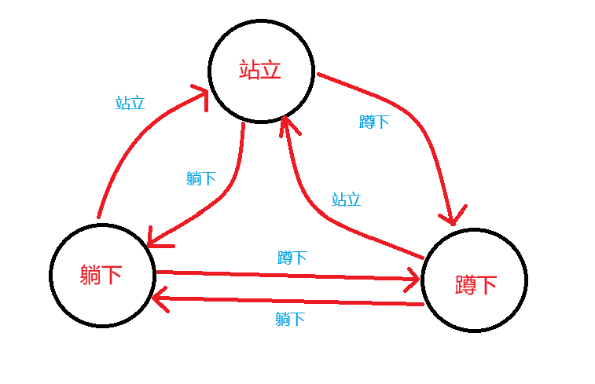

***

状态机的四大组成：

一、State：状态。一个状态机至少要包含两个状态，如上面举的栗子有站立、蹲下和躺下三个状态。

二、Event：事件。命令就是事件，如大脑对站立状态下达了“下蹲”指令。

三、Action：动作。事件，也就是命令发生后需要执行的动作，如“下蹲”命令对应动作就是双腿弯曲下蹲。

四、Transition，变换。从一个状态变化为另一个状态，如从“站立”变化到了“蹲下”

***

## 题一（状态机模型）

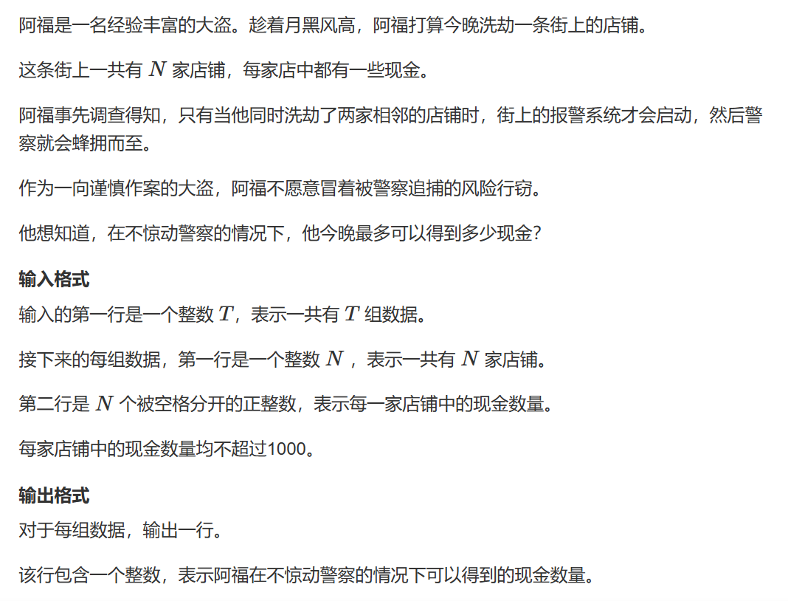   
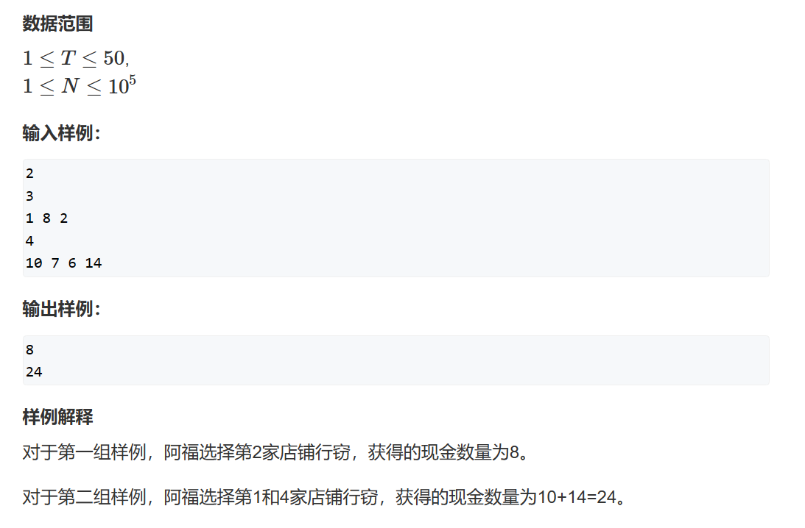

看完状态机的介绍这题可能有思路了，我们需要表示的状态就是上一个商店是被抢还是没被抢来决定我们是否抢下一家商店。

### 解法一

先用我们学过的知识来试着解一下此题。

y总分析法：

一、状态表示

1. 集合：dp[i] 表示考虑抢劫前i 个商店获得金钱集合
2. 属性：Max

二、状态计算

抢第i 个商店，那么不能前一个商店是一定不能抢的：dp[i] = dp[i-2] + w[i]

不抢第i 个商店，那么前一个商店是可以被抢的：dp[i] = dp[i-1]

两者取最大。

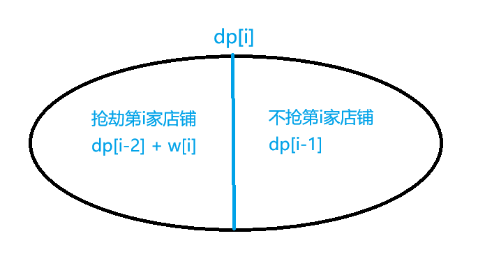

```cpp
#include <iostream>
#include <algorithm>

const int N = 100010;

int T;
int n;
int dp[N];
int w[N];
int main()
{
	scanf("%d", &T);
	while (T--)
	{
		scanf("%d", &n);
		for (int i = 1; i <= n; i++)
			scanf("%d", &w[i]);
		for(int i = 1;i<=n;i++)
		{
			dp[i] = std::max(dp[i - 1], dp[i - 2] + w[i]);
		}
		printf("%d\n", dp[n]);
	}
}
```

但是根据上述代码，我们是不能够知道第i - 1 家店铺是被抢了还是没被抢，存在数据的不确定性，这部分数据被忽略掉了。

### 法二 —— 状态机

此时引入之前介绍的状态机模型，将每个dp[i] 标记为被抢劫或者未被抢劫的状态 —— dp[i][0]、dp[i][1] ，0即代表店铺i 未被抢劫，1代表店铺i 被抢劫。

y总分析法：

一、状态表示

1. 集合：dp[i][0] 表示考虑抢劫前i 家店铺中不抢劫第i 家店铺的集合；dp[i][1]表示考虑抢劫前i 家店铺中抢劫第i 家店铺的集合（此时所有方案一定能被我们分成不重不漏的两个集合）。
2. 属性：Max

二、状态计算

1. 对于dp[i][0]：我们不选第i 家店铺，那么就可以从第i - 1 家店铺中第i - 1 家店铺被抢劫或不被抢劫两个状态转移过来
2. 对于dp[i][1]：我们抢劫了第i 家店铺，那么我们只能从第i - 1 家店铺没被抢劫的状态转移过来

核心代码：

```cpp
dp[i][0] = std::max(dp[i - 1][0], dp[i - 1][1]);
dp[i][1] = dp[i - 1][0] + w;
```

***

朴素法：

```cpp
#include <iostream>
#include <algorithm>

const int N = 100010;

int T;
int n;
int dp[N][2];

int main()
{
	scanf("%d", &T);
	while (T--)
	{
	    scanf("%d", &n);
		int w;
		for(int i = 1;i<=n;i++)
		{
			scanf("%d",&w);
			dp[i][0] = std::max(dp[i - 1][0], dp[i - 1][1]);
			dp[i][1] = dp[i - 1][0] + w;
		}
		printf("%d\n", std::max(dp[n][0],dp[n][1]));
	}
}
```

空间优化法：

既然已经知道我们只使用了上一层的数据，那为何不用滚动数组优化一下呢？

```cpp
#include <iostream>
#include <algorithm>
#include<cstring>

const int N = 100010;

int T;
int n;
int dp[2][2];
bool state;

int main()
{
	scanf("%d", &T);
	while (T--)
	{
	    memset(dp, 0 ,sizeof dp);
	    scanf("%d", &n);
		int w;
		for(int i = 1;i<=n;i++)
		{
			scanf("%d", &w);
			dp[i & 1][0] = std::max(dp[(i - 1) & 1][0], dp[(i - 1) & 1][1]);
			dp[i & 1][1] = dp[(i - 1) & 1][0] + w;
		}
		printf("%d\n", std::max(dp[n & 1][0],dp[n & 1][1]));
	}
}
```

## 题二（状态机模型）

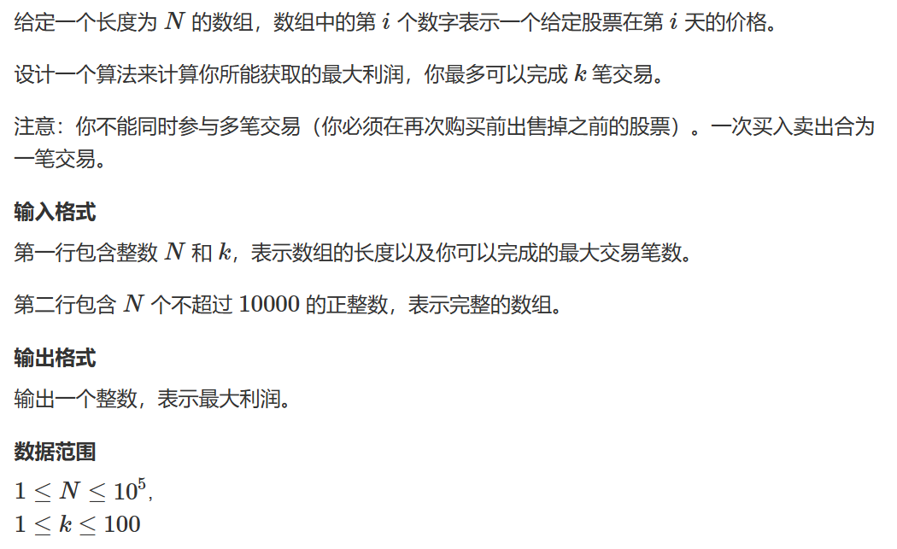   
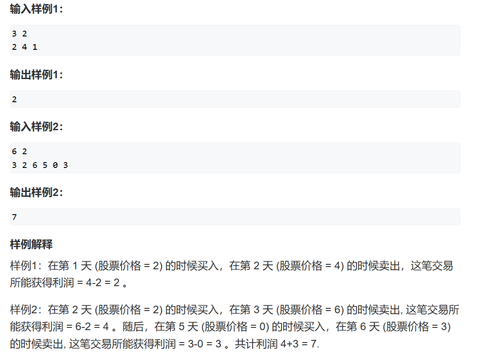

***

根据此题，分析出状态机如下：

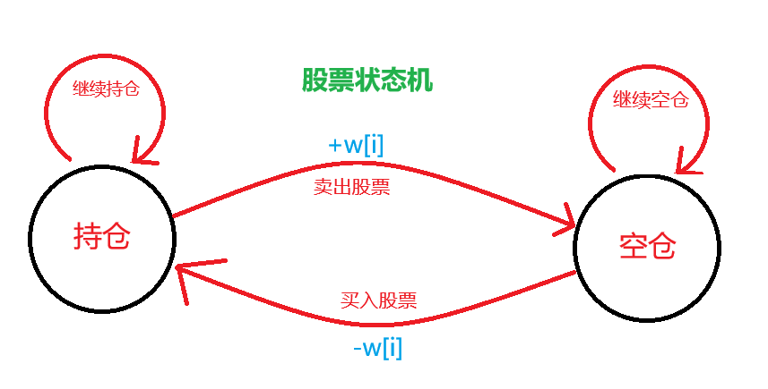

y总分析法：

一、状态表示

1. 集合：dp[i][j][0/1] 表示前i 天中，已经完成交易j 次，当前1——手中持有股票的状态，0——手中没有持有股票的状态，其值表示目前手持金额。
2. 属性：Max

二、状态计算

1. 对于持仓状态dp[i][j][1]，其上个状态可以是继续持仓或由空仓状态买入股票后进入持仓状态。
2. 对于空仓状态dp[i][j][0]，其上个状态可以是继续空仓或由持仓状态经过一次交易后进入空仓状态。

***

朴素法：

```cpp
#include <iostream>
#include <algorithm>
#include <cstring>

const int N = 100010, K = 110;;

int w[N];
int dp[N][K][2];

int n, k;
int main()
{
    memset(dp, 0xcf, sizeof dp);
    dp[0][0][0] = 0;
	scanf("%d%d", &n, &k);
	for (int i = 1; i <= n; i++) scanf("%d", &w[i]);
	for(int i = 1;i<=n;i++)
	{
		for(int j = 0;j<=k;j++)
		{
			//默认空仓状态基础空仓状态，如果之前完成过交易我们才能从持仓状态转移过来
			dp[i][j][0] = dp[i - 1][j][0];
			if(j) dp[i][j][0] = std::max(dp[i][j][0], dp[i-1][j-1][1] + w[i]);
			dp[i][j][1] = std::max(dp[i - 1][j][0] - w[i], dp[i - 1][j][1]);
		}
	}
	//结果一定是从空仓状态得出，遍历空仓状态找到最大手持金额
	int res = 0;
	for(int i = 0;i<=k;i++) res = std::max(res,dp[n][i][0]);
	printf("%d",res);
}
```

空间优化法：

当然，我们依然可以使用滚动数组去优化我们的空间复杂度，可以注意到我们只会用到i 和i-1 两层，那么我们就只保留两层即可。

并且对于此题，使用朴素法使得我们处于TLE的边缘，空间优化法可以加速地址的寻找，减少时间开销。

```cpp
#include <iostream>
#include <algorithm>
#include <cstring>

const int N = 100010, K = 110;;

int dp[2][K][2];

int n, k;
int main()
{
	memset(dp, 0xcf, sizeof dp);
	dp[0][0][0] = 0;
	scanf("%d%d", &n, &k);
	int w;
	for (int i = 1; i <= n; i++)
	{
		scanf("%d", &w);
		for (int j = 0; j <= k; j++)
		{
			dp[i&1][j][0] = dp[(i - 1)&1][j][0];
			if (j) dp[i&1][j][0] = std::max(dp[i&1][j][0], dp[(i - 1)&1][j - 1][1] + w);
			dp[i&1][j][1] = std::max(dp[(i - 1)&1][j][0] - w, dp[(i - 1)&1][j][1]);
		}
	}
	int res = 0;
	for (int i = 0; i <= k; i++) res = std::max(res, dp[n&1][i][0]);
	printf("%d", res);
}
```

## 题三（状态机模型）

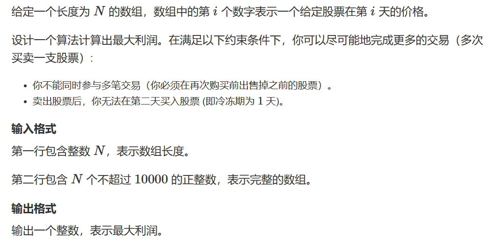   
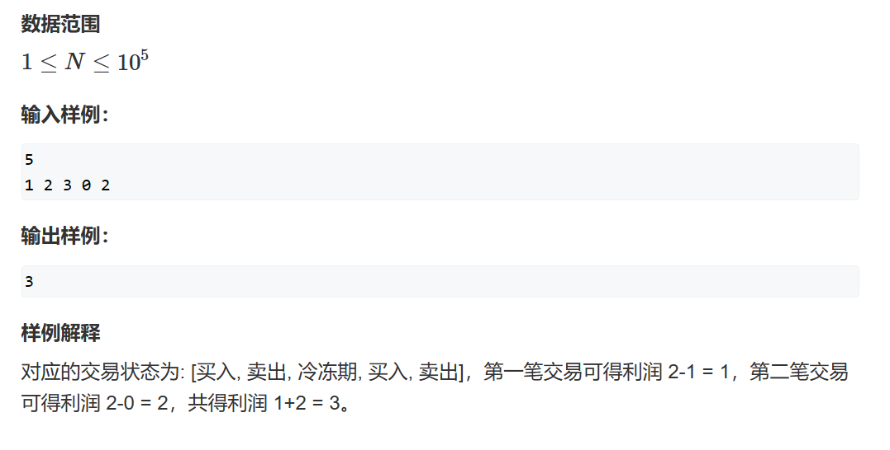

如果将彩票模型Ⅳ做懂以后此题其实十分简单，因为此题一个是少了买卖次数的限制，让我们少了一维，二是此题只不过多了一个冷冻空仓期的状态。

根据此题，分析出状态机如下：

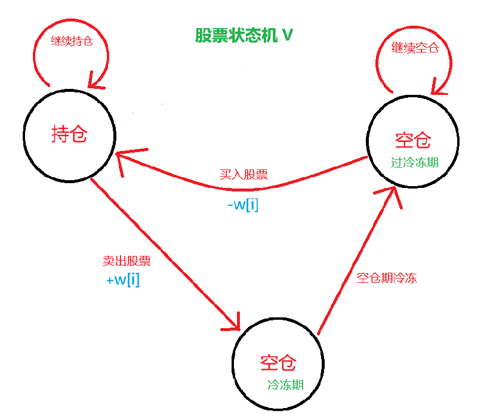

***

y总分析法：

一、状态表示

1. 集合：dp[i][0] —— 考虑前i 天，且第i 天为空仓状态（待交易），dp[i][1] —— 考虑前i 天，且第i 天为持仓状态，dp[i][2] —— 考虑前i 天，且第i 天为空仓状态（冷冻期）
2. 属性：Max

二、状态计算

根据状态机：   
空仓状态（待交易） <--- 空仓状态（待交易）、空仓状态（冷冻期）   
持仓状态 <--- 空仓状态（待交易）、持仓状态  
空仓状态（冷冻期） <--- 持仓状态

***

朴素法：

```cpp
#include <iostream>
#include <algorithm>
#include <cstring>

const int N = 100010;

int w[N];
int dp[N][3];

int n;
int main()
{
    memset(dp, 0xcf, sizeof dp);
    dp[0][0] = 0;
	scanf("%d", &n);
	int w;
    for (int i = 1; i <= n; i++)
	{
		scanf("%d", &w);
		dp[i][0] = dp[(i - 1)][0];
		dp[i][2] = dp[(i - 1)][1] + w;
		dp[i][0] = std::max(dp[i][0], dp[(i - 1)][2]);
			
		dp[i][1] = std::max(dp[(i - 1)][0] - w, dp[(i - 1)][1]);
	}
	printf("%d", std::max(dp[n][0],dp[n][2]));
}
```

空间优化法：

```cpp
#include <iostream>
#include <algorithm>
#include <cstring>

const int N = 100010;

int w[N];
int dp[2][3];

int n;
int main()
{
    memset(dp, 0xcf, sizeof dp);
    dp[0][0] = 0;
	scanf("%d", &n);
	int w;
    for (int i = 1; i <= n; i++)
	{
		scanf("%d", &w);
		dp[i&1][2] = dp[(i - 1)&1][1] + w;
		dp[i&1][0] = std::max(dp[(i-1)&1][0], dp[(i - 1)&1][2]);
		dp[i&1][1] = std::max(dp[(i - 1)&1][0] - w, dp[(i - 1)&1][1]);
	}
	printf("%d", std::max(dp[n&1][0],dp[n&1][2]));
}
```

## 题四（状态机模型）

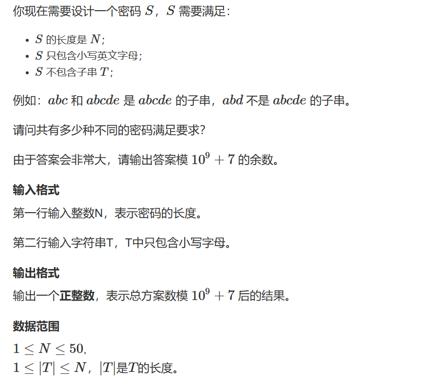   
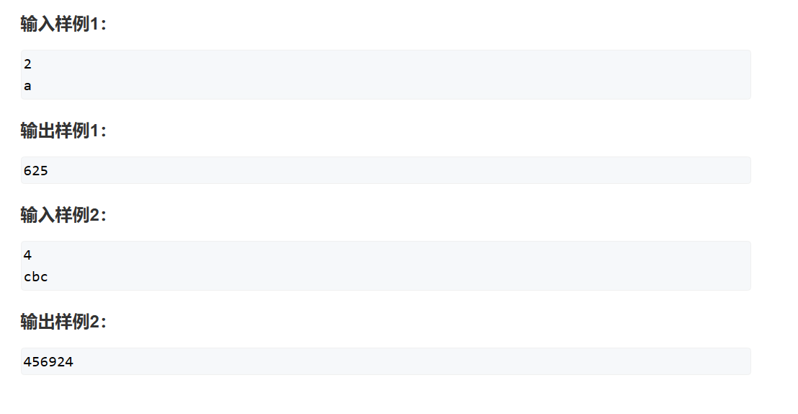

***
小疑问：此题我自己的做法是0型next数组，也就是没有右移的next数组，但是一直WA，希望有大佬解答。
***

题目要求很明确，有多少个长度为N，不包含T的字符串。

对于字符串匹配很容易想到KMP算法，并且此题就是以KMP算法的next数组最为状态机。

这里给出next数组的一些性质供大家复习：

1. next数组记录的就是最长相等前后缀的长度，如果next[len-1]!=0/-1，则说明字符串有相同的前后缀。
2. 最长相等前后缀的长度为next[len-1] + 1，数组长度为len。
3. 如果len %（len - （next[len - 1] + 1））== 0，则说明（数组长度 - 最长相等前后缀的长度）正好可以被数组的长度整除，该字符串中有重复的子字符串。
4. 数组长度减去最长相等前后缀的长度相当于第一个重复子字符串的长度，也就是一个重复周期的长度，如果这个周期可以被整除，则说明整个数组就是这个周期的循环。

但问题就在于如何实现将next作为状态机使用呢？

***
我们先进行dp分析：

y总分析法：

一、状态表示

1. 集合：dp[i][j] 表示考虑S的前i 个字符，且生成的以S[i] 为后缀的字符串恰好等于T的1 ~ j 形成的子串的方案数
2. 属性：Count

二、状态计算

这里就是实现next数组作为状态机的关键了。

根据我们的状态表示，很显然我们无法保证d[n][j] 时S中就一定没有字符串T。

此时巧妙的地方来了，此时我们保证了S的第i 个字符等于T的第j 个字符，那么在枚举第i+1 个字符的取值时，我们就有以下三种可能：

1. 后缀串正好构成了T ---> 舍去，这就是巧妙的地方，在枚举的时候每次都不统计能构成T的情况，那么之后求和的同时集合中就不会出现违法元素。
2. 后缀串不足以构成T 但S[i+1] = T[j+1] ---> 成功匹配长度+1 此时相当于构成了dp[i+1][j+1]。
3. 后缀串不足以构成T 但S[i+1] != T[j+1] ---> 指定一个指针u 从j 回退去寻找以S[i+1]为后缀的最长T子串，如果没有那自然是最好的，这样就完全没有匹配上的风险。


状态演示   
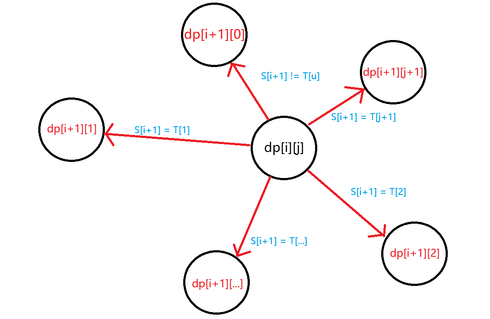

```cpp
#include <iostream>
#include <cstring>

const int N = 55, MOD = 1e9 + 7;

int dp[N][N];

int n;
char Mod_str[N];
int next[N];

int main()
{
	//从下标1开始记录字符串，这是为了方便dp的使用，
	//其实常做就可以发现，我们总是空出一行一列作为预留空间
	std::cin >> n >> Mod_str+1;
	int size = std::strlen(Mod_str+1);
	int j = 0;
	//求next数组
	for (int i = 2; i <= size; i++)
	{
		while (j && Mod_str[i] != Mod_str[j+1]) j = Mod_str[j];
		if (Mod_str[i] == Mod_str[j+1])
			j++;
		next[i] = j;
	}
	//对于考虑0长度密码，和无匹配有一个方案
	dp[0][0] = 1;
	//枚举密码
	for (int i = 0; i < n; i++)
	{
		//对于每一位密码枚举模式串T
		for (int j = 0; j < size; j++)
		{
			//枚举每一位下标i+1可以赋的值
			for (char k = 'a'; k <= 'z'; k++)
			{
				//找到最长匹配T子串
				int u = j;
				while (u && Mod_str[u+1] != k) u = next[u];
				if (Mod_str[u+1] == k) u++;
				if (u < size) dp[i+1][u] = (dp[i+1][u] + dp[i][j]) % MOD;
			}
		}
	}
	int res = 0;
	for (int i = 0; i < size; i++) res = (res + dp[n][i]) % MOD;
	printf("%d", res);
}
```

## 题五

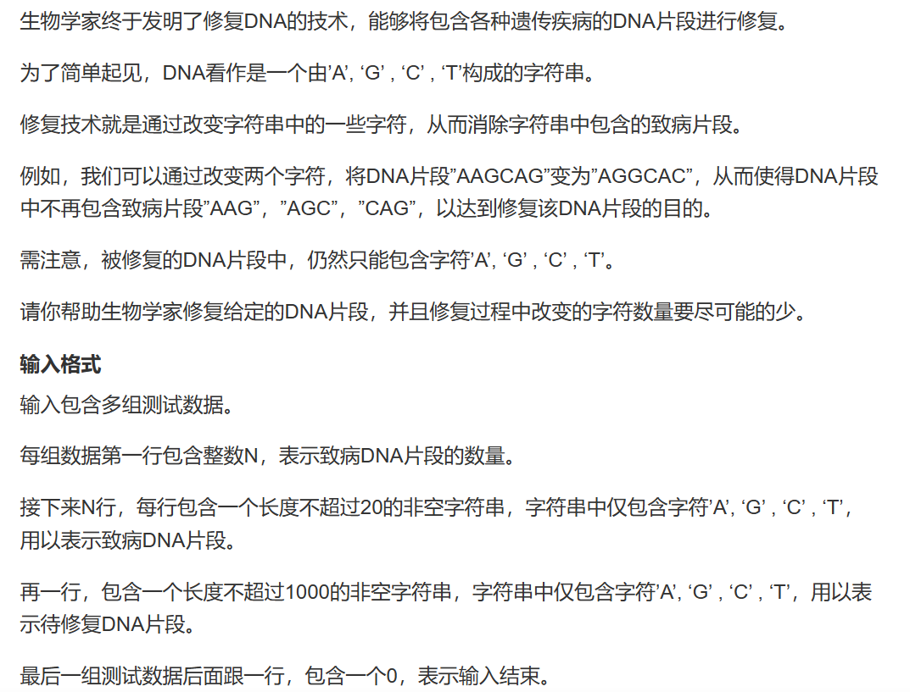
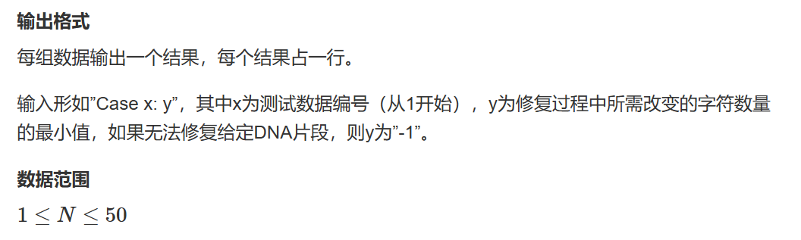
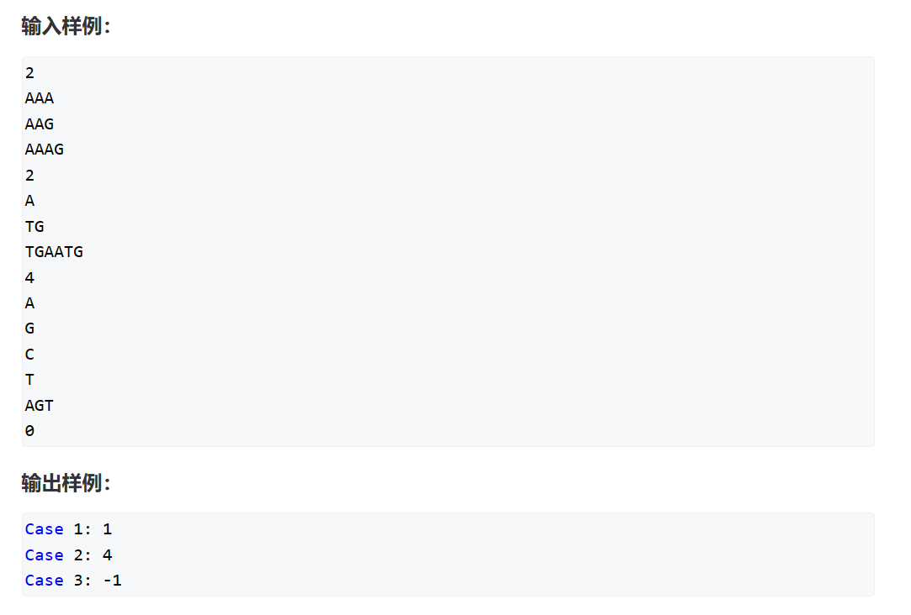

此题涉及AC自动机内容，强烈建议先学习AC自动机后再来看此题！！！

[AC自动机](https://www.acwing.com/file_system/file/content/whole/index/content/10587839/)

对比上一题，学过AC自动机的同学可能很快就能反应过来了，上一题是单个字符串的线性匹配问题。而对于这题，是多个字符串的匹配问题，对于多个字符串，我们使用Trie树去存储，那么我们的匹配方法就是非线性的树形匹配。

学完AC自动机再来看此题其实就很容易了，这里就不再进行代码的过多解释，参见上文AC自动机的构建。

y总分析法：

一、状态表示

1. 集合：dp[i][j] 表示考虑字符串的前i 个字符，当前走到AC自动机种的第j 个位置的所有操作方案种，最少修改的字符的数量。
2. 属性：Min

二、状态计算


```cpp
#include <iostream>
#include <algorithm>
#include <cstring>

const int N = 1010;

int dp[N][N];
int trie[N][4], dar[N], idx;
int q[N], fail[N];
int n, m;
char str[N];

int get(char c)
{
	if (c == 'A') return 0;
	if (c == 'T') return 1;
	if (c == 'G') return 2;
	return 3;
}

void insert()
{
	int p = 0;
	for (int i = 0; str[i]; i++)
	{
		int t = get(str[i]);
		if (trie[p][t] == 0) trie[p][t] = ++idx;
		p = trie[p][t];
	}
	dar[p] = 1;
}

void build()
{
	int hh = 0, tt = -1;
	for (int i = 0; i < 4; i++)
		if (trie[0][i])
			q[++tt] = trie[0][i];
	while (hh <= tt)
	{
		int t = q[hh++];
		for (int i = 0; i < 4; i++)
		{
			int p = trie[t][i];
			if (!p)  trie[t][i] = trie[fail[t]][i];
			else
			{
				fail[p] = trie[fail[t]][i];
				q[++tt] = p;
				//此时如果fail指针指向的节点为某一个病毒串结尾，我们也是需要标记这个节点为结尾的
				dar[p] |= dar[fail[p]];
			}
		}
	}
}

int main()
{
	int T = 1;
	while (std::cin >> n, n)
	{
		std::memset(trie, 0, sizeof trie);
		std::memset(dar, 0, sizeof dar);
		std::memset(fail, 0, sizeof fail);
		idx = 0;

		for (int i = 0; i < n; i++)
		{
			scanf("%s", str);
			insert();
		}
		build();
		scanf("%s", str + 1);
		m = strlen(str + 1);
		//取最小值，记得初始化为大数
		memset(dp, 0x3f, sizeof dp);
		dp[0][0] = 0;
		for (int i = 0; i < m; i++)
		{
			for (int j = 0; j <= idx; j++)
			{
				for (int k = 0; k < 4; k++)
				{
					//t是判断此时字符串的下一个字母是否和我们枚举的字符相等，如果相等我们就不需要修改
					int t = get(str[i + 1]) != k;
					//p 指向此时节点的下一个字符
					int p = trie[j][k];
					//判断一下p是否为匹配节点，也就是说p 是否为其中一个病毒单词的结尾节点，如果不是，我们才能进行密码枚举
					//如果不是，那就看看目前状态，和从上一状态转移到填上k字符是否使得操作数变少
					if (!dar[p]) dp[i + 1][p] = std::min(dp[i + 1][p], dp[i][j] + t);
				}
			}
		}
		int res = 0x3f3f3f3f;
		for (int i = 0; i <= idx; i++) res = std::min(res, dp[m][i]);
		if (res == 0x3f3f3f3f) res = -1;
		std::cout << "Case " << T++ << ": " << res << "\n";
	}
}
```