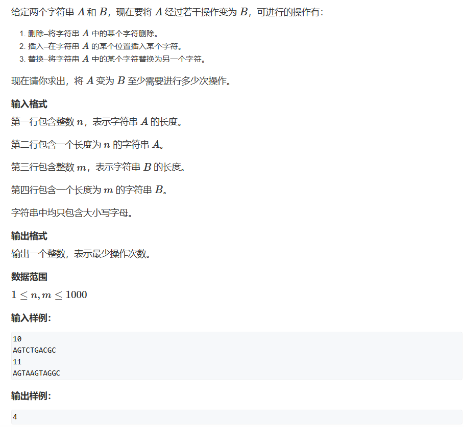

# 线性DP

具有明显的线性关系的dp题目被称为线性dp，例如题一中我们一层一层地遍历每个元素并且是从左到右地去线性遍历

## 题一


此题的题目很明确——要求我们找到路径使得节点权重和最大，对于这道题，最直接的想法是将dp[i][j]的含义定义为：从上到下直至nums[i][j]为终点的最大路径。但这样又引出一个问题——我们的三角形右边界需要特判


此时我们将dp[i][j]的含义定义为：从下到上直至nums[i][j]为终点的最大路径。就可以避免这样的问题


y式分析法：
1. 状态表示：dp[i][j]
   1. 集合：所有从起点（从下到上），走到(i, j)的路径
   2. 属性：所有路径上数值的最大值——Max


2. 状态计算：
   1. 来自左下方：dp[i-1][j]    +  nums[i][j]
   2. 来自右下方：dp[i-1][j-1]  +  nums[i][j]
   3. 两者取max


```cpp
#include <iostream>
#include <algorithm>

const int N = 510;
int dp[N][N];
int nums[N][N];
int n;

int main()
{
    std::cin>>n;
    
    for(int i = 1;i<=n;i++)
        for(int j = 1;j<=i;j++)
            std::cin>>nums[i][j];
    for(int i = 1;i<=n;i++)
        dp[n][i] = nums[n][i];
    for(int i = n-1;i>=1;i--)
        for(int j = 1;j<=i;j++)
            dp[i][j] = std::max(dp[i+1][j] + nums[i][j], dp[i+1][j+1] + nums[i][j]);
    std::cout<<dp[1][1];
}
```

这里我们还可以继续向下优化，我们的状态计算总是先将变更前的值进行计算以后再赋到同一位置，用到的数据都是之前变更过的，我们用同一个二维数组来表示即可：

```cpp
#include <iostream>
#include <algorithm>

const int N = 510;
int dp[N][N];
int n;

int main()
{
	std::cin >> n;

	for (int i = 1; i <= n; i++)
		for (int j = 1; j <= i; j++)
			std::cin >> dp[i][j];
	for (int i = n - 1; i >= 1; i--)    //因为最后一行默认就是它的值，所以我们从倒数第二行开始
		for (int j = 1; j <= i; j++)
			dp[i][j] = std::max(dp[i + 1][j] + dp[i][j], dp[i + 1][j + 1] + dp[i][j]);
	std::cout << dp[1][1];
}
```

## 题二（LIS——最长上升子序列一）


y氏分析法：
1. 状态表示：dp[i]
   1. 集合：所有以nums[i]结尾的上升子序列
   2. 属性：最长上升子序列，Max
2. 状态计算（j < i）：
   1. 包含i：   dp[j] + 1 
   2. 不包含i： dp[i] = 1


Karl五步法：
1. dp[i]代表i及i之前最长的递增子序列   
2. dp[i]等于arr[i]>arr[k](i>k)时最大的dp[k]加上一，即    
if(arr[i]>arr[k]) dp[i]=std::max(dp[i],dp[k]+1)因为这里的dp[i]是在变化的，所以说其实dp[i]与dp[k]+1的比较是在寻找i之前最大的递增子序列长度    
3. 因为只有一个系列，单个元素也可以视为一个递增子序列，所以dp全部初始化为1    
4. 因为子序列是有顺序的，我们选择从前到后遍历，内层循环也一样   
5. 举例推导过程略过   

```cpp
#include <iostream>
#include <algorithm>
#include <cstring>
const int N = 1010;
int dp[N];
int nums[N];
int n;

int main()
{

	std::cin >> n;
	
	for (int i = 1; i <= n; i++)
		std::cin >> nums[i];
	int res = 1;
	for(int i = 1;i<=n;i++)
	{
	    dp[i] = 1;
		for(int j = 1;j<i;j++)
		{
			if (nums[i] > nums[j])
				dp[i] = std::max(dp[j] + 1, dp[i]);
		}
		res = std::max(res, dp[i]);
	}
	std::cout << res;
}
```

***
### 遇到的问题

这里在写代码的时候还犯了一个错误：使用了cstring的memset函数去初始化dp数组，但其实这样是错误的
```cpp
memset(dp, 1, sizeof dp);	//其实数组中的值并没有被初始化为1，而是全被初始化为了16843009
```
这里截取CSDN的weiambt用户的解释：

所以如果我们要初始化一个int数组，我们只能使用0或者-1
***

## 题三（最长上升子序列二）


此题与上一题不同的地方就是数据的输入范围变了，我们的数组范围变到了10w，所以如果我们不进行优化继续使用上题中$O(n^2)$的算法，那么我们必定超时

### 解释一
优化思路：我们将长度为k的最长单调子序列集合中，只存入结尾最小的那一位，例如：题例中，长度为1的LIS结尾为1，长度为2的LIS结尾为2，长度为3的LIS结尾为5，长度为4的LIS结尾为6。   
这时我们就可以根据以上描述来假设：整个结尾的数值是单调递增的。    
反证法：
1. 假设：长度为3的LIS结尾与长度为4的LIS结尾相同
2. 那么我们知道LIS是严格单调递增的，那么长度为4的LIS的倒数第二个元素数值上应该是小于结尾的，但是由于长度为4的LIS是由长度为3的LIS得出，那么长度为3的LIS结尾应该是与其相等的（因为存的LIS都是由相对最小值组成的，也就代表着$a_i$的前一个数一定是最大的小于它的那个数），即出现了矛盾，那么我们的假设就是成立的

其实以上的假设和证明有些晦涩难懂，本题严格意义做法上并不是dp，我们只是找到了其他更适合本题的算法思路

### 解释二
其实用一句话就可以解释这个算法 —— 我们不断地维护一个数组，使得大于这个数组最大的数字放到最后，小于或等于这个数组的数将第一个大于等于它的数替换
***
记住，无论是y总的方法还是数组维护法，得出的数组都不是我们的LIS，它们对应下标储存的值代表的是：    
**长度为i的LIS中以最小数字结尾的LIS**    
***
因为只有这样，我们才能保证我们长度为i的LIS有最大的可扩展性，只要我们每次都保证了i-1长度的最大扩展性，那我们就一定能为长度为i的LIS提供最佳的组合方式。俗话说得好，每一步都为未来考虑，那你的当下也一定是最佳的

### 解释三
再换一个解释，在计算出这个数组后，如果我们再添加一个数字并且它刚好大于dp[i]小于dp[i+1]（以我们的定义这是一定成立的），那么这个数字不仅能接到到以nums[dp[i]]结尾的LIS之后，也能接到以nums[dp[1]] ~ nums[dp[i-1]]结尾的LIS之后，并且我们会更新出一个以这个数结尾的长度为i+1的最佳的LIS字串dp[i+1] = x


```cpp
#include <iostream>	//y总法
#include <algorithm>

const int N = 100010;

int dp[N];  //dp[i] 此时的含义为——长度为i的LIS中最小的尾数
int nums[N];

int main()
{
	int n;
	std::cin >> n;
	for(int i = 1;i<=n;i++)
	{
		std::cin >> nums[i];
	}
	int len = 0;
	
	for(int i = 1;i<=n;i++)
	{
		int l = 0; r = len; //明确一下r的含义：可以接到哪个长度的后面
		while(l<r)
		{
			int center = l + r + 1>> 1;
			if (dp[center] < nums[i]) l = center;
			else r = center - 1;
		}
		len = std::max(len, r + 1);
		dp[r + 1] = nums[i];
	}
	std::cout << len;
}
```

维护数组法：
```cpp
#include <iostream>
const int N = 100010;

int cnt[N],nums[N];
int n;
int main()
{
	std::cin >> n;
	for (int i = 1; i <= n; i++) std::cin >> nums[i];
	int len = 0;
	for(int i = 1;i<=n;i++)
	{
		int l = 0, r = len;
		while(l<r)
		{
			int mid = l + r + 1 >> 1;
			if (cnt[mid] < nums[i]) l = mid;
			else r = mid - 1;
		}
		if (r == len)
		{
			cnt[++len] = nums[i];
		}
		else cnt[r+1] = nums[i];    //r指向小于nums[i]最大的数，所以我们需要替换掉它后面那个数
	}
	std::cout << len;
}
```

## 题四（LCS——最长公共子序列）


y总分析法：
1. 状态表示：
   1. 集合：dp[i][j]表示A[1 ~ i]，B[1 ~ j] 的最长公共子序列的值（我们从1开始输入字符串）
   2. 属性：Max
2. 状态计算：
   1. 如果A[i] == B[j]，那么dp[i][j] = dp[i-1][j-1] + 1;
   2. 如果A[i] != B[j]，那么dp[i][j] = std::max(dp[i-1][j], dp[i][j-1])


Karl五步法：
1. dp[i][j]指的是长度为[1,i]的Text1字符串与长度为[1,j]的Text2字符串的最长公共子序列。   
2. 如果Text[i]与Text[j]相等，那么dp[i][j]=dp[i-1][j-1]+1,    
如果不相等，那么dp[i][j]=std::max(dp[i-1][j],dp[i][j-1])。     
3. 因为两者之间会出现完全不重复的情况，所以dp初始值为0。    
4. 遍历顺序均为递增。    
5. 举例推导过程略过    

```cpp
#include <iostream>
#include <algorithm>
#include <string>

const int N = 1010;
int dp[N][N];		//dp[i][j]以A[i]结尾的，
char A[N], B[N];
int n, m;

int main()
{
	std::cin >> n >> m;
	for(int i = 1;i<=n;i++)
		std::cin >> A[i];
	for (int i = 1; i <= m; i++)
		std::cin >> B[i];
	int res = 0;
	for(int i = 1;i<=n;i++)
	{
		for(int j = 1;j<=m;j++)
		{
			if(A[i]==B[j])
			{
				dp[i][j] = std::max(dp[i - 1][j] + 1, dp[i - 1][j-1]);
			}
			else
			{
				dp[i][j] = std::max(dp[i - 1][j],dp[i-1][j-1]);
			}
		}
	}
	std::cout << dp[n][m];
}
```

## 题五与题六（最短编辑距离）



y氏分析法：

1. 状态表示：dp[i][j]
   1. 集合：所有将A[1 ~ i]变成B[1 ~ j]的操作方式
   2. 属性：Min
2. 状态计算：dp[i][j] = 
   1. 删A[i]：删掉A[i]后使得A[1 - i-1] = B[1 ~ j]（此时A[1 ~ i-1]与B[1 ~ j]相等） —— dp[i-1][j] + 1
   2. 增A[j]：添加A[j]后使得A[i + 1] = B[j] （i + 1 = j，所以此时A[1 ~ i]与B[1 ~ j - 1]相等）—— dp[i][j-1] + 1
   3. 改A[i]：
      1. 如果A[i] = B[j]，不操作 —— dp[i-1][j-1]
      2. 如果A[i] != B[j]，将A[i]更改成B[j] —— dp[i-1][j-1] + 1

这里需要特殊的初始化，当我们的i或j是0时，我们只需要删除或增加i个操作数，所以需要初始化另dp[i][0] = i，dp[0][i] = i

```cpp
#include <iostream>
#include <algorithm>

const int N = 1010;
char A[N], B[N];
int dp[N][N];
int n, m;

int main()
{
	std::cin >> n;
	for (int i = 1; i <= n; i++) std::cin >> A[i];
	std::cin >> m;
	for (int i = 1; i <= m; i++) std::cin >> B[i];

	for (int i = 1; i <= n; i++) dp[i][0] = i;
	for (int i = 1; i <= m; i++) dp[0][i] = i;


	for(int i = 1;i<=n;i++)		//取三者之间的最小值
	{
		for(int j = 1;j<=m;j++)
		{
			dp[i][j] = std::min(dp[i - 1][j] + 1, dp[i][j - 1] + 1);
			if (A[i] == B[j]) dp[i][j] = std::min(dp[i][j], dp[i - 1][j - 1]);
			else dp[i][j] = std::min(dp[i][j], dp[i - 1][j - 1] + 1);
			//优化写法
			//dp[i][j] = std::min(dp[i - 1][j] + 1, dp[i][j - 1] + 1);
			//dp[i][j] = std::min(dp[i][j], dp[i - 1][j - 1] +( A[i] != B[j]));
		}
	}
	std::cout << dp[n][m];
}
```


此题与上题核心代码一致，只是需要多次判断和考察做题者对代码基础的掌握
```cpp
#include <iostream>
#include <cstring>
#include <algorithm>

const int N = 1010;

char strings[N][20];
int dp[N][20];
int n, m;

int edit_distance(char* str1, char* str2)
{
	int len1 = std::strlen(str1), len2 = std::strlen(str2);
	for (int i = 0; i <= len1; i++) dp[i][0] = i;
	for (int i = 0; i <= len2; i++) dp[0][i] = i;

	for(int i = 1;i<=len1;i++)
	{
		for(int j = 1;j<=len2;j++)
		{
			dp[i][j] = std::min(dp[i - 1][j]+1, dp[i][j - 1]+1);
			dp[i][j] = std::min(dp[i][j], dp[i - 1][j - 1] + (str1[i-1] != str2[j-1]));	//注意此处需要-1来访问正确的字符位置，代码与y总在输入时少一个+1，也就是下标为1开始储存字符串，而我们从0开始
		}
	}
	return dp[len1][len2];
}

int main()
{
	std::cin >> n >> m;
	for(int i = 0;i<n;i++)
		scanf_s("%s", strings[i]);
	while(m--)
	{
		char str[20];
		int Changenums;
		scanf_s("%s%d", str, &Changenums);

		int times = 0;
		for(int i = 0;i<n;i++)
		{
			if (edit_distance(strings[i], str) <= Changenums)
				times++;
		}
		std::cout << times<<"\n";
	}
}
```