# 01背包问题

## 题一（01背包问题）

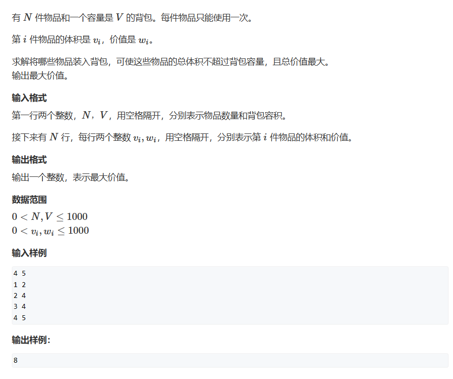

1. 状态表示：
    1. 集合：例如在题一中，dp[i][j]代表考虑所有前i个物品，且总体积不超过j的选法集合
    2. 属性：题一求最大价值
2. 状态计算：
    也就是我们状态的更新
    1. 在题一中我们将dp[i][j]分为两个集合
       1. 第一个是所有不选第i个物品的方案：我们的dp[i][j]此时就会等于dp[i-1][j]，因为我们不选第i个物品，同时我们dp[i][j]的定义又是考虑前i个物品体积不超过j的最大价值价值的选法
       2. 第二个是所有选择第i个物品的方案：我们在考虑这个情况时有一个前提条件，也就是第i个元素的体积是不能超过j的。在这个前提下，我们的方案被分成两个部分，固定部分：$1.第i个元素$、动态部分：$2.第1-i个的最大价值集合$。所以我们的$dp[i][j] = dp[i-1][j-V[i]] + W[i]$，$j-V[i]\quad$是为了预留出第i个元素的体积。
    2. 最后我们只需要取两个集合之间的最大值就是此时我们的dp[i][j]的最大价值

五步法：

1. 确定dp数组及下标的含义：
dp[i][j]：从1~i的物品中体积不超过j的最大价值选择方案
2. 确定递归公式：
if(不含i) dp[i][j] = dp[i-1][j]
if(含i) dp[i][j] = std::max(dp[i-1][j], dp[i-1][j-V[i]] + W[i])
3. 初始化dp数组：当我们以0为编号（不存在），装不少于i体积的物品的最大价值;又因为从所有编号的重量为0的最大价值也是0，但是又因为在C++中数组初始0，所以没必要
4. 确定遍历顺序：因为我们前i个物品的dp值依赖于前i-1个物品的值，所以我们从前向后遍历
5. 举例推导dp数组
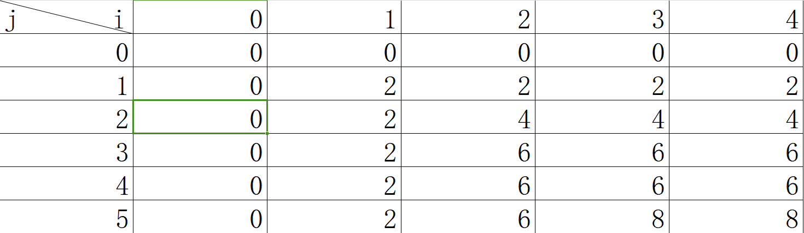

```cpp
#include <iostream>
#include <algorithm>

const int N = 1010;

int n, m;
int V[N], W[N];
int dp[N][N];

int main()      //朴素法
{
 std::cin >> n >> m;

 for (int i = 1; i <= n; i++)
  std::cin >> V[i] >> W[i];

 //for (int i = 0; i <= n; i++) //初始化dp数组，当我们以0为编号（不存在），装不少于i体积的物品的最大价值;又因为从所有编号的重量为0的最大价值也是0
 // dp[i][0] = dp[0][i] = 0; //但是又因为在C++中数组初始0，所以没必要

 for(int i = 1;i<=n;i++)
  for(int j = 1;j<=m;j++)
  {
   dp[i][j] = dp[i - 1][j];        //不含i的集合
   if (j >= V[i]) dp[i][j] = std::max(dp[i][j], dp[i - 1][j - V[i]] + W[i]);   //取含i的集合和不含i的集合之间的最大值
  }
 std::cout << dp[n][m];
}
```

但是，当我们观察一下状态转移方程式后我们会发现：其实我们的$dp[i][j]$只使用到了$i-1$这一层，并没有使用$i-2$或$i-3$之前的层数，这代表着我们可以使用滚动数组将dp转换为一维，从而优化我们的状态转移方程

```cpp
#include <iostream>
#include <algorithm>

const int N = 1010;

int n, m;
int V[N], W[N];
int dp[N];

int main()      //优化法
{
 std::cin >> n >> m;

 for (int i = 1; i <= n; i++)
  std::cin >> V[i] >> W[i];

 //for (int i = 0; i <= n; i++) //初始化dp数组，当我们以0为编号（不存在），装不少于i体积的物品的最大价值;又因为从所有编号的重量为0的最大价值也是0
 // dp[i][0] = dp[0][i] = 0; //但是又因为在C++中数组初始0，所以没必要

 for(int i = 1;i<=n;i++)
  for(int j = m;j>=V[i];j--)
   dp[j] = std::max(dp[j], dp[j - V[i]] + W[i]);
  
 std::cout << dp[m];
}
```

为什么这里我们需要从后向前遍历？

从举例推导dp数组的过程中我们可以发现，当我们从前向后遍历时，我们需要使用到第i-1层的数据，同样的，我们转换为一维的使用也需要使用，但在二维中两者互不相关，一维中我们每一层循环都会改变数组的值，那么我们从后向前遍历就会避免我们把我们需要使用的i-1层的j或j-V[i]数据更新到第i层导致数据污染答案错误。

## 题六（01背包问题）

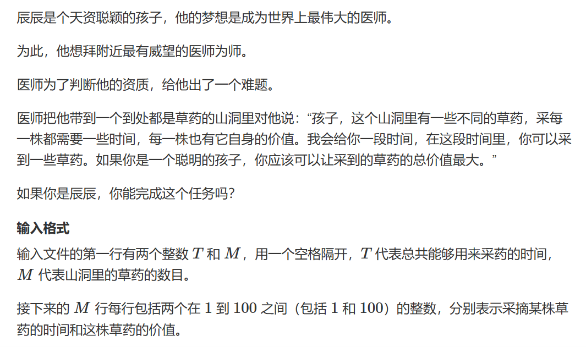   
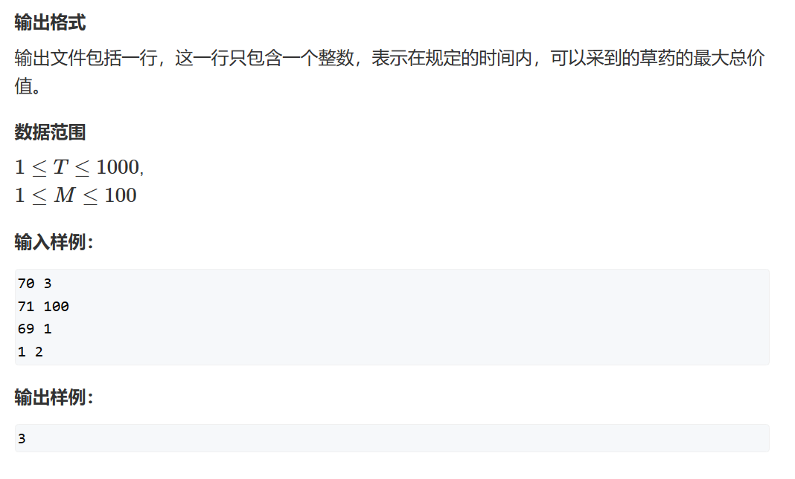

经典01背包问题，只不过此题的限制条件不再是体积而是时间而已，注意此题输入顺序。

***

y氏分析法：

一、状态分析

1. 集合：dp[i][j] 代表考虑编号从 1 ~ i 的草药中采集时间不超过 j 的方案集合
2. 属性：Max

二、状态计算

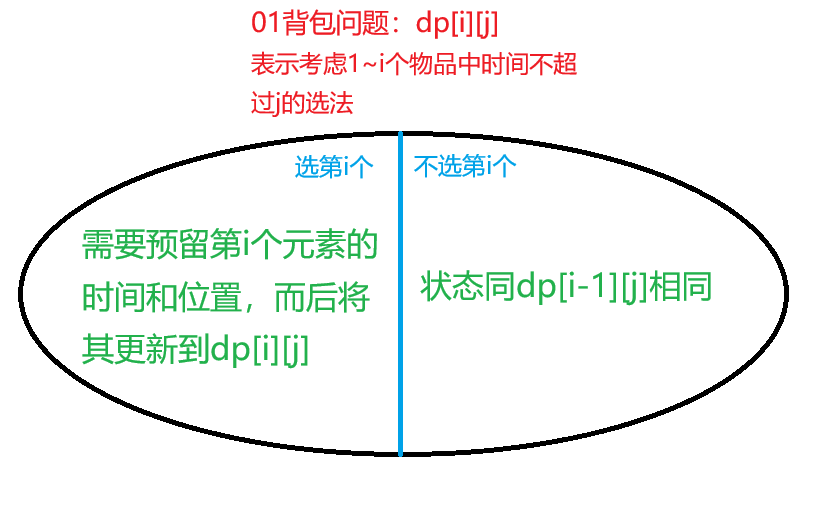

***

朴素法01背包：

```cpp
#include <iostream>
#include <cstring>
#include <algorithm>

const int N = 110, T = 1010;

int value[N], Time[N];
int dp[N][T];
int t, m;

int main()
{
	scanf("%d %d",&t,&m);
	
	for (int i = 1; i <= m; i++) scanf("%d %d", &Time[i], &value[i]);

	for(int i = 1;i<=m;i++)
	{
		for(int j = 0;j<=t;j++)
		{
			dp[i][j] = dp[i - 1][j];
			if (Time[i] <= j) dp[i][j] = std::max(dp[i][j], dp[i - 1][j - Time[i]] + value[i]);
		}
	}
	printf("%d", dp[m][t]);
}
```

空间复杂度优化法01背包：

但是，当我们观察一下状态转移方程式后我们会发现：其实我们的$dp[i][j]$只使用到了$i-1$这一层，并没有使用$i-2$或$i-3$之前的层数，这代表着我们可以使用滚动数组将dp转换为一维，从而优化我们的状态转移方程

```cpp
#include <iostream>
#include <cstring>
#include <algorithm>

const int N = 110, T = 1010;

int value[N], Time[N];
int dp[T];
int t, m;

int main()
{
	scanf("%d %d",&t,&m);
	
	for (int i = 1; i <= m; i++) scanf("%d %d", &Time[i], &value[i]);

	for(int i = 1;i<=m;i++)
	{
		for(int j = t ;Time[i] <= j;j--)
		{
			dp[j] = std::max(dp[j], dp[j - Time[i]] + value[i]);
		}
	}
	printf("%d", dp[t]);
}
```

为什么这里我们需要从后向前遍历？

从举例推导dp数组的过程中我们可以发现，当我们从前向后遍历时，我们需要使用到第i-1层的数据，同样的，我们转换为一维的使用也需要使用，但在二维中两者互不相关，一维中我们每一层循环都会改变数组的值，那么我们从后向前遍历就会避免我们把我们需要使用的i-1层的j或j-V[i]数据更新到第i层导致数据污染答案错误。

## 题七（01背包问题）

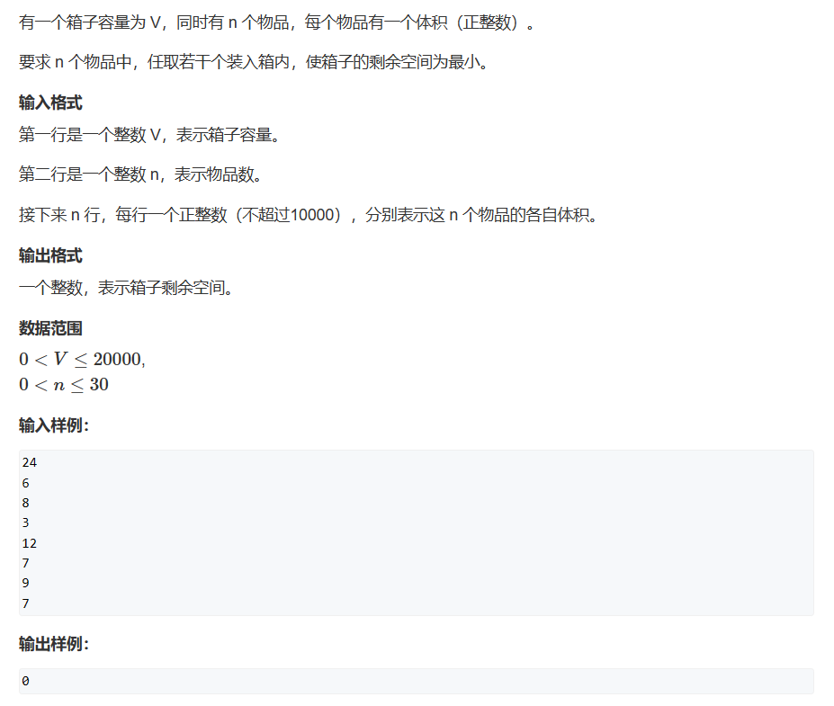

这是一题比较裸的01背包问题，要求的是箱子剩余最小空间，其实也就是求最大使用空间。

***
y总分析法：

一、状态表示：

1. 集合：dp[i][j]表示考虑物品1 ~ i 使用空间不超过j 的方案中箱子体积的集合
2. 属性：Max

二、状态计算

1. 含i：预留出i的空间 dp[i][j] = dp[i - 1][j - v] + v
2. 不含i：dp[i][j] = dp[i-1][j]

***

朴素法：

```cpp
#include <iostream>
#include <algorithm>

const int N = 20010;

int dp[35][N];

int main()
{
	int n,V;
	scanf("%d%d", &V,&n);
	for(int i = 1;i<=n;i++)
	{
		int vol;
		scanf("%d", &vol);
		for(int j = 0;j<=V;j++)
		{
			dp[i][j] = dp[i-1][j];
			if(j>=vol) dp[i][j] = std::max(dp[i][j], dp[i-1][j-vol] + vol);
		}
	}
	printf("%d", V-dp[n][V]);
}
```

空间优化：

```cpp
#include <iostream>
#include <algorithm>

const int N = 20010;

int dp[N];

int main()
{
	int n,V;
	scanf("%d%d", &V,&n);
	for(int i = 0;i<n;i++)
	{
		int vol;
		scanf("%d", &vol);
		for(int j = V;j>=vol;j--)
		{
			dp[j] = std::max(dp[j],dp[j - vol] + vol);
		}
	}
	printf("%d", V-dp[V]);
}
```

## 题八（二维01背包问题）

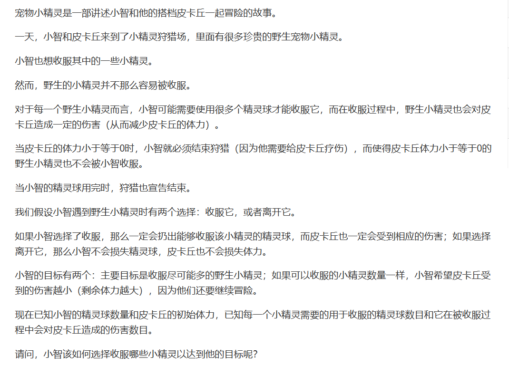
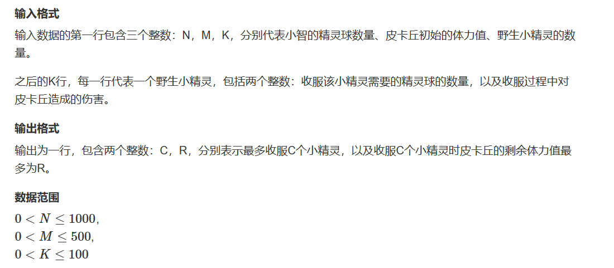
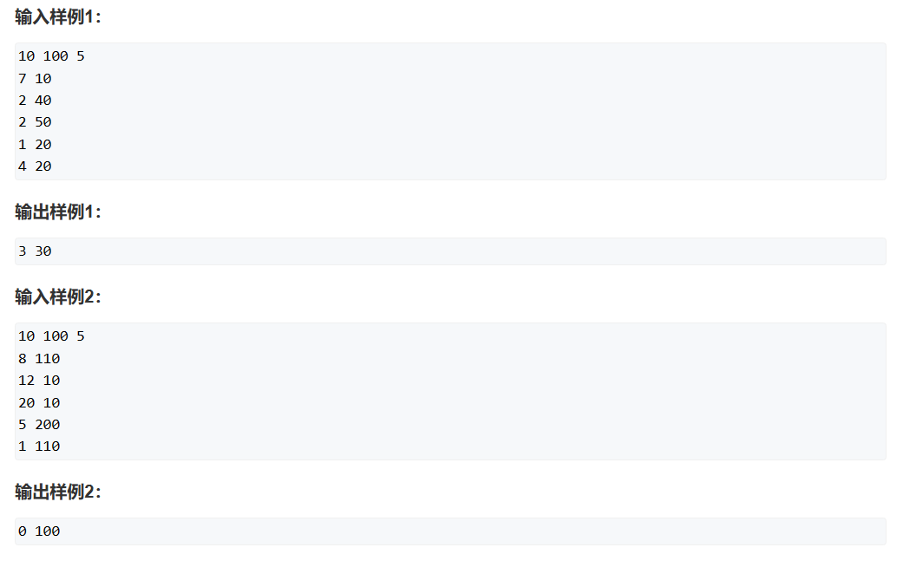

此题有两个开销一个价值：

1. 开销1：精灵球数量
2. 开销2：皮卡丘体力值
3. 价值：小精灵的数量

y总分析法：

一、状态表示：

1. 集合：dp[i][j][k]表示 所有只从前i个物品中选，且花费1不超过j，花费2不超过k的选法的集合
2. 属性：Max

二、状态计算

dp[i][j][k] = std::max(dp[i - 1][j][k], dp[i - 1][j - num[j]][k - cost[k]] + 1);

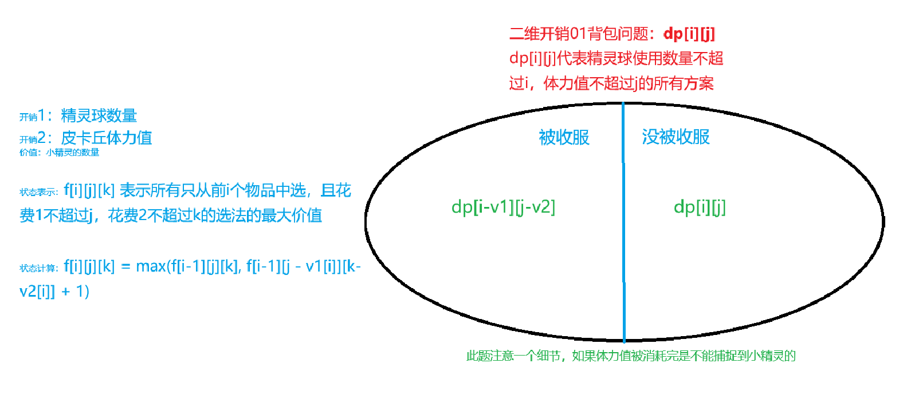

因为计算上我们可以优化第一维，可以变成二维的状态计算。

y总法：

```cpp
#include <iostream>
#include <algorithm>

const int N = 1010, M = 510, K = 110;

int dp[N][M];
int num[K],cost[N];

int main()
{
	int V1, V2, n;
	scanf("%d%d%d", &V1, &V2, &n);
	for (int i = 0; i < n; i++)
	{
		int v1, v2;
		scanf("%d%d", &v1, &v2);
		for(int j = V1;j>=v1;j--)
		{
			for(int k = V2;k>=v2;k--)
			{
				dp[j][k] = std::max(dp[j][k], dp[j - v1][k - v2] + 1);
			}
		}
	}
	printf("%d ", dp[V1][V2]);
	int k = V2-1;
	while (k >= 0 && dp[V1][k] == dp[V1][V2]) k--;
	printf("%d", V2 - k);
}
```

墨佬法：

墨佬十分敏锐地发现了精灵的限制范围是小于精灵球数量的，那么我们更改一下状态表示就能减少很多的计算量。

dp[i][j] 表示体力为i，收集了j个精灵 用的**最少**精灵球数量

注意这个最小，这时候我们就需要初始化一下dp

```cpp
#include <iostream>
#include <cstring>
#include <algorithm>

const int N = 1005, M = 505, S = 105;

const int INF = 0x3f3f3f3f;
int n, m, K, dp[M][S];
//dp[i][j] 表示体力为i，收集了j个精灵 用的最少精灵球数量

int main()
{
	std::memset(dp, 0x3f, sizeof dp);
	scanf("%d%d%d", &n, &m, &K);
	dp[0][0] = 0;
	for(int i = 1;i<=K;i++)
	{
		int c, d;
		scanf("%d%d", &c, &d);
		for (int j = m; j >= d; j--)
			for (int k = i; k >= 1; k--)
				if (dp[j - d][k - 1] + c <= n)
					dp[j][k] = std::min(dp[j][k], dp[j - d][k - 1] + c);
	}
	//因为消耗体力值越多越能保证我们捕捉到更多的小精灵
	//所以我们从捕捉到的最多的小精灵开始搜索
	//从最少消耗体力来查询，直到查询到第一个
	//就代表在尽可能捕捉到多的小精灵的情况下消耗的最少体力
	//从而得出尽可能捕捉到多的小精灵的情况下皮卡丘剩余的最多体力
	for(int k = K;~k;k--)
	{
		int p = INF;
		for (int j = 0; j < m; j++)
			if (dp[j][k] != INF && j < p)
				p = j;
		if(p!=INF)
		{
			printf("%d %d\n", k, m - p);
			return 0;
		}
	}
}
```

y总法：


墨佬法：


援引墨佬的话：**这题启示我们，要用灵活的思维去考虑问题qwq**

## 题九（取等01背包问题）

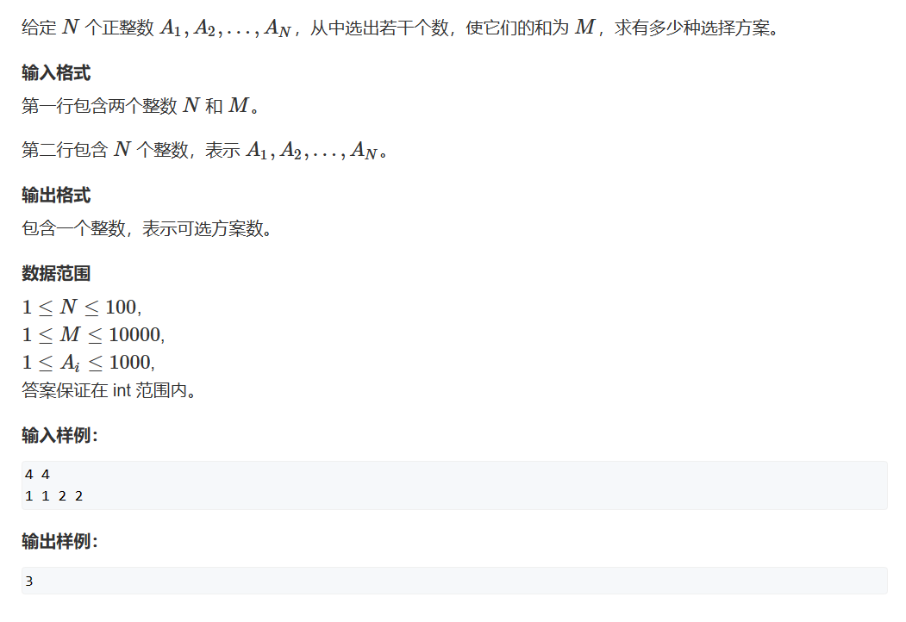

此题与其他的01背包问题区别在于状态dp的状态转移条件是equal

y总分析法：

一、状态表示：

1. 集合：dp[i][j] 表示考虑1 ~ i 号数字，组合总和等于j 的方案数
2. 属性：sum

二、状态计算

1. 选i：dp[i][j] += dp[i-1][j - v[i]]
2. 不选i：dp[i][j] = dp[i-1][j]

很多同学会奇怪为什么如此就能保证我们的组合加起来恰好能等于j呢？

这主要得益于我们对状态的定义是：表示考虑1 ~ i 号数字，组合总和等于j 的方案数。那么我们在保证了我们的v[i] 能被放到组合中的一种的的时候，我们的方案数取决于考虑从i ~ i-1，组合总和等于j - v[i]的方案数，在定义下，我们只需要再加上不选i的方案数即可。

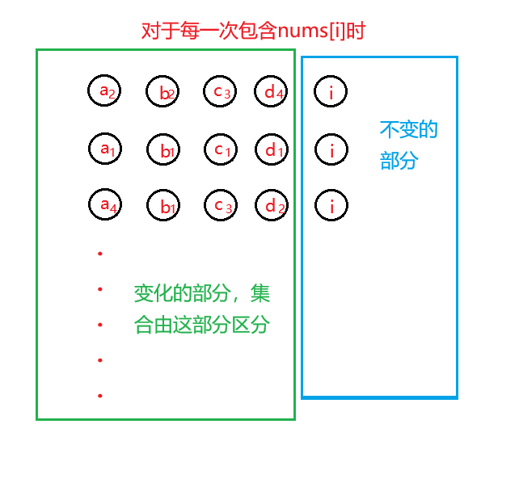

***

朴素法：

```cpp
#include <iostream>
#include <algorithm>

const int N = 110;
const int M = 10010;
int dp[N][M];
int nums[N];
int n, target;

int main()
{
	scanf("%d%d", &n, &target);

	for (int i = 1; i <= n; i++) scanf("%d", &nums[i]);
    
    dp[0][0] = 1;
	for(int i = 1;i<=n;i++)
	{
		for(int j = 0;j<=target;j++)
		{
			dp[i][j] = dp[i - 1][j];
			if (j >= nums[i]) dp[i][j] += dp[i - 1][j - nums[i]];
		}
	}
	printf("%d", dp[n][target]);
}
```

空间优化：

对于背包问题的空间优化是老生常谈的问题了，为什么总是先写出朴素法，因为只有在不断地对比中我们才能熟悉这个优化的代码，从而在竞赛中更快地想到优化这一步，但是依然建议先写出朴素法，因为不是所有题都能优化，对于空间地优化大部分情况都是从代码的逻辑上发现的，经典的背包问题常常是两层数据的迭代变化，所以常常可以化为一维来做。

```cpp
#include <iostream>
#include <algorithm>

const int N = 110;
const int M = 10010;
int dp[M];

int n, target;

int main()
{
	scanf("%d%d", &n, &target);

    dp[0] = 1;
	for(int i = 1;i<=n;i++)
	{
	    int v;
	    scanf("%d",&v);
		//记住，在二维优化至一维时一定要检查
		//遍历顺序，否则会造成数据更新过早而WA
		for(int j = target;j>=v;j--)
		{
			if (j >= v) dp[j] += dp[j - v];
		}
	}
	printf("%d", dp[target]);
}
```

## 题十六（二维费用01背包问题）

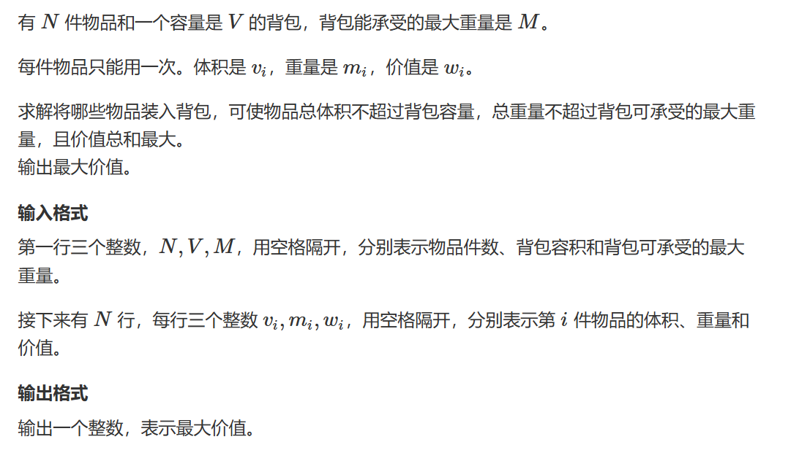   
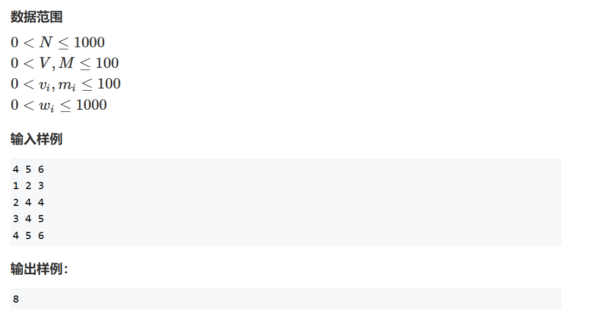

注意此题的背包有了两个限制，一个是大小，一个是重量，在这个限制下需要多一个循环去处理。

但本质还是01背包问题，抱着尝试的态度照着01背包思路写下去自然就过了。

***

y总分析法：

一、状态表示

1. 集合：dp[i][j][k] 表示考虑前i 种物品，总体积不超过j ，总重量不超过k 的背包价值方案集合
2. 属性：最大价值，Max

二、状态计算

1. 选第i 个元素：dp[i-1][j][k]
2. 不选第i 个元素：dp[i-1][j-v][k-m] 注意保证背包是否足够放下第i 个元素

朴素法：

```cpp
#include <iostream>
#include <algorithm>

const int N = 110,M = 1010;

int dp[M][N][N];
int n, v, m;
int main()
{
	scanf("%d%d%d", &n, &v, &m);

	for(int i = 1;i<=n;i++)
	{
		int _v, _m, _w;
		scanf("%d%d%d", &_v, &_m, &_w);
		for(int j = 0;j<=v;j++)
		{
			for(int k = 0;k<=m;k++)
			{
			    dp[i][j][k] = dp[i-1][j][k];
				if(j>=_v&&k>=_m) dp[i][j][k] = std::max(dp[i][j][k], dp[i-1][j - _v][k - _m] + _w);
			}
		}
	}
	std::cout << dp[n][v][m];
}
```

空间优化法：

空间优化法与普通01背包问题是一样的，这里就不多解释，需要的跳，注意从后向前遍历。

[01背包问题题解](https://www.acwing.com/file_system/file/content/whole/index/content/10418351/)

```cpp
#include <iostream>
#include <algorithm>

const int N = 110,M = 1010;

int dp[N][N];
int n, v, m;
int main()
{
	scanf("%d%d%d", &n, &v, &m);

	for(int i = 1;i<=n;i++)
	{
		int _v, _m, _w;
		scanf("%d%d%d", &_v, &_m, &_w);
		for(int j = v;j>=_v;j--)
		{
			for(int k = m;k>=_m;k--)
			{
				dp[j][k] = std::max(dp[j][k], dp[j - _v][k - _m] + _w);
			}
		}
	}
	std::cout << dp[v][m];
}
```

## 题十七（二维费用01背包问题）

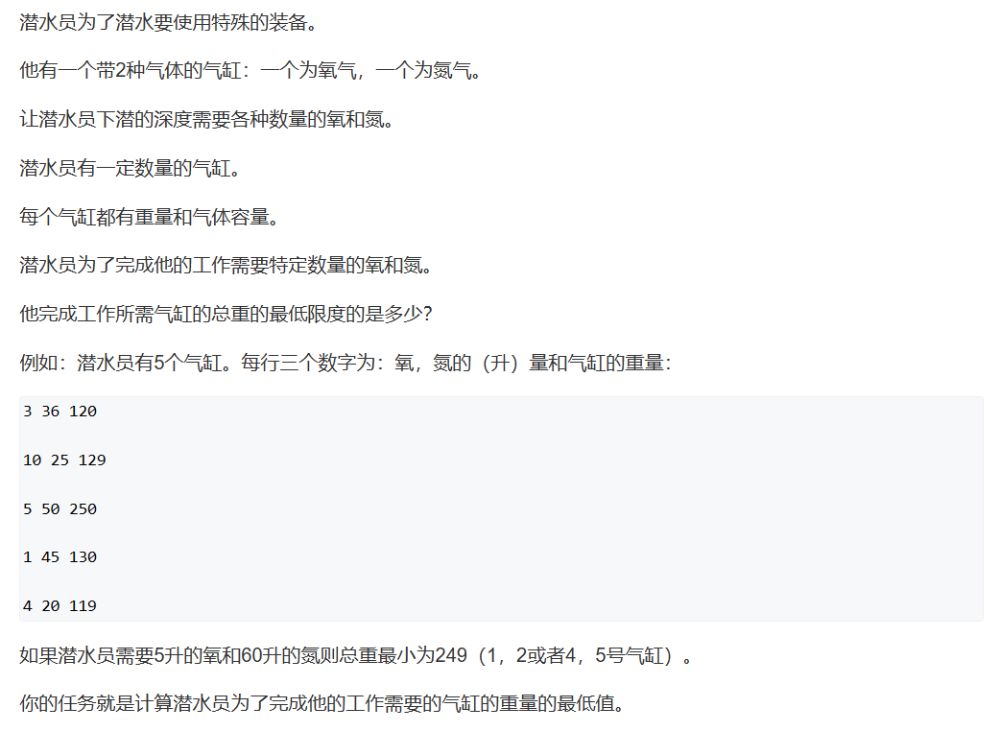   
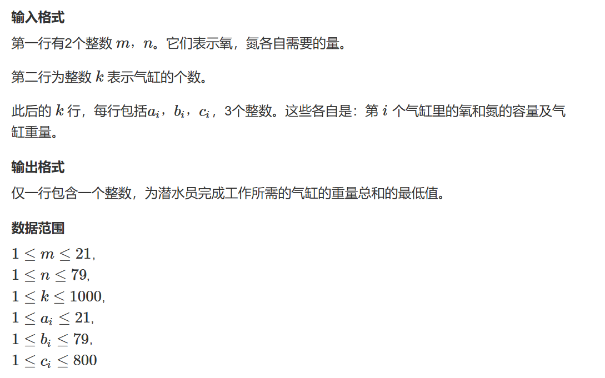   
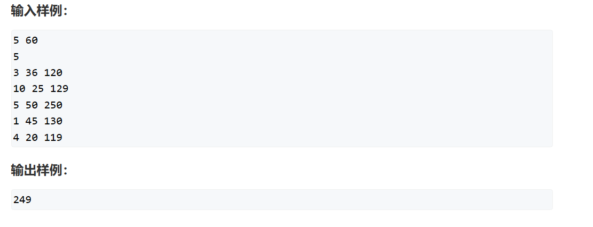

此题是普通的01背包问题，但是属性不同，致使状态计算出现变化。

y总分析法：

一、状态表示

1. 集合：dp[i][j][k] 表示考虑前i 个气缸，氧气含量不低于j，氮气含量方案中重量的集合。
2. 属性：重量最轻，Min

二、状态计算

不包含第i个气缸：dp[i-1][j][k]    
包含第i个气缸：dp[i-1][max(j-v, 0)][max(k-m), 0] + w

***

这里解释一下为什么状态计算是max(j - v, 0) 这个样式：

我们的气缸会选择出两种，假设我们需要5个单位的氧气，如果气缸含3，那么我们选了它只会可以再加气缸，如果气缸含6，那么我们选择了它就超过了我们的需求，但是依然是合法的选择，毕竟如果我们只需要带一个气缸，其重量又小，可以理解为同一个价格下，商家提供的物品质量好到超出我们制定的最低标准，那么何乐而不为呢？所以我们将其状态从0转移也就是说我们的这一项要求用一个气缸就达标了。

同时注意，求解最小值的dp问题时，需要将dp数组初始为一个很大的值（0了半天突然反应过来是这个问题QAQ）。

***

朴素法：

```cpp
#include <iostream>
#include <algorithm>
#include <cstring>

const int N = 84,M=26,K=1010;

int dp[K][M][N];

int m, n, p;

int main()
{
	scanf("%d%d%d", &m, &n,&p);
	std::memset(dp, 0x3f, sizeof dp);
	dp[0][0][0] = 0;
	for(int i = 1;i<=p;i++)
	{
		int a, b, c;
		scanf("%d%d%d", &a, &b, &c);
		for(int j = 0;j<=m;j++)
			for(int k = 0;k<=n;k++)
				dp[i][j][k] = std::min(dp[i - 1][j][k],dp[i-1][std::max(j-a,0)][std::max(k-b,0)] + c);
	}
	printf("%d", dp[p][m][n]);
}
```

空间优化法：

01背包的空间优化问题，依然是注意从后向前遍历即可。

```cpp
#include <iostream>
#include <algorithm>
#include <cstring>

const int N = 84,M=26;

int dp[M][N];

int m, n, p;

int main()
{
	scanf("%d%d%d", &m, &n,&p);
	std::memset(dp, 0x3f, sizeof dp);
	dp[0][0] = 0;
	for(int i = 1;i<=p;i++)
	{
		int a, b, c;
		scanf("%d%d%d", &a, &b, &c);
		for(int j = m;j>=0;j--)
			for(int k = n;k>=0;k--)
				dp[j][k] = std::min(dp[j][k],dp[std::max(j-a,0)][std::max(k-b,0)] + c);
	}
	printf("%d", dp[m][n]);
}
```

## 题十九

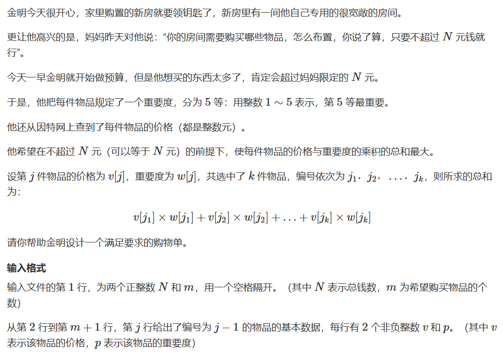    
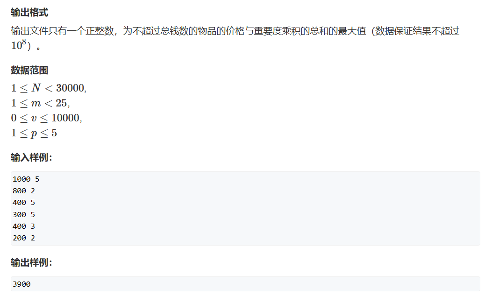

y总分析法：

一、状态表示

1. 集合：dp[i][j] 代表考虑前i 个物品，预算不超过j 总综合价值的集合
2. 属性：Max

二、状态计算

1. 不包含第i 个物品：dp[i-1][j]
2. 包含第i 个物品：dp[i-1][j-v] + p * v

***

朴素法：

```cpp
#include <iostream>
#include <algorithm>

const int N = 30010;

int dp[N];

int main()
{
	int n, m;
	scanf("%d%d", &n, &m);
	for(int i = 1;i<=m;i++)
	{
		int v, p;
		scanf("%d%d", &v, &p);
		for (int j = n; j >= v; j--)
			dp[j] = std::max(dp[j], dp[j - v] + v * p);
	}
	printf("%d", dp[n]);
}
```

空间优化法：

```cpp
#include <iostream>
#include <algorithm>

const int N = 30010;

int dp[N];

int main()
{
	int n, m;
	scanf("%d%d", &n, &m);
	for(int i = 1;i<=m;i++)
	{
		int v, p;
		scanf("%d%d", &v, &p);
		for (int j = n; j >= v; j--)
			dp[j] = std::max(dp[j], dp[j - v] + v * p);
	}
	printf("%d", dp[n]);
}
```

## 题二十一（01背包问题 + 最短路径）

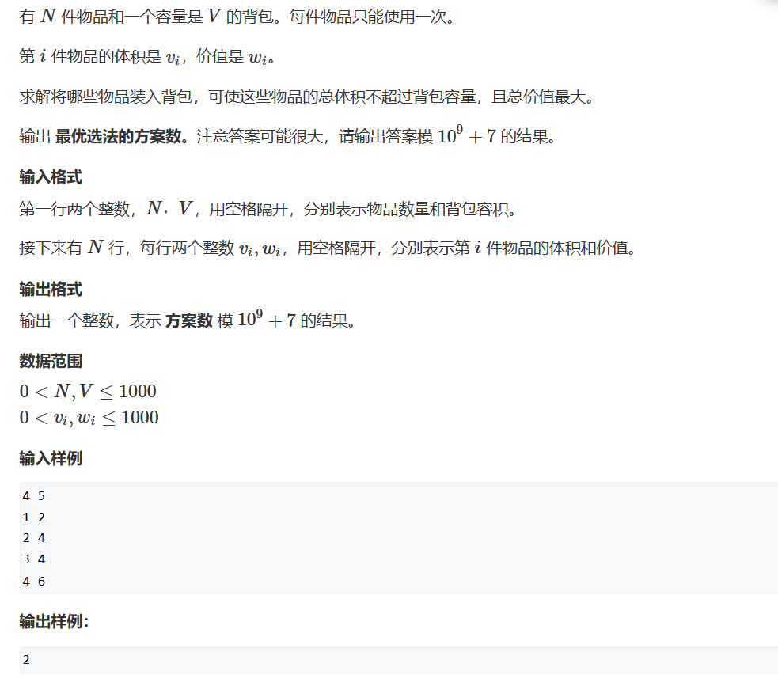

y总分析法：

一、状态表示

1. 集合：dp[i][j] 表示考虑前i 个物品，总体积不超过j 的方案的集合，cnt[i][j] 表示选择了第i 个元素且体积不超过j 时最大价值的路径数
2. 属性：Max

二、状态计算

1. 对于dp老生常谈
2. 对于cnt，我们考虑三种可能：

① dp[i-1][j] > dp[i-1][j - v]：cnt[i][j] 继承于cnt[i-1][j]   
② dp[i-1][j] < dp[i-1][j - v]：cnt[i][j] 继承于cnt[i-1][j-v]   
③ dp[i-1][j] = dp[i-1][j - v]：cnt[i][j] 可同时由两者继承故等于cnt[i-1][j] + cnt[i-1][j-v]

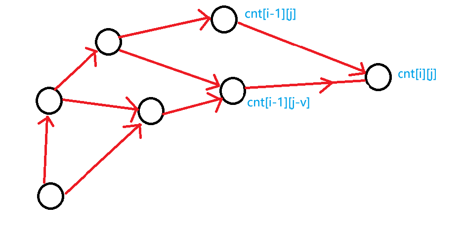

朴素法：

```cpp
#include <iostream>
#include <cstring>
#include <algorithm>

const int N = 1010,MOD = 1e9+7;

int dp[N][N];
int cnt[N][N];
int n,m;

int main()
{
    scanf("%d%d", &n, &m);
    for (int i = 0; i <= m; i ++ )
        cnt[0][i] = 1;
    for(int i = 1;i<=n;i++)
    {
        int v,w;
        scanf("%d%d",&v,&w);
        for(int j = 0;j<=m;j++)
        {
            if(j>=v)
            {
               	if(dp[i-1][j]<dp[i-1][j-v]+w)
                   //更新路径来源
                   cnt[i][j] = cnt[i-1][j-v];
               	else if(dp[i-1][j] == dp[i-1][j-v] + w)
                   //如果上下两层值相等，说明dp[i][j]可从dp[i-1][j-v]和dp[i-1][j]更新而来
                   //计算路径总和
                   //以下含义为：总的路径数 = 从其他路径到达j的路径数
                   cnt[i][j] = (cnt[i-1][j] + cnt[i-1][j-v])%MOD;
                else
					//更新路径来源
                    cnt[i][j] = cnt[i-1][j];
                dp[i][j] =std::max(dp[i-1][j],dp[i-1][j-v]+w);
               
           }else
           {
               dp[i][j] = dp[i-1][j];
               cnt[i][j] = cnt[i-1][j];
           }
        }
    }

    printf("%d",cnt[n][m]);
}
```

空间优化法：

看懂朴素法后再来优化空间复杂度，这样能理解地更深。

```cpp
#include <iostream>
#include <cstring>
#include <algorithm>

const int N = 1010,MOD = 1e9+7;

int dp[N];
int cnt[N];
int n,m;

int main()
{
    scanf("%d%d", &n, &m);
    for(int i = 0;i<=m;i++) cnt[i] = 1;
    for(int i = 1;i<=n;i++)
    {
        int v,w;
        scanf("%d%d",&v,&w);
        for(int j = m;j>=v;j--)
        {
           if(dp[j]<dp[j-v]+w)
           {
               dp[j] = dp[j-v] + w;
               cnt[j] = cnt[j-v];
           }
           else if(dp[j] == dp[j-v] + w)
               cnt[j] = (cnt[j] + cnt[j-v])%MOD;
        }
    }
    printf("%d",cnt[m]);
}
```

## 题二十二（01背包问题 + 方案输出）

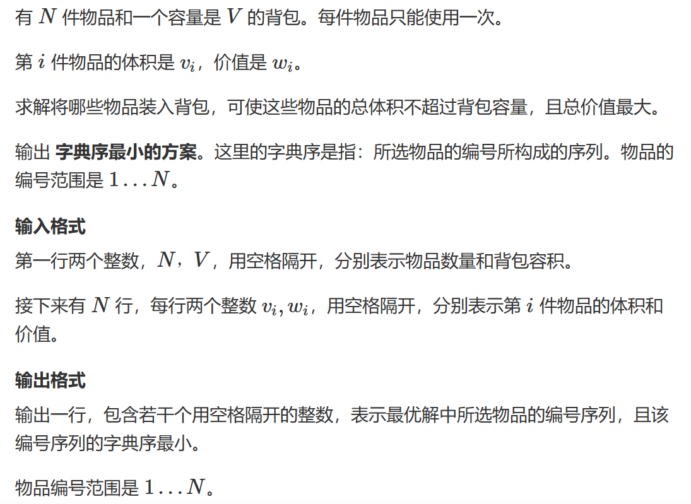
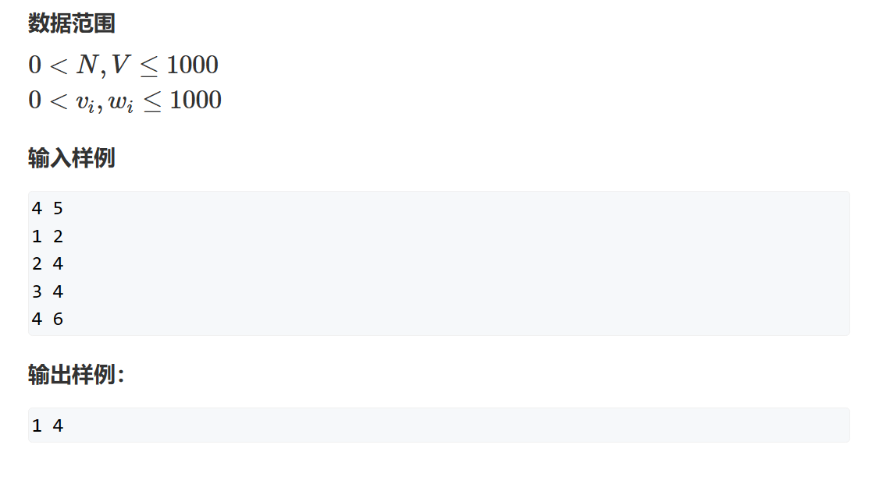

什么是字典序？

类比字典里的排序，一位一位往后比较排序，例如1、2、3、4、5排序，12345是最小字典序，54321是最大字典序。

***

y总分析法：

一、状态表示

1. 集合：dp[i][j] 表示考虑从n ~ i（倒序，这是倒序！）的物品，体积不超过j的方案集合
2. 属性：Max    
（在这样的表示方法下，dp[1][m] 才表示总的最大价值）

二、状态计算

1. 因为我们本质是倒着来状态计算的，那么顺着过来就一定是我们要的最小字典序，那么dp[i][j] 就得考虑是从dp[i+1][j] 转移过来还是dp[i+1][j-v] 转移过来。

三、路径寻找

因为我们是倒着去寻找最佳状态，那么此时我们顺着过去就是从最小字典序去输出我们的路径。在动态规划中寻找路径只需要去寻找它的上一个状态即可。

***

注意这题是正序输入，倒序dp，我们就不能滑~了

```cpp
#include <iostream>
#include <algorithm>
#include <cstring>

const int N = 1010;

int dp[N][N];
int v[N], w[N];
int n, m;
int main()
{
	scanf("%d%d", &n, &m);
	for(int i = 1;i<=n;i++)
		scanf("%d%d",&v[i],&w[i]);
	for(int i =n;i>=1;i--)
	{
		for(int j = 0;j<=m;j++)
		{
			dp[i][j] = dp[i + 1][j];
			if (j >= v[i])
				dp[i][j] = std::max(dp[i][j], dp[i + 1][j - v[i]] + w[i]);
		}
	}
	int j = m;
	for(int i = 1;i<=n;i++)
		if(j>=v[i]&&dp[i][j] == dp[i+1][j-v[i]] + w[i])
		{
			printf("%d ", i);
			j -= v[i];
		}
}
```

## 题二十三（01背包问题 + 贪心）

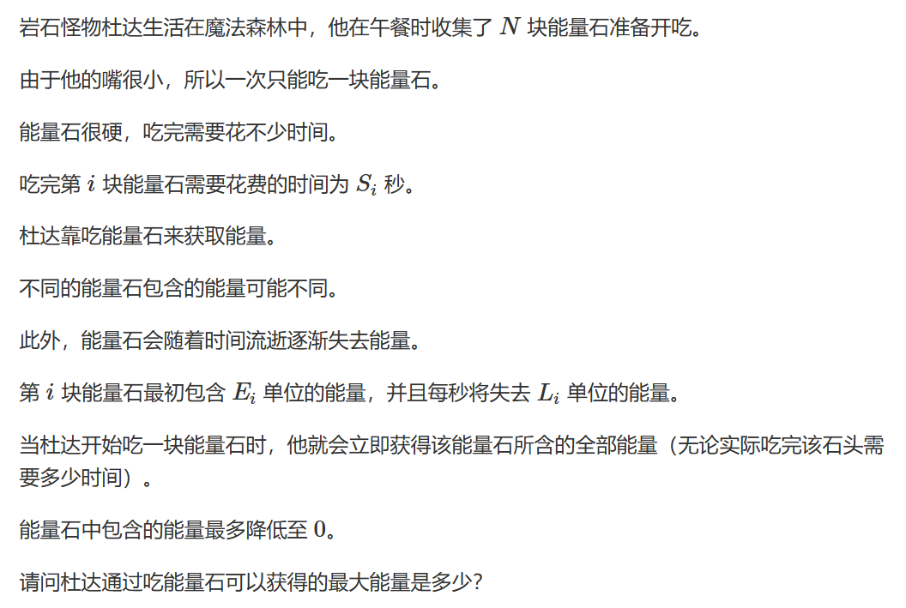   
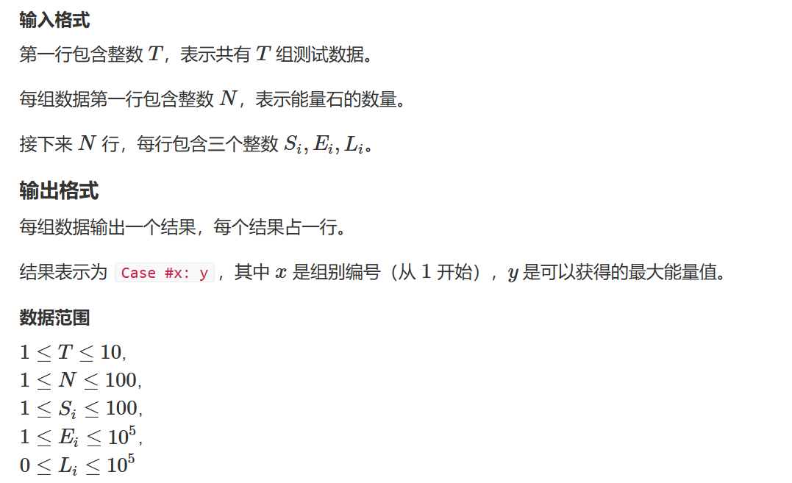    
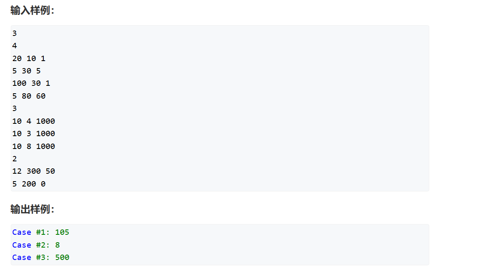   
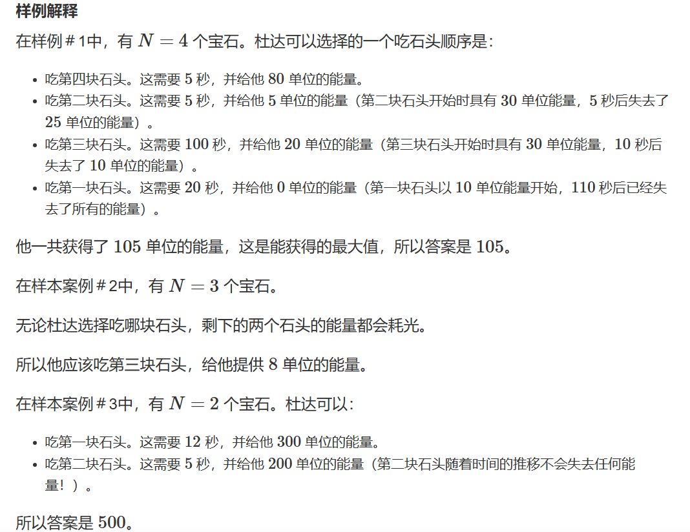

这个问题类似于贪心问题中的推公式类，但是可以通过两者结合的DP来处理这个问题。

***

一、公式推取

我们考虑在集合中任意两个相邻的能量石i 和i + 1（默认杜达还能恰）。

①我们先吃第i 个能量石，那么此时杜达获得的能量为：
$$E_i^{'}+E_{i+1}^{'}-S_iL_{i+1}$$
②我们先吃第i+1 个能量石，那么此时杜达获得的能量为：
$$E_i^{'}+E_{i+1}^{'}-S_{i+1}L_{i}$$

二、比大小

假设方案①杜达获得的能量大于方案②，那么有：
$$S_iL_{i+1}<S_{i+1}L_{i}$$

推一下：
$$\frac{S_i}{L_i}<\frac{S_{i+1}}{L_{i+1}}$$

三、处理数据

由上我们可知，当吃$\frac{S_i}{L_i}$ 最小的能量石时我们能获得相对最大能量

***

y总分析法：

一、状态表示

1. 集合：dp[i][j] 表示所有从前i块能量石中选，且花费时间不超过j的方案
2. 属性：Max

二、状态计算

dp[i][j] = max(d[i - 1][j], dp[i-1][j - s] + std::max(0, e - s[i] - (j - s) * l[i]))

***

朴素法：

经过检验，在朴素法正向遍历中此题不需要赋初始值，因为我们的状态转移并不会涉及到负数部分。

同时，我们也没必要在状态转移时考虑吃进去的石头是否能量已经为0或小于0，因为我们的状态转移只会从正数转移，如果此时dp[i-1][j] 为负数，它加上任何数也都是在减少的状态，故而我们不会选到它。也就是说我们获取的能量石一定是递增的，不会出现递减状态。

```cpp
#include <iostream>
#include <algorithm>
#include <cstring>

const int N = 110,M = 10010;

struct PowerStone
{
	int s;
	int e;
	int l;
	bool operator<(const PowerStone& other) const
	{
		return s * other.l < other.s * l;
	}
}PowerStones[N];
int T;
int dp[N][M];
int main()
{
	scanf("%d", &T);
	for(int t = 1;t<=T;t++)
	{
		int m = 0;
		
		int n;
		scanf("%d", &n);
		for(int i = 0;i<=n;i++) dp[0][i] = 0;
		for (int i = 1; i <= n; i++)
		{
			scanf("%d%d%d", &PowerStones[i].s, &PowerStones[i].e, &PowerStones[i].l);
			m += PowerStones[i].s;
		}
		std::sort(PowerStones + 1, PowerStones + n + 1);

		for(int i = 1;i<=n;i++)
		{
			int s = PowerStones[i].s, e = PowerStones[i].e, l = PowerStones[i].l;
			for(int j = 0;j<=m;j++)
			{
				dp[i][j] = dp[i - 1][j];
				if (j >= s) dp[i][j] = std::max(dp[i][j], dp[i - 1][j - s] + e - (j - s) * l);
			}
	
		}
		int res = 0;
		for (int i = 0; i <= m; i++) res = std::max(res, dp[n][i]);
		printf("Case #%d: %d\n",t, res);
	}
}
```

空间优化法：

```cpp
#include <iostream>
#include <algorithm>
#include <cstring>

const int N = 110,M = 10010;

struct PowerStone
{
	int s;
	int e;
	int l;
	bool operator<(const PowerStone& other) const
	{
		return s * other.l < other.s * l;
	}
}PowerStones[N];
int T;
int dp[M];
int main()
{
	scanf("%d", &T);
	for(int t = 1;t<=T;t++)
	{
		int m = 0;
		
		int n;
		scanf("%d", &n);
		memset(dp,0xcf,sizeof dp);
		dp[0] = 0;
		for (int i = 1; i <= n; i++)
		{
			scanf("%d%d%d", &PowerStones[i].s, &PowerStones[i].e, &PowerStones[i].l);
			m += PowerStones[i].s;
		}
		std::sort(PowerStones + 1, PowerStones + n + 1);

		for(int i = 1;i<=n;i++)
		{
			int s = PowerStones[i].s, e = PowerStones[i].e, l = PowerStones[i].l;
			for(int j = m;j>=s;j--)
			{
				dp[j] = std::max(dp[j], dp[j - s] + e - (j - s) * l);
			}
	
		}
		int res = 0;
		for (int i = 0; i <= m; i++) res = std::max(res, dp[i]);
		printf("Case #%d: %d\n",t, res);
	}
}
```

## 题二十五

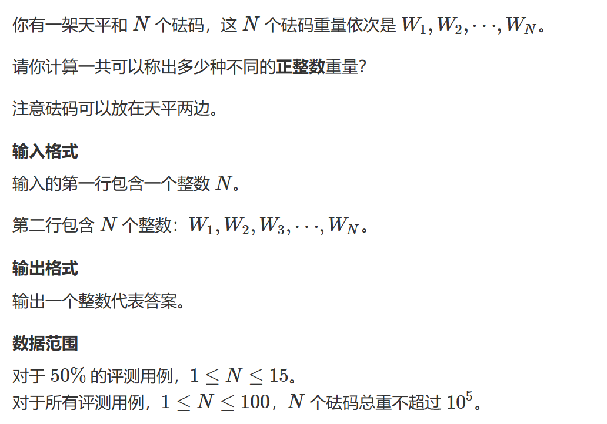
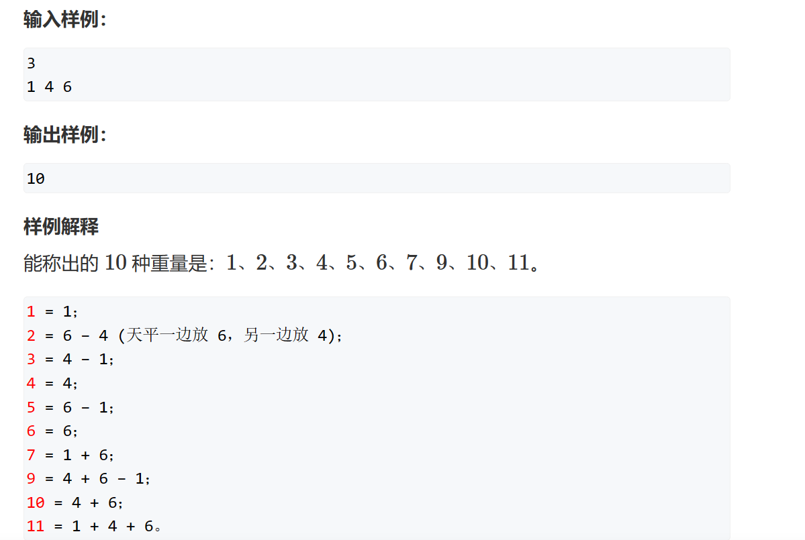

此题不难，就是一个01背包问题，并且要想到对于两个砝码在两个盘可以测量不同的重量。我们假设左盘是我们的主盘，那么我们能测量的值则是在左盘加上第i 个砝码或者在右盘加上第i 个砝码，又或者不加这个砝码。

y总分析法：

一、状态表示

1. 集合：dp[i][j] 表示考虑前i 个砝码，此时可测量总重为j 的方案。
2. 属性：是否有值不重方案。

二、状态计算

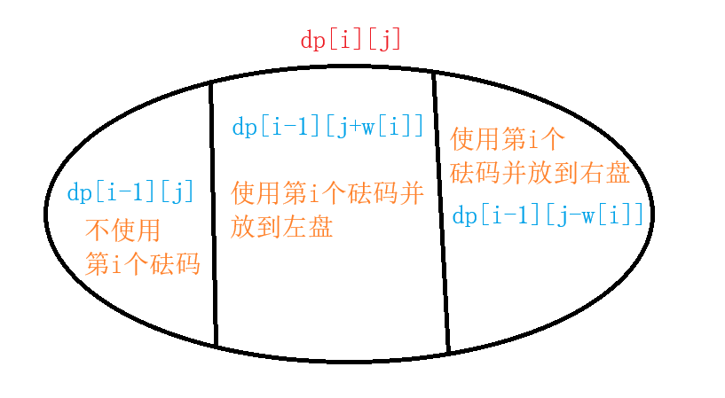

根据分析，我们只需要考虑上图的三种可能即可，那我们的dp数组只需要保存是否存在这个方案即可。

```cpp
#include <iostream>
#include <algorithm>
const int N = 110,M = 200010;
int q[N];
bool dp[N][M];

int main()
{
    std::ios::sync_with_stdio(false);
    std::cin.tie(0);
    std::cout.tie(0);
    
    
    int n,sum = 0;
    std::cin>>n;
    for(int i = 1;i<=n;i++)
    {
        std::cin>>q[i];
        sum += q[i];
    }
    dp[0][0] = true;
    for(int i = 1;i<=n;i++)
    {
        for(int j = 0;j<=sum;j++)
        {
            dp[i][j] = dp[i-1][j]||dp[i-1][std::abs(j-q[i])]||dp[i-1][j+q[i]];
        }
    }
    int res= 0;
    for(int i = 1;i<=sum;i++) if(dp[n][i]) res++;
    std::cout<<res;
}
```


