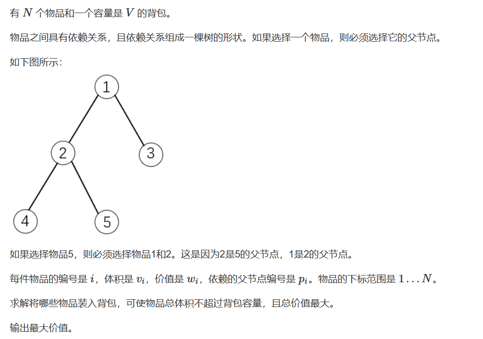
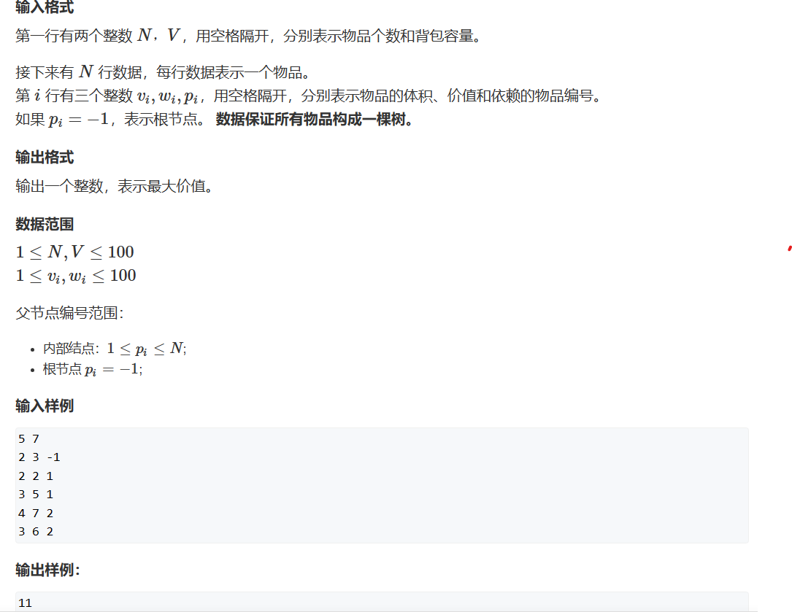
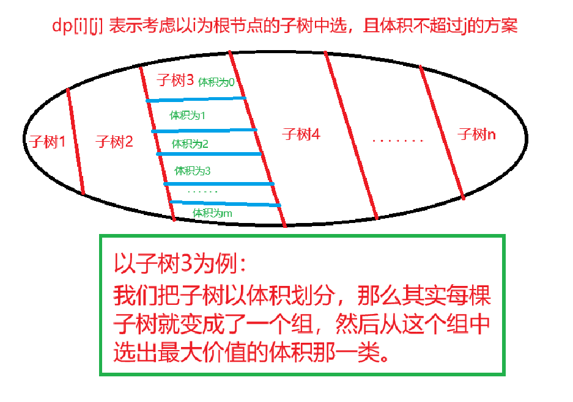

# 依赖背包问题

## 题二十（依赖背包问题）

   


y总分析法：

一、状态表示

1. 集合：dp[i][j] 表示考虑以i 为根节点的子树中选，且体积不超过j 的方案
2. 属性：Max

二、状态计算



```cpp
#include <iostream>
#include <algorithm>
#include <cstring>

const int N = 110;
int n, m;
int v[N], w[N], p;

int dp[N][N];
int h[N], next[N], value[N], idx;

int st[N];

void add(int a,int b)
{
	value[idx] = b, next[idx] = h[a], h[a] = idx++;
}

void dfs(int u)
{
	//枚举子树
	for(int i = h[u];~i;i = next[i])
	{
		//取出子树
		int son = value[i];
		//继续枚举，直到树叶，我们从叶子节点向上递归计算
		dfs(son);
		//预留出根节点的体积
		for(int j = m-v[u];j>=0;j--)
		{
			//循环决策，寻找价值最大的那个体积
			for(int k = 0;k<=j;k++)
			{
				//dp[son][k] + dp[u][j - k] 指儿子节点为根时，体积不超
				//过k和当前根节点体积不超过j - k（给儿子留出空间同时
				//保证自己有足够的空间）下的最大价值
				dp[u][j] = std::max(dp[u][j],dp[son][k] + dp[u][j - k]);
			}
		}
	}
	//此时我们还没将根节点的价值加上
	for (int j = m; j >= v[u]; j--) dp[u][j] = dp[u][j - v[u]] + w[u];
	//空间不够，不能以j为体积的状态不能选，价值为0
	for (int j = 0; j < v[u]; j++) dp[u][j] = 0;
}
int main()
{
	std::memset(h, -1, sizeof h);
	
	scanf("%d%d", &n, &m);
	int root;
	for (int i = 1; i <= n; i++)
	{
		scanf("%d%d%d", &v[i], &w[i], &p);
		if (p == -1)
			root = i;
		else
			add(p, i);
	}
	dfs(root);
	printf("%d", dp[root][m]);
}
```


