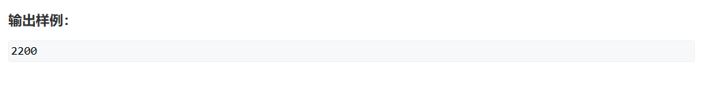

# 分组背包问题

## 题五（分组背包问题）


此题与之前的三种问题不同的是，题设要求从每个数量不一定相同的**组**中选出一种方案使得每组中**只选一个成员**而得到背包的最大价值。这类问题是特殊的多重背包问题，只不过被分组使用了

1. 确定dp数组及下标的含义：
dp[i][j]：从1~i组中，每组最多选出一个物品使得体积不超过j的最大背包价值的选择方案
2. 确定递归公式：
每组中：    
if(不含i) dp[i][j] = dp[i-1][j]
if(含i) dp[i][j] = std::max(dp[i-1][j], dp[i-1][j-V[0]] + W[0], dp[i-1][j-V[1]] + W[1], ..., dp[i-1][j-V[s-1]] + W[s-1])
3. 初始化dp数组：同题一
4. 确定遍历顺序：因为我们前i个物品的dp值依赖于前i-1个物品的值，所以我们从前向后遍历
5. 举例推导dp数组

```cpp
#include <iostream>
#include <algorithm>

const int N = 110;
int dp[N];
int v[N][N], w[N][N], s[N];
int n, m;

int main()
{
	std::cin >> n >> m;
	for(int i = 1;i<=n;i++)		//输入第i个组的数据，并存入此组的数据
	{
		std::cin >> s[i];
		for(int j = 0;j<s[i];j++)
			std::cin >> v[i][j] >> w[i][j];
	}
	for (int i = 1; i <= n; i++)    //从第一组开始列举
		for (int j = m; j >= 0; j--)    //从后往前遍历，繁殖更新之前的数据
			for (int k = 0; k < s[i]; k++)  //遍历组中的每个元素
				if (j >= v[i][k]) dp[j] = std::max(dp[j], dp[j - v[i][k]] + w[i][k]);
	std::cout << dp[m];
}
```

## 题十八（分组背包问题）

   


这是一道典型的分组背包问题，在分组背包中，会规定每组中只能选出有限个物品。

***

如何去看待此题呢？

每个公司可以选择分配一台设备或者不分配设备，在不分配设备的情况和普通01背包问题一致，但是在分配一台设备的时候，我们需要类比去找到此时分配几台设备给此公司时能达到盈利最大。

转换为分组背包问题：

有n**组**物品，每组有m**个**物品，当每组**最多**只能选一个物品时，背包价值最大。

***

y总分析法：

一、状态表示

1. 集合：dp[i][j] 代表考虑前i个公司，分配机器不超过j的方案下盈利的集合
2. 属性：Max

二、状态计算

1. 不含第i家公司：dp[i-1][j]
2. 含第i家公司：max(dp[i-1][j-v1] + w1, dp[i-1][j-v2] + w2, ..., dp[i-1][j-vn] + wn)

***

路径寻找：从后往前寻找，由状态转移时的值来向前寻找，找到后记录路径即可。

***

```cpp
#include <iostream>
#include <algorithm>

const int N = 15, M = 20;

int dp[N][M];
int win[N][M];
int route[N];
int n, m;

int main()
{
	scanf("%d%d", &n, &m);
	for (int i = 1; i <= n; i++)
		for (int j = 1; j <= m; j++)
			scanf("%d", &win[i][j]);

	for(int i = 1;i<=n;i++)
		for(int j = 1;j<=m;j++)
			for(int k = 0;k<=j;k++)
				dp[i][j] = std::max(dp[i][j], dp[i - 1][j - k] + win[i][k]);
	int j = m;
    for (int i = n; i; i -- )
        for (int k = 0; k <= j; k ++ )
            if (dp[i][j] == dp[i - 1][j - k] + win[i][k])
            {
                route[i] = k;
                j -= k;
                break;
            }
	printf("%d\n", dp[n][m]);
	for(int i = 1;i<=n;i++)
	    printf("%d %d\n",i,route[i]);
}
```

## 题二十四（分组背包 + 树形DP）

   
   


此题涉及到树形DP和分组背包。

其实思路很简单，每一个主件和其附件的组合构成一棵以主件为根节点，附件为子节点的最大二层的二叉树。如此，我们只需要保证每棵树在必选根节点的条件下的几种组合中选出一种即可。

***

y总分析法：

一、状态表示

1. 集合：dp[i][j] 表示考虑前i 组，总花费不超过j元的方案集合
2. 属性：Max

二、状态计算

枚举每组可能的选择方案，这里使用二进制枚举法（代码注释有详解），而后做决策选择合法的价值最高的那一组。

***

思路简单，代码不一定简单，明确思路和实现代码是算法题的两大头，缺一不可。我们直接贴出代码大家通过注释来理解：

朴素法：

```cpp
#include <iostream>
#include <algorithm>
#include <vector>

const int M = 32010,K = 70;

//表示考虑前i 组，总花费不超过j元的方案集合
int dp[K][M];

struct staff
{
	int v;
	int w;
}fathers[K];
//fathers[i] 用于记录每棵树的树根
int n, m;

//用来记录每棵树的子节点
std::vector<staff> sons[K];

int main()
{
	scanf("%d%d",&m,&n);
	for(int i = 1;i<=n;i++)
	{
		int v, p, q;
		scanf("%d%d%d", &v, &p, &q);
		p *= v;
		//根据输入特点
		if (q == 0)
			//0为父节点
			fathers[i] = { v,p };
		else
			//非0为子节点，将其放到其父节点下
			sons[q].push_back({ v,p });
	}
	for(int i = 1;i<=n;i++)
	{
		//注意第二层循环的判断条件比y总多一个fathers[i].v!=0，
		//因为我们只记录的父节点，这么做可以有效避开无效数据，
		//减少无意义计算量
		for(int j = 0;j<=m&&fathers[i].v!=0;j+=10)
		{
			//不选第i组
		    dp[i][j] = dp[i-1][j];
			//选第i组，并且使用二进制来枚举我们的可能性，
			//这里我对代码进行逐行解析
			for (int k = 0; k < 1 << sons[i].size();k++)
			{
				//在循环判断中 1 << sons[i].size()，是规定了枚举钟点，
				//例如sons[i].size() = 2时，也就说这是对于father[i] 来说它
				//有两个儿子节点，那么枚举终点就是100，我们可以有
				//000：不选儿子节点
				//001：选第一个儿子不选第二个
				//010：选第二个儿子不选第一个
				//011：两个儿子都选
				//共四种可能，也就是说0代表不选这个儿子，1代表选这个儿子


				int v = fathers[i].v;
				int w = fathers[i].w;
				//v、w 指这个组合中的总体积和总价值，
				//默认带上根节点故初始化根节点
				for(int l = 0;l<sons[i].size();l++)
				{
					//k >> l & 1 判断这个组合中二进制数每一位上的值
					//从而真正实现二进制来枚举组合
					if(k >> l & 1)
					{
						v += sons[i][l].v;
						w += sons[i][l].w;
					}
				}
				//最后在合法的状态下，也就说体积足够时进行状态计算
				if (j >= v) dp[i][j] = std::max(dp[i][j], dp[i - 1][j - v] + w);
			}
		}
	}
	printf("%d", dp[n][m]);
}
```

空间优化法：

空间优化就是在代码等价下进行空间优化：

```cpp
#include <iostream>
#include <algorithm>
#include <vector>

const int M = 32010,K = 70;

int dp[M];

struct staff
{
	int v;
	int w;
}fathers[K];

int n, m;

std::vector<staff> sons[K];
int main()
{
	scanf("%d%d",&m,&n);
	for(int i = 1;i<=n;i++)
	{
		int v, p, q;
		scanf("%d%d%d", &v, &p, &q);
		p *= v;
		if (q == 0)
			fathers[i] = { v,p };
		else
			sons[q].push_back({ v,p });
	}
	for(int i = 1;i<=n;i++)
	{
		for(int j = m;j>=0&&fathers[i].v!=0;j-=10)
		{
			for (int k = 0; k < 1 << sons[i].size();k++)
			{
				int v = fathers[i].v;
				int w = fathers[i].w;
				for(int l = 0;l<sons[i].size();l++)
				{
					if(k >> l & 1)
					{
						v += sons[i][l].v;
						w += sons[i][l].w;
					}
				}
				if (j >= v) dp[j] = std::max(dp[j], dp[j - v] + w);
			}
		}
	}
	printf("%d", dp[m]);
}
```