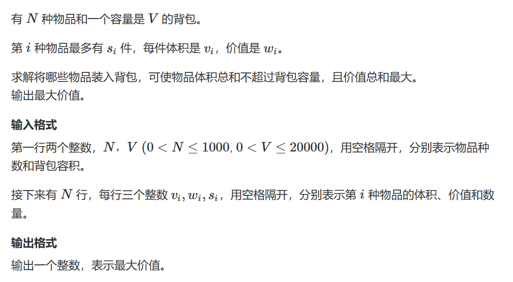

# 多重背包问题

## 题三与题四（多重背包问题）


此题我们先来分析一下时间复杂度，n、m、s的值都不超过100，所以如果我们使用朴素算法最大的时间复杂度$O(n^3)$为百万级别，C++可以在1秒内计算出来。

1. 确定dp数组及下标的含义：dp[i][j] 指考虑从1 ~ i 的物品中所有不超过体积j的选择方案中最大的价值
2. 确定递归公式：每个物品的数量不是无限，并且不一定一致，所以我们朴素算法只需要再遍历一次数量即可，那么很自然的，我们的递推公式就等于：
$$dp[i][j] = std::max(dp[i][j], dp[i-1][j - v[i]p] + pw[i]p);$$
3. 初始化dp数组：同题一
4. 确定遍历顺序：同上
5. 举例推导dp数组：略

**此题唯一需要注意的地方是我们的第三层循环需要保证我们的体积不超过背包的体积下才能进行**

```cpp
#include <iostream>
#include <cstring>
#include <algorithm>

const int N = 110;

int n,m;
int v[N],w[N],num[N];
int dp[N][N];

int main()
{
    std::cin>>n>>m;
    
    for(int i = 1;i<=n;i++)
        std::cin>>v[i]>>w[i]>>num[i];
    for(int i =1;i<=n;i++)
        for(int j = 0;j<=m;j++)
            for(int p = 0;p<=num[i]&&p*v[i]<=j;p++)
                dp[i][j] = std::max(dp[i][j], dp[i-1][j - p*v[i]] + p*w[i]);
    std::cout<<dp[n][m];
}
```


对于题四，我们观察我们的数据范围，可以很明显地发现如果使用朴素法，那么时间复杂度将会达到$O(n^3)$ 以亿的级别，一定是会TLE的。

### 优化

我们的优化方法是在输入的同时对数据进行分组——以二进制的1 2 4 8进行分组，例如我们其中一个物品有20个，那么我们可以将其拆分为：20 = 1 + 2 + 4 + 8 + 5(5是剩下的s)。此时我们成功将数据的数量降低到了logS，那么我们就可以将每一份单独作为一个背包——转换为了01背包问题，最后只需要套用01背包问题的代码即可：

```cpp
#include <iostream>
#include <vector>
#include <algorithm>


int n, m;
const int N = 2010;
int dp[N];

struct MyGood
{
	int v;
	int w;
};
int main()
{
	std::vector<MyGood> MyGoods;
	std::cin >> n >> m;
	for(int i = 1;i<=n;i++)		//优化我们的数据集
	{
		int v, w, s;
		std::cin >> v >> w >> s;
		for(int k = 1;k<=s;k*=2)
		{
			s -= k;
			MyGoods.push_back({ k * v, k * w });
		}
		if (s > 0) MyGoods.push_back({ s * v,s * w });
	}

	for(auto& Good:MyGoods)		//使用引用可以减少复制消耗的时间
	{
		for (int j = m; j >= Good.v; j--)
			dp[j] = std::max(dp[j], dp[j - Good.v] + Good.w);
	}
	std::cout << dp[m];
}
```

## 题十三（多重背包问题Ⅲ 男人八题）

   


此题需要结合完全背包问题和多重背包问题Ⅰ、Ⅱ来对比学习。

此题来源于POJ楼教主的男人八题之一（花了一天才弄懂QAQ）

此题与多重背包问题Ⅰ和Ⅱ的区别仅仅是数据范围的变化，我们的数据范围从100 --> 2000 --> 20000，方法分别从暴力枚举 --> 二进制优化转换为01背包问题 --> 现在的优先队列优化

***

之上，我们已经提到了此题的优化方案是优先队列，但是发现可以使用这个方法是从完全背包中分析得来的：

### 完全背包

在完全背包中，我们发现：

$$dp[i][j] = std::max(dp[i][j],\quad dp[i-1][j-v[i]] + w[i],\quad d[[i-1] + 2v[i]] + 2w[i],\quad ...,\quad dp[i-1][j - kv[i]] + kw[i])$$
且
$$dp[i][j-v[i]] = std::max(dp[i-1][j-v[i]],\quad dp[i-1][j-2v[i]] + w[i],\quad d[i-1][j - 3v[i]] + 2w[i],\quad ...,\quad dp[i-1][j - kv[i]] + (k-1)w[i]) $$
所以
$$dp[i][j] = std::max(dp[i][j],\quad dp[i][j-v[i]] + w[i]) $$

在这个等式中，$k$能无限取直到$j < kv[i]$

### 多重背包

在多重背包中，$k$多了一个限制 —— $k <= s$，也就是说$k$除了受到背包大小的限制，也受到了其本身具有的限度的限制。

那么对于上述公式就会有所变化，因为对其比较好发现性质，使用画图来展示：


对于每一个圈起来的红色方框内，他们其呈现出一个等差数列，以$w[i]$为公差


又看向每一个框，我们求的答案是每一个框内的相对最大值然后加上一倍公差，我们的框是以长度$s$不断地向后移动，所以能想到的是我们可以使用单调队列来维护一个滑动数组去保存每一次滑动数组内的最大值，这样我们就不需要遍历每一次方案去寻找我们的最大值。

### 核心优化

其实到这里仍然有问题没用解决：如何去解决由等差带来的偏移呢？

去解决这个问题，第二维含义就需要发生变化：我们将 j % v = r ，r相同，也就是余数相同的物品归为一类，那么我们的第一种选择就可以变为：$dp[i][r]$，这表示从前i类中选择余数为r的那一类。那么数据集就会被分为j类，我们的答案就是从dp[i-1][j] ~ dp[i-1][j + s*v[i]]选出最大值即可。

那对于一个dp[k*v+r]，同一个r是一个类别，多一个v代表这个类中的元素多取一个，直到取到s或体积超过j。

也就是说，我们每一次更新的是每一类中的最大值。滑动数组从每一类中选出我们的最大值即可

而后我们的公式转换为（提前进行了一维优化）：

```
dp[j]    =     dp[j]   
dp[j+v]  = max(dp[j] +  w,  dp[j+v])   
dp[j+2v] = max(dp[j] + 2w,  dp[j+v] +  w, dp[j+2v])   
dp[j+3v] = max(dp[j] + 3w,  dp[j+v] + 2w, dp[j+2v] + w, dp[j+3v])   
...
```

将公差提出来：

```
dp[j]    =     dp[j]   
dp[j+v]  = max(dp[j], dp[j+v] - w) + w   
dp[j+2v] = max(dp[j], dp[j+v] - w, dp[j+2v] - 2w) + 2w   
dp[j+3v] = max(dp[j], dp[j+v] - w, dp[j+2v] - 2w, dp[j+3v] - 3w) + 3w   
...
```

那么此时我们滑动数组内的元素就是dp[j + k*v] - k*w

注：我们每一次计算都还是用的上一层数据，避免数据污染再开一个数组储存上一层数据。

***
写出代码：

```cpp
#include <iostream>
#include <cstring>

const int N = 1010,V = 20010;

int dp[V],lastdp[V];
int hh, tt;
int q[V];


int main()
{
	int n, m;
	scanf("%d%d", &n, &m);

	for(int i = 1;i<=n;i++)
	{
		memcpy(lastdp, dp, sizeof dp);
		int v, w, s;
		scanf("%d%d%d", &v, &w, &s);
		for(int j = 0;j<v;j++)
		{
			hh = 0, tt = -1;
			for(int k = j;k<=m;k+=v)
			{
				if (hh <= tt && q[hh] < k - s * v) hh++;
				while (hh <= tt && lastdp[q[tt]] + (k-q[tt]) / v * w <= lastdp[k]) tt--;
				q[++tt] = k;
				dp[k] = lastdp[q[hh]] + (k - q[hh]) / v * w;
			}
		}
	}
	printf("%d", dp[m]);
}
```

### 还没懂？

哈哈哈哈，还没懂就对了，其实上面的题解基本是"借鉴"其他人的得来，我自己也是半懵半懂地写出来的。Acwing上的题解大多都没有跳出y总的课堂所讲的内容，本身y总讲的很多地方我就没听懂，这里我给出我自己的题解，希望能够帮到大家，如果有误，希望能够指出并批评：

***

一、重新审视这道题目，抛开完全背包和01背包

我们来看朴素法：

在朴素法中，我们通过枚举每种物品的每种选取来达成数据更新

核心代码：

```cpp
    for(int i =1;i<=n;i++){
        int v,w,s;
        std::cin>>v>>w>>s;
        for(int j = m;j>=v;j--)
            for(int k = 0;k<=s&&k*v<=j;k++){
                dp[j] = std::max(dp[j], dp[j - k*v] + k*w);
				printf("dp[%d] = %2d, dp[%d]+%d=%d\n",j,dp[j],j-k*v,k*w,dp[j-k*v]+k*w);
			}
	}
```

我添加了一行代码来输出我们的**dp[j] 在什么情况进行了更新**输入我们的测试数据：

```cpp
2 9
3 5 2
2 4 3
```

观察输出：


我分别将第一组和第二组数据的部分圈出来了，让我们观察一下规律。

1. 性质1：每dp[j]的转移只会来自j - k * v
2. 性质2：j >= s * v 后，dp[j]的状态转移最终固定在s 次
3. 性质3：dp[j] 的值只来自于 k <= s&&k * s <= j 的条件下 dp[j - k * v] 中的最大值

这时候回到y总的课堂，这三个性质解决了我们两个问题：

一、为什么使用单调队列或者说滑动窗口？

这是由性质2和性质3得出的，想想看，我们的答案是dp[m]，在从前向后遍历的过程中，我们的dp[j]的状态一直基于窗口中的最大值进行变化。

二、为什么对v取模用余数去做状态计算？

根据性质1

假设 j % v = r

那么

```cpp
(k 为满足条件的最大值)
r      = j - k * v    
r + v  = j - (k - 1) * v     
r + 2v = j - (k - 2) * v    
.
.
.
r + k * v = j
```

也就是说这是一 一对应的，我们挑了这种方式去计算罢了，因为这有益于我们从前往后使用滑动数组也就说单调队列去计算。y总画出了一个数轴，我一直在纠结这个数轴上r + k * v和j - k * v 之间的大小关系，为什么两种状态表示都要用到呢？给我头整昏了。

同时这里解释了，对于每一种余数，它都被分成了一类，且不重不漏，每一个j 对应 一个单独的r ，因为这是一个等式：

j % v = r $< = >r + p * v + (k - p) * v = j < = >$ r + k * v = j

***

现在，如果再回去看y总写的公式，是否能够更理解了一些呢？

## 题十四（多重背包问题）

   


本题就是多重背包问题的裸题，需要题解者请自行查看多重背包问题Ⅰ、Ⅱ、Ⅲ
的各种题解

三种方法都能过，自行选择

### 法一：朴素法

```cpp
#include <iostream>
#include <cstring>
#include <algorithm>

const int N = 6010;

int n,m;
int dp[N];

int main()
{
    std::cin>>n>>m;
    for(int i =1;i<=n;i++){
        int v,w,s;
        std::cin>>v>>w>>s;
        for(int j = m;j>=v;j--)
            for(int k = 0;k<=s&&k*v<=j;k++){
                dp[j] = std::max(dp[j], dp[j - k*v] + k*w);
				//printf("dp[%d] = %2d, dp[%d]+%d=%d\n",j,dp[j],j-k*v,k*w,dp[j-k*w]+k*w);
			}
	
    }
    std::cout<<dp[m];
}
```


[题解](https://www.acwing.com/solution/content/211954/)

### 法二：二进制优化（此题最适用）

```cpp
#include <iostream>
#include <vector>
#include <algorithm>


int n, m;
const int N = 6010;
int dp[N];

struct MyGood
{
	int v;
	int w;
};
int main()
{
	std::vector<MyGood> MyGoods;
	std::cin >> n >> m;
	for(int i = 1;i<=n;i++)
	{
		int v, w, s;
		std::cin >> v >> w >> s;
		for(int k = 1;k<=s;k*=2)
		{
			s -= k;
			MyGoods.push_back({ k * v, k * w });
		}
		if (s > 0) MyGoods.push_back({ s * v,s * w });
	}

	for(auto& Good:MyGoods)
	{
		for (int j = m; j >= Good.v; j--)
			dp[j] = std::max(dp[j], dp[j - Good.v] + Good.w);
	}
	std::cout << dp[m];
}
```


[题解](https://www.acwing.com/solution/content/211956/)

### 法三：单调队列优化

```cpp
#include <iostream>
#include <cstring>

const int N = 6010;

int q[N];
int lastDp[N], dp[N];
int hh, tt;
int n, m;
int main()
{
	scanf("%d%d", &n, &m);

	for(int i = 1;i<=n;i++)
	{
		int v, w, s;
		std::memcpy(lastDp, dp, sizeof dp);
		scanf("%d%d%d", &v, &w, &s);
		for(int j = 0;j<v;j++)
		{
			hh = 0, tt = -1;
			for(int k = j;k<=m;k+=v)
			{
				if (hh <= tt && k - s * v > q[hh]) hh++;
				while (hh <= tt && lastDp[q[tt]] + (k - q[tt]) / v * w <= lastDp[k]) tt--;
				q[++tt] = k;
				dp[k] = lastDp[q[hh]] + (k - q[hh]) / v * w;
			}
		}
	}
	printf("%d", dp[m]);
}
```


[题解](https://www.acwing.com/file_system/file/content/whole/index/content/10398869/)

