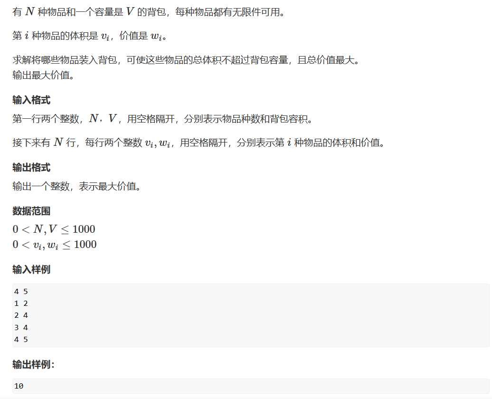
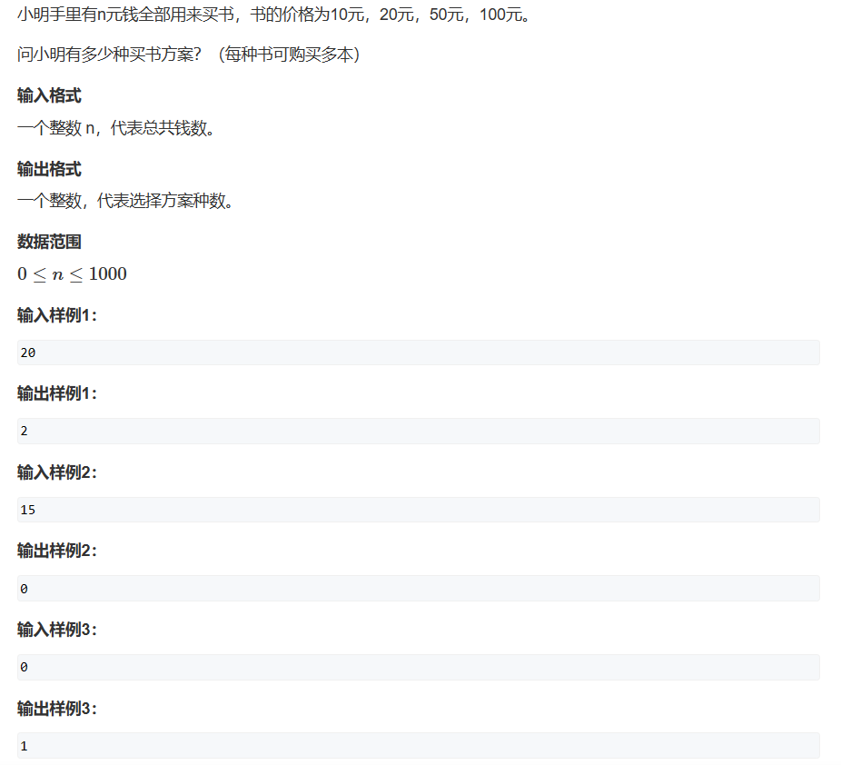
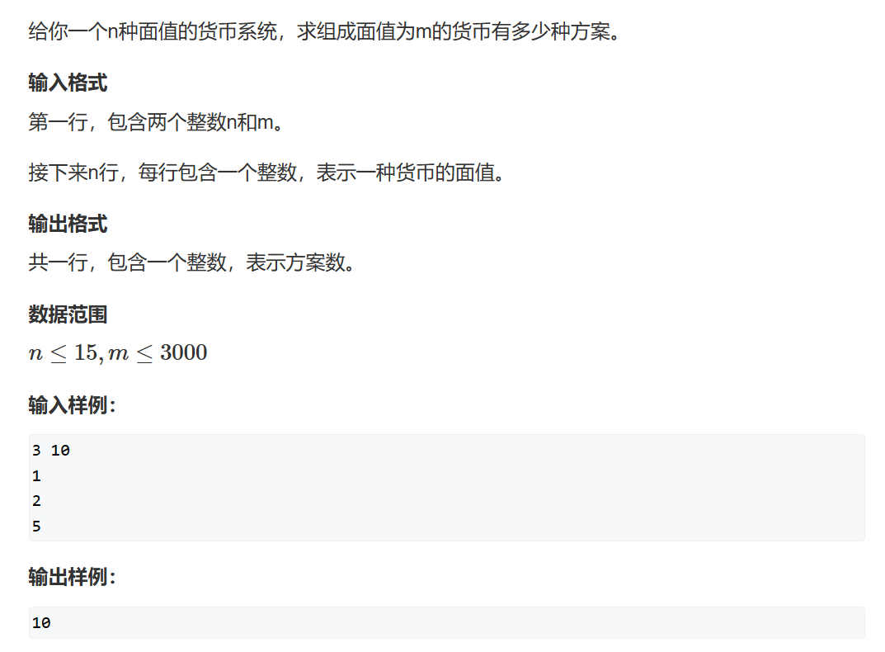
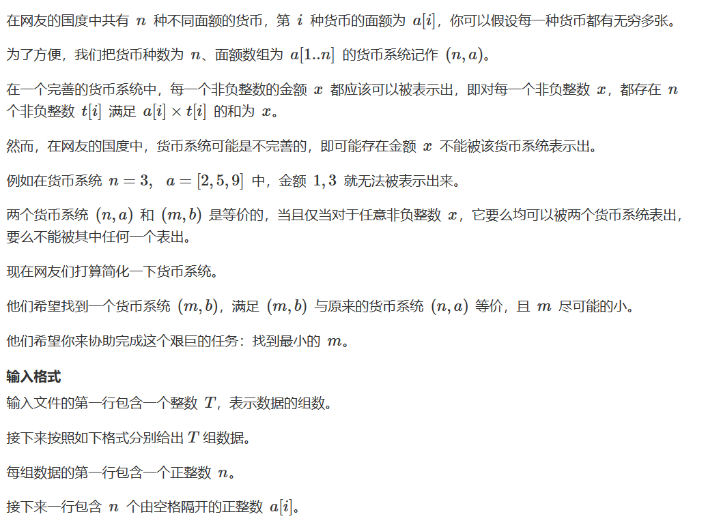
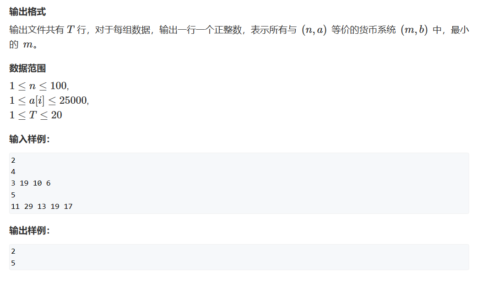
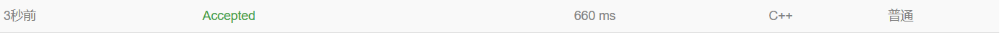

# 完全背包问题

## 题二（完全背包问题）



1. 确定dp数组及下标的含义：dp[i][j] 指考虑从1 ~ i 的物品中所有不超过体积j的选择方案中最大的价值
2. 确定递归公式：因为
$$dp[i][j] = std::max(dp[i][j],\quad dp[i-1][j-v[i]] + w[i],\quad d[[i-1] + 2v[i]] + 2w[i],\quad ...,\quad dp[i-1][j - k*v[i]] + k*w[i])$$
且
$$dp[i][j-v[i]] = std::max(dp[i-1][j-v[i]],\quad dp[i-1][j-2v[i]] + w[i],\quad d[[i-1] + 3v[i]] + 2w[i],\quad ...,\quad dp[i-1][j - k*v[i]] + (k-1)*w[i]) $$
所以
$$dp[i][j] = std::max(dp[i][j],\quad dp[i][j-v[i]] + w[i]) $$
3. 初始化dp数组：与题一相同
4. 确定遍历顺序：j - v[i] < j，并且我们先计算j - v[i]项才能推出第 j 项，所以我们从前向后遍历
5. 举例推导dp数组：略

```cpp
#include <iostream>
#include <cstring>
#include <algorithm>
const int N = 1010;

int n,m;
int dp[N][N],v[N],w[N];

int main()
{
    std::cin>>n>>m;
    
    for(int i = 1;i<=n;i++)
        std::cin>>v[i]>>w[i];
    
    for(int i = 1;i<=n;i++)
        for(int j = 0;j<=m;j++)
        {
            dp[i][j] = dp[i-1][j];
            if(v[i]<=j) dp[i][j] = std::max(dp[i][j], dp[i][j-v[i]] + w[i]);
        }
    std::cout<<dp[n][m];
    
}
```

我们现在考虑优化过程：

1. 我们知道其实：
   $$dp[i][j] = std::max(dp[i][j],\quad dp[i-1][j-v[i]] + w[i],\quad d[[i-1] + 2v[i]] + 2w[i],\quad ...,\quad dp[i-1][j - k*v[i]] + k*w[i])$$
   $$dp[i][j-v[i]] = std::max(dp[i-1][j-v[i]],\quad dp[i-1][j-2v[i]] + w[i],\quad d[[i-1] + 3v[i]] + 2w[i],\quad ...,\quad dp[i-1][j - k*v[i]] + (k-1)*w[i]) $$

2. 那么我们w[i]是定值，变化的只有kv[i]，这样，我们就可以知道其实dp[i][j]取最大值的等式除第一项之外，我们可以等价替换成 dp[i][j - v[i]] + w[i]

3. 实现这一层优化后我们将其一维化，然后观察等式是否等价
   1. dp[i][j] => dp[j] ，dp[i][j] = dp[i - 1][j] => dp[j] = dp[j] 此式中等式后的dp[j]是先算出来再赋给下一层的dp[j]的，所以逻辑和计算是没问题的，我们可以直接消去这一项
   2. dp[i][j - v[i]] => dp[j - v[i]] + w[i] ，因为我们的后一项是由第i层也就是现在这一层得出，所以我们是从前向后遍历的顺序是正确的，可以对比题一同样的地方为什么是从后向前遍历来帮助思考
   3. 最后因为在v[i]>j 之前的数据我们都没有操作而是跳过，所以我们循环可以直接从v[i] 开始

优化后

```cpp
#include <iostream>
#include <cstring>
#include <algorithm>
const int N = 1010;

int n,m;
int dp[N][N],v[N],w[N];

int main()
{
    std::cin>>n>>m;
    
    for(int i = 1;i<=n;i++)
        std::cin>>v[i]>>w[i];
    
    for(int i = 1;i<=n;i++)
        for(int j = v[i];j<=m;j++)
            dp[j] = std::max(dp[j], dp[j-v[i]] + w[i]);
    
    std::cout<<dp[m];
}
```

## 题十（完全背包问题）



y总分析法：

一、状态表示

1. 集合dp[i][j] 表示考虑1 ~ i 种书中，花费j 元能购买的书的方案
2. 属性：sum

二、状态计算

1. 包含i：计算买1本i，2本i，3本i，...，n本i的方案，注意花费不能超过j
2. 不包含i：沿用上一状态
3. dp[i][j] 为上述两种状态的和

其实这题朴素版应该开三维，因为我们需要考虑到第i本书买1本、2本、3本、...、n本的情况，但是这里有一个十分巧妙地优化方法（其实就是完全背包的优化方案）

$$dp[i][j] = std::sum(dp[i][j],\quad dp[i-1][j-v[i]],\quad d[[i-1] + 2v[i]],\quad ...,\quad dp[i-1][j - kv[i]])$$
且
$$dp[i][j-v[i]] = std::sum(dp[i-1][j-v[i]],\quad dp[i-1][j-2v[i]],\quad d[i-1][j + 3v[i]],\quad ...,\quad dp[i-1][j - kv[i]][i]) $$
所以
$$dp[i][j] = std::sum(dp[i][j],\quad dp[i][j-v[i]]) $$

***

一般法：

```cpp
#include <iostream>
#include <algorithm>

const int N = 1010;

int dp[5][N];
int cost[5] = { 0,10,20,50,100 };

int n;

int main()
{
	scanf("%d", &n);

	dp[0][0] = 1;
	for(int i = 1;i<5;i++)
	{
		for(int j = 0;j<=n;j++)
		{
			dp[i][j] = dp[i - 1][j];
			if (j >= cost[i]) dp[i][j] += dp[i][j - cost[i]];
		}
	}
	printf("%d", dp[4][n]);
}
```

空间优化：

根据一般法，我们发现我们使用的数据都在第i行，说明我们使用的数据是更新过的，所以我们必须从前向后遍历。

```cpp
#include <iostream>
#include <algorithm>

const int N = 1010;

int dp[N];
int cost[5] = { 0,10,20,50,100 };

int n;

int main()
{
	scanf("%d", &n);

	dp[0] = 1;
	for(int i = 1;i<5;i++)
	{
		for(int j = cost[i];j<=n;j++)
		{
			dp[j] += dp[j - cost[i]];
		}
	}
	printf("%d", dp[n]);
}
```

## 题十一（完全背包问题）



y总分析法：

一、状态表示

1. dp[i][j] 表示考虑前i 种货币，组合面值为j 的方案
2. 属性：sum

二、状态计算

1. 不含i：沿用上一状态
2. 含i：考虑一张i、两张i、三张i、...、n张i的情况
3. dp[i][j]为两种状态的和

其实这题朴素版应该开三维，因为我们需要考虑到第i本书买1本、2本、3本、...、n本的情况，但是这里有一个十分巧妙地优化方法（其实就是完全背包的优化方案）

$$dp[i][j] = std::sum(dp[i][j],\quad dp[i-1][j-v[i]],\quad d[[i-1] + 2v[i]],\quad ...,\quad dp[i-1][j - kv[i]])$$
且
$$dp[i][j-v[i]] = std::sum(dp[i-1][j-v[i]],\quad dp[i-1][j-2v[i]],\quad d[i-1][j + 3v[i]],\quad ...,\quad dp[i-1][j - kv[i]][i]) $$
所以
$$dp[i][j] = std::sum(dp[i][j],\quad dp[i][j-v[i]]) $$

***

一般法：

```cpp
#include <iostream>

using LL = long long;
const int N = 20,M=3010;

LL dp[N][M];
int money[N];
int n, m;

int main()
{
	scanf("%d %d", &n, &m);
	for (int i = 1; i <= n; i++) scanf("%d", &money[i]);
	dp[0][0] = 1;
	for(int i = 1;i<=n;i++)
	{
		for(int j = 0;j<=m;j++)
		{
			dp[i][j] = dp[i - 1][j];
			if (j >= money[i]) dp[i][j] += dp[i][j - money[i]];
		}
	}
	printf("%lld",dp[n][m]);
}
```

空间优化：

根据一般法，我们发现我们使用的数据都在第i行，说明我们使用的数据是更新过的，所以我们必须从前向后遍历。

```cpp
#include <iostream>

using LL = long long;
const int N = 20,M=3010;

LL dp[M];

int n, m;

int main()
{
	scanf("%d %d", &n, &m);
	
	dp[0] = 1;
	for(int i = 1;i<=n;i++)
	{
	    int v;
	    scanf("%d",&v);
		for(int j = v;j<=m;j++)
		{
            dp[j] += dp[j - v];
		}
	}
	printf("%lld",dp[m]);
}
```

## 题十二（完全背包问题）

   


对于一个有$n$ 种面值的货币系统，我们将其记作$(n, a)$

那么如果这个货币系统是完善的，那么对于每一种面值$x$，存在如下等式：
$$x=t_1a_1+t_2a_2+t_3a_3+...+t_na_n\quad t_i\in Z^+ $$
也就是说每一个数都能通过已有面值的组合来组成

***

那么$(n,a)$与$(m,b)$等价是什么意思呢？

它的含义就是两者能表示出的货币完全相同，两者表示出的$x_i$集合相同

看样例，

对于$(n,a)$ = {3, 19, 10, 6}

我们知道6 = 3 * 2，那么6就可以被去掉

19 = 10 + 3 * 3，所以19也能被去掉

此时剩下的$(m, b)$ = {3, 10}，m = 2就是我们的答案

***

此题需要去寻找并发现题目的性质（涉及线代，但是线代才开课QAQ）：

1. 性质1：对于每个$a_i$，一定是能作为$x$被$b$表示出来，也就是
$$\forall a_i\exists b_i使得a_i = t_1b_i+t_2b_2+...+t_nb_n\quad t_i\in Z^+$$ 
2. 性质2：在最优解中，$b_1，b_2，...，b_m$一定都是从$a_1，a_2，...，a_n$中选出
3. 性质3：$b_1，b_2，...，b_m$一定不能被其他$b_i$所表示

***

性质2证明：

假设：$b_i$不等于任何一个$a_i$

由于题设，我们知道$b_i$可以被一组存在的$a_i$表示出来，即：
$$b_i=t_1a_1+t_2a_2+t_3a_3+...+t_ma_m\quad t_i\in Z^+ $$

同时我们又知道$a_i$可以被一组存在的$b_i$表示出来：
$$a_i = t_1b_i+t_2b_2+...+t_mb_m\quad t_i\in Z^+$$
那么替换所有$a_i$后，我们知道$b_i$可以被一组存在的$b_i$表示出来，那么$b_i$就是一个可以舍弃的数，那么就不满足其是最优解的条件。

***

### 算法思路

一、对输入的面值进行排序，因为大的面值一定是由小的面值组合而成，不可能是大面值组合成小面值。

二、而后进行完全背包问题的求解，我们要求的是等于$a_i$的情况下是否$a_i$能由其他数组成。

y总分析法：

一、状态表示

1. 集合：dp[i][j] 表示考虑前i 种面值，组合数等于j 的方案集合
2. 属性：方案和，sum

二、状态计算

状态计算和完全背包问题完全一致，但是我们求的答案并不是考虑前i 种面值，组合数等于j 的方案集合，而是考虑**前i 种面值，是否有组合数面值等于j 的方案**，如果**没有**，那么它可以**作为$b_i$留在我们的面值中**，否则，它就可以被丢弃。所以我们每次循环结束后检查一下我们的这个面值是否能保留即可。

对于如何优化第三维度这里不再介绍

***

一般法：

```cpp
#include <iostream>
#include <cstring>
#include <algorithm>

int T;

const int N = 110, M = 25010;
int dp[N][M];
int money[N];

int n;

int main()
{
	scanf("%d", &T);
	while (T--)
	{
		scanf("%d", &n);
		for (int i = 1; i <= n; i++) scanf("%d", &money[i]);
		std::sort(money + 1, money + n + 1);

		dp[0][0] = 1;
		int res = 0;
		int end = money[n];

		for (int i = 1; i <= n; i++)
		{
			//检查是否能够丢弃
			if (!dp[i-1][money[i]]) res++;

			for (int j = 0; j <= end; j++)
			{
				dp[i][j] = dp[i - 1][j];
				if (j >= money[i]) dp[i][j] += dp[i][j - money[i]];
			}
		}
		printf("%d\n", res);
	}
}
```



空间优化法：

这里我们同时对计算进行优化，我们并不关心$a_i$有几个$b_i$的组合方案，我们只关心它能不能单独存在，那么我们就可以用位运算来优化我们的计算，即：
$$dp[i][j] = dp[i-1][j]\quad |\quad dp[i][j-money[i]]$$

```cpp
#include <iostream>
#include <cstring>
#include <algorithm>

int T;

const int N = 110, M = 25010;
bool dp[M];
int money[N];

int n;

int main()
{
	scanf("%d", &T);
	while (T--)
	{
	    memset(dp,0,sizeof dp);
		scanf("%d", &n);
		for (int i = 1; i <= n; i++) scanf("%d", &money[i]);
		std::sort(money + 1, money + n + 1);
		dp[0] = true;
		int res = 0;
		int end = money[n];
		for (int i = 1; i <= n; i++)
		{

			if (!dp[money[i]]) res++;

			for (int j = money[i]; j <= end; j++)
			    dp[j] |= dp[j - money[i]];
		}
		printf("%d\n", res);
	}
}
```

