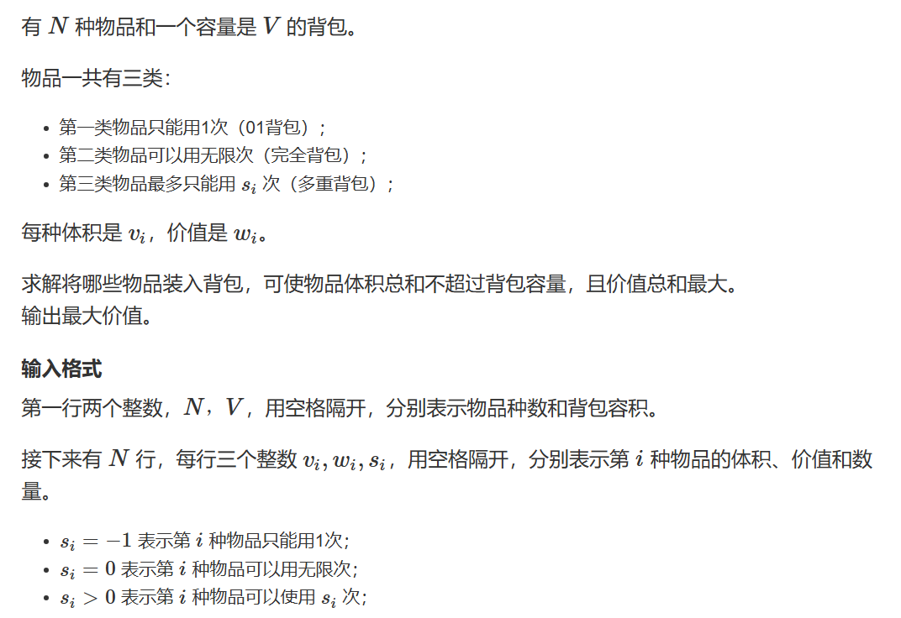
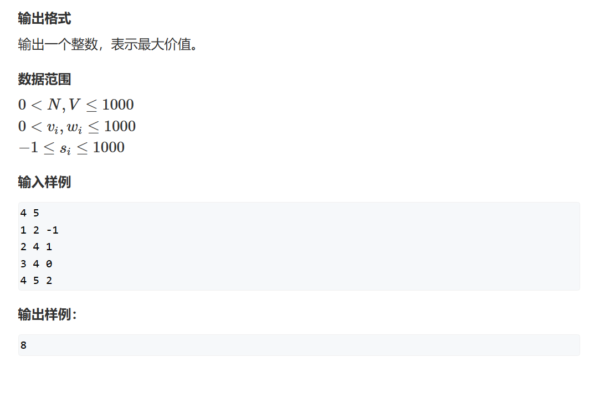

# 背包问题

背包问题主要被分为四种：

1. 01背包：每种物品只有一个
2. 完全背包：每种物品有无限多个
3. 多重背包：每种物品有有限多个，且数量不完全相同
4. 分组背包：按组打包，每组最多选一个物品

## 闫氏DP分析法

而背包问题的DP数组一般有两个主要过程：

1. 状态表示：
    1. 集合：例如在题一中，dp[i][j]代表考虑所有前i个物品，且总体积不超过j的选法集合
    2. 属性：题一求最大价值
2. 状态计算（使用集合的角度去思考）：
    也就是我们状态的更新
    1. 在题一中我们将dp[i][j]分为两个集合
       1. 第一个是所有不选第i个物品的方案：我们的dp[i][j]此时就会等于dp[i-1][j]，因为我们不选第i个物品，同时我们dp[i][j]的定义又是考虑前i个物品体积不超过j的最大价值价值的选法
       2. 第二个是所有选择第i个物品的方案：那我们在考虑这个情况时有一个前提条件，也就是第i个元素的体积是不能超过j的。在这个前提下，我们的方案被分成两个部分，固定部分：$1.第i个元素$、动态部分：$2.第1-i个的最大价值集合$。所以我们的$dp[i][j] = dp[i-1][j-V[i]] + W[i]$，$j-V[i]\quad$是为了预留出第i个元素的体积。
    2. 最后我们只需要取两个集合之间的最大值就是此时我们的dp[i][j]的最大价值
3. 对于背包问题的优化，我们一般在朴素法方程写出来后通过观察状态计算方程再来考虑是否可以优化

理解以上流程之后我们所有的分析使用五步法来进行（卡尔五步法）：

1. 确定dp数组及下标的含义
2. 确定递归公式
3. 初始化dp数组
4. 确定遍历顺序
5. 举例推导dp数组

## 题十五（混合背包问题）

    


这题很简单，只需要按照输入要求，是什么类型的背包就进行什么样的状态计算就可以了，是一到很好的练习三种背包问题核心代码的题目。因为我们只会用到i和i-1两层数据，所以分别计算并不会对其他类型的计算产生影响。

```cpp
#include <iostream>
#include <algorithm>
#include <vector>


const int N = 1010;

int dp[N];
int n, m;

struct MyGood
{
	int v;
	int w;
};

std::vector<MyGood> MyGoods;

int main()
{
	scanf("%d%d", &n, &m);
	for(int i = 1;i<=n;i++)
	{
		int v, w, s;
		scanf("%d%d%d", &v, &w, &s);
		if(s==-1)
		{
			for(int j = m;j>=v;j--)
				dp[j] = std::max(dp[j], dp[j - v] + w);
		}
		else if(s==0)
		{
			for (int j = v; j <= m; j++)
				dp[j] = std::max(dp[j], dp[j - v] + w);
		}
		else
		{
			for(int k = 1;k<=s;k*=2)
			{
				s -= k;
				MyGoods.push_back({ k * v,k * w });
			}
			if(s>0) MyGoods.push_back({s*v,s*w});
			
		}
	
	}	
	for(auto& it : MyGoods)
	{
		for (int j = m; j >= it.v; j--)
			dp[j] = std::max(dp[j], dp[j - it.v] + it.w);
	}
	printf("%d", dp[m]);
}
```