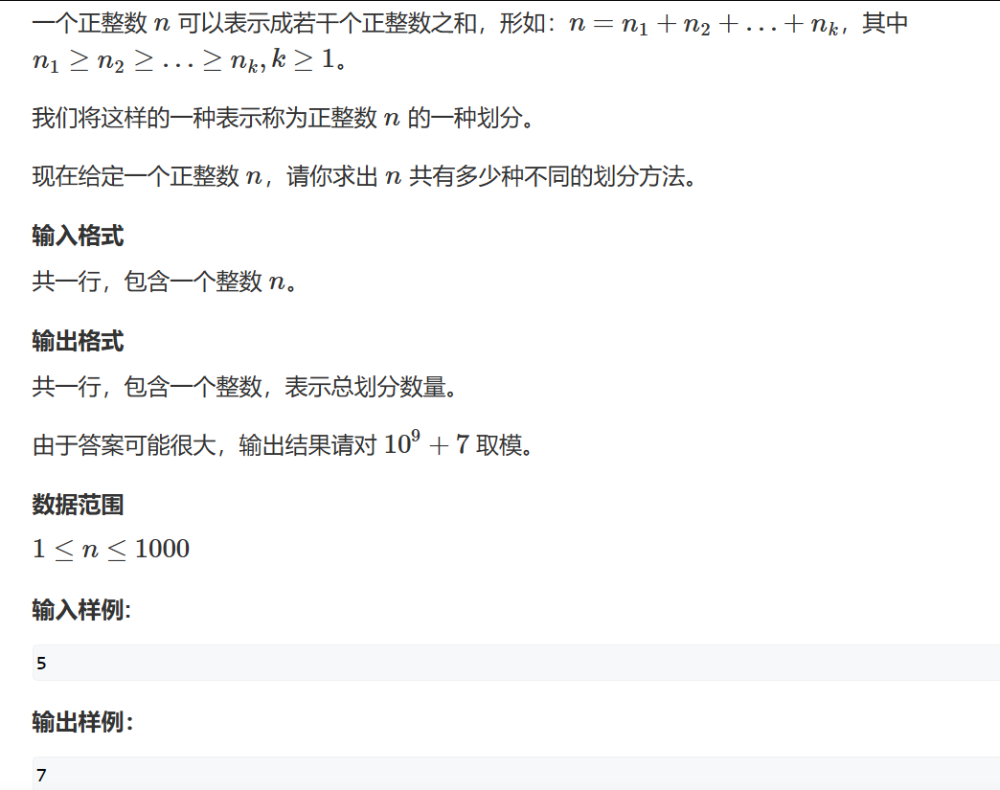

# 计数类DP



此题思路很重要，我们可以将问题转换为完全背包问题 —— 将无限个1 ~ n 种体积分别为1 ~ n 的物品装入体积为 n的背包中共有多少种方案

y氏分析法：

1. 状态表示：dp[i][j]
   1. 集合：所有考虑将无限个1 ~ i种 体积分别是1 ~ i的物品装入体积为j的背包中的方案
   2. 属性：sum
2. 状态计算
   1. 不包含第i个物品：dp[i][j] = dp[i-1][j]
   2. 包含了第i个物品：在体积不超过背包的体积的情况下dp[i-1][j] = dp[i-1][j] + dp[i][j - i]; （等式为何如此，请参考完全背包问题优化过程）

根据题目要求记得状态计算的值记得取模

最后我们贴出优化了空间复杂度的代码：

```cpp
#include <iostream>

const int N = 1010,MOD = 1e9+7;
int dp[N];
int n;

int main()
{
 std::cin >> n;
 dp[0] = 1;      //初始化，因为当d[0][0] 时我们啥也不选也是一个合法的方案
 for(int i = 1;i<=n;i++)
 {
  for(int j = 0;j<=n;j++)
  {
   dp[j] = dp[j]%MOD;
   if (i <= j) dp[j] = (dp[j]+ dp[j - i]) % MOD;
  }
 }
 std::cout << dp[n];
}
```
