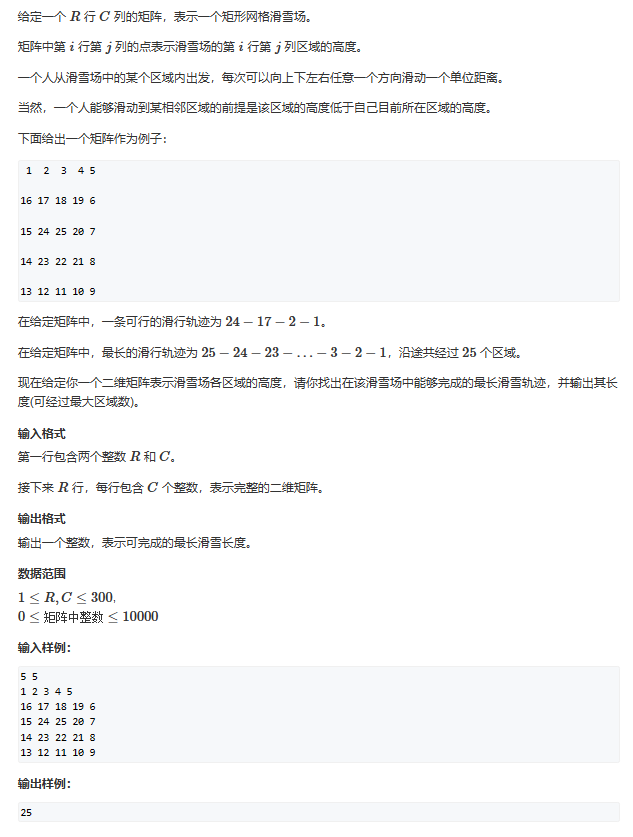
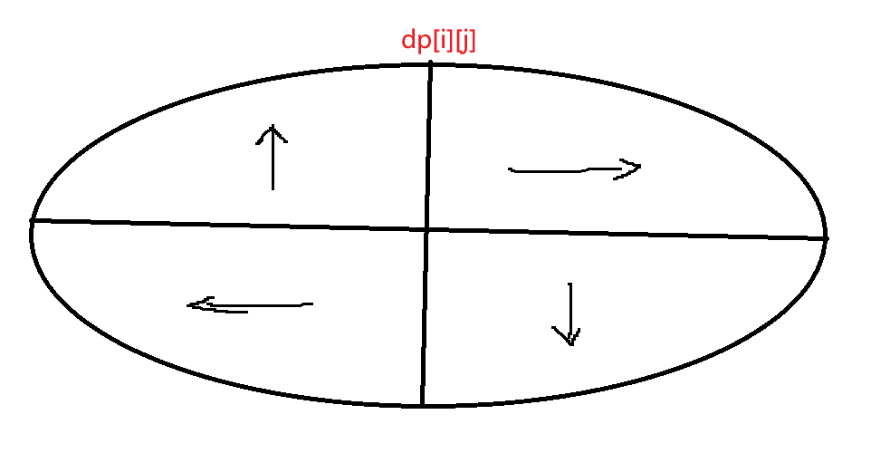

# 记忆化搜索

## 题一



题目的意思很明确，图中的值代表高度，我们只能从高往低滑，任意取一点作为滑行起点，寻找能滑行的最大长度。

y氏分析法：
一、状态表示：dp[i][j]

1. 集合：所有从map[i][j]开始滑的路径的集合
2. 属性：Max

二、状态计算：
1. 我们枚举四个方向，选出从四个方向上回到起点的最大路径
   for(四个方向)
        dp[i][j] = std::max(dp[i][j], dp[k][f])



```cpp
#include <iostream>
#include <algorithm>
#include <cstring>

const int N = 310;

int dp[N][N];
int map[N][N];
int dx[4] = { 1,0,-1,0 },dy[4] = {0,1,0,-1};
int n, m,res;

int DP(int x,int y)
{
	int& v = dp[x][y];
	if (v != -1) return v;

	v = 1;  //初始化，如果被困住了，自然只能走这一个点
	for(int i = 0;i<4;i++)
	{
		int a = x + dx[i], b = y + dy[i];
		if (a >= 1 && a <= n && b >= 1 && b <= m && map[x][y] < map[a][b])
			v = std::max(v, DP(a,b)+1);
			//其实从递归终点看过来的话，我们相当于是在求从终点滑回到起点
			//的最大长度，因为每次我们都取max，那么我们在递归过程中一定是
			//选择到了最长的长度
	}
	return v;
}
int main()
{
	std::cin >> n >> m;
	for (int i = 1; i <= n; i++)
		for (int j = 1; j <= m; j++)
			std::cin >> map[i][j];
	std::memset(dp, -1, sizeof dp);
	for (int i = 1; i <= n; i++)
		for (int j = 1; j <= m; j++)
			res = std::max(res, DP(i, j));
			//枚举不同起点下路径的最大值
	std::cout << res;
}
```


