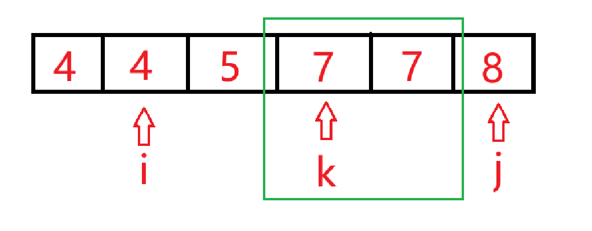

# 双指针算法

双指针算法常常被用做线性区间问题的时间复杂度优化上，常见的可见归并排序、快速排序、LIS和滑动数组法。

双指针通过一个快指针和慢指针在一个循环内的移动来回避指针的回溯问题，也就是说双指针不会回溯到起始点。

## 题一（前置题）

   


此题要求随机从数列中取出两个元素，如果两者属性只差为C，那么就是满足条件的一种方案，求一共有多少种这样的方案。

因为是随机取值，很容易想到先排个序方便观察性质，如示例可被排列为：
$$4\quad 4\quad 5\quad 7\quad 7\quad 8$$

我们要得到一个这样的式子有多少个：

$$被减数-减数 = C$$

而双指针算法在这里就类似于一个滑动数组，定义指针i、j 和k （嗯嗯嗯？不是双指针？），**i** 指向**减数** 。


因为提前排了序，我们找到的满足条件的被减数一定是连续的子序列，如此，我们让**k** 去寻找这个**满足被减数条件的子数组的左下标**，**j** 去寻找这个**满足被减数条件的右下标**。

那么此时对于i来说从**k ~ j-1 都是满足条件的被减数**。


最后后移i ，如果i 与i-1 相等，那么最后的方案数会再加上一次j - k ，如果不相等，因为数组是升序，i一定大于i-1 ，j 之前的数作为被除数得到的答案一定小于C ，所以我们以当前的k，j 为起点向后搜索满足i 的被减数。



如此循环，就一定能再在$O(n)$的时间复杂度内找到所有的方案数。


```cpp
#include <iostream>
#include <algorithm>
using namespace std;

const int N = 200010;
int q[N];
int main()
{
  int n,c;
  scanf("%d%d",&n,&c);

  for(int i = 0;i<n;i++) scanf("%d",&q[i]);
  std::sort(q,q+n);
  long long res = 0;
  for(int i = 0,j = 0,k=0;i<n;i++)
  {
    while(k<n&&q[k]-q[i]<c) k++;
    while(j<n&&q[j]-q[i]<=c) j++;

    if((q[j-1]-q[i])==c&&j-1>0) res += j-k;
  }
  printf("%lld",res);

  return 0;
}
```

## 题二


此题比上一题简单得多，我们找出题目的几个关键词**最长**、**不重复**和**连续**。

仅仅连续一个关键限制，就代表了我们可以不回头地进行遍历，而重复地限制只需要定义一个哈希表去检查就行，统计每次加入的数在已知数组的出现次数，，如果超过我们的阈值**1**，就说明重复，我们就需要**删除之前的元素**，直至这个**新加入元素的总数量低于我们的阈值**，此时我们更新我们的最大长度即可。


开始遍历：


出现重复元素，更新最大长度，i 指针向后遍历**直至消去重复元素**：


继续向后遍历，以此循环：


```cpp
#include <iostream>
const int N = 100010;


int q[N];
int count[N];

int main()
{
	int n;
	std::cin >> n;
	int i,j,result = 0;
	for(i = 0,j=0;j<n;++j)
	{
		scanf("%d",&q[j]);
		count[q[j]]++;
		if(count[q[j]]>1) {
		    result = std::max(result, j-i);
		    while(i<j&&count[q[j]]>=2) count[q[i++]]--;
		}
	}
    //记得最后一次更新，如果最后一个元素满足的话在循环内是没有更新的
	result = std::max(result, j-i);
	std::cout << result;
}
```