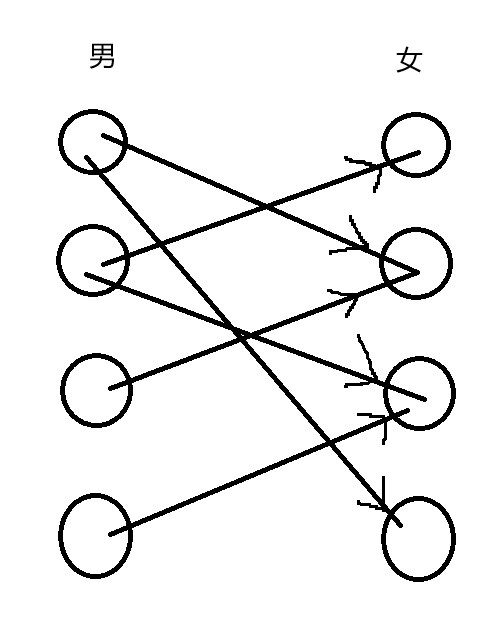

# 匈牙利算法
O(n*m)    
可以在一个较短的时间内告诉我们二分图中两个集合中匹配成功的最大数量是多少，
给定一个二分图，求二分图的最小或最大匹配   
## 题一

根据题意，我们将其抽象成一个具体的例子 ———— 找对象（y总这个例子太有才了 xd）      
1. 我们将二分图的两个集合分别当成男生集合和女生集合，边是单向的，其实际意义是男生对指向的女生有好感

2. 此时让我们的一号男生先选择对象，根据图中所示，他能够成功匹配二号女生

3. 此时我们进行下次循环，让二号男生去找对象，二号男生成功匹配到了一号女生

4. 下一次循环，我们发现三号男生中意的第一个女生，也就是二号女生已经是一号男生的对象了，**注意了奥**此时！三号男生变成了ntr！他过去问一号哥们：“哥们你能换个对象吗？”，欸！此时一号哥们发现自己还有一个中意的女生，一号哥们就说：“也不是不行”，欸！皆大欢喜是吧

(绿色线，懂？)
5. 依次重复上述流程，每次匹配成功匹配数就+1，最后的结果就是最大的。

```cpp
#include <iostream>
#include <cstring>
const int N = 510,M=100010;
int e[N],h[M],next[M], n1, n2, m,idx;
bool st[N];		//保证不重复搜某个点
int match[N];	//右集合指向左集合的点
void add(int a,int b)
{
	e[idx] = b, next[idx] = h[a], h[a] = idx++;
}
bool find(int x)
{
	for(int i = h[x];i!=-1;i=next[i])
	{
		int j = e[i];
		if(!st[j])
		{
			st[j] = true;
			if (match[j] == 0 || find(match[j]))	//j号女生没对象或者j号女生的男朋友愿意换个对象（别骂，你愿意就变成给女生分配对象呗 ->。->）
			{
				match[j] = x;
				return true;	//分配成功，返回成功
			}
		}
	}
	return false;	//哦豁，这哥们没对象QAQ
}
int main()
{
	std::cin >> n1 >> n2 >> m;
	memset(h, -1, sizeof h);
	while(m--)
	{
		int a, b;
		std::cin >> a >> b;
		add(a, b);		//此题有向图即可
	}
	int res = 0;
	for(int i = 1;i<=n1;i++)
	{
		memset(st, false, sizeof st);	//帮每个男生找对象的时候都需要初始化一下st表
		if (find(i)) res++;				//如果匹配成功，那么匹配数就+1
	}
	std::cout << res;
}

```


