# 图论

树可以被看成特殊的图，所以树的模拟与问题都可以用图去解决。

***

## 在正式进入图论前我们需要需要知道图的两种搜索方式 —— DFS（深度优先搜索）与BFS（广度优先搜索）

### DFS

深度优先搜索的基本逻辑就是 —— **撞了南墙就回头**

其主要需要理解的就是 **“恢复”** 过程，我们举例题说明：


此题没有什么巧妙的算法，我们只能用暴力方法一一列举，但你的计算机并不会，你需要告诉计算机怎么去一一列举。

我们以n = 3 画个图举个例：

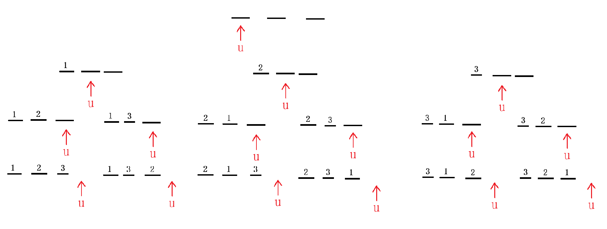

那么DFS实际上的搜索路线如下：

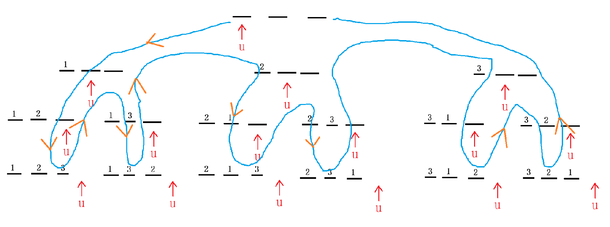

```cpp
#include <iostream>
const int N = 10;

int path[N];	//用来保存我们填上的数字
bool st[N];		//用来记录哪些值已经被使用过
int n;
void dfs(int u)	//传入的参数为第u 个位置应该填什么
{
    if(u>n)		//当我们列举完，指针指向位置n+1 结束填写输出我们已经排列好的数字 
    {
        for(int i = 1;i<=n;i++) std::cout<<path[i]<<" ";
        std::cout<<std::endl;
        return;	//记得结束递归，否则将会无法结束列举而TLE
    }
    for(int i = 1;i<=n;i++)
    {
        if(!st[i])	//列举1 —— n中哪些数字还没有被用过，并将其填到数组中
        {
            path[u] = i;
            st[i] = true;
            dfs(u+1);	//加深递归，看看下一个位置填什么

			//后面的位置就是恢复的过程，记住，我们撞了南墙以后会回头，在此题也就是填完n 个数字后我们回头看看位置n-1是否还有其他填法，我们需要恢复到没有填位置n-1的状态。
            path[u] = 0;	
            st[i] = false;
        }
    }
}
int main()
{
    std::cin>>n;
    dfs(1);
}
```

### n-皇后问题


我们再来看一道经典的DFS问题 —— $n$皇后问题

根据要求，我们不能在4个角度上找到皇后，通过定义四个方向我们可以定义四个数组去记录这四个方向是否含有皇后存在。

需要解释的是两个对角线上的判断数组怎么表示：

1. 斜对角线：就是这个'\'，对于这个方向上我们有表达式：$y = -x + k$也就是$x+y = k$，那么对于同一个斜对角线上的点都对应同一个$k$
2. 主对角线，对于这个方向上我们有表达式：$y = x + k$也就是$x-y = k$，但问题来了，对于第一象限的主对角线方向的偏移值$k$是小于0的，但毕竟我们不需要那么严谨，我们的数组只需要记录一个映射即可。所以我们把它偏移回去$x-y +n= k$，最后别忘了这两个方向的数组需要开2倍大小。

```cpp
#include <iostream>
const int N = 10;
bool X[N],Y[N],dg[2*N],rdg[2*N];
char game[N][N];
int n;
void dfs(int u,int x,int y)
{
    if(u>n) return;
    //需要注意在二维数组中的第一维是y，第二维映射的才是x
    if(y==n)
    {
        y=0,++x;
    }
    if(x==n)
    {
        if(u==n)
       { 
            for(int i = 0;i<n;i++)
                std::puts(game[i]);
            std::puts("");
       }
       return;
    }
    

    game[x][y] = '.';
    dfs(u,x,y+1);
    if(!X[x]&&!Y[y]&&!dg[x+y]&&!rdg[x-y+n])
    {
        X[x] = true,Y[y] = true,dg[x+y] = true,rdg[x-y+n] = true;
        game[x][y] = 'Q';
        dfs(u+1,x,y+1);
        X[x] = false,Y[y] = false,dg[x+y] = false,rdg[x-y+n] = false;
        game[x][y] = '.';
    }
}

int main()
{
	std::cin >> n;
	dfs(0,0,0);
}
```

### BFS（广度优先搜索）

广度优先搜索的基本逻辑就是 —— **层序遍历**

为什么这么说呢？

广度优先遍历经常会用到一个工具：队列（先进先出）。我们先取出队列中已有的元素t，pop掉。而后将此时与节点t相接的未遍历过的节点推入队列中，然后继续重复上诉过程。

这就决定了，我们每次都会先遍历完与t相接的节点，才会去遍历与t的子节点相接的节点。所以我们将其叫做层序遍历，总结成一句话就是 —— **从离起始点最近的几个节点开始遍历至最远的一批节点**

这也就解释了为什么BFS常用来做最短路问题。我们来看一道简单的BFS题目。

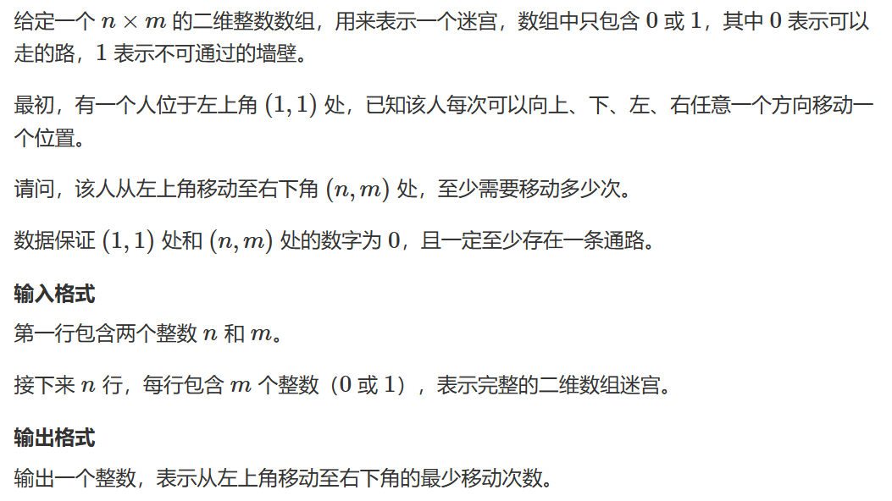
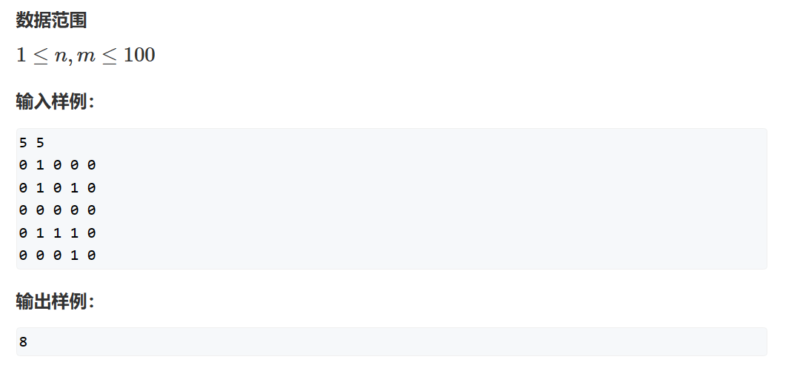

走迷宫问题就是很经典的DFS和BFS题目，前者解决有几条路可走，后者解决最短的那条路径。

对于此题，1代表了墙，0代表了路，问最短走几步可从左上角到达右下角的终点。

按照上面介绍的BFS的基本逻辑，我们可以知道与节点t接壤的节点就是上下左右四个节点，只不过加了个墙的条件使得我们无法走向某些方向。

我们可以先定义四个方向的单位向量方便后续遍历。同时我们声明一个ans数组来记录每个节点至起点的距离，默认值为-1表示未遍历到的节点，那么经过手动模拟，我们得出以下结果（建议自己试一遍再康康与正确答案是否一致）：

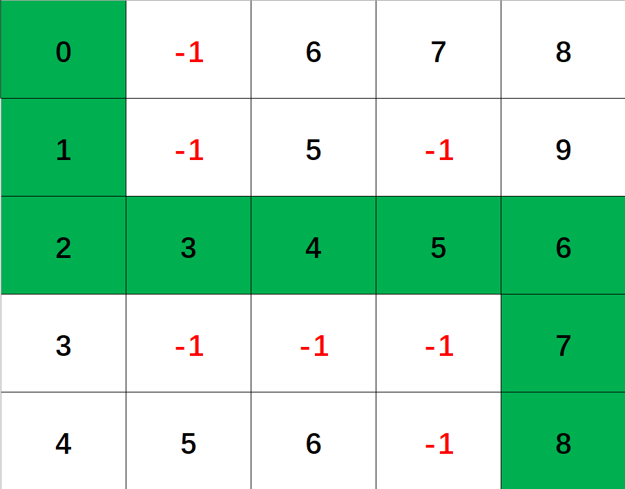

代码如下：
```cpp
#pragma GCC optimize(2)
#include <iostream>
#include <algorithm>
#include <cstring>
#include <utility>
#include <queue>

const int N = 110;
using pii = std::pair<int ,int >;
int map[N][N];
int ans[N][N];
int X[4]={0,-1,0,1},Y[4] = {1,0,-1,0};
int n,m;

int bfs()
{
    std::memset(ans,-1,sizeof ans);
    std::queue<pii> q;
    q.push({1,1});  //初始化队列，将起点推入
    ans[1][1] = 0;  //初始化起点
    while(q.size()) //当队列没有元素时，就是无路可走了
    {
        auto t = q.front();
        q.pop();
        for(int i = 0;i<4;i++)
        {
            //运用向量来遍历我们的四个方向
            int x = t.first + X[i], y = t.second + Y[i];
            //将越界行为排除，将非法点排除，防止将遍历过的节点又推入队列中而造成死循环
            if(x>0&&y>0&&x<=n&&y<=m&&!map[x][y]&&ans[x][y]==-1)
            {
                //此时的(x，y)至原点的距离等于到原点到其父节点的距离+1
                ans[x][y] = ans[t.first][t.second] + 1;
                //别忘了将新节点推入队列中
                q.push({x,y});
            }
        }
    }
    return ans[n][m];
}

int main()
{
    std::ios::sync_with_stdio(false);
    std::cin.tie(0);
    std::cout.tie(0);
    
    std::cin>>n>>m;
    for(int i = 1;i<=n;i++)
        for(int j = 1;j<=m;j++)
            std::cin>>map[i][j];
    
    std::cout<<bfs();
}
```

### 八数码

再介绍完简单的BFS后我们来做一道BFS的经典例题 —— 八数码

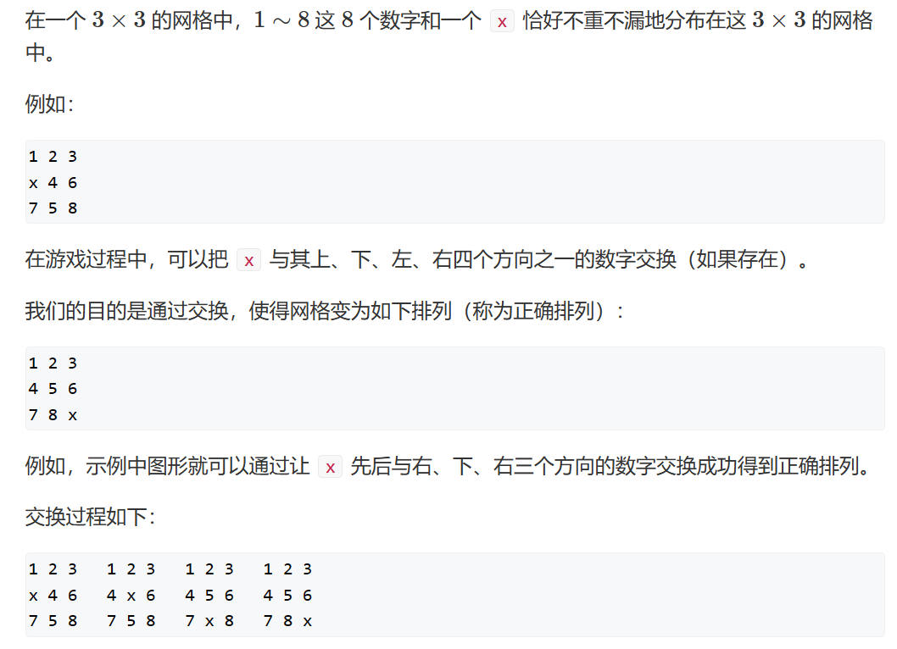
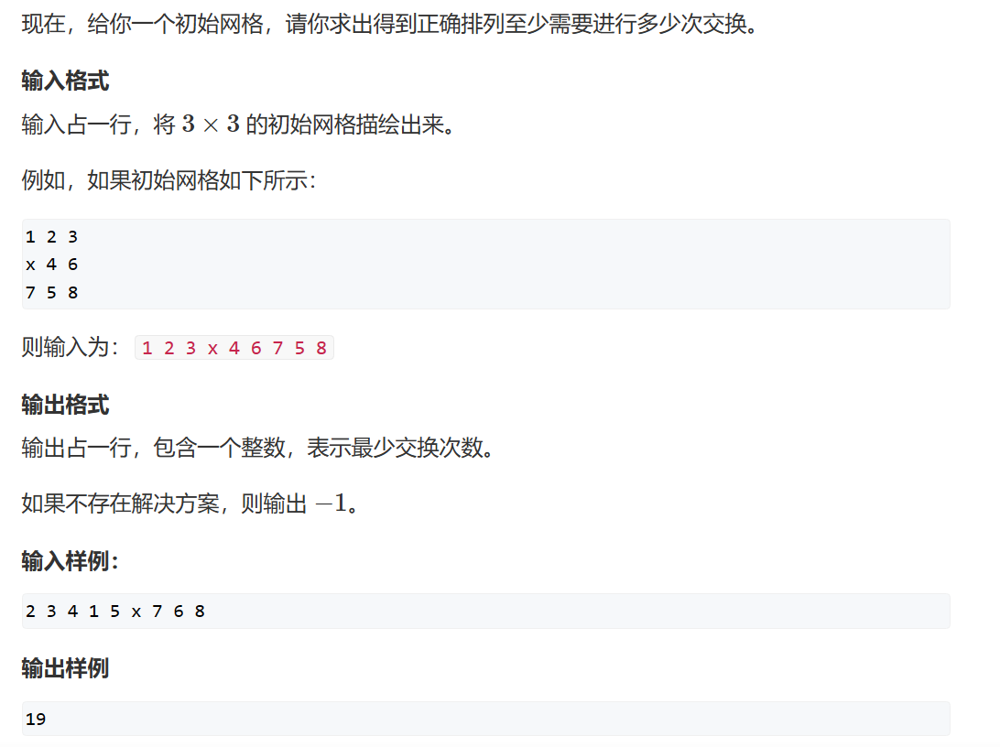

此题其实就是华容道，x为空位，我们需要将整个华容道恢复到指定的状态。这里用到了unordered_map去判断我们是否遍历过这个“节点”。

各位读者先自行按照以上提示写写代码，之后阅读代码对一下思路即可。

```cpp
#pragma GCC optimize(2)
#include <iostream>
#include <algorithm>
#include <string>
#include <queue>
#include <unordered_map>
std::string begin;
int X[4] = { 1,0,-1,0 }, Y[4] = { 0,1,0,-1 };
int bfs()
{
	const std::string end = "12345678x";
	std::queue<std::string> q;
	std::unordered_map<std::string, int> myMap;

	myMap[begin] = 0;
	q.push(begin);

	while (q.size())
	{
		auto t = q.front();
		q.pop();

        //注意我们回到起点后就代表我们找到了“最短路”
		if (t == end) return myMap[end];

		int distanceToBegin = myMap[t];
		int k = t.find('x');

        //一维换二维的变换
		int x = k / 3, y = k % 3;
		
		for (int i = 0; i < 4; i++)
		{
			int cx = x + X[i], cy = y + Y[i];

			if (cx >= 0 && cy >= 0 && cx < 3 && cy < 3)
			{   
                //swap绝对不要放到后面的判断里，因为我们的判断条件依赖于变化后的t
				std::swap(t[k], t[cx * 3 + cy]);
				if (!myMap.count(t))
				{
					myMap[t] = distanceToBegin + 1;
					q.push(t);
				}
				std::swap(t[k], t[cx * 3 + cy]);
			}
		}
	}
	return -1;
}

int main()
{
    std::ios::sync_with_stdio(false);
    std::cin.tie(0);
    std::cout.tie(0);
    //此题输入稍微需要注意，每个元素输入后都有回车出现
	for (int i = 0; i < 9; i++)
	{
		std::string a;
		std::cin >> a;
		begin += a;
	}
	std::cout << bfs();
}
```

## 图的存储

图因为具有指向性，当有一个节点与另一个节点连接时，我们需要将其记录，这时我们就有两种记录方式——**邻接表（也常常被称为链式前向星）**、**邻接矩阵**。

### 邻接表（稀疏图）
与哈希表中的邻接表是一致的，此时我们只是在图中对应的节点拉出一个邻接表。使用原始数组模拟实现邻接表代码如下：
```cpp
int idx;    //仅仅是作为在数组中添加元素的下标
int h[N];	//下标为图节点的编号，值为该编号的节点在数组的哪个位置
int e[2*N];	//储存值，此题就是节点的编号，下标是在数组中的位置
int ne[2*N];	//储存next值，下标是在数组中的位置
memset(h, -1, sizeof h);  //为头节点都初始化为-1，表示邻接表结尾
void add(int a, int b)      //a->b
{
	e[idx] = b;         //记录节点b的编号，位于数组的第idx位
    ne[idx] = h[a];     //将b节点的next指向节点a邻接表的头节点
    h[a] = idx++;       //a邻接表的头节点指向上一个接入邻接表的元素，并为下一次添加做准备
}
```

当理解了以上代码后，我们就知道，当我们需要的是有向图时，a->b只需要调用一次add(a, b)，当我们需要的是无向图时，则需要add(a, b)的同时再调用add(b, a)。

### 邻接矩阵（稠密图）

```cpp
int g[N][N];
while(m--)
	{
		int a, b, c;
		std::cin >> a >> b >> c;
		g[a][b] = std::min(c, g[a][b]); //只记录最短边
	}
```

## 图的DFS

知道图的储存与表示后我们来做一道图的DFS：

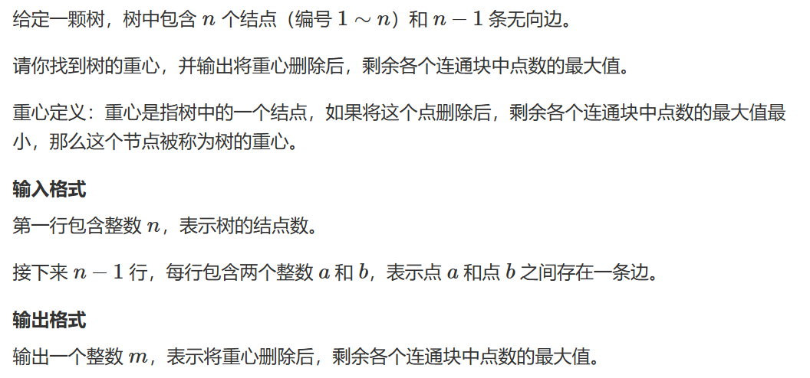
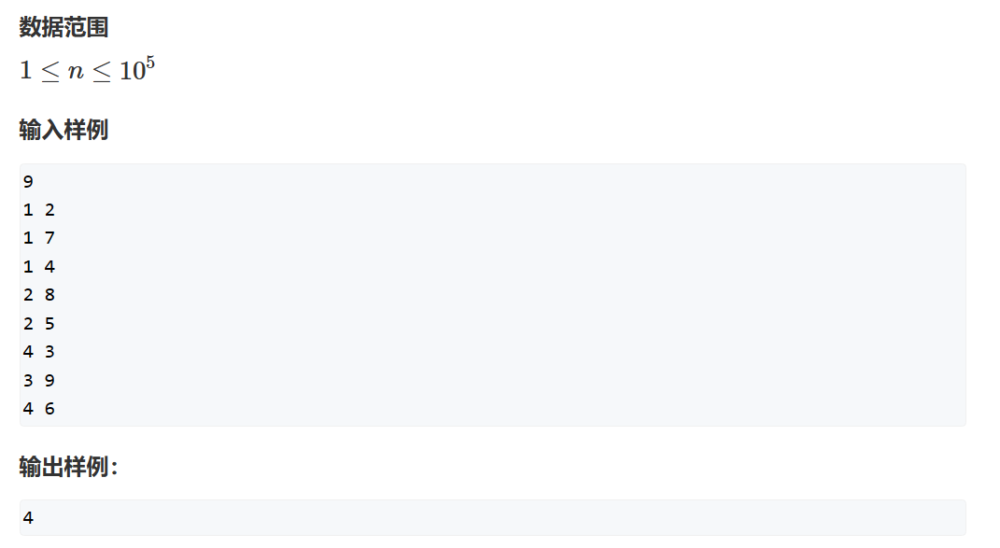

题意：题意不难理解，这是一棵树，那么树没有环，去掉任意一个点树要么保持不变，要么变成两棵树，题意就是让我们找到这么一个点，去掉以后使得节点最大的那棵树的节点最小。

思路：遍历每个点，同时计算以此点为根节点的树的大小sum和以此点为根节点的树的最大子树maxSon，此时得到的最大的那棵树的节点大小为：
$$max（（树的总大小n - sum），maxSon） $$

在遍历过程中不断维护这个值的最小值即可。

```cpp
#pragma GCC optimize(2)
#include <iostream>
#include <cstring>
#include <algorithm>

const int N = 100010;

int e[2*N],next[2*N],h[N],idx;
int st[N];
int max,n;
int min = INT32_MAX;
void add(int a,int b)
{
    e[idx] = b,next[idx] = h[a],h[a] = idx++;
}

int dfs(int u)
{
    //这里就是一个邻接链表的使用方法
    //在每次递归时，我们需要标记此时遍历到的根节点
    st[u] = true;

    //sum表示以u为根节点的树的总大小
    //maxSon表示以u为根节点的树的最大子树
    int sum = 1,maxSon = 0;
    for(int i = h[u];~i;i= next[i])
    {
        int j = e[i];
        if(st[j]) continue;

        int t = dfs(j); //取出每个子树的大小
        maxSon = std::max(maxSon,t);//找出最大的那个子树
        sum += t;//计算以u为根节点的树的总大小
    }

    max = std::max(n - sum,maxSon);//计算去掉节点u以后最大的连通块
    min = std::min(min,max);//计算这里面的最小值
    return sum;
}

int main()
{
    std::ios::sync_with_stdio(false);
    std::cin.tie(0);
    std::cout.tie(0);
    std::memset(h,-1,sizeof h);

    std::cin>>n;
    for(int i = 0;i<n;i++)
    {   
        //无向图，两个方向的边都得加
        int a,b;
        std::cin>>a>>b;
        add(a, b);
        add(b,a);
    }
    dfs(1);
    std::cout<<min;
}
```

## 图的BFS

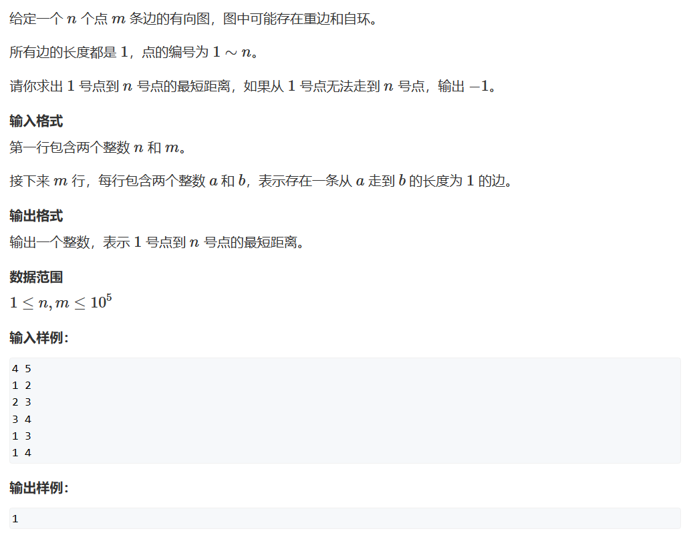

对于BFS，我们注重将点放入队列中来进行对队列的遍历，其实本题就是一个简单的层序遍历，我们使用BFS来实现并且标记点的层数。

```cpp
#pragma GCC optimize(2)
#include <iostream>
#include <cstring>
#include <algorithm>

const int N = 100010;

int e[2*N],next[2*N],h[N],idx;
int max,n;
int q[N],hh,tt = -1;//数组模拟队列
int ans[N];

void add(int a,int b)
{
    e[idx] = b,next[idx] = h[a],h[a] = idx++;
}

int bfs()
{
    //先将根节点入队
    q[0] = 1;
    hh = tt = 0;
    memset(ans,-1,sizeof ans);
    //根节点的层次是0
    ans[1] = 0;
    while(hh<=tt)
    {
        //取出队头元素
        int value = q[hh++];
        for(int i = h[value];~i;i = next[i])
        {
            int j = e[i];
            if(ans[j]==-1)
            {
                q[++tt] = j;
                ans[j] = ans[value] + 1;
            }
        }
    }
    return ans[n];
  
}
int main()
{
    std::ios::sync_with_stdio(false);
    std::cin.tie(0);
    std::cout.tie(0);
    std::memset(h,-1,sizeof h);
    int m;
    std::cin>>n>>m;
    for(int i = 0;i<m;i++)
    {
        int a,b;
        std::cin>>a>>b;
        add(a, b);
    }
    
    std::cout<<bfs();
}
```

### BFS之图的括扑系列

**括扑序列只存在于有向图中**

括扑序列：图的方向一定是从前指向后，即无环序列，故有向无环图也被称为括扑图。

***
知识补充：对于一个有向图，外面定义每一个节点含出度和入度，出度指从节点指向其他节点的边数，入度指从其他节点指向此节点的边数。由此可知，出度等于入度。

当入度为0：则无任何边指向此节点，此时该节点可作为括扑序列的下一个节点。
***

画几个图：

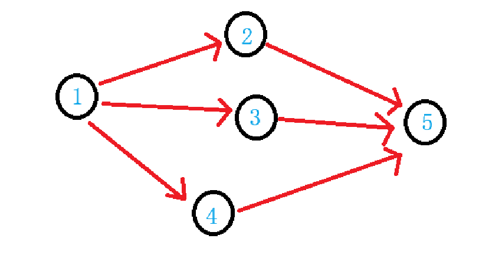

此时此图可构成的其中一个括扑序列：1 2 3 4 5

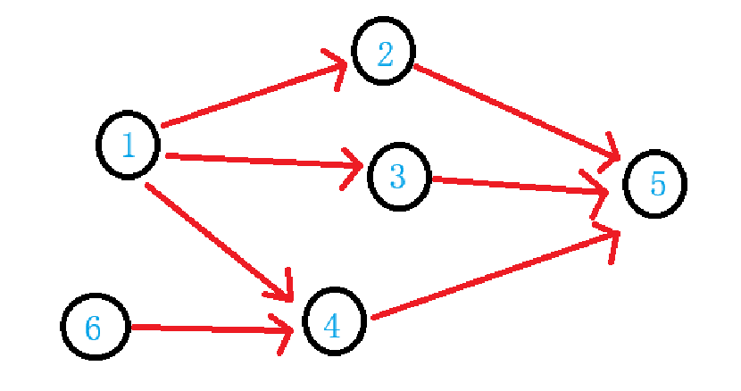

此时此图可构成的其中一个括扑序列：6 1 2 3 4 5

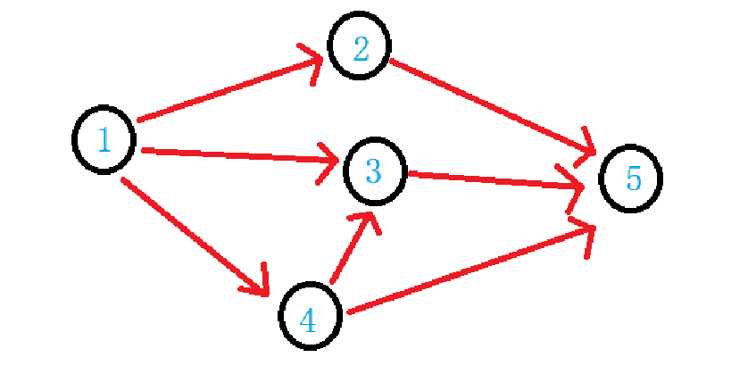

此时此图可构成的其中一个括扑序列：1 2 4 3 5

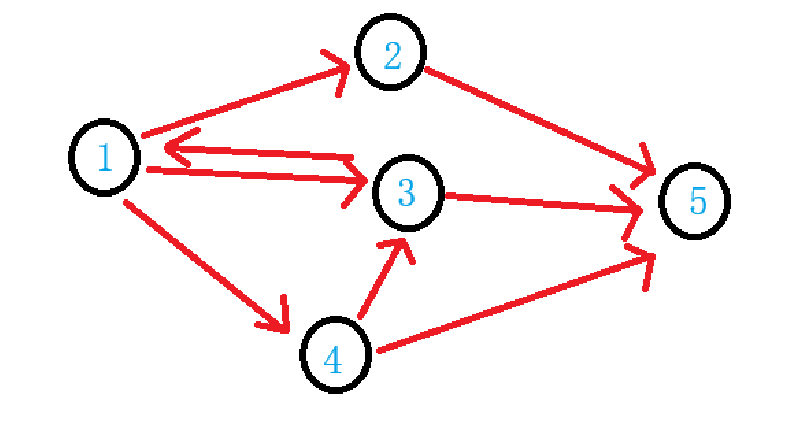

此时此图不能组成括扑序列，因为图在1 3 4 之间形成了环，导致在寻找括扑序列时，每个节点都能找到上一个节点而造成循环，不存在括扑序列。

我们以图1来进行模拟：

一、将节点一入队，因为此时整个图中只有其入度为0

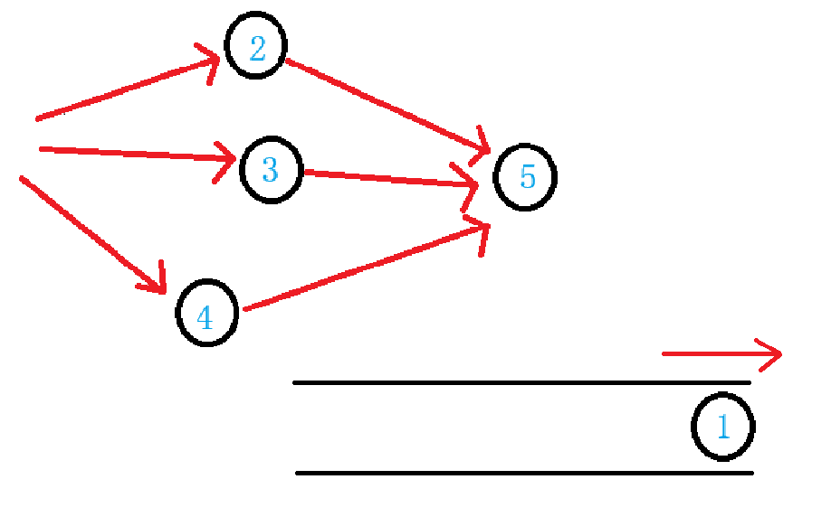

二、将队列中的节点取出，让后遍历其子节点并删除其连向子节点的边，即使子节点入度-1。如果此时子节点入度为0，将其推入队列中。

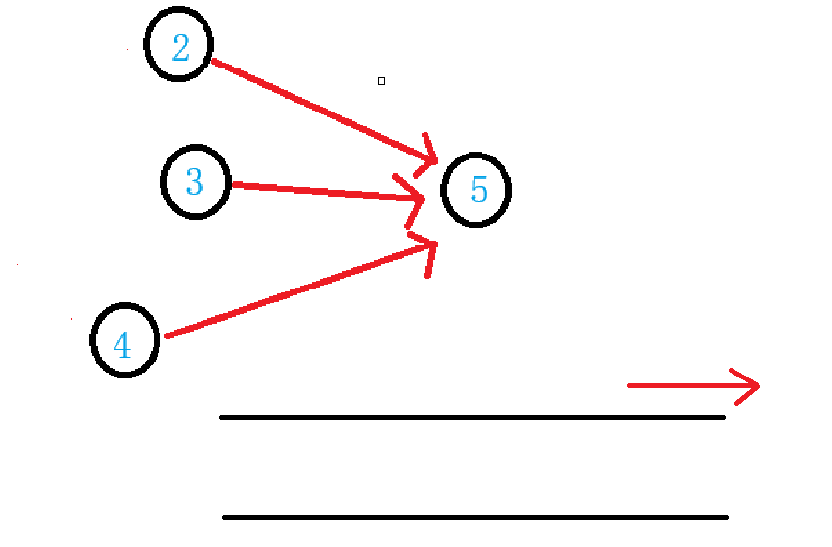
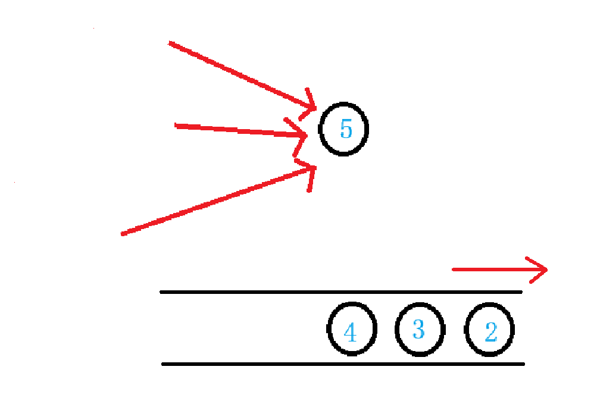

三、重复上述过程，此时入队顺序或出队顺序就是一个括扑序列。

```cpp
#pragma GCC optimize(2)
#include <iostream>
#include <cstring>
#include <queue>

const int N = 100010;

std::queue<int> q;  
int next[2 * N], h[N], e[N * 2], idx;
int res[N],Idx; //用于储存括扑序列
int outO[N], inO[N];

void add(int a,int b)
{
	e[idx] = b, next[idx] = h[a], h[a] = idx++;
	b[inO]++; //此时b的入度+1
}

int main()
{
	std::memset(h, -1, sizeof h);
	std::ios::sync_with_stdio(false);
	std::cin.tie(0);
	std::cout.tie(0);
	int n,m;
	std::cin >> n>>m;
	for(int i = 0;i<m;i++)
	{
		int a, b;
		std::cin >> a >> b;
		add(a, b);
	}
	for (int i = 1; i <= n; i++)
		if (!inO[i])    //首先找到入度为0的点作为根节点
		{
			q.push(i);
			res[Idx++] = i; //被推入的点是按顺序推入的，故括扑序列储存在队列的顺序中
		}
	while(q.size())
	{

		int t = q.front();
		q.pop();
		
		for(int i = h[t];~i;i = next[i])
		{
			int j = e[i];
			if (--inO[j]==0) //我们将此时节点连向其的子节点的边去掉，直至子节点入度为0，我们就可以将其推入队列中
			{
				q.push(j);
				res[Idx++] = j;
			}
		}
	}
	if (Idx != n)   //如果此时我们向队列中加入的节点不恰好为n的话，即有部分节点未能加入，则说明我们出现了环，不能构成括扑序列。
		std::cout << -1;
	else
		for (int i = 0; i < n; i++)
			std::cout << res[i] << " ";
}
```

***
图被分为有向图和无向图，它们各自分别又有有权和无权的区别。有向和无向的意思就好比公路，有些公路只能单向通行，有些却能双向，单向的被叫做有向，双向的则被称为无向。对于有权和无权，可以理解为节点之间的距离，如果有权，那么不同公路的长度可以不同；而无权则一般认为是1，节点之间的距离就是边的数量。     

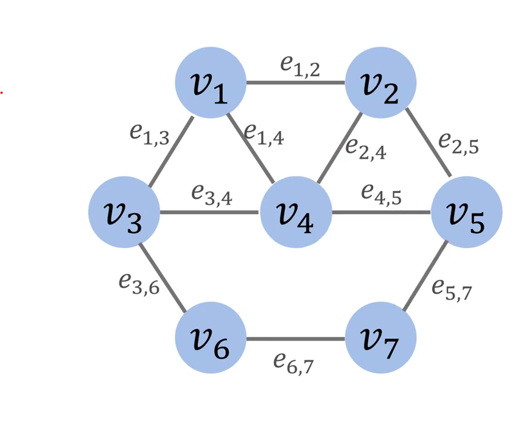    

## 二分图
当一个图的节点能被分成两个集合，且集合内部没有边，但集合之间由边连接是，这个图被称为二分图。    
简单来说：相邻的节点一定不属于一个集合
    
二分图的实际意义：    
匹配程序员和岗位


## 简单路径
简单路径不会绕圈，图中的1,2,3,4,6形成的路径就不是简单路径


## 最短路问题（Shortest Path）
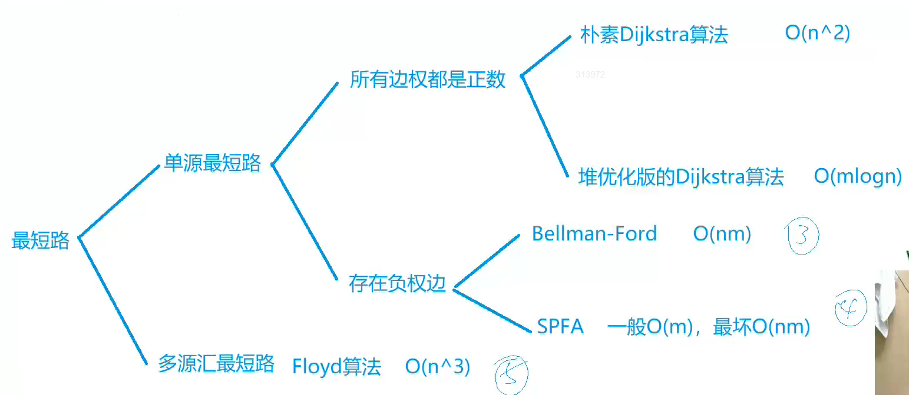   
因为无向图是一种特殊的有向图，所以我们在处理无向图的最短路问题的时候通常沿用有向图的最短路问题解法。
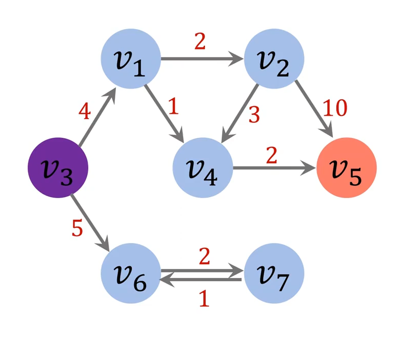    

这是一个有向有权图，我们研究一下从v3 ——> v5的最短路径     
由图可知：    
***
path1: v3-->v1-->v2-->v5       distance = 16    
path2: v3-->v1-->v4-->v5       distance = 7    
path3: v3-->v1-->v2-->v4-->v5  distance = 11    
***
那么自然path2 是最短的路径
***
***

### Single-Sourse Shortest Path Proplem —— 单元最短路问题
    

题目的意思是从给出的图中，以s为起点，找出到其他所有节点的最短路径    
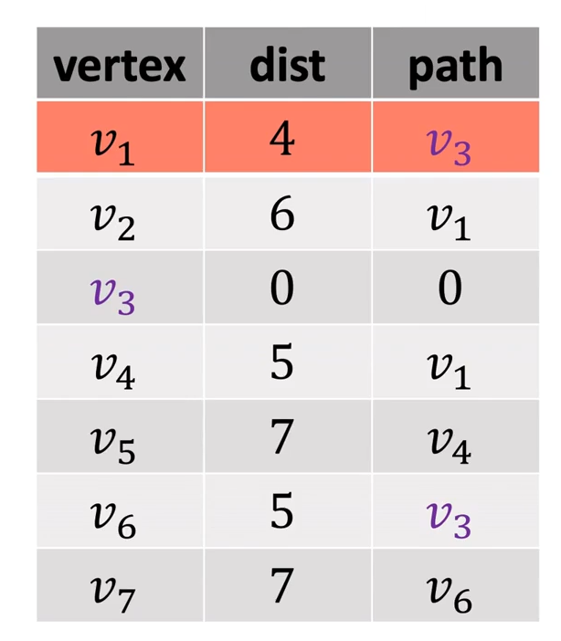    
第一列的含义是终点，第二列的含义是最短路径，第三列的含义是到达终点前的最后一个节点。

### Multivariate Shortest Path Problem —— 多元最短路问题 
