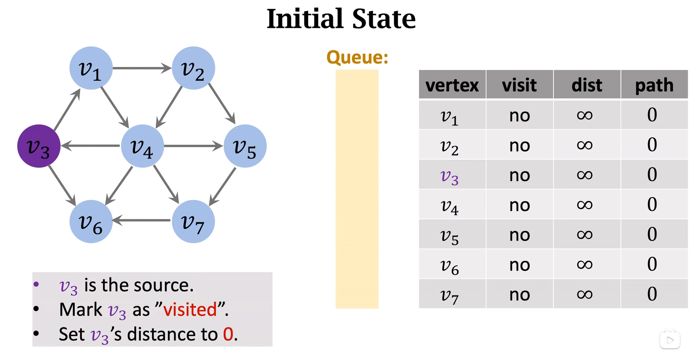
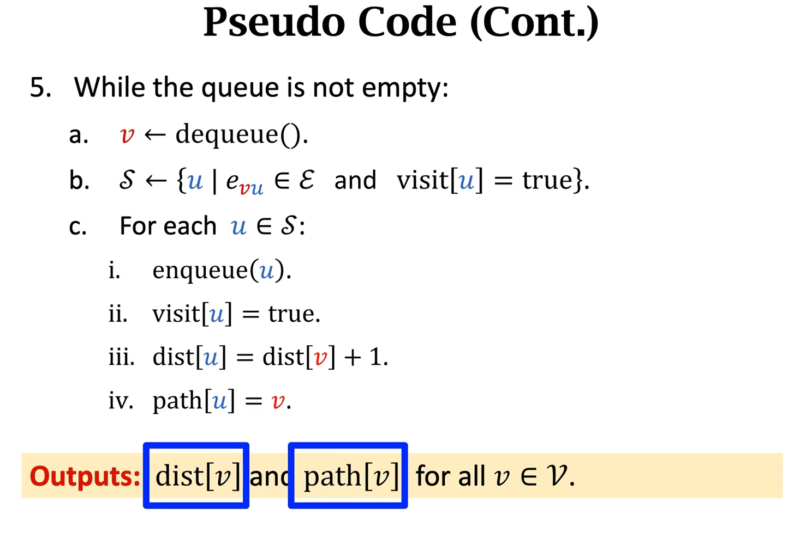

# 无权图的最短路问题
时间复杂度O(n) = n+m
    
现在，我们来做一道题去介绍无权图的最短路径算法：    
首先，我们以v3为起点    
我们需要准备的有——    
一个queue队列（先进先出）、   
一个vertex数组用于记录终点（记录每个点）、   
一个visit数组用于记录是否访问过该点（初始为false也就是没有访问过）、   
一个distance数组用于记录起点到终点的最短距离（初始为-1或正无穷）、   
一个path数组用于记录路径（初始为0）。

1. 当我们开始寻找时，我们以v3为起点的visit定义为true，distance赋值为0，并将v3插入到队列中   
     
2. 此时我们开始第二步——    
   循环，循环的退出条件为队列queue是否为空，因为当它为空时，代表我们走到了每一个路径的尽头。    
   我们将队列的头元素取出并记录（t = q.front()），此时我们将t的邻接表打开，依次检查里面元素是否被访问过，如果被范围过，那么我们跳过不做任何操作，如果没有被范围过，那么我们更新元素的状态。   
   例如此题中，我们第一次走v1这个路径，它没有被访问过，我们我们将visit状态更改为true并将它插入队列，同时将distance更新为它们之间的距离为1，在一般情况下，因为是无权图，那么distance[邻接表取出的元素] = distance[刚刚从队列取出的元素] + 1。最后，我们path[邻接表取出的元素]记录为v3。   
    
那代码中的体现就如下(注意这里做了空间优化：当distance==-1时则代表没有走过该路径)：
```cpp
void bfs(int u)
{
	memset(d, -1, sizeof d);	//另所有的d等于-1代表没有走过
	d[u] = 0;					//根节点到根节点的距离为0
	std::queue<int> q;			//储存编号的队列
	q.push(u);					//以1为根节点开始遍历

	while(q.size())
	{
		int t = q.front();	//将路径上的上一个节点取出
		q.pop();

		for(int i = h[t];i!=-1;i=ne[i])		//i为图中元素在数组模拟中的下标位置
		{
			int j = e[i];					//取出它在图中的编号
			if(d[j]==-1)					//判断是否走过这个点
			{
				d[j] = d[t] + 1;
                path[j] = t;
				q.push(j);
			}
		}
	}
}
```
