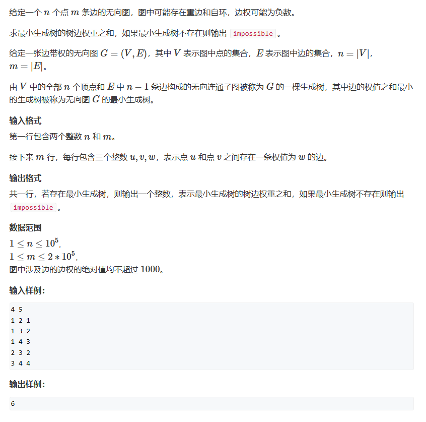

# Kruskal算法

时间复杂度：O(mlogm)


Kruskal算法的基本思想：

**维护一个森林，这个森林是一个树的集合**

1. 初始时，我们有由n个节点（所有节点）单独组成的n棵树
2. 每一轮循环检查一条边，如果边在不会构成回路且是相对最短边，那么我们选中这条边使两个数合并起来，这时树就减少了一棵
3. 当只剩下一棵树的时候我们就结束循环
4. 每一轮循环研究一条边，所以循环的次数不会超过图中边的数量

## 题一



```cpp
#include <iostream>
#include <algorithm>

const int N = 100010;
int n, m;
int sum = 0;
int p[N];
struct node
{

	int a;
	int b;
	int w;
	bool operator<(const node& d) const
	{
		return w < d.w;
	}
}Nodes[2 * N];

int find(int x)     //并查集+路径优化，用于储存各棵树
{
	if (p[x] != x) p[x] = find(p[x]);
	return p[x];
}

void kruskal()
{
	int count = 1;
	std::cin >> n >> m;
	for (int i = 0; i < m; i++)
	{
		int a, b, c;
		std::cin >> a >> b >> c;
		if (a != b)
		{
			Nodes[i] = { a,b,c };
		}
	}
	std::sort(Nodes, Nodes + m);     //以边的长度进行排序
	for (int i = 1; i <= n; i++) p[i] = i;  //初始化森林

	for (int i = 0; count != n && i < m; i++)	//如果森林里只剩一棵树了可以提前结束，减少时间消耗
	{
		int a = Nodes[i].a, b = Nodes[i].b, w = Nodes[i].w;
		a = find(a), b = find(b);
		if (a != b)
		{
			sum += w;
			count++;
			p[a] = b;
		}
	}
	if (count < n) std::cout << "impossible";
	else std::cout << sum;
}

int main()
{
	kruskal();
}
```


```cpp
#include<iostream>
#include<cstdio>
#include<cstring>
#include<algorithm>
#define LL long long int
using namespace std;
const int maxn=30005,maxv=100005,maxm=100005,INF=2000000000,P=1000000007;
int N,M,K;
 
struct EE{
	int a,b,w;
}Edge[maxm];
 
 
int head[maxv],nedge = 0;
struct EDGE{
	int to,next;
}edge[maxm];

inline void build(int a,int b){
	edge[nedge] = (EDGE){b,head[a]};
	head[a] = nedge++;
	edge[nedge] = (EDGE){a,head[b]};
	head[b] = nedge++;
}
 
void init(){
	fill(head,head+maxv,-1);
	N = read();
	M = read();
	K = read();
	for(int i=1; i<=M; i++){
		Edge[i].a = read();
		Edge[i].b = read();
		Edge[i].w = read();
	}
}
 
int nodei=0,pre[maxv],v[maxn];
 
inline int find(int x){return x == pre[x] ? x : pre[x]=find(pre[x]);}
 
void kruskal(){
	sort(Edge+1,Edge+1+M);
	for (int i = 1; i <= N; i++) pre[i]=i;
	nodei=N;
	int fa,fb;
	for (int i = 1; i <= M; i++){
		fa = find(Edge[i].a);
		fb = find(Edge[i].b);
		if (fa != fb){
			v[++nodei] = Edge[i].w;
			pre[fa] = pre[fb] = pre[nodei] = nodei;
			build(fa,nodei);
			build(fb,nodei);
		}
	}
}

```