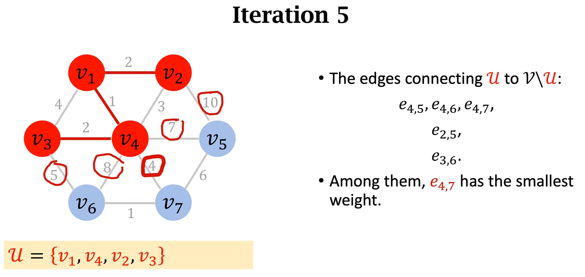
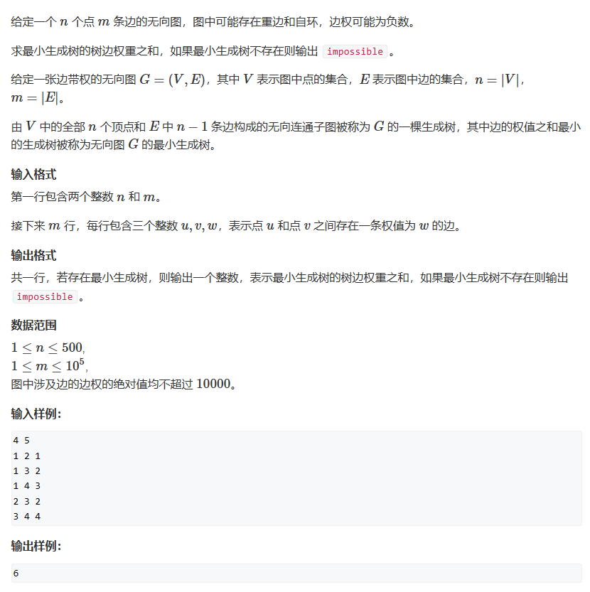

# Prim算法

Prim算法的基础思想：   
**种一颗从1个节点增长到n个节点的树**
1. 初始时树只有一个节点，可以是任意一个节点
2. 每次循环需要找到一个节点和一条边接到树上
3. 整个过程需要保证树的两个性质：
        1. 树是连通图   
        2. 树不能出现回路
4. 算法循环次数是节点的数量，因为每次循环都会往树里添加一个节点

简述版：每增加一个节点，就从当前所有已增加节点的无终点边中选出不会造成回路的一条最短边

## 题一

### 朴素版prim算法
和Dijkstra算法很类似     
1. 先初始所有距离为正无穷->dist[i] = 0x3f    
2. for(i=0;i<n;i++)
    1. t<--找到**集合**外距离最小的点 s[]表示集合      
    2. 用t更新其他点到**集合**的距离（dijkstra算法是什么呢？用t是距离起点距离最小的点，用t更新其他点到起点的距离）     
    3. st[t] = true 将点加到集合当中去
   
根据题意，这是个稠密图，那么我们使用邻接矩阵去存储
```cpp
#include <iostream>
#include <cstring>
#include <algorithm>
const int N = 510,INF= 0x3f3f3f3f;
int n, m;
int gd[N][N];
int dist[N];	//记录集合外的点距离集合最短的距离
bool st[N];		//判断点是否已经被加入到集合当中

int prim()
{
	memset(dist, 0x3f, sizeof dist);

	int res = 0;	//记录最短树中所有边的长度之和
	for(int i = 0;i<n;i++)
	{
		int t = -1;		//t==-1表示我们当前还没有找到任何点，循环结束后dist[t]就表示距离集合最近的距离了
		for (int j = 1; j <= n; j++)
			if (!st[j] && (t == -1 || dist[t] > dist[j]))
				t = j;
		if (i && dist[t] == INF)		//如果不是第一个点且dist[t]==正无穷，说明当前距离集合最近的点到集合的距离无穷大，即图不连通，那么不存在生成树
			return INF;
		if (i) res += dist[t];	//只要不是第一条边，那么我们就增加距离
		for (int k = 1; k <= n; k++) dist[k] = std::min(dist[k], gd[t][k]);		//更新集合外的点到集合的距离
		
		st[t] = true;


	}
	return res;
}
int main()
{
	std::memset(gd, 0x3f, sizeof gd);
	std::cin >> n >> m;
	while(m--)
	{
		int a, b, c;
		std::cin >> a >> b >> c;
		gd[a][b] = gd[b][a] = std::min(gd[a][b], c);
	}
	int t = prim();
	if (t == INF) std::cout << "impossible";
	else std::cout << t;
}
```