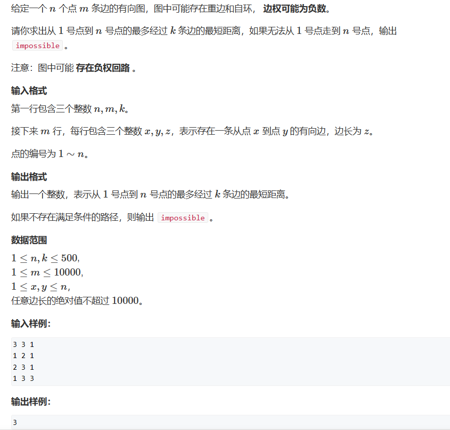
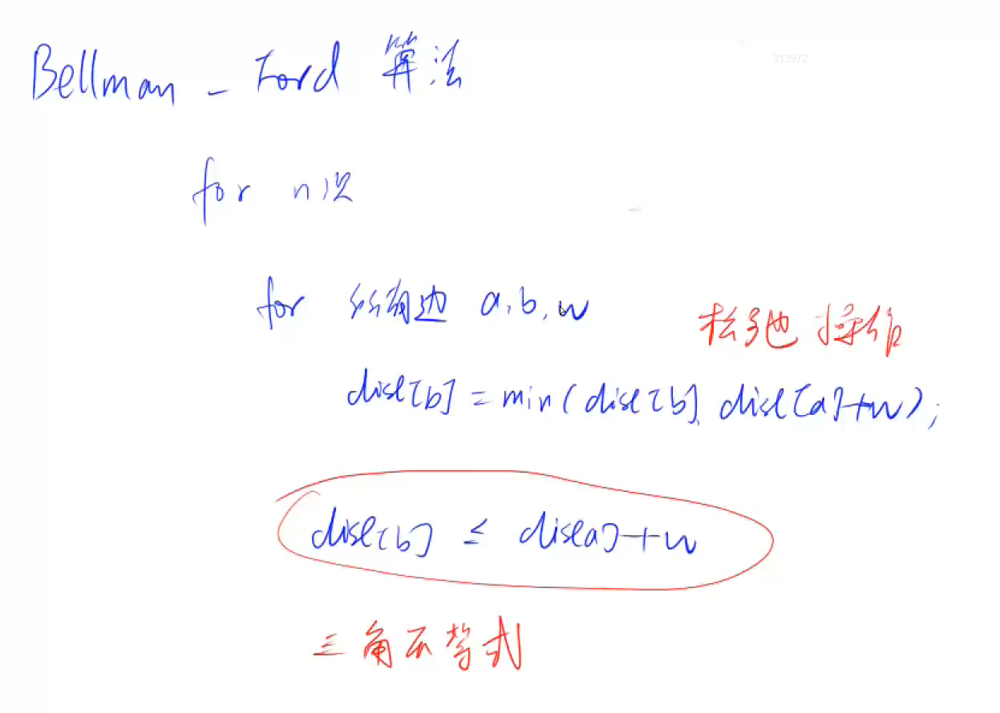
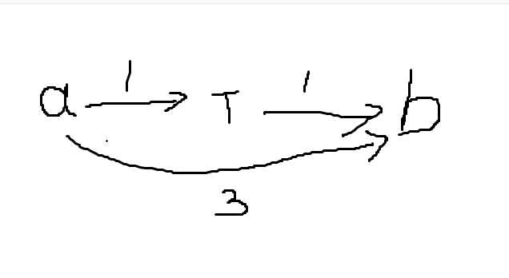

# Bellman-Ford算法

这个算法可以随意存边，只需要让我们可以遍历到所有的边就行。    
此算法一般用来处理存在有负权边的图，伪代码流程大概如下：    


在两层for循环结束后存在dist[b]<=dist[a] + w; 的三角不等式成立。    

对于第一层迭代，它的实际意义是迭代k次求得最短距离是从起点经过不超过k条边到每个点的最短距离，那么根据抽屉原理就一定存在重复节点，也就是环的出现，此时存在负权边的图不一定存在最短路径，若其中一个环为负数就会出现。
```cpp
#include <iostream>
#include <cstring>
#include <algorithm>

const int N = 510,M=10010;
int n, m,k;
int dist[N], backup[N];

struct Edge
{
	int a, b, c;

}edges[M];
void bellman_ford()
{
	memset(dist, 0x3f, sizeof dist);
	dist[1] = 0;
	for(int i = 0;i<k;i++)
	{
		std::memcpy(backup, dist,sizeof dist);
		for(int j = 0;j<m;j++)
		{
			int a = edges[j].a, b = edges[j].b, c = edges[j].c;
			dist[b] = std::min(dist[b], backup[a] + c);
		}
	}
}
int main()
{
	std::cin >> n >> m>> k;
	
	for(int i = 0;i<m;i++)
	{
		std::cin >> edges[i].a >> edges[i].b >> edges[i].c;
	}
	bellman_ford();
	if (dist[n] > 0x3f3f3f3f / 2)  std::cout << "impossible";
	else std::cout<<dist[n];
}****
```

为什么这里要使用备份？    
    
会发生串联现象：在我们更新起点到b的距离时，如果我们使用未备份的dist数组，当k=1时，我们最多只能使用一条边使a->b，a->b的距离是两条边也就是a->b实际上的距离应该是**正无穷**（它们不直接连接），结果因为使用了上一次更新的dist，那么a->b就会有a->中间节点->b的情况出现而影响结果