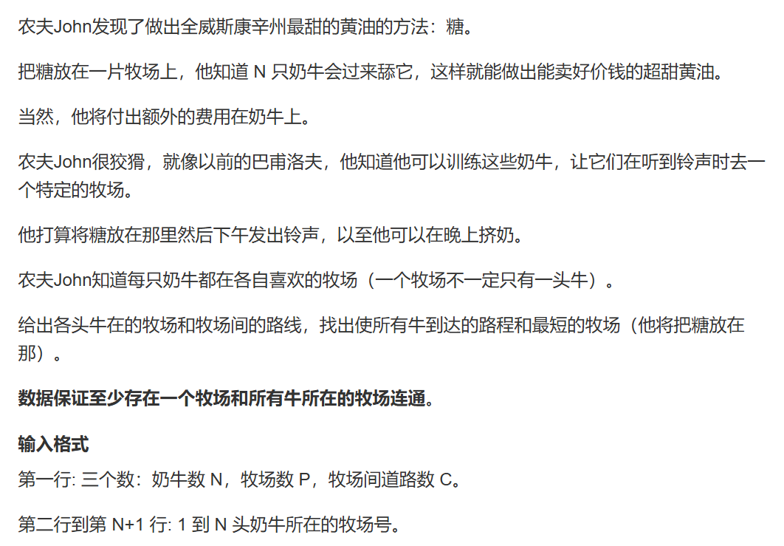
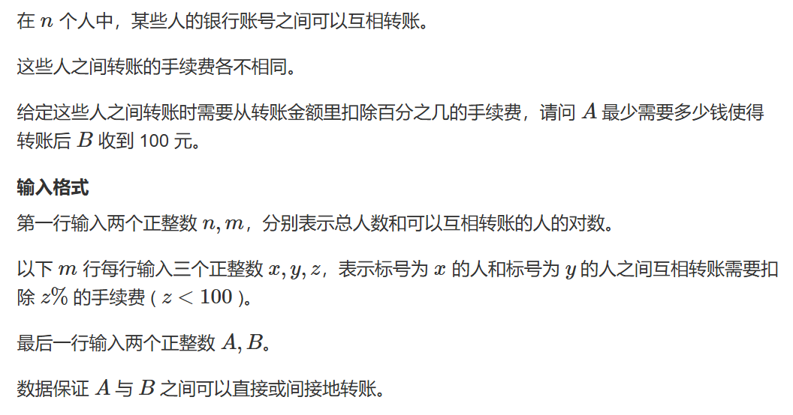

# Dijkstra求最短路（正权边）

## 题一


此题需要首先理解图论的Dijkstra算法后再来理解代码，这里直接贴代码

```cpp
//朴素版dijkstra算法，使用邻接矩阵
#include <cstring>
#include <iostream>
#include <algorithm>

const int N = 510;  //题目500点却有10w的边，说明是稠密图，所以使用邻接矩阵
int n, m;
int g[N][N];    //邻接矩阵，记录相邻点的distance值
int dist[N];    //记录点到起点的距离
bool st[N];		//该节点是否已经确定最短路径


int dijkstra()
{
	memset(dist, 0x3f, sizeof dist);
	dist[1] = 0;

	for(int i = 0;i<=n-1;i++)       //迭代到n-1是因为要确定起点到所有节点的最短路径
	{
		int t = -1;
		for (int j = 1; j <= n; j++)		//这个for循环就是模拟的优先队列
			if (!st[j] && (t == -1 || dist[t] > dist[j]))
				t = j;
		st[t] = true;   //此时我们的t指向已经确定最短距离节点之后距离起点最近的节点
		for (int j = 1; j <= n; j++)
			dist[j] = std::min(dist[j], dist[t] + g[t][j]);     //更新最短距离，检查是否存在经过节点t到j的距离能大于其他已确定路径的最短距离
	}
	if (dist[n] == 0x3f3f3f3f) return -1;
	else return dist[n];
}
int main()
{
	std::cin >> n >> m;

	memset(g, 0x3f,sizeof g);
	while(m--)
	{
		int a, b, c;
		std::cin >> a >> b >> c;
		g[a][b] = std::min(c, g[a][b]);
	}
	std::cout << dijkstra();
}
```

使用堆优化的算法：

```cpp
//使用堆优化的代码
#include <iostream>
#include <queue>
#include <utility>
#include <cstring>
int  n, m;
const int N = 1000010;
int h[N], e[N], next[N],idx,w[N];
int dist[N];
using PII = std::pair<int, int >;
bool st[N];
void add(int a,int b,int c)
{
	e[idx] = b, w[idx] = c, next[idx] = h[a], h[a] = idx++;
}

int dijkstra()
{
	memset(dist, 0x3f, sizeof dist);
	dist[1] = 0;

	std::priority_queue<PII, std::vector<PII>, std::greater<PII>> heap;		//距离，编号

	heap.push({0,1});
	while(heap.size())
	{
		auto t = heap.top();
		heap.pop();

		int ver = t.second, distance = t.first;
		if(ver == n) return dist[n];
		if(st[ver]) continue;
		st[ver] = true;
	
		for(int  i =h[ver];i!=-1;i = next[i])
		{
			int j = e[i];
			if (dist[j] > (dist[ver] + w[i]))
			{
				dist[j] = distance + w[i];
				heap.push({ dist[j],j });
			}
		}
	}
	if (dist[n] == 0x3f3f3f3f) return -1;
	else return dist[n];
}

int main()
{
	memset(h, -1, sizeof h);
	
	std::cin >> n >> m;
	while(m--)
	{
		int a, b, c;
		std::cin >> a >> b >> c;
		add(a, b, c);
	}
	std::cout << dijkstra();
}
```

## 题二


本质上就是一道dijkstra算法的简单应用

```cpp
#pragma GCC optimize(2)
#include <iostream>
#include <algorithm>
#include <cstring>
#include <queue>
#include <utility>
const int N = 1E5;
using pii = std::pair<int, int>;
int ne[2 * N], e[2 * N], h[N],w[2*N], idx;
int st[N];
int dist[N];
int T, C, TS, TE;
void add(int a,int b,int c)
{
	ne[idx] = h[a], e[idx] = b, w[idx] = c, h[a] = idx++;
}

int dijkstra(int root)
{
	memset(dist, 0x3f, sizeof dist);
	dist[root] = 0;
	std::priority_queue<pii, std::vector<pii>, std::greater<pii>> q;

	q.push({ 0,root });
	while (q.size())
	{
		auto t = q.top();
		q.pop();
		int ver = t.second, distance = t.first;
		if (ver == TE) return dist[ver];
		if(st[ver]) continue;
		st[ver] = true;

		for(int i = h[ver];~i;i = ne[i])
		{
			int j = e[i];
			if(dist[j]>dist[ver] + w[i])
			{
				dist[j] = dist[ver] + w[i];
				q.push({ dist[j],j });
			}
		}
	}
	if (dist[TE] == 0x3f3f3f3f) return -1;
	return dist[TE];


}


int main()
{
	std::ios::sync_with_stdio(false);
	std::cin.tie(0);
	std::cout.tie(0);

	std::cin >> T >> C >> T >> TE;
	memset(h, -1, sizeof h);
	for(int i = 0;i<C;i++)
	{
		int a, b, c;
		std::cin >> a >> b >> c;
		add(a, b, c);
		add(b, a, c);
	}

	std::cout << dijkstra(T);
}
```

## 题三


此题因为边开少了十分逆天地WA一发，与之前地做法不同的是此题相当于求从起点到所有点的最短路径中最长的那一条，所以我们不能在再次遇到点$n$时结束计算。

```cpp
#pragma GCC optimize(2)
#include <iostream>
#include <cstring>
#include <utility>
#include <queue>
#include <vector>

const int N = 1e5, M = 1e5;
using pii = std::pair<int, int>;
int ne[M], e[M], h[N], w[M], idx;
int dist[N];
int st[N];
int n, m;
void add(int a,int b,int c)
{
	ne[idx] = h[a], e[idx] = b, w[idx] = c, h[a] = idx++;
}

int dijkstra()
{
	memset(dist, 0x3f, sizeof dist);
	std::priority_queue<pii, std::vector<pii>, std::greater<pii>> q;
	//st[1] = true;
	dist[1] = 0;
	q.push({ 0,1 });

	while (q.size())
	{
		auto t = q.top();
		q.pop();
		int ver = t.second, distance = t.first;

		if(st[ver]) continue;
		st[ver] = true;
		for(int i = h[ver];~i;i = ne[i])
		{
			int j = e[i];
			if(dist[j]>dist[ver] + w[i])
			{
				dist[j] = dist[ver] + w[i];
				q.push({ dist[j],j });
			}
		}

	}
	int maxone = 0;
	for(int i = 1;i<=n;i++)
	{
		maxone = std::max(dist[i], maxone);
	}

	if (maxone == 0x3f3f3f3f) return -1;
	return maxone;
}

int main()
{
	std::ios::sync_with_stdio(false);
	std::cin.tie(0);
	std::cout.tie(0);
	memset(h, -1, sizeof h);
	std::cin >> n >> m;
	for(int i = 0;i<m;i++)
	{
		int a, b, c;
		std::cin >> a >> b >> c;
		add(a, b, c);
		add(b, a, c);
	}

	std::cout << dijkstra();
}
```

## 题四




题意：每只牛所在的位置可能各不相同，求在图中找一个节点使得所有牛到这个节点的距离和最短，并输出这个距离和。

题解：对每个节点进行一次以它为根节点的dijkstra算法，然后维护最小值即可，注意判断图的连通与否。

```cpp
#pragma GCC optimize(2)
#include <iostream>
#include <cstring>
#include <algorithm>
#include <utility>
#include <vector>
#include <unordered_map>
#include <queue>
using pii = std::pair<int, int>;
std::unordered_map<int, int> mmap;
const int N = 1E5 + 7;
int ne[2 * N], e[2 * N], w[2 * N], h[N], idx;
int n, p, c;
int dist[N];
int st[N];
void add(int a,int b,int c)
{
	ne[idx] = h[a], e[idx] = b, w[idx] = c, h[a] = idx++;
}

void dijkstra(int root)
{
	memset(dist, 0x3f3f3f3f, sizeof dist);
	memset(st, 0, sizeof st);
	std::priority_queue<pii, std::vector<pii>, std::greater<pii>> q;
	dist[root] = 0;
	q.push({ 0,root });
	while (q.size())
	{
		auto t = q.top();
		q.pop();
		int ver = t.second, distance = t.first;
		if(st[ver]) continue;
		st[ver] = true;
		for(int i = h[ver];~i;i = ne[i])
		{
			int j = e[i];
			if(dist[j]>dist[ver] + w[i])
			{
				dist[j] = dist[ver] + w[i];
				q.push({ dist[j],j });
			}
		}
	}
}

int check(int i)
{
	dijkstra(i);
	int sum = 0;
	for(auto& t : mmap)
	{
		if (dist[t.first] == 0x3f3f3f3f) return 0x3f3f3f3f;
		sum += t.second * dist[t.first];
	}
	return sum;

}

int main()
{
	std::ios::sync_with_stdio(false);
	std::cin.tie(0);
	std::cout.tie(0);
	memset(h, -1, sizeof h);
	std::cin >> n >> p >> c;

	for(int i = 1;i<=n;i++)
	{
		int a;
		std::cin >> a;
		mmap[a]++;
	}

	for(int i = 0;i<c;i++)
	{
		int a, b, c;
		std::cin >> a >> b >> c;
		add(a, b, c);
		add(b, a, c);
	}

	int ans = 0x3f3f3f3f;

	for(int i = 1;i<=p;i++)
	{
		int sum = check(i);
		ans = std::min(ans, sum);
	}
	std::cout << ans;
}
```

## 题五




此题也是套模板即可，需要注意的是数据类型，同时因为我们只知道终点的值，所以我们可以反向以收到$100$元的$B$为起点去求$A$的答案。

一点小知识是在$double$ 类型中，使用$memset$去赋初始值时$0x43$ 是较大值，$0x7f$ 是极大值。

```cpp
#pragma GCC optimize(2)
#include <iostream>
#include <cstring>
#include <vector>
#include <algorithm>
#include <queue>
#include <utility>
#include <iomanip>
using pdi = std::pair<double, int>;
const int N = 2E3 + 7, M = 1E5 + 7;
int n, m;
int root, end;
int ne[2 * M], e[2 * M], h[N], w[2*M], idx;
double dist[N];
int st[N];

void add(int a,int b,int c)
{
	ne[idx] = h[a], e[idx] = b, w[idx] = c, h[a] = idx++;
}

void dijkstra()
{
	memset(dist, 0x43, sizeof dist);
	dist[root] = 100.0;
	std::priority_queue<pdi, std::vector<pdi>, std::greater<pdi>> q;
	q.push({ 100.0,root });
	while (q.size())
	{
		auto t = q.top();
		q.pop();
		int ver = t.second;
		if(ver==end)
		{
			std::cout <<std::fixed<<std::setprecision(8)<< dist[ver];
			return;
		}
		if(st[ver]) continue;
		st[ver] = true;
		//t - t*w[i] = ans ==> t = ans/(1-w[i])
		for(int i = h[ver];~i;i = ne[i])
		{
			int j = e[i];
			if(dist[j]>dist[ver]/(1-w[i]*0.01))
			{
				dist[j] = dist[ver] / (1 - w[i]*0.01);
				q.push({dist[j],j});
			}
		}
	}

	if(dist[end]==0x7f)
	{
		std::cout << "-1";
		return;
	}
	std::cout << std::fixed << std::setprecision(8) << dist[end];
}

int main()
{
	std::ios::sync_with_stdio(false);
	std::cin.tie(0);
	std::cout.tie(0);
	memset(h, -1, sizeof h);
	std::cin >> n >> m;
	for(int i = 0;i<m;i++)
	{
		int a, b, c;
		std::cin >> a >> b >> c;
		add(a, b, c);
		add(b, a, c);
	}
	std::cin >> end >> root;
	dijkstra();
}
```

## 题六


这题说实话脑子一时半会没转过来，后来看了看y总的数据输入才突然醒悟。

此题实际上就是处理成 从前到后都能到达且长度为$1$，而后$bfs$ 即可，图很可能是稠密图建议使用邻接矩阵。

```cpp
#pragma GCC optimize(2)
#include <iostream>
#include <cstring>
#include <sstream>
#include <algorithm>
#include <queue>

const int N = 520;

int map[N][N];
int dist[N];
int n, m;
int st[N];
int stop[N];


void bfs()
{
	memset(dist, 0x3f3f3f3f, sizeof dist);
	std::queue<int> q;
	dist[1] = 0;
	q.push(1);
	while(q.size())
	{
		int t = q.front();
		q.pop();
		for(int i = 1;i<=m;i++)
		{
			if(map[t][i]&&dist[i]>dist[t] + 1)
			{
				dist[i] = dist[t] + 1;
				q.push(i);
			}
		}
	}

}

int main()
{
	std::cin >> n >> m;
	getchar();
	for(int i = 1;i<=n;i++)
	{
		std::string str;
		std::getline(std::cin,str);
		std::stringstream ssin(str);
		int cnt = 0,p;
		while (ssin >> p) stop[cnt++] = p;
		for(int j = 0;j<cnt;j++)
		{
			for(int k = j+1;k<cnt;k++)
			{
				map[stop[j]][stop[k]] = 1;
			}
		}
	}

	bfs();
	if (dist[m] != 0x3f3f3f3f)
		std::cout << std::max(dist[m] - 1, 0);
	else
		std::cout << "NO";
}
```

## 题七


题意：问从节点$1$ 至所有节点的花费中哪一个最小，同时每个节点有权重，路径上的任意两个节点的权重差不能超过$m$。从$1$ 到某个节点的花费为其路径权值和加上尾节点的权值。

题解：很简单，因为我们始终以节点$1$ 为起点，那么我们以其为合法区间枚举进行$dijkstra$ 即可，需要注意的是$dijkstra$ 的优先队列中的值不能包含节点的权值，否则不满足其原理而出错。

```cpp
#pragma GCC optimize(2)
#include <iostream>
#include <cstring>
#include <algorithm>
#include <queue>
#include <utility>
using pii = std::pair<int, int>;
const int N = 1e5 + 7;
int ne[2 * N], e[2 * N],w[2*N], h[N], idx;
int prize[N];
int level[N];
int n, m;
int dist[N];
int st[N];
void add(int a,int b,int c)
{
	ne[idx] = h[a], e[idx] = b, w[idx] = c, h[a] = idx++;
}

int dijkstra(int l,int r)
{
	std::priority_queue<pii, std::vector<pii>, std::greater<pii>> q;
	memset(dist, 0x3f3f3f3f, sizeof dist);
	memset(st, 0, sizeof st);
	dist[1] = prize[1];
	q.push({prize[1],1});
	while(q.size())
	{
		auto t = q.top();
		int ver = t.second,distance = t.first;
		q.pop();
		if(st[ver]) continue;
		st[ver] = true;
		for(int i = h[ver];~i;i=ne[i])
		{
			int j = e[i];
			//if(std::abs(level[ver] - level[j])>m) continue;
			if(dist[j] > w[i] + dist[ver] - prize[ver] + prize[j] &&level[j]>=l&&level[j]<=r)
			{
				dist[j] = w[i] + dist[ver] - prize[ver] + prize[j];
				q.push({dist[j]-prize[j],j});
			}
		}
	}
	int res = 0x3f3f3f3f;
	for (int i = 1; i <= n; i++) res = std::min(res, dist[i]);
	return res;
}

int main()
{
	std::ios::sync_with_stdio(false);
	std::cin.tie(0);
	std::cout.tie(0);
	std::cin >> m >> n;
	memset(h, -1, sizeof h);
	for(int i = 1;i<=n;i++)
	{
		int p, l, x;
		std::cin >> p >> l >> x;
		prize[i] = p;
		level[i] = l;
		for(int j = 1;j<=x;j++)
		{
			int id, pr;
			std::cin >> id >> pr;
			add(i, id, pr);
		}
	}

	int ans = 0x3f3f3f3f;
	for(int i = level[1];i<=level[1] + m;i++)
	{
		ans = std::min(ans, dijkstra(i - m, i));
	}
	std::cout << ans;
}
```

## 题八


题意很简单，让我们求出从节点$1$ 起步，经过$a、b、c、d、e$ （无固定顺序）后的最短路径，实际上就是求$a、b、c、d、e$ 全排列且以前者为出发点的最短路径，题目是不难，主要是麻烦，这里我选择先分别预处理出以$1、a、b、c、d、e$ 为出发点的最短路径，而后运用$algorithm$ 库里的 **next_permutation** 函数处理全排列，对于这个函数的运用可以参考如下样例：

输出 $1、2、3$ 的全排列

```cpp
#pragma GCC optimize(2)
#include <algorithm>
#include <iostream>

int n[] = { 1,2,3};

int main()
{
	do
	{
		for (auto& t : n)
			std::cout << t << " ";
		std::cout << "\n";

	} while (std::next_permutation(n, n + 3));
}
```

output：

```txt
1 2 3
1 3 2
2 1 3
2 3 1
3 1 2
3 2 1
```

```cpp
#pragma GCC optimize(2)
#include <iostream>
#include <cstring>
#include <algorithm>
#include <queue>
#include <unordered_map>

using pii = std::pair<int, int>;
const int N = 5e5 + 7, M = 1e5 + 7;
std::unordered_map<int, int> mapp;	//用哈希表记录每个root对应的dist序列
int ne[2 * M], e[2 * M], w[2 * M], h[N], idx;
int n, m;
int target[6]{1};
int dist[6][N];
int st[N];
int stt[5];
void add(int a,int b,int c)
{
	ne[idx] = h[a], e[idx] = b, w[idx] = c, h[a] = idx++;
}


void dijkstra(int root,int k)
{
	for (int i = 1; i <= n; i++) dist[k][i] = 0x3f3f3f3f;
	std::memset(st, 0, sizeof st);
	std::priority_queue<pii, std::vector<pii>, std::greater<pii>> q;
	dist[k][root] = 0;
	q.push({ 0,root });
	while(q.size())
	{
		auto t = q.top();
		q.pop();
		int ver = t.second;
		if(st[ver]) continue;
		st[ver] = true;
		for(int i = h[ver];~i;i = ne[i])
		{
			int j = e[i];
			if(dist[k][j]>dist[k][ver] + w[i])
			{
				dist[k][j] = dist[k][ver] + w[i];
				q.push({ dist[k][j],j });
			}
		}
	}
}


int main()
{
	std::ios::sync_with_stdio(false);
	std::cin.tie(0);
	std::cout.tie(0);
	std::cin >> n >> m;
	std::memset(h, -1, sizeof h);
	for (int i = 1; i <= 5; i++)
	{
		std::cin >> target[i];
	}
	std::sort(target, target + 6);
	for (int i = 0; i <= 5; i++)
	{
		mapp[target[i]] = i;	//每个root对应数组下标的映射
	}

	for(int i = 0;i<m;i++)
	{
		int x, y, t;
		std::cin >> x >> y >> t;
		add(x, y, t);
		add(y, x, t);
	}
	int ans = 0x3f3f3f3f;

	for(int i = 0;i<6;i++)
	{
		dijkstra(target[i], i);
	}
	int first = 0;
	do
	{
		int res = 0;
		for (int i = 0; i < 5; i++)
			res += dist[mapp[target[i]]][target[i + 1]];
		ans = std::min(ans, res);
	} while (std::next_permutation(target + 1, target + 6));
	std::cout << ans;
}
```

## 题九


此题解法很多，之后我会尝试使用其他题解并更新：

### 二分+dijkstra堆优化版

其实二分是解决此题最重要的思路之一，因为数据比较水后面使用什么方法反而不是最重要的，所以这里重点在于理解二分的思路：

一、思考二分什么？

二分一般需要满足一个性质：

**即在一个有序序列中ans值左边所有值满足（不满足）性质，ans值右边所有值不满足（满足）性质**

对于此题，因为在路径中我们会去掉前$k$大的所有边，求的值为剩余边中的最大边的最小值，也就是这些路径中的第$k+1$大的边的最小值，此时思考性质：

**从节点$1$到$N$中最少经过的边长大于$x$的边的数量是否小于等于$k$**

二、那么这个性质怎么用呢？

如果将其中大于$x$ 的边重新将权重记为$1$，否则记为$0$，那么依据这个权重进行最短路算法得出的$dist[i]$ 的含义就会变成：**从节点$1$经过最少的权值大于$x$的边到达$N$**

三、现在我们来证明这么做的正确性，假设ans为t：

1. 当$x>t$ 时，因为当$x=t$ 时我们至少也需要消耗$k$ 次去消除这条边的花费，那么当$x$ 更大时大于其的边数量就更少了，自然是满足条件的。
2. 当$x<t$ 时，根据定义我们至少需要大于$k$ 次去消除大于这个值的花费才能到达$N$，即不满足条件

举个栗子：从$1$经过权值超过$3$的边到达$N$，最少也要$4$条超过$3$的边，分别是有$5、5、6、6$或$4、4、5、7$这几条等等路径，但是我们的$k = 3$，那么此时我们的答案应该至少大于$3$ 而取到剩余分支中下一个值的最小值。

```cpp
#pragma GCC optimize(2)
#include <iostream>
#include <cstring>
#include <algorithm>
#include <utility>
#include <queue>
using pii = std::pair<int, int>;
const int N = 1E4 + 7, M = 1E5 + 7;

int n, m, k;
int ne[2 * M], e[2 * M], w[2 * M], h[N], idx;
int dist[N];
int st[N];
void add(int a,int b,int c)
{
	ne[idx] = h[a], e[idx] = b, w[idx] = c, h[a] = idx++;
}

bool check(int x)
{
	memset(dist, 0x3f, sizeof(int) * (n * 4));
	memset(st, 0, sizeof st);
	std::priority_queue<pii, std::vector<pii>, std::greater<pii>> q;
	dist[1] = 0;
	q.push({ 0,1 });
	while (q.size())
	{
		auto t = q.top();
		q.pop();
		int ver = t.second;
		if(st[ver]) continue;
		st[ver] = true;
		for(int i = h[ver];~i;i = ne[i])
		{
			int j = e[i], distance = w[i] > x;
			if(dist[j]>dist[ver] + distance)
			{
				dist[j] = dist[ver] + distance;
				q.push({ dist[j],j });
			}
		}
	}
	return dist[n] <= k;
}

int main()
{
	std::cin >> n >> m >> k;
	memset(h, -1, sizeof(int) * (n + 4));
	for(int i = 1;i<=m;i++)
	{
		int a, b, c;
		std::cin >> a >> b >> c;
		add(a, b, c);
		add(b, a, c);
	}
	int l = 0, r = 1e6 + 1;
	while(l<r)
	{
		int mid = l + r >> 1;
		if(check(mid))
		{
			r = mid;
		}else
		{
			l = mid + 1;
		}
	}
	if (l == 1e6 + 1) std::cout << -1;
	else std::cout << l;
}
```

## 题十


此题是ICPC Asia Pacific Championship E 原题，属于签到题

题意：给一个无向图，求从节点$1$ 到节点$n$，再从节点$n$ 回到节点$1$ 的最短路径，两次路程使用过的边不能完全相同，可以重复使用边。

题解：可以想到霍比特人：去而复返....不是，可以想到最短路径算法得出的路径一定是合法的一条路径，那么在回程的时候可以考虑走相同的路径的情况下节点处换一条没走过的路回去，枚举维护一下这个最小值即可。

```cpp
#pragma GCC optimize(2)
#include <iostream>
#include <queue>
#include <utility>
#include <cstring>
#include <map>
int  n, m;
const int N = 1e5+10,M = 3e5+10;
int h[N], e[2*M], next[2*M], idx, w[2*M];
int dist[2][N];
int rode[N];
using PII = std::pair<int, int>;
std::map<PII, int> mmap;
bool st[N];

void add(int a, int b, int c)
{
	e[idx] = b, w[idx] = c, next[idx] = h[a], h[a] = idx++;
}

void dijkstra(int *dt,int root)
{
	for (int i = 0; i <= n; i++) dt[i] = 0x3f3f3f3f, st[i] = 0;
	dt[root] = 0;

	std::priority_queue<PII, std::vector<PII>, std::greater<PII>> heap;		//距离，编号
	rode[root] = root;
	heap.push({ 0,root });
	while (heap.size())
	{
		auto t = heap.top();
		heap.pop();

		int ver = t.second;
		if (st[ver]) continue;
		st[ver] = true;
		for (int i = h[ver]; i != -1; i = next[i])
		{
			int j = e[i];
			if (dt[j] > (dt[ver] + w[i]))
			{
				rode[j] = ver;
				dt[j] = dt[ver] + w[i];
				heap.push({ dt[j],j });
			}
		}
	}
	
}

int main()
{
	std::ios::sync_with_stdio(false);
	std::cin.tie(0);
	std::cout.tie(0);
	memset(h, -1, sizeof h);

	std::cin >> n >> m;
	while (m--)
	{
		int a, b, c;
		std::cin >> a >> b >> c;
		add(a, b, c);
		add(b, a, c);

	}
	dijkstra(dist[0], 1);

	if(dist[0][n]==0x3f3f3f3f)
	{
		std::cout << -1;
		return 0;
	}
	int from = n;
	while(from!=1)
	{
		mmap[std::make_pair(from, rode[from])] = 1;
		mmap[std::make_pair(rode[from],from )] = 1;
		from = rode[from];
		
	}
	
	dijkstra(dist[1], n);
	
	int ans = 0x3f3f3f3f;
	for(int k = 1;k<=n;k++)
	{
		for(int i = h[k];~i; i = next[i])
		{
			int j = e[i];
			if(mmap[std::make_pair(k,j)]) continue;
			ans = std::min(ans, w[i] + dist[0][k] + dist[1][j]);
			ans = std::min(ans, w[i] + dist[0][j] + dist[1][k]);
		}
	}
	
	if (ans== 0x3f3f3f3f) std::cout << "-1";
	else std::cout << dist[0][n] + ans;
}
```

## 题十一


题目可能有点复杂，先梳理一下：

1. 给一个图，这个图有两种路，陆路--->双向权值非负，海路--->单向权值正负均有。
2. 这个图可能由多个陆路组成的连通块，连通块之间仅由海路连接且连通块之间无法形成环。

那么此时根据以上两个性质我们可以尝试对连通块之间做括扑排序，连通块内部做$dijkstra$ 算法。

最后我们来梳理我们的流程：

1. 输入陆路
2. 根据陆路将图分成多个连通块（具体方法自行选择，我这里使用$bfs+并查集$）
3. 输入海路，并记录连通块的入度
4. 对每个连通块进行括扑排序，括扑排序过程中选中一个连通块之后对这个连通块进行$dijkstra$ 求最短路，求最短路之前要把整个连通块都放到优先队列中，因为我们并不知道在这个连通块中的起点在哪（上一个连通块的海路与这个连通块的海路连到哪个点上，当然如果你原意也可以在输入海路的同时提前处理出来），我们需要全部枚举以找出来。

最后输出$dist$ 数组即可

```cpp
#pragma GCC optimize(2)
#include <iostream>
#include <cstring>
#include <algorithm>
#include <vector>
#include <unordered_map>
#include <queue>
#include <utility>
using pii = std::pair<int, int>;
const int N = 25e3 + 7,M = 5e5+7;

int p[N];
int dist[N];
int st[N];
int stcheck[N];
std::unordered_map<int, int> blockhead;
std::unordered_map<int, int> blockIn;
std::queue<int> q;

int ne[4 * M], e[4 * M], h[N], w[4 * M], idx;
std::vector<int> block[N];
int T, R, P, S;

int find(int x)
{
	if (p[x] != x) p[x] = find(p[x]);
	return p[x];
}

void add(int a,int b,int c)
{
	ne[idx] = h[a], e[idx] = b, w[idx] = c, h[a] = idx++;
}

void bfs(int root)
{
	std::queue<int> qt;
	qt.push(root);
	
	while(qt.size())
	{
		auto t = qt.front();
		qt.pop();
		if(stcheck[t]) continue;
		stcheck[t] = true;
		int pt = find(t);
		for(int i = h[t];~i;i = ne[i])
		{
			int j = e[i];
			p[j] = pt;
			block[pt].push_back(j);
			blockhead[pt] = true;
			qt.push(j);
		}
	}
}

void dijkstra(int root)
{
	std::priority_queue<pii,std::vector<pii>,std::greater<pii>> qt;
	qt.push({dist[root],root});
	for(auto u : block[root])
	{
		qt.push({ dist[u],u });
	}
	while(qt.size())
	{
		auto t = qt.top();
		qt.pop();
		int ver = t.second;
		if(st[ver]) continue;
		st[ver] = true;
		int pver = find(ver);
		for(int i = h[ver];~i;i = ne[i])
		{
			int j = e[i];
			int pj = find(j);
			if(dist[j]>dist[ver] + w[i])
			{
				dist[j] = dist[ver] + w[i];
				if(pj==pver) qt.push({dist[j],j});
			}
			if(pj!=pver)
			{
				blockIn[pj]--;
				if(blockIn[pj]==0)
				{
					q.push(pj);
				}
			}
		}
	}
}

void ToopSort()
{
	for(auto&t : blockhead)
	{
		if(!blockIn[t.first])
		{
			q.push(t.first);
		}
	}
	memset(dist, 0x3f, sizeof dist);
	dist[S] = 0;
	while(q.size())
	{
		auto t = q.front();
		q.pop();
		dijkstra(t);
	}
}

int main(){
	std::ios::sync_with_stdio(false);
	std::cin.tie(0);
	std::cout.tie(0);

	memset(h, -1, sizeof h);
	std::cin >> T >> R >> P >> S;
	for (int i = 1; i <= T; i++) p[i] = i;
	for(int i = 1;i<=R;i++)
	{
		int a, b, c;
		std::cin >> a >> b >> c;
		add(a, b, c);
		add(b, a, c);
	}

	for(int i = 1;i<=T;i++)
	{
		if(!stcheck[i])
		{
			bfs(i);
		}
	}

	for(int i = 1;i<=P;i++)
	{
		int a, b, c;
		std::cin >> a >> b >> c;
		add(a, b, c);
		int pa = find(a), pb = find(b);
		if(pa!=pb)
		{
			blockIn[pb]++;
			blockTob[pa].push_back(pb);
		}
	}

	ToopSort();

	for(int i = 1;i<=T;i++)
	{
		if (dist[i] > 0x3f3f3f3f/2) std::cout << "NO PATH\n";
		else std::cout << dist[i]<<"\n";
	}
}
```

## 题十二


题意：在一个给定的图中，有单向边也有双向边，每个节点有一个权值，求从节点$1$ 走到节点$n$ 路径上后节点与前节点权值差值最大。

题解：考虑类似于$dp$的做法，假设第$i$ 个节点为分割点，其含义为从$1$~$i$ 的节点中买入，在$i+1$~$n$ 的节点中卖出赚取的最多差价。由于存在节点不被唯一更新，故无法使用$dijkstra$ 考虑$spfa$ 维护$distmin[i]$ 与$distmax[i]$ 的值最后枚举最大值即可。

```cpp
#pragma GCC optimize(2)
#include <iostream>
#include <cstring>
#include <algorithm>
const int N = 1e5 + 7,M = 5e5+7;
int n, m;
int ne[4 * M], e[4 * M], ht[N],hs[N], idx;
int q[N];
int st[N];
int dmin[N], dmax[N];
int qt[N], hh, tt;
void add(int h[], int a, int b)
{
	ne[idx] = h[a], e[idx] = b, h[a] = idx++;
}

void spfa(int h[],int dist[],int type)
{
	hh = 0, tt = 1;
	if(type==0)
	{
		memset(dist, 0x3f, sizeof dmin);
		dist[1] = q[1];
		qt[0]=1;

	}
	else
	{
		memset(dist, -0x3f, sizeof dmax);
		dist[n] = q[n];
		qt[0] = n;
	}
	while(hh!=tt)
	{
		int t = qt[hh++];
		if (hh == N) hh = 0;

		st[t] = false;
		for(int i = h[t];~i;i = ne[i])
		{
			int j = e[i];
			if (type == 0 && dist[j] > std::min(dist[t], q[j]) || type == 1 && dist[j] < std::max(dist[t], q[j]))
			{
				if (type == 0) dist[j] = std::min(dist[t], q[j]);
				else dist[j] = std::max(dist[t], q[j]);

				if (!st[j])
				{
					qt[tt++] = j;
					if (tt == N) tt = 0;

					st[j] = true;
				}
			}

		}
	}
	


}

int main()
{
	std::ios::sync_with_stdio(false);
	std::cin.tie(0);
	std::cout.tie(0);
	memset(ht, -1, sizeof ht);
	memset(hs, -1, sizeof hs);
	std::cin >> n >> m;
	for (int i = 1; i <= n; i++) std::cin >> q[i];
	for(int i = 1;i<=m;i++)
	{
		int a, b, c;
		std::cin >> a >> b >> c;
		if (c == 1) add(hs,a, b),add(ht,b,a);
		else add(hs,a, b), add(hs,b, a),add(ht,a,b),add(ht,b,a);
	}

	spfa(hs, dmin, 0);
	spfa(ht, dmax, 1);


	int res = 0;
	for (int i = 1; i <= n; i++) res = std::max(res, dmax[i] - dmin[i]);
	std::cout << res;
}
```

解法二：按照以上思想，我们其实并不需要这么麻烦，从前向后和从后向前$dfs$ 预处理$distmin$ 和$distmax$ 即可。

```cpp
#pragma GCC optimize(2)
#include <iostream>
#include <cstring>
#include <algorithm>

const int N = 1e5 + 7, M = 2e6 + 7;
int n, m;
int ne[M], e[M],ht[N],hs[N], idx;
int q[N];
int distmin[N], distmax[N];
void add(int h[],int a,int b)
{
	ne[idx] = h[a], e[idx] = b, h[a] = idx++;
}

void dfs_min(int u,int last)
{
	if(last>=distmin[u]) return;
	last= std::min(last, q[u]);
	distmin[u] = last;
	for(int i = hs[u];~i;i = ne[i])
	{
		int j = e[i];
		dfs_min(j,last);
	}
}

void dfs_max(int u,int last)
{
	if (last <= distmax[u]) return;
	last = std::max(last, q[u]);
	distmax[u] = last;
	for (int i = ht[u]; ~i; i = ne[i])
	{
		int j = e[i];
		dfs_max(j, last);
	}
}

int main()
{
	std::ios::sync_with_stdio(false);
	std::cin.tie(0);
	std::cout.tie(0);
	memset(ht, -1, sizeof ht);
	memset(hs, -1, sizeof hs);
	memset(distmax, -0x3f, sizeof distmax);
	memset(distmin, 0x3f, sizeof distmin);

	std::cin >> n >> m;
	for (int i = 1; i <= n; i++) std::cin >> q[i];
	for(int i = 1;i<=m;i++)
	{
		int a, b, c;
		std::cin >> a >> b >> c;
		add(hs, a, b), add(ht, b, a);
		if (c == 2) add(hs, b, a), add(ht, a, b);
	}
	dfs_min(1,q[1]);
	dfs_max(n,q[n]);
	int res = 0;
	for (int i = 1; i <= n; i++) res = std::max(res, distmax[i] - distmin[i]);
	std::cout << res;
}
```