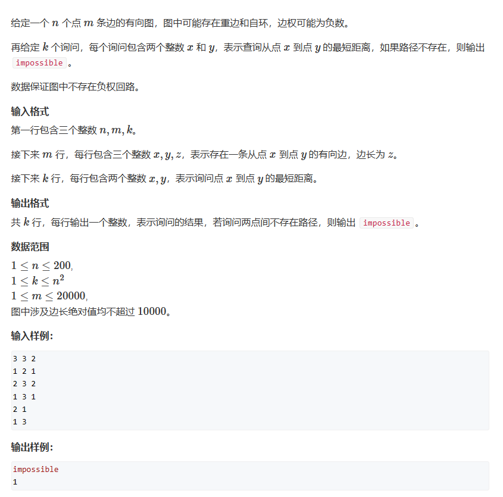

# Floyed算法

时间复杂度O(n) = n^3
***

问：求任意两个点之间的最短路径      
这类问题被称为“多源最短路径问题”
这里我们介绍Floyed算法，此算法可以出现负权边，但如果出现负环将不适用     

1. 我们使用邻接矩阵进行存储和更新
2. 举例：通过节点1进行中转
```cpp
for(int i = 1;i<=n;i++)
{
    for(int j = 1;j<=n;j++)
    {
        if(i==j) continue;
        if(g[i][j]>g[i][1] + g[1][j])
            g[i][j] = g[i][1] + g[1][j];
    }
}
```
1. 那么通过推举，我们能得出Floyed的核心代码：
```cpp
for(int k = 1;k<=n;k++)
{
    for(int i = 1;i<=n;i++)
    {
        for(int j = 1;j<=n;j++)
        {
            if(i==j){
                g[i][j] = 0;
                continue;}
            if(g[i][j]>g[i][k] + g[k][j])
                g[i][j] = g[i][k] + g[k][j];
        }
    }
}
```
## 题一

```cpp
#include <iostream>

const int N = 210,INF = 1E9;
int idx, n, m, wi;

int g[N][N];


void _add(int a,int b,int c)	//邻接矩阵
{
	if (g[a][b] > c)    //干掉重边，只留下最短边
		g[a][b] = c;
}

void floyed()
{
	for (int k = 1; k <= n; k++)
	{
		for (int i = 1; i <= n; i++)
		{
			for (int j = 1; j <= n; j++)
			{
				if ( g[i][j] > g[i][k] + g[k][j])
					g[i][j] = g[i][k] + g[k][j];
			}
		}
	}
}
int main()
{
	
	std::cin >> n >> m >> wi;
	for(int i = 1;i<=n;i++)
		for(int j = 1;j<=n;j++)
		{
			if (i == j) g[i][j] = 0;    //干掉自环
			else g[i][j] = INF;
		}
	while(m--)
	{
		int a, b, c;
		std::cin >> a >> b >> c;
		_add(a, b, c);
	}
	floyed();
	while(wi--)
	{
		int a, b;
		std::cin >> a >> b;
		
		if (g[a][b] > INF/2) std::cout << "impossible" << std::endl;
		else std::cout << g[a][b] << std::endl;
	}
}
```

