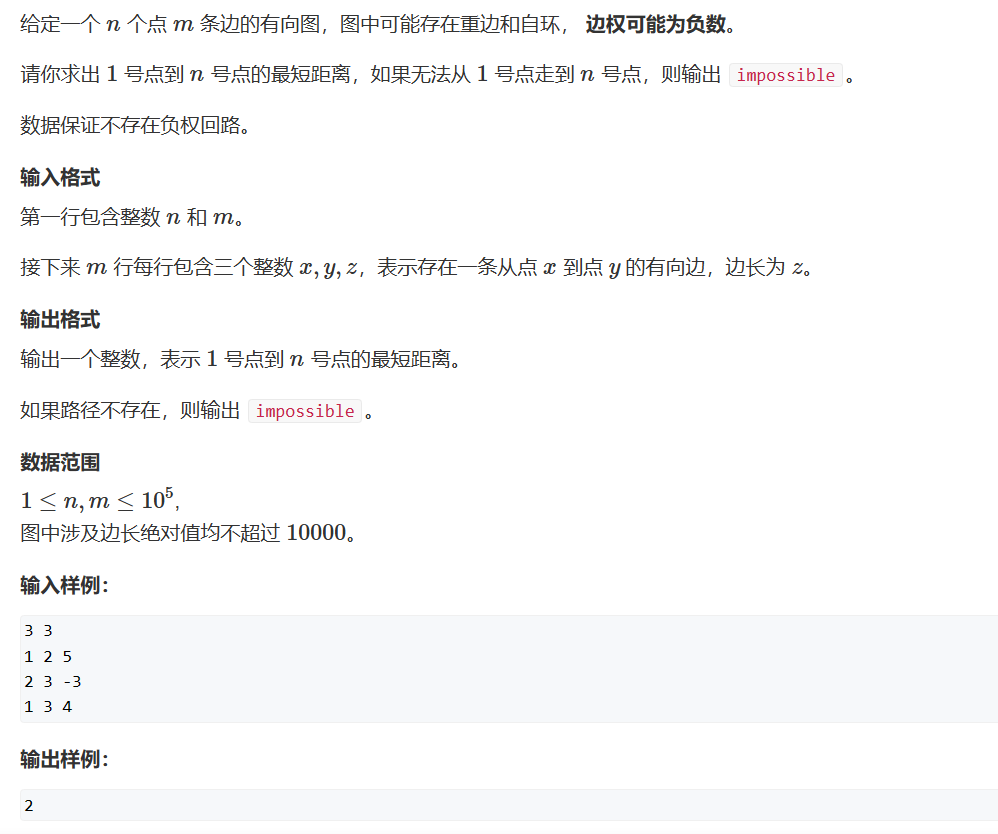
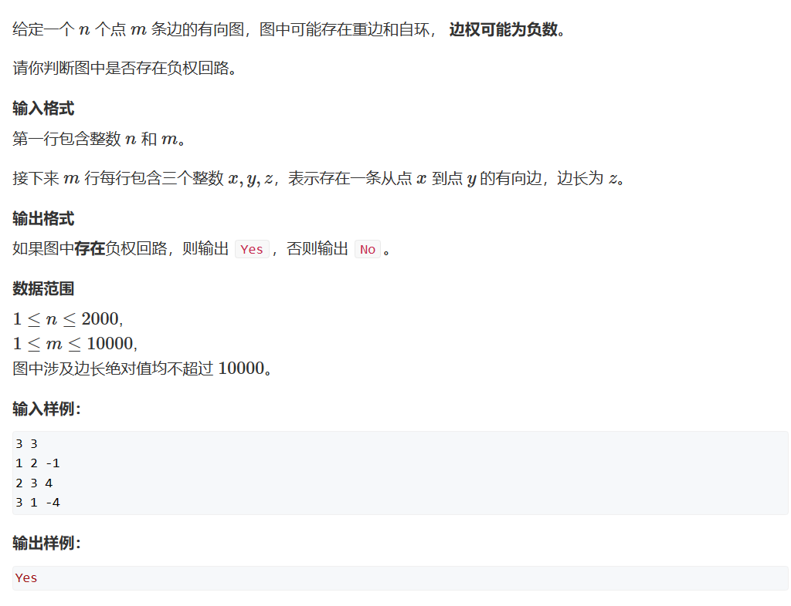

# spfa算法
很多时候我们可以使用spfa算法过掉大部分的图题     
spfa算法实际上是对bellman_ford算法的一个优化，因为bellman_ford算法遍历了邻接矩阵的所有元素，但实际上我们不需要这么做。    

根据我们的状态更新式：
```cpp
dist[b] = std::min(dist[b], dist[a] + w);
```
我们可以得知，只有当dist[a]变小时，我们的dist[b]才会变小，所以我们使用宽度优先搜索来进行优化 ———— 队列     
```cpp
#include <iostream>
#include <queue>
#include <cstring>
int  n, m;
const int N = 100010;
int h[N], e[N], next[N], idx, w[N];
int dist[N];
bool st[N];
void add(int a, int b, int c)
{
	e[idx] = b, w[idx] = c, next[idx] = h[a], h[a] = idx++;
}

int spfa()
{
	memset(dist, 0x3f, sizeof dist);
	dist[1] = 0;

	std::queue<int> q;
	q.push(1);
	st[1] = true;	//st数组存的是当前此点是否在队列中，以防止存储重复的点

	while(q.size())
	{
		int t = q.front();
		q.pop();

		st[t] = false;

		for(int i = h[t];i!=-1;i=next[i])
		{
			int j = e[i];
			if(dist[j]>dist[t] + w[i])
			{
				dist[j] = dist[t] + w[i];
				if (!st[j])
				{
					q.push(j);
					st[j] = true;
				}
			}
		}
	}
	return dist[n];
}

int main()
{
	memset(h, -1, sizeof h);

	std::cin >> n >> m;
	while (m--)
	{
		int a, b, c;
		std::cin >> a >> b >> c;
		add(a, b, c);
	}
	int t = spfa();
	if (t == 0x3f3f3f3f) std::cout << "impossible";
	else std::cout << t;
}
```
***
## 题二：判断负环
   
根据之前介绍的，spfa算法会遍历每个边，其k的意义就是从起点到更新点最少经过的边。那么在此题中，我们就可以利用这个性质，记录边的数量来判断是否有负环（当有n个点的图需要大于n-1的边才能到达时，由于抽屉原理那么我们的路径上一定至少两次经过了同一个点，此时就出先了负环）。
```cpp
#include <iostream>
#include <queue>
#include <cstring>
int  n, m;
const int N = 100010;
int h[N], e[N], next[N], idx, w[N];
int dist[N];
int count[N];
bool st[N];		//用于保证队列中同一个节点只能存在一个
void add(int a, int b, int c)
{
	e[idx] = b, w[idx] = c, next[idx] = h[a], h[a] = idx++;
}

bool spfa()
{
	std::queue<int> q;
	for (int i = 1; i <= n; i++)	//因为没有确定起点，此时我们需要将每个点都作为起点进行遍历，否则如果两个图不相交那么就会失败
	{
		q.push(i);
		st[i] = true;
	}


	while(q.size())
	{
		int t = q.front();
		q.pop();
		st[t] = false;
		for(int i = h[t];i!=-1;i=next[i])
		{
			int j = e[i];
			if(dist[j]>dist[t] + w[i])
			{
				dist[j] = dist[t] + w[i];
				count[j] = count[t] + 1;
				if (count[j] >= n) return true;		//一旦发现到达某个元素的边多于n-1条就返回存在负环
				if (!st[j])
				{
					q.push(j);
					st[j] = true;
				}
			}
		}
	}
	return false;
}

int main()
{
	memset(h, -1, sizeof h);

	std::cin >> n >> m;
	while (m--)
	{
		int a, b, c;
		std::cin >> a >> b >> c;
		add(a, b, c);
	}
	bool t = spfa();
	if (t == false) std::cout << "No";
	else std::cout << "Yes";
}
```


