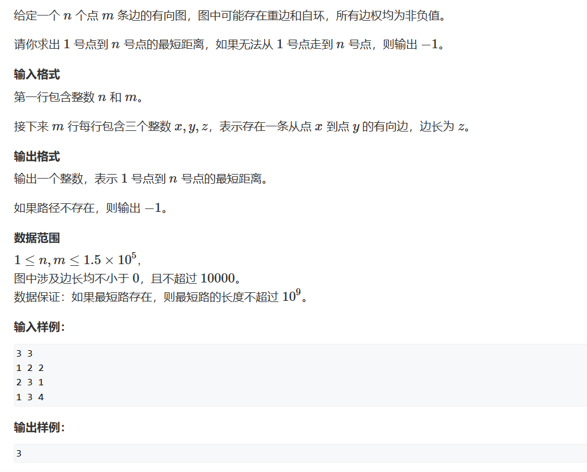

# 最短路算法介绍

在最短路问题中，我们一般分为（$n$为节点数，$m$为边数）：
$$最短路问题\begin{cases}
    单源最短路问题——求一个点至其他点的距离\begin{cases}
        所有变权均为正数\begin{cases}
            朴素版Dijkstra算法——常用于稠密图（贪心）\quad O(n^2)\\
            堆优化版Dijkstra算法——常用于稀疏图\quad O(mlogn)
        \end{cases}\\
        存在负权边\begin{cases}
            Bellman-Ford算法（离散数学）\quad O(nm)\\
            spfa算法(优化版的Bellman-Ford算法，但如果限制遍历边数，则不可使用)\quad 一般情况：O(m)，最坏O(nm)
        \end{cases}

    \end{cases}\\\\\
    多源汇最短路问题——求任选两个点a、b，求a到b的最短路：Floyd算法（动态规划）\quad O(n^3)
\end{cases}
$$

***
注：最短路问题难点在于模型转换，也就是如何将题目转换为最短路问题来做，所以重要得不是学习证明，而是学习使用和题型积累。
***

## 朴素Dijkstra算法

算法步骤：

1. 初始化距离：dist[1] = 0 —— 起点到起点距离为0，其他点到起点dist[i] = 正无穷（极大的数即可，如：0x3f3f3f3f）
2. 循环$n$次，第i次循环**至少**能找到**1个**到起点**边数**为$i$的节点，为什么说Dijkstra算法基于贪心就是这个原因，如果找到一条点$u$到起点的最短路径，那么该路径上的任何一个点 $u^{'}$到起点的子路径也是其最短路径，那么由贪心可知，每次到达$u^{'}$的路径都是最短路径，那么到达$u$的路径也必定是最短路径。
3. 在第i次循环找到此时最短路径后，更新与$u^{'}_i$相连的未确定最短路径的节点距离，也就是找到使用$i+1$条边，是否能够找到另一个节点到起点的距离比使用**小于**$i+1$条边到起点距离更短的路径。

***
思考：在第二步中，我们说了这么一句话——第i次循环**至少**能找到**1个**到起点**边数**为$i$的节点。想一想，如果我们第$i$次循环找到不止$1个$到起点**边数**为$i$的节点呢（如下图）？再考虑这个算法是否还有可以优化的地方呢？

***


```cpp
#pragma GCC optimize(2)
#include <cstring>
#include <iostream>
#include <algorithm>

const int N = 510, M = 2 * N;
int n, m, d;
int g[N][N];
int dist[N];
bool st[N];		//标记确定最短路径的点

int dijkstra()
{
    std::memset(dist,0x3f,sizeof dist);
    dist[1] = 0;
    for(int i = 1;i<=n;i++)
    {
        int t = 0; //初始化为0方便后面寻找最短路径
        for(int j = 1;j<=n;j++)
        {
            if(!st[j]&&(dist[j]<dist[t]))
                t = j;
        }
        if(t==n) return dist[n];    //这里就是让大家思考的地方，如果我们已经找到了n为我们此时的最短路径，直接返回就完事了，但这不是最优的优化，接下来会介绍最优的优化部分
        st[t] = true;
        for(int j = 1;j<=n;j++) //更新与t相连的节点的新路径长度
            dist[j] = std::min(dist[j], dist[t] + g[t][j]);
    }
    if(dist[n]==0x3f3f3f3f) return -1;
    return dist[n];
}
int main()
{
    std::ios::sync_with_stdio(false);
    std::cin.tie(0);
    std::cout.tie(0);
	std::cin >> n >> m;

	memset(g, 0x3f,sizeof g);
	while(m--)
	{
		int a, b, c;
		std::cin >> a >> b >> c;
		g[a][b] = std::min(c, g[a][b]);
	}
	std::cout << dijkstra();
}
```

## 堆优化的Dijkstra算法

上文中做的思考，可以考虑到在每次更新前我们都需要找到最短的那条路径的节点，但是它的时间复杂度是$O(n)$

但事实上我们可以通过小顶堆来维护我们的最小值，如此的话我们寻找最小值的时间复杂度就是$O(1)$，而维护堆的时间复杂度为$O(logn)$，故整个代码的时间复杂度就被优化为了$O(mlogn)$。



```cpp
#pragma GCC optimize(2)
#include <iostream>
#include <queue>	//priority_queue在这里！
#include <cstring>
#include <utility>	//pair在这里！
#include <algorithm>

using pii = std::pair<int, int>;
const int N = 1500010;
int next[N], e[N], h[N],w[N], idx;
int dist[N];
bool st[N];
int n, m;
std::priority_queue<pii,std::vector<pii>,std::greater<pii>> head;   //以pii.first为升序排序的优先队列

void add(int a,int b,int c)
{
	e[idx] = b, next[idx] = h[a], w[idx] = c, h[a] = idx++;
}

int dijkstra()
{
	std::memset(dist, 0x3f, sizeof dist);
	dist[1] = 0;
	head.push({0,1}); //<距离，节点编号>
	while (head.size())
	{
		auto t = head.top();
		head.pop();

		int ver = t.second, d = t.first;
        if(ver == n) return dist[n];  //如果已经找到到n的最短距离，直接返回其值即可
		if(st[ver]) continue;   //如果该节点被更新过，跳过
		st[ver] = true;

		for(int i = h[ver];~i;i = next[i])  //枚举更新与ver节点相连的节点距离
		{
			int j = e[i];
			if(dist[j]> d + w[i])
			{
				dist[j] = d + w[i];
				head.push({ dist[j],j });
			}
		}
	}
	return -1;	//如果始终没有将节点$n$推入堆中，说明存在环或此图不连通，节点1无法到达节点n
}

int main()
{
	std::ios::sync_with_stdio(false);
	std::cin.tie(0);
	std::cout.tie(0);
	std::memset(h, -1, sizeof h);
	
	std::cin >> n >> m;

	for(int i = 0;i<m;i++)
	{
		int a, b, c;
		std::cin >> a >> b >> c;
		add(a, b, c);
	}

	std::cout << dijkstra();
}
```

## Bellman-Ford算法

Bellman-Ford算法不需要考虑边与边、之间的关系，我们只需要存下来这个边并使得我们能遍历到所有边即可，并不需要规定只能遍历某个点引伸出的某条边。

伪代码：

```cpp
for(int i = 1;i <= n; i++)
{
	for(循环所有边a, b, w) //指存在a -> b，权重为w 的边
	{
		dist[b] = std::min(dist[b],dist[a] + w);
	}
}
```

是不是很熟悉呢？

回忆一下朴素版dijkstra算法：

```cpp
for(int i = 1;i<=n;i++)
    {
        ...

        for(int j = 1;j<=n;j++) //更新与t相连的节点的新路径长度
            dist[j] = std::min(dist[j], dist[t] + g[t][j]);
    }
```

此时再思考一下做朴素版dijkstra算法时给的小思考，我们就会发现，其实这就是纯纯暴力算法啦！

这个算法的思路就是（和dijkstra算法一毛一样啊！！！）：循环$n$次，第i次循环**至少**能找到**1个**到起点**边数**为$i$的节点

为什么说Dijkstra算法基于贪心就是这个原因，如果找到一条点$u$到起点的最短路径，那么该路径上的任何一个点 $u^{'}$到起点的子路径也是其最短路径，那么由贪心可知，每次到达$u^{'}$的路径都是最短路径，那么到达$u$的路径也必定是最短路径。

但是，此时我们不考虑我们是否已经是找到了最短路，也就说默认我们不懂贪心操作，就是无脑地找到使用$i$条边是否可以找到到达节点$n$的路径，并且持续维护其中的最小值罢了。

***

但此题的重点是考虑到有负权边，当存在负权边和负权回路时因为负数的存在，每次回路的循环都会造成路径长度的不断减小，并且如果此时负权回路处于从起点到终点的路径上时，我们就不会存在最短路。

另一个需要考虑到的问题是更新的问题，当我们在每次大循环中需要调用dist值，但有多条边连至同一个点时，我们除第一次更新会造成数据污染而导致答案错误，所以我们使用一个备份去解决这个问题。

```cpp
#pragma GCC optimize(2)
#include <iostream>
#include <algorithm>
#include <cstring>

const int N = 10010;
int n, m, k;

struct line
{
	int a;
	int b;
	int w;
}lines[N];
int dist[N];
int backup[N];
int main()
{
	std::ios::sync_with_stdio(false);
	std::cin.tie(0);
	std::cout.tie(0);
	
	std::memset(dist, 0x3f, sizeof dist);

	std::cin >> n >> m >> k;
	for (int i = 1; i <= m; i++) std::cin >> lines[i].a >> lines[i].b >> lines[i].w;

	dist[1] = 0;	//初始化

	for(int i = 1;i<=k;i++)	//更新出的dist的含义是经过不超过i条边的最短路径长度
	{
		std::memcpy(backup, dist, sizeof dist);	//每次备份一遍以防数据污染
		for(int j = 1;j<=m;j++)
		{
			dist[lines[j].b] = std::min(backup[lines[j].a] + lines[j].w, dist[lines[j].b]);
		}
	}
	if (dist[n] >= 0x3f3f3f3f/2) std::cout << "impossible";
	else
		std::cout << dist[n];
}
```