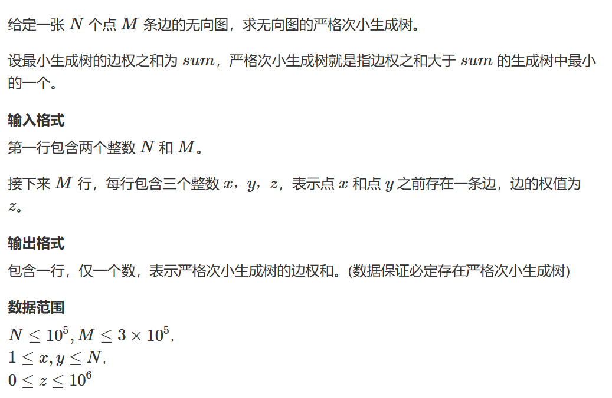
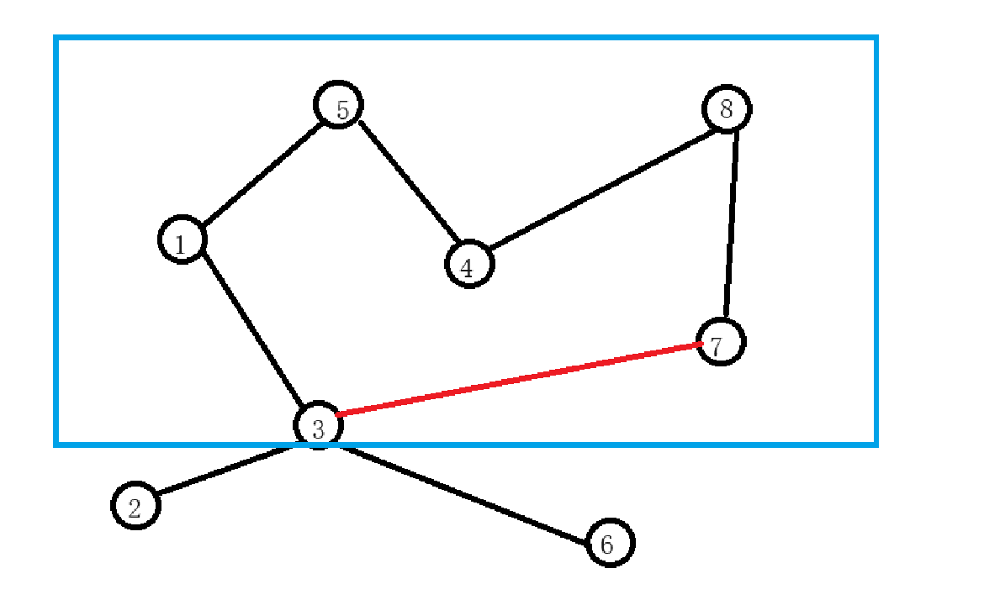
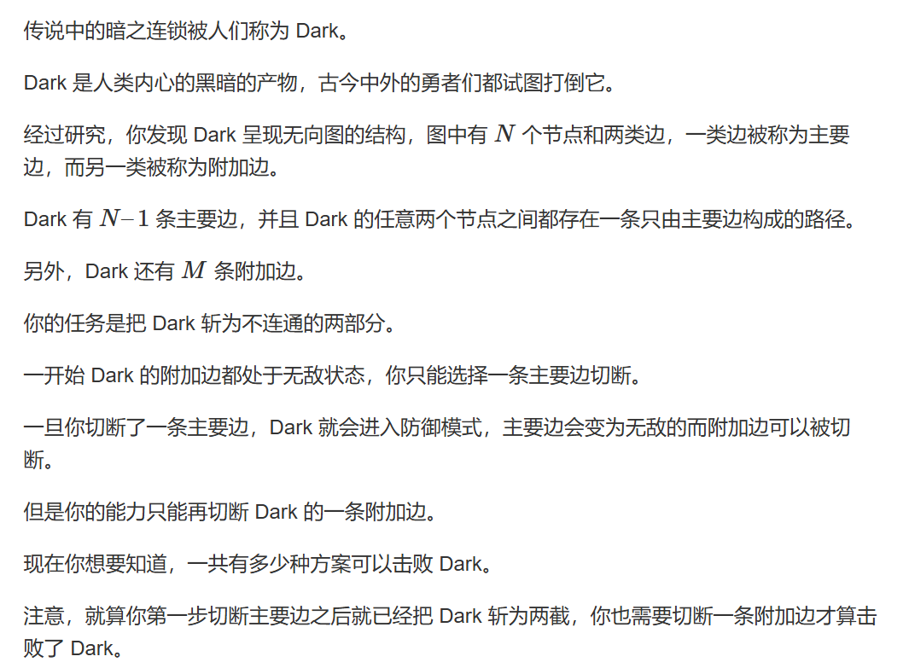
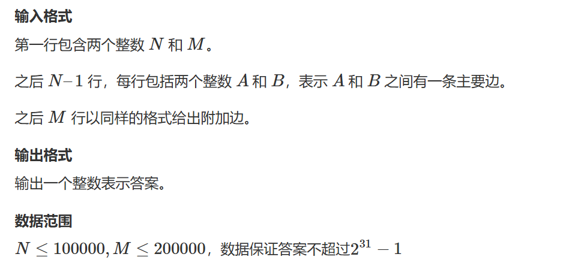
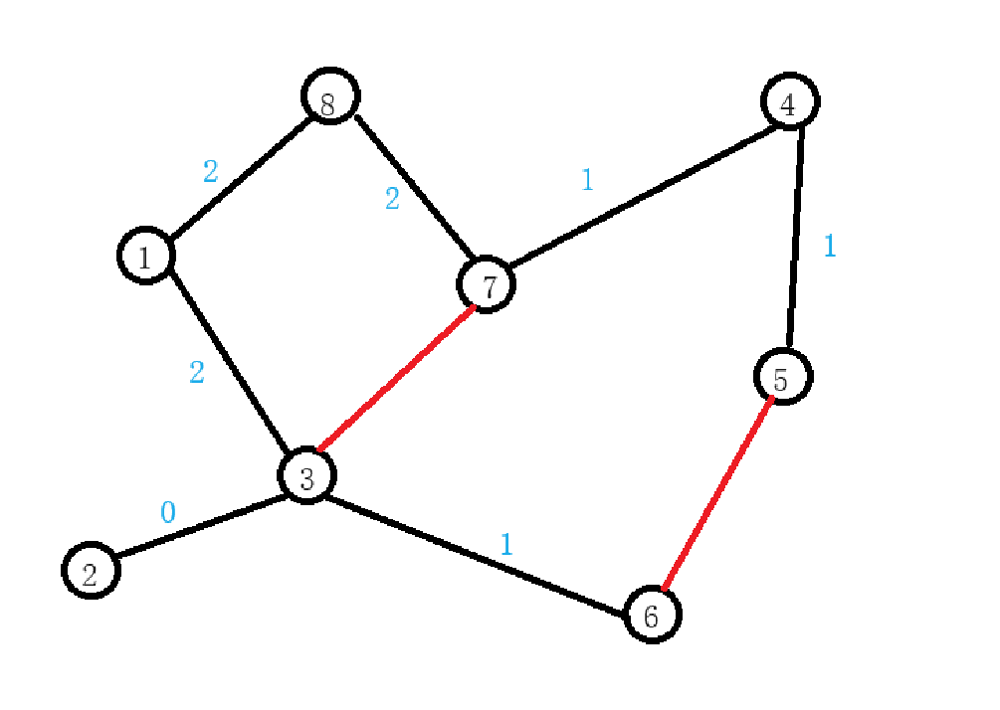

# 最近公共祖先LCA

最近公共祖先也称LCA常常用于与树相关的问题，例如有一棵树如下图：


对于每个节点，他的祖先包括它自己以及它的所有父节点，绿色节点由红色三角形标出，橙色节点的由蓝色三角形标出。根据定义，紫色节点为绿色节点与橙色节点的LCA，紫色节点为绿色节点与紫色节点的LCA。

那么我们如何寻找两个节点的LCA呢？以下题一先介绍稍简单的方法：

## 题一

时间复杂度：

预处理：$O(nlogn)$

查询：$O(logn)$

我们定义一个fa[i][j] 数组表示从 $i$ 节点开始跳（向上走） $2^k$ 步到达的节点编号，那么会发现 fa[j][k] = fa[fa[j][k-1]][k-1] 。

那我们查询的步骤是：

1. 先将两个点跳到同一层
2. 让两个点同时向上跳，一直跳到它们LCA的下一层

跳的方法是使用倍增枚举 $要跳的步数>=2^k$ 次逐步从多往少跳直到用二进制枚举匹配所有次数。


```cpp
#pragma GCC optimize(2)
#include <iostream>
#include <cstring>
#include <algorithm>
#include <queue>

const int N = 4E4 + 7;

int n, m;
int ne[2 * N], e[2 * N], h[N], idx;
int root;
int depth[N],fa[N][16];
//int dist[N];
void add(int a,int b)
{
	ne[idx] = h[a], e[idx] = b, h[a] = idx++;
}

void bfs(int root)	//用于预处理depth和fa数组
{
	//初始化depth数组
	memset(depth, 0x3f, sizeof depth);
	depth[0] = 0;	//设置的哨兵，以方便处理跳出根节点的情况
	depth[root] = 1;
	std::queue<int> q;
	q.push(root);
	while(q.size())
	{
		int t = q.front();
		q.pop();
		for(int i = h[t];~i;i=ne[i])
		{
			int j = e[i];
			if(depth[j]>depth[t] + 1)
			{
				depth[j] = depth[t] + 1;
				fa[j][0] = t;
				for (int k = 1; k <= 15; k++)
					fa[j][k] = fa[fa[j][k - 1]][k - 1];
				q.push(j);
			}
		}

	}

}

int lca(int a,int b)
{
	if (depth[a] < depth[b]) std::swap(a, b);
	for(int k = 15;k>=0;k--)
	{
		if (depth[fa[a][k]] >= depth[b])
			a = fa[a][k];
	}

	if (a == b) return a;
	for(int k = 15;k>=0;k--)
	{
		if(fa[a][k]!=fa[b][k])
		{
			a = fa[a][k];
			b = fa[b][k];
		}
	}
	return fa[a][0];
}

int main()
{
	std::ios::sync_with_stdio(false);
	std::cin.tie(0);
	std::cout.tie(0);
	memset(h, -1,sizeof h);
	std::cin >> n;
	for(int i = 0;i<n;i++)
	{
		int a, b;
		std::cin >> a >> b;
		if (b == -1) root = a;
		else
		{
			add(a, b);
			add(b, a);
		}
	}

	bfs(root);

	std::cin >> m;
	while(m--)
	{
		int a, b;
		std::cin >> a >> b;

		int p = lca(a, b);
		if (p == a) std::cout << "1\n";
		else if (p == b) std::cout << "2\n";
		else
		{
			std::cout << "0\n";
		}
	}
}
```

## 在线\离线LCA

在线和离线分别的意思是在线指问一次输出一次下一次数据会出现变化（比如上一题做法也就是倍增其实是在线做法），离线指在询问前已经将所有数据给出。

### 离线LCA（Tarjan算法）

时间复杂度：$O(n+m)$

在深度优先遍历时（从左到右），将所有点分成三大类（假设目前正在搜索红边组成的路径）：

1. 已经遍历过且回溯过的点（绿圈部分）。
2. 正在搜索的分支（红色路径部分）。
3. 还未搜索到的点（篮圈部分）。


在实际操作时，在DFS回退时会将已经遍历过的节点通过并查集合并到其父节点上，这个操作被称为缩点操作。


假设询问的是绿色节点与红色节点的距离，那么其距离就等于 
$$绿色节点到根节点的距离+红色节点到根节点的距离 - 2\times 两者LCA到根节点的距离$$

## 题二


```cpp
#pragma GCC optimize(2)
#include <iostream>
#include <algorithm>
#include <cstring>
#include <utility>
#include <vector>
const int N = 1e4 + 7;
int n, m;
using pii = std::pair<int, int>;
int ne[2 * N], e[2 * N],w[2*N], h[N], idx;
int p[N];
int st[N];
int dist[N];
std::vector<pii> query[N];	//first存查询的另一个点，second存查询编号
int res[2*N];

void add(int a,int b,int c)
{
	ne[idx] = h[a], e[idx] = b, w[idx] = c, h[a] = idx++;
}

void dfs(int u,int fa)	//提前预处理每个节点到根节点的距离
{
	for(int i = h[u];~i;i=ne[i])
	{
		int j = e[i];
		if(j == fa) continue;
		dist[j] = dist[u] + w[i];
		dfs(j, u);
	}
}

int find(int x)	//并查集
{
	if (p[x] != x) p[x] = find(p[x]);
	return p[x];
}

void tarjan(int u)
{
	st[u] = 1;
	for(int i = h[u];~i;i = ne[i])
	{
		int j = e[i];
		if(!st[j])
		{
			tarjan(j);
			p[j] = u;	//并查集找到该点的父节点
		}
	}

	for (auto t : query[u])
	{
		int y = t.first,id = t.second;
		if(st[y] == 2)
		{
			int anc = find(y);	//并查集缩点，将回退过的点合并到其父节点身上，只有涉及到询问的点会被缩点，其余点不会受到影响
			res[id] = dist[u] + dist[y] - dist[anc] * 2;
		}
	}

	st[u] = 2;
}

int main()
{
	std::ios::sync_with_stdio(false);
	std::cin.tie(0);
	std::cout.tie(0);

	std::cin >> n >> m;
	memset(h, -1, sizeof h);	
	for(int i = 0;i<n-1;i++)
	{
		int x, y, k;
		std::cin >> x >> y >> k;
		add(x, y, k);
		add(y, x, k);
	}
	for(int i = 0;i<m;i++)	//先将所有询问存好，在tarjan时才能处理问询
	{
		int x, y;
		std::cin >> x >> y;
		query[x].push_back({ y,i });
		query[y].push_back({ x,i });
	}
	for (int i = 1; i <= n; i++) p[i] = i;	//并查集初始化
	dfs(1, -1);
	tarjan(1);
	for (int i = 0; i < m; i++) std::cout << res[i] << "\n";
}
```

## 题三



此题和题目“秘密的奶牛运输” 都是求严格次小生成树，区别在于数据量的不同，前者因为点的数量只有 $500$ 所以开了二维数组去dfs暴力寻找两点之间的最短和次短边。

其实思路很明确，在此题中，使用了LCA 去优化寻找最大边的过程。



假设上图黑边是最小生成树树边，当我们加入3 <---> 7这条非树边时，我们会在蓝色边框区域形成一个环，此时如果要一个严格次小生成树，我们就需要去掉在蓝色边框中黑边中严格不等于红边的最大边。

LCA的做法就是在做LCA的同时记录每个点跳$2^k$ 步后的最大边和次大边。

```cpp
#pragma GCC optimize(2)
#include <iostream>
#include <cstring>
#include <algorithm>
#include <vector>
#include <queue>
using ll = long long;
const int N = 1e5 + 7,M = 3e5+7,INF = 0x3f3f3f3f;
std::vector<int> usededge;	//用于存储使用过的边
std::queue<int> q;
int ne[2 * N], e[2 * N], h[N],w[2*N], idx;	//链式前向星用于储存生成的最小生成树
int p[N],depth[N],fa[N][17],d1[N][17],d2[N][17];	//LCA存储最小边以及次小边
//int q[N];
int n, m;
struct Edge
{
	int a;
	int b;
	int w;
	bool ifused;
	bool operator<(const Edge& t)
	{
		return w < t.w;
	}
}edges[M];

int find(int x)	//并查集
{
	if (p[x] != x) p[x] = find(p[x]);
	return p[x];
}

void add(int a,int b,int c)
{
	ne[idx] = h[a], e[idx] = b, w[idx] = c, h[a] = idx++;
}

ll kruskal()	//kruskal先行形成最小生成树并且储存使用过的边
{
	for (int i = 1; i <= n; i++) p[i] = i;
	std::sort(edges, edges + m);
	ll ans = 0;

	for(int i = 0;i<m;i++)
	{
		int a = edges[i].a, b = edges[i].b, w = edges[i].w;
		int fa = find(a), fb = find(b);
		if(fa!=fb)
		{
			p[fa] = fb;
			ans += w;
			edges[i].ifused = true;
			usededge.push_back(i);
		}
	}
	return ans;
}

void build()	//建立最小生成树
{
	memset(h, -1, sizeof(int) * (n + 4));
	for(auto& t: usededge)
	{
		int a = edges[t].a, b = edges[t].b, w = edges[t].w;
		add(a, b, w);
		add(b, a, w);
	}
}

void bfs()	//bfs建立最小生成树的LCA，为了防止爆栈不使用dfs
{
	std::memset(depth, 0x3f, sizeof(int) * (n + 4));	//初始化depth数组
	depth[0] = 0,depth[1] = 1;	//设置哨兵并以1为根节点
	q.push(1);
	while(!q.empty())
	{
		int t = q.front();
		q.pop();
		for(int i = h[t];~i;i = ne[i])
		{
			int j = e[i];
			if(depth[j]>depth[t] + 1)	//如果此深度没有被标记我们即将其加入
			{
				depth[j] = depth[t] + 1;
				q.push(j);
				fa[j][0] = t;	//设置这个点的父节点是谁
				d1[j][0] = w[i], d2[j][0] = -INF;	//初始化以j节点为起点，向上走2的k次方步以后的最小边和次小边
				for(int k = 1;k<=16;k++)	//开始向上走，并更新相关节点的LCA以及最小边和次小边的值
				{
					int anc = fa[j][k - 1];
					fa[j][k] = fa[anc][k - 1];
					int distance[4] = { d1[j][k - 1],d2[j][k - 1],d1[anc][k - 1],d2[anc][k - 1] };	//将向上跳的节点值都取出来，然后更新我们的最小边和次小边
					d1[j][k] = d2[j][k] = -INF;
					for(int u=0;u<4;u++)
					{
						int d = distance[u];
						if (d > d1[j][k]) d2[j][k] = d1[j][k], d1[j][k] = d;
						else if (d != d1[j][k] && d > d2[j][j]) d2[j][k] = d;
					}
				}
			}
		}
	}

}

int lca(int a,int b,int w)
{
	static int distance[2 * N];	//声明静态数组用来存储所有被找出的最小边和次小边
	//（不要去纠结这个static，在此题中你不加或者将数组声明为全局变量都可以
	//这里理解为y总炫了一个没啥意义的技
	//static只是延长了这个数组的生命周期至程序关闭
	//每次初始化相当于cnt归零来进行的）
	int cnt = 0;

	if (depth[a] < depth[b]) std::swap(a, b);
	for(int k = 16;k>=0;k--)	//先让深层的跳到和浅层同一层
	{
		if (depth[fa[a][k]] >= depth[b])
		{
			distance[cnt++] = d1[a][k];
			distance[cnt++] = d2[a][k];
			a = fa[a][k];
		}
	}
	if(a!=b)	//如果两者之间b不为a的祖先，那么a、b两点同时向上跳，同时将最大值和次大值放到distance数组中
	{
		for(int k = 16;k>=0;k--)
		{
			if(fa[a][k]!=fa[b][k])
			{
				distance[cnt++] = d1[a][k];
				distance[cnt++] = d2[a][k];
				distance[cnt++] = d1[b][k];
				distance[cnt++] = d2[b][k];
				a = fa[a][k], b = fa[b][k];
			}
		}
		//最后一跳很可能没被记录，这里别忘了记录
		distance[cnt++] = d1[a][0];
		distance[cnt++] = d1[b][0];
	}

	int dist1 = -INF, dist2 = -INF;

	for(int i = 0;i<cnt;i++)
	{
		if (distance[i] > dist1) dist2 = dist1, dist1 = distance[i];
		else if (distance[i] != dist1 && distance[i] > dist2) dist2 = distance[i];
	}
	//返回的值的含义为加上这条边后在环中去掉一条严格不等于这条边长度的最大值
	if (w > dist1) return w - dist1;
	if (w > dist2) return w - dist2;
	return INF;
}

int main()
{
	std::ios::sync_with_stdio(false);
	std::cin.tie(0);
	std::cout.tie(0);

	std::cin >> n >> m;
	
	for(int i = 0;i<m;i++)
	{
		int a, b, c;
		std::cin >> a >> b >> c;
		edges[i] = { a,b,c };
	}
	ll sum = kruskal();
	build();
	bfs();

	ll res = 1e18;
	for(int i = 0;i<m;i++)
	{
		if(!edges[i].ifused)	//枚举不在树上的边集，假设加上这条边去掉a - b之间的严格最大边的答案
		{
			int a = edges[i].a, b = edges[i].b, w = edges[i].w;
			res = std::min(res,sum + lca(a,b,w));	//根据公式 sum + w - wi ，lca求出的部分是 w - wi
		}
	}
	std::cout << res;
}
```

## 题四




题意：给一个由主要边和附加边构成的图，由主要边构成的图为一棵树，去掉一个主要边和附加边能使得图变成两个独立的连通图即为一个合法方案。

题解：考虑树上差分，当从 a <---> b 含有一条直接的附加边时，将 a <---> b 路径上的主要边权值 +1 ，然后开始切主要边（$m$为附加边的个数），如若$主要边边权\begin{cases}
	=1 ---> ans += 1\\
	=0 ---> ans += m\\
	>1 ---> ans +=0
\end{cases}$

假设黑边为主要边，红边为附加边，那么最终边的权值可能（取决于你以谁为根节点建树）如下：



```cpp
#pragma GCC optimize(2)
#include <iostream>
#include <cstring>
#include <vector>
#include <queue>
#include <algorithm>

const int N = 1E5 + 7, M = 2e5 + 7;

int h[N], ne[M], e[M], idx;
int depth[N], fa[N][17];
std::queue<int> q;
int p[N];
int d[N];
int n, m;
int ans;
void add(int a,int b)
{
	ne[idx] = h[a], e[idx] = b,h[a] = idx++;
}

void bfs()	//bfs初始化LCA
{
	memset(depth, 0x3f, sizeof(int) * (n + 4));
	depth[0] = 0, depth[1] = 1;
	q.push(1);
	while (q.size())
	{
		int t = q.front();
		q.pop();
		for(int i = h[t];~i;i=ne[i])
		{
			int j = e[i];
			if(depth[j]>depth[t] + 1)
			{
				depth[j] = depth[t] + 1;
				q.push(j);
				fa[j][0] = t;
				for(int k = 1;k<=16;k++)
				{
					fa[j][k] = fa[fa[j][k - 1]][k-1];
				}
			}
		}
	}
}

int lca(int a,int b)	//求两个节点之间的LCA（模板）
{
	if (depth[a] < depth[b]) std::swap(a, b);
	for(int k = 16;k>=0;k--)
	{
		if(depth[fa[a][k]]>=depth[b])
		{
			a = fa[a][k];
		}
	}
	if (a == b) return a;
	for(int k = 16;k>=0;k--)
	{
		if(fa[a][k]!=fa[b][k])
		{
			a = fa[a][k];
			b = fa[b][k];
		}
	}

	return fa[a][0];
}


int dfs(int u,int fa)	//dfs差分求该边的权值
{
	int res = d[u];
	for(int i = h[u];~i;i = ne[i])
	{
		int j = e[i];
		if(j!=fa)
		{
			int s = dfs(j, u);
			if (s == 0) ans += m;
			else if(s == 1) ans++;
			res += s;
		}
	}
	return res;
}

void solve()
{
	std::cin >> n >> m;
	memset(h, -1, sizeof(int)*(n + 4));
	for(int i = 0;i<n-1;i++)
	{
		int a, b;
		std::cin >> a >> b;
		add(a, b);
		add(b, a);
	}

	bfs();

	for(int i = 0;i<m;i++)
	{
		int a, b;
		std::cin >> a >> b;
		int p = lca(a, b);
		d[a]++;	//树上差分操作，在两个节点+t，在两者LCA-2t
		d[b]++;
		d[p] -= 2;
	}
    dfs(1,-1);
	std::cout << ans;
}

int main()
{
	std::ios::sync_with_stdio(false);
	std::cin.tie(0);
	std::cout.tie(0);
	solve();
}
```