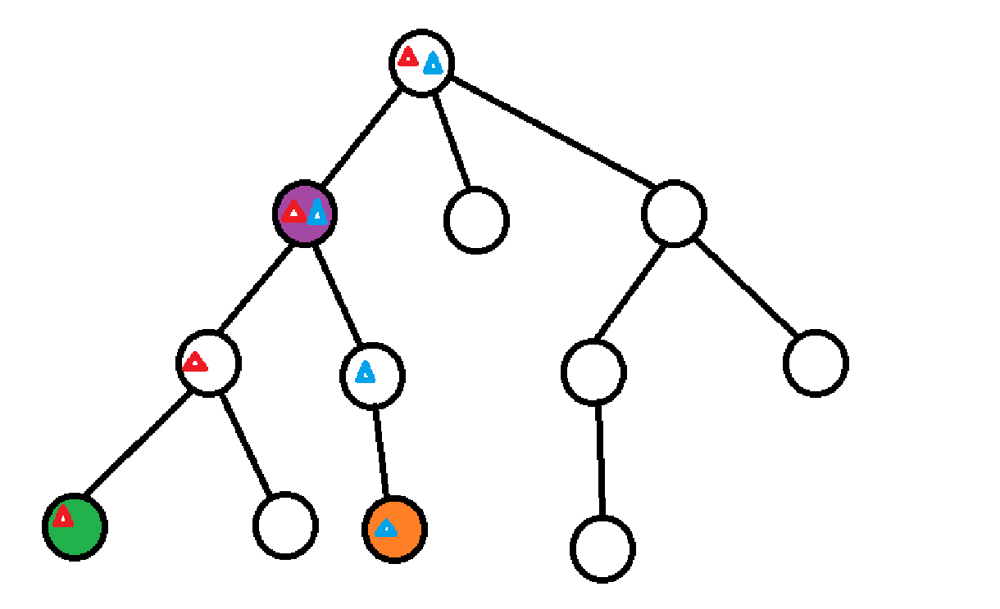
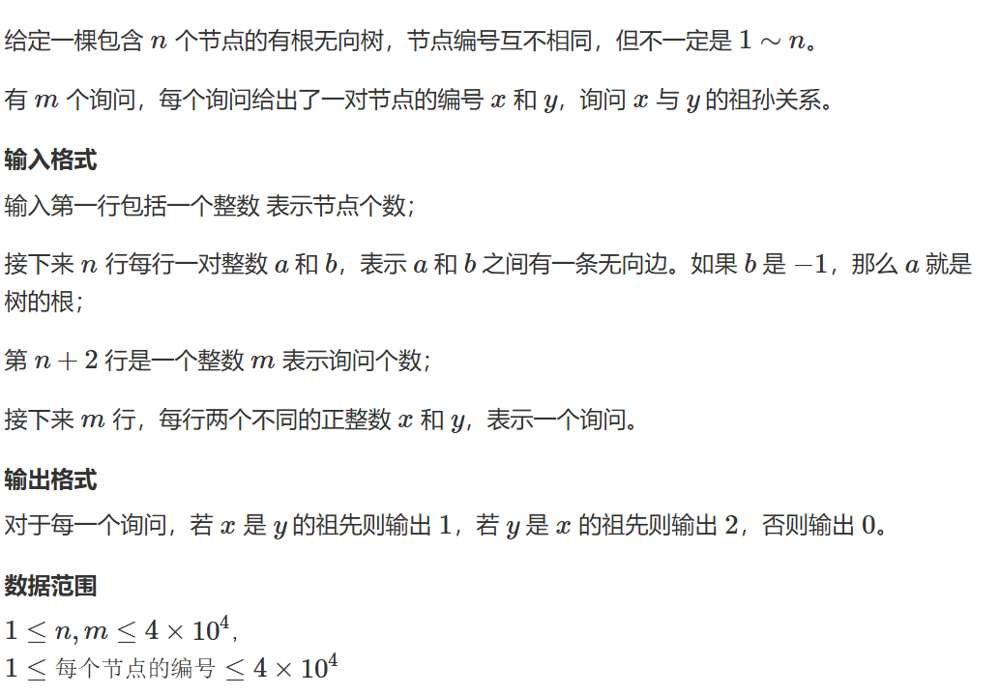
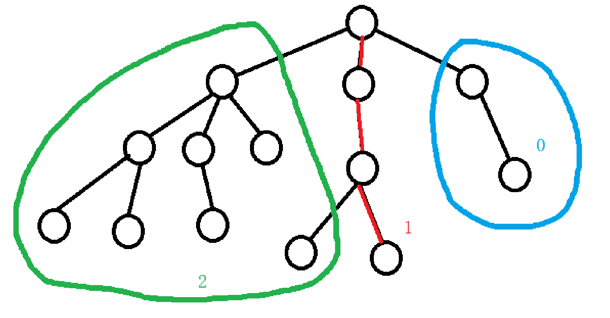
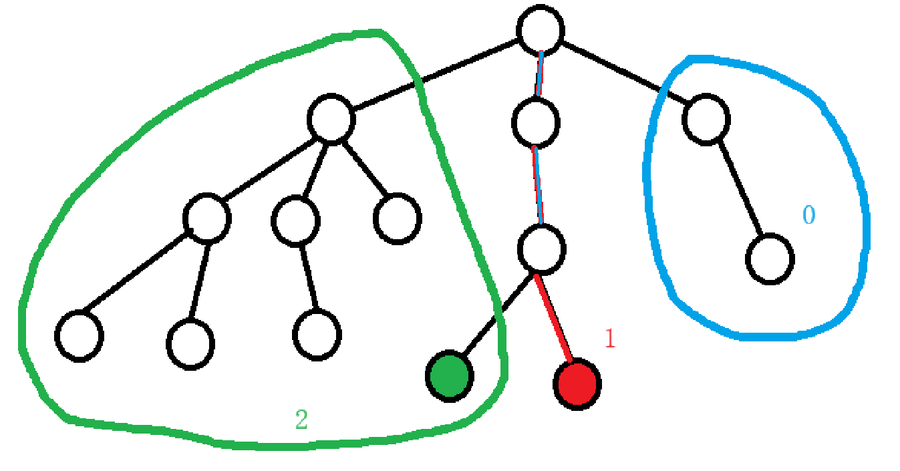
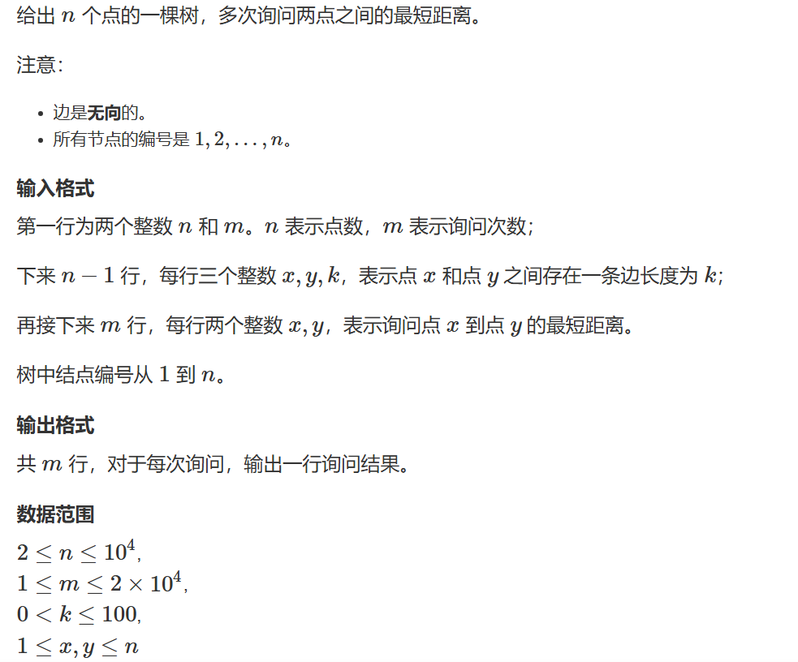

# 最近公共祖先LCA

最近公共祖先也称LCA常常用于与树相关的问题，例如有一棵树如下图：



对于每个节点，他的祖先包括它自己以及它的所有父节点，绿色节点由红色三角形标出，橙色节点的由蓝色三角形标出。根据定义，紫色节点为绿色节点与橙色节点的LCA，紫色节点为绿色节点与紫色节点的LCA。

那么我们如何寻找两个节点的LCA呢？以下题一先介绍稍简单的方法：

## 题一

时间复杂度：

预处理：$O(nlogn)$

查询：$O(logn)$

我们定义一个fa[i][j] 数组表示从 $i$ 节点开始跳（向上走） $2^k$ 步到达的节点编号，那么会发现 fa[j][k] = fa[fa[j][k-1]][k-1] 。

那我们查询的步骤是：

1. 先将两个点跳到同一层
2. 让两个点同时向上跳，一直跳到它们LCA的下一层

跳的方法是使用倍增枚举 $要跳的步数>=2^k$ 次逐步从多往少跳直到用二进制枚举匹配所有次数。



```cpp
#pragma GCC optimize(2)
#include <iostream>
#include <cstring>
#include <algorithm>
#include <queue>

const int N = 4E4 + 7;

int n, m;
int ne[2 * N], e[2 * N], h[N], idx;
int root;
int depth[N],fa[N][16];
//int dist[N];
void add(int a,int b)
{
	ne[idx] = h[a], e[idx] = b, h[a] = idx++;
}

void bfs(int root)	//用于预处理depth和fa数组
{
	//初始化depth数组
	memset(depth, 0x3f, sizeof depth);
	depth[0] = 0;	//设置的哨兵，以方便处理跳出根节点的情况
	depth[root] = 1;
	std::queue<int> q;
	q.push(root);
	while(q.size())
	{
		int t = q.front();
		q.pop();
		for(int i = h[t];~i;i=ne[i])
		{
			int j = e[i];
			if(depth[j]>depth[t] + 1)
			{
				depth[j] = depth[t] + 1;
				fa[j][0] = t;
				for (int k = 1; k <= 15; k++)
					fa[j][k] = fa[fa[j][k - 1]][k - 1];
				q.push(j);
			}
		}

	}

}

int lca(int a,int b)
{
	if (depth[a] < depth[b]) std::swap(a, b);
	for(int k = 15;k>=0;k--)
	{
		if (depth[fa[a][k]] >= depth[b])
			a = fa[a][k];
	}

	if (a == b) return a;
	for(int k = 15;k>=0;k--)
	{
		if(fa[a][k]!=fa[b][k])
		{
			a = fa[a][k];
			b = fa[b][k];
		}
	}
	return fa[a][0];
}

int main()
{
	std::ios::sync_with_stdio(false);
	std::cin.tie(0);
	std::cout.tie(0);
	memset(h, -1,sizeof h);
	std::cin >> n;
	for(int i = 0;i<n;i++)
	{
		int a, b;
		std::cin >> a >> b;
		if (b == -1) root = a;
		else
		{
			add(a, b);
			add(b, a);
		}
	}

	bfs(root);

	std::cin >> m;
	while(m--)
	{
		int a, b;
		std::cin >> a >> b;

		int p = lca(a, b);
		if (p == a) std::cout << "1\n";
		else if (p == b) std::cout << "2\n";
		else
		{
			std::cout << "0\n";
		}
	}
}
```

## 在线\离线LCA

在线和离线分别的意思是在线指问一次输出一次下一次数据会出现变化（比如上一题做法也就是倍增其实是在线做法），离线指在询问前已经将所有数据给出。

### 离线LCA（Tarjan算法）

时间复杂度：$O(n+m)$

在深度优先遍历时（从左到右），将所有点分成三大类（假设目前正在搜索红边组成的路径）：

1. 已经遍历过且回溯过的点（绿圈部分）。
2. 正在搜索的分支（红色路径部分）。
3. 还未搜索到的点（篮圈部分）。



在实际操作时，在DFS回退时会将已经遍历过的节点通过并查集合并到其父节点上，这个操作被称为缩点操作。



假设询问的是绿色节点与红色节点的距离，那么其距离就等于 
$$绿色节点到根节点的距离+红色节点到根节点的距离 - 2\times 两者LCA到根节点的距离$$

## 题二



```cpp
#pragma GCC optimize(2)
#include <iostream>
#include <algorithm>
#include <cstring>
#include <utility>
#include <vector>
const int N = 1e4 + 7;
int n, m;
using pii = std::pair<int, int>;
int ne[2 * N], e[2 * N],w[2*N], h[N], idx;
int p[N];
int st[N];
int dist[N];
std::vector<pii> query[N];	//first存查询的另一个点，second存查询编号
int res[2*N];

void add(int a,int b,int c)
{
	ne[idx] = h[a], e[idx] = b, w[idx] = c, h[a] = idx++;
}

void dfs(int u,int fa)	//提前预处理每个节点到根节点的距离
{
	for(int i = h[u];~i;i=ne[i])
	{
		int j = e[i];
		if(j == fa) continue;
		dist[j] = dist[u] + w[i];
		dfs(j, u);
	}
}

int find(int x)	//并查集
{
	if (p[x] != x) p[x] = find(p[x]);
	return p[x];
}

void tarjan(int u)
{
	st[u] = 1;
	for(int i = h[u];~i;i = ne[i])
	{
		int j = e[i];
		if(!st[j])
		{
			tarjan(j);
			p[j] = u;	//并查集找到该点的父节点
		}
	}

	for (auto t : query[u])
	{
		int y = t.first,id = t.second;
		if(st[y] == 2)
		{
			int anc = find(y);	//并查集缩点，将回退过的点合并到其父节点身上，只有涉及到询问的点会被缩点，其余点不会受到影响
			res[id] = dist[u] + dist[y] - dist[anc] * 2;
		}
	}

	st[u] = 2;
}

int main()
{
	std::ios::sync_with_stdio(false);
	std::cin.tie(0);
	std::cout.tie(0);

	std::cin >> n >> m;
	memset(h, -1, sizeof h);	
	for(int i = 0;i<n-1;i++)
	{
		int x, y, k;
		std::cin >> x >> y >> k;
		add(x, y, k);
		add(y, x, k);
	}
	for(int i = 0;i<m;i++)	//先将所有询问存好，在tarjan时才能处理问询
	{
		int x, y;
		std::cin >> x >> y;
		query[x].push_back({ y,i });
		query[y].push_back({ x,i });
	}
	for (int i = 1; i <= n; i++) p[i] = i;	//并查集初始化
	dfs(1, -1);
	tarjan(1);
	for (int i = 0; i < m; i++) std::cout << res[i] << "\n";
}
```
