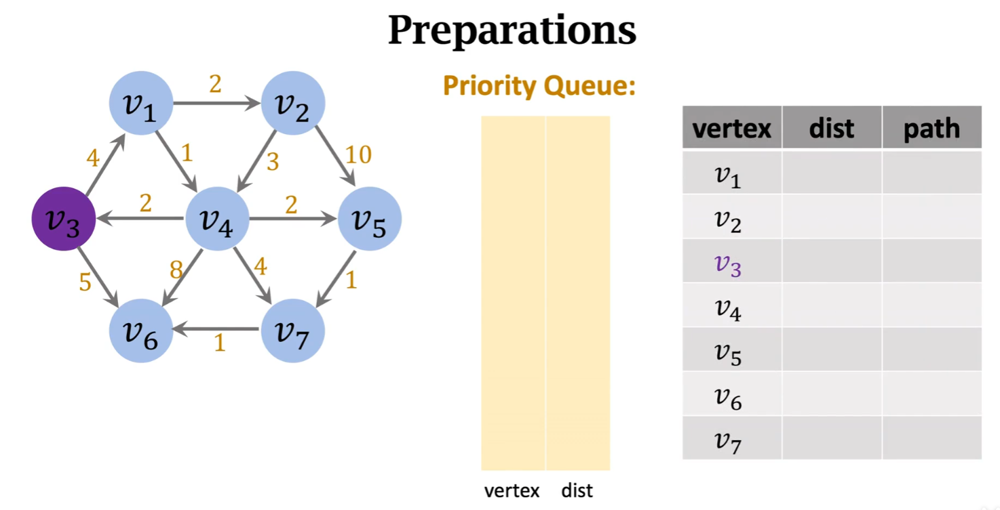
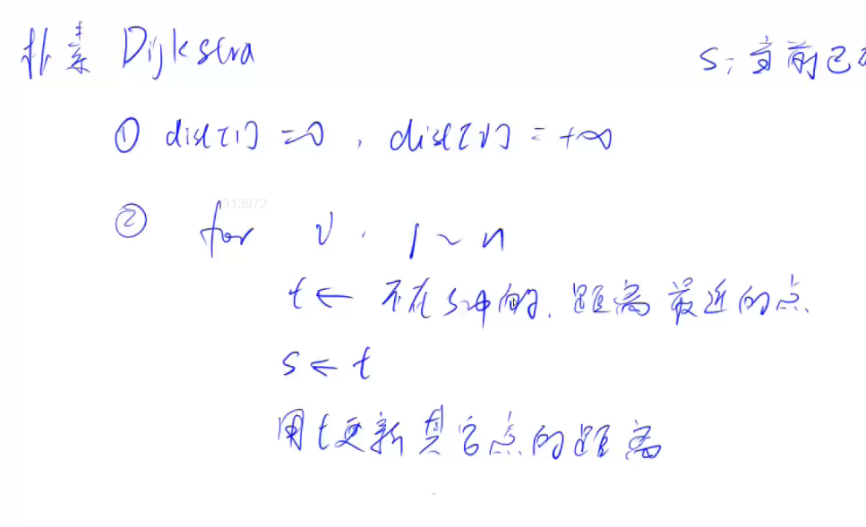

# 有权图的最短路问题
## 单元最短路问题 —— 给定起点和终点

这里介绍Dijkstra's Algorithm      
## Dijkstra's Algorithm
***

我们需要一个优先队列——以距离头节点的距离来排序输出，以及常用的图队列等等。   
流程：   
1. 初始化：dist设置为正无穷，path设置为0。   
2. 优先队列<--v3，dist[v3] = 0 起点到起点的距离为0
3. 遍历v3的邻接表，如果dist[vn] < d[vn] ，如题4小于正无穷，更新距离为4，path[v1] = v3，此时找到一个更短的队列，就将v1插入到优先队列中。     


对于用t更新其他点的距离意思就是—— std::min(dist[t] + d, dist[x])，**原点到点x的距离** 与 **t点到原点的距离加上t点到x的距离** 哪个更小     
代码如下：
```cpp
#include <iostream>
#include <queue>
#include <utility>
#include <cstring>
int  n, m;
const int N = 1000010;
int h[N], e[N], next[N],idx,w[N];
int dist[N];
using PII = std::pair<int, int >;
bool st[N];
void add(int a,int b,int c)
{
	e[idx] = b, w[idx] = c, next[idx] = h[a], h[a] = idx++;
}

int dijkstra()
{
	memset(dist, 0x3f, sizeof dist);
	dist[1] = 0;

	std::priority_queue<PII, std::vector<PII>, std::greater<PII>> heap;		//距离，编号

	heap.push({0,1});
	while(heap.size())
	{
		auto t = heap.top();
		heap.pop();

		int ver = t.second, distance = t.first;
		if(st[ver]) continue;
		st[ver] = true;
	
		for(int  i =h[ver];i!=-1;i = next[i])
		{
			int j = e[i];
			if (dist[j] > (dist[ver] + w[i]))
			{
				dist[j] = distance + w[i];
				heap.push({ dist[j],j });
			}
		}
	}
	if (dist[n] == 0x3f3f3f3f) return -1;
	else return dist[n];
}

int main()
{
	memset(h, -1, sizeof h);
	
	std::cin >> n >> m;
	while(m--)
	{
		int a, b, c;
		std::cin >> a >> b >> c;
		add(a, b, c);
	}
	std::cout << dijkstra();
}
```

## Bellman-Ford


