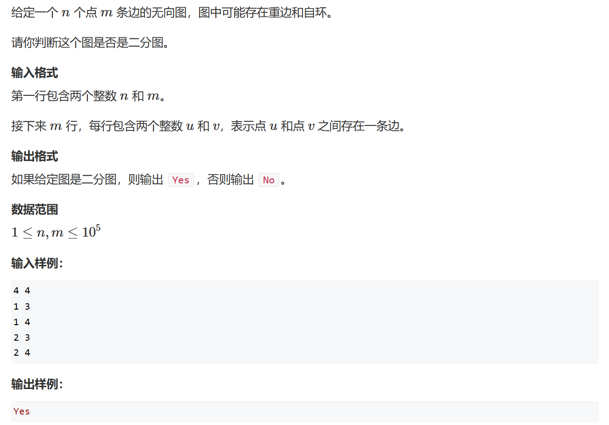

# 染色法判断二分图
时间复杂度 O(n+m)   

一个图当且仅当可以被2-染色，那么它是二分图    
或者说    
二分图当且仅当图中不含奇数环（奇数环指环的边数是奇数）   
简单来说：相邻的节点一定不属于一个集合   

由于图中不含有奇数环，所以我们可以通过DFS或BFS来对每个节点进行遍历染色，染色过程中也一定不会有矛盾    
核心伪代码：
```
for(int i = 1;i<=n;i++)
{
    if(i未被染色)
        dfs(i,1);     //利用深度优先遍历吧i所在的连通块整个染成1号颜色
}
```
***
```cpp
#include <iostream>
#include <cstring>

const int N = 100010;
int h[N], e[N*2], next[N*2],color[N], idx, n, m;	//color分 0 —— 未染色，1 —— 红色，2 —— 黑色
void add(int a, int b)
{
	e[idx] = b, next[idx] = h[a], h[a] = idx++;
}
bool dfs(int index,int cls)
{
	color[index] = cls;	//点index染成cls色

	
	for(int i =h[index];i!=-1;i=next[i])	//遍历和index相邻的点
	{
		int j = e[i];
		if(!color[j])	//如果相邻的点没有染色，我们将其染成另一个颜色，同时检查相邻的点的相邻的点
		{
			if(!dfs(j,3-cls)) return false;
		}
		else if (color[j] == cls) return false;		//如果染色，检查是否重色，重色则不是二分图
	}
	return true;	//如果遍历完图后没有出现矛盾，则说明是二分图
}

int main()
{
	std::memset(h, -1, sizeof h);
	std::cin >> n >> m;

	while(m--)		//无向图，需要赋两次相向边
	{
		int a, b;
		std::cin >> a >> b;
		add(a, b);
		add(b, a);
	}
	bool flag = true;	//用于判断是否矛盾
	for(int i =1;i<=n;i++)
	{
		if (!color[i])
			if(!dfs(i,1))	//染色的同时判断是否矛盾
			{
				flag = false;
				break;
			}
	}
	if (flag) std::cout << "Yes";
	else std::cout << "No";
}
```