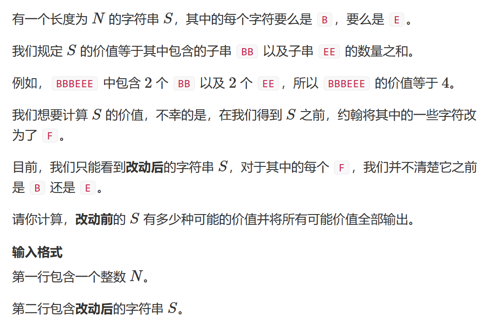
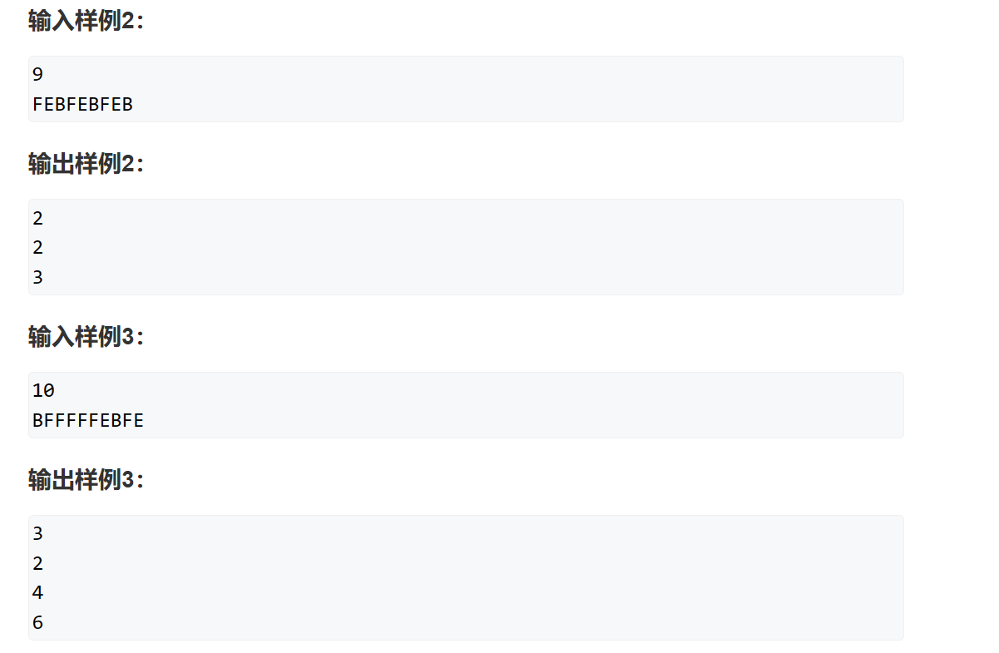
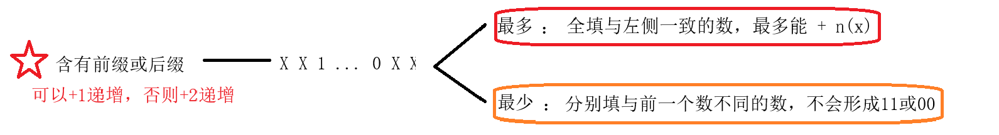
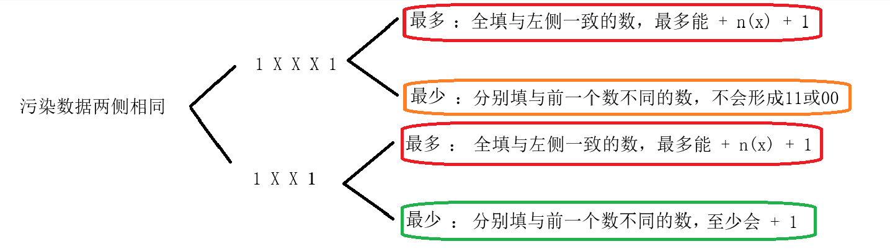
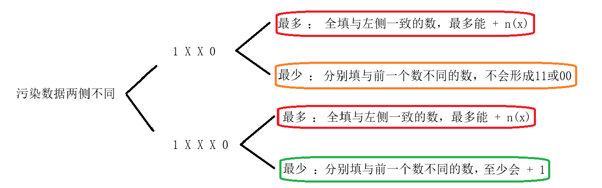

# 涉及算法


## 题一





思路：分类讨论

将问题抽象为01二进制问题，那么问题就变为已知部分位置的数，部分不知道，求有几种组合方式并输出连续组11与00的个数和。

分类讨论：





代码有点啰嗦，可以的同学可以根据思路优化：

```cpp
#pragma GCC optimize(2)
#include <iostream>

std::string str;
int n;

int main()
{
	std::ios::sync_with_stdio(false);
	std::cin.tie(0);
	std::cout.tie(0);

	std::cin >>n>> str;
	int i = 0;
	int lenth = 0;
	bool doubleif = true;
	int minValue = 0, maxValue;
	for (i = 0; i < str.size(); i++)
		if (str[i] != 'F')
		{
			break;
		}
	if (i != 0) doubleif = false;
	if(i==n)
	{
		maxValue = i - 1;
	}
	else
	minValue = 0, maxValue = i;
	
	for(i=i+1;i<str.size();i++)
	{
		if (str[i] != 'F')
		{
			if(lenth!=0&&str[i]==str[i-lenth-1])
			{
				maxValue += lenth + 1;
				if(!(lenth%2))
				{
					++minValue;
				}
				lenth = 0;
			}
			if(lenth!=0&&str[i]!=str[i-lenth-1])
			{
				maxValue += lenth;
			
				if (lenth % 2)
				{
					++minValue;
				}
				lenth = 0;
			}
			if(str[i] == str[i-1]) ++minValue, ++maxValue;
		}
		else ++lenth;
		
	}
	if (lenth != 0)
	{
		doubleif = false;
		maxValue += lenth;
	}
	
	if (doubleif)
	{
		std::cout << (maxValue - minValue + 2) / 2 << std::endl;
		for (int j = minValue; j <= maxValue; j += 2) std::cout << j << std::endl;
	}
	else
	{
		std::cout << (maxValue - minValue + 1)  << std::endl;
		for (int j = minValue; j <= maxValue; j++) std::cout << j << std::endl;
	}
}
```
