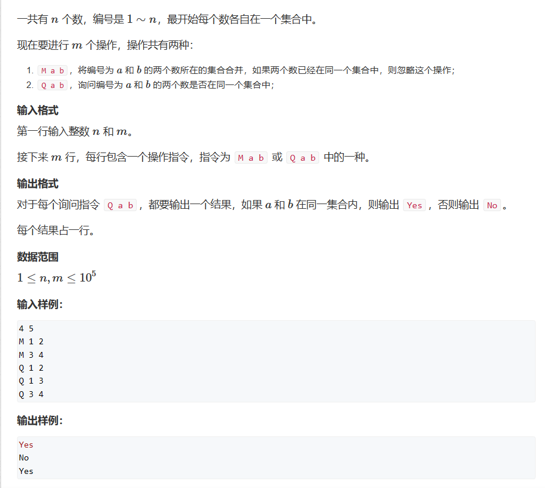

# 并查集
并查集主要处理两个问题：   
1. 将两个集合合并   
2. 询问两个元素是否在一个集合当中   

并查集的基本原理：每一个集合用一棵树来表示，树根的编号就是整个集合的编号 p[x] = x 。每个节点储存它的父节点，p[x]表示x的父节点  

并查集要处理的三个主要问题：   
问题1：如何判断树根？    
if(p[x]==x)    
问题2：如何求x的集合编号？   
while(p[x]!=x) x=p[x]   
问题3：如何合并两个集合？    
p[x]是x的集合编号，p[y]是y的集合编号-> p[x] = y    
## 题一

```cpp
#include <iostream>

const int N = 100010;
int father[N];
int find(int x) //返回x所在树的根节点 + 路径压缩
{
	if (father[x] != x) return find(father[x]);
	return father[x];
}
int main()
{
	int n, m;
	std::cin >> n >> m;
	for(int i =1;i<=n;++i)
	{
		father[i] = i;
	}
	char p;
	int a, b;
	while(m--)
	{
		std::cin >> p;
		std::cin >> a >> b;

		if(p=='M')
		{
            if(find(a)==find(b))    //优化，避免多次连接难以维护树
		        continue;
			father[find(a)] = find(b);
		}
		else
		{
			if (find(a) == find(b))
				std::cout << "Yes" << std::endl;
			else
				std::cout << "No" << std::endl;
		}
		
	}
}
```
## 题二

何谓连通块，其实和题一一个道理，只不过将集合抽象成一个连通块而已，此题多了一个size的维护，因为其答案只与根节点有关，我们维护根节点的size值即可。
```cpp
#include <iostream>
#include <string>
const int N = 100010;
int father[N],size[N];
int find(int x) //返回x所在树的根节点 + 路径压缩
{
	if (father[x] != x) father[x] = find(father[x]);
	return father[x];
}
int main()
{
	int n, m;
	std::cin >> n >> m;
	for(int i =1;i<=n;++i)
	{
		father[i] = i;
		size[i] = 1;
	}
	std::string p;
	int a, b;
	while(m--)
	{
		std::cin >> p;
		

		if(p=="C")
		{
			std::cin >> a >> b;
			if(find(a)==find(b)) continue;   //不可少，否则同一根节点反复连接后数量加倍
			size[find(b)] += size[find(a)];
			father[find(a)] = find(b);
		}
		else if(p=="Q1")
		{
			std::cin >> a >> b;
			if (find(a) == find(b))
				std::cout << "Yes" << std::endl;
			else
				std::cout << "No" << std::endl;
		}
		else
		{
			std::cin >> a;
			std::cout << size[find(a)] << std::endl;
		}
		
	}
}
```
## 题三

此题的巧妙之处是使用节点到根节点的距离对3取模的值来模拟食物链：   
distance % 3   
= 0 --->  与根节点同类   
= 1 --->  捕食根节点    
= 2 --->  被根节点捕食    

第二个巧妙之处是判断谎话之处：   
1.当在同一食物链中时，按取模结果判断谎话与否，其中当其是捕食关系时，它们与根节点之间的差值为1，那么-1后再取模即可。    

2.当不在同一食物链中时，我们将其中一个食物链的根节点接入到另一个食物链中，如何保证食物链中的相对关系不变呢？那就要维护接入食物链的根节点到新的根节点的距离为整周期，也就是说相对食物链关系不变，比如当它们是同类时，那它们到新的根节点的距离应当相等（假设将X接入Y） <==> (distance[x] + distance[find(x)] - distance[y]) % 3 == 0 <==> 那么X的根节点到新的根节点的距离就 == distance[y] - distance[x]     

第三点需要注意的是find函数因为进行了路径压缩，那么我们维护distance时就需要将原父节点先记录下来。    
```cpp
#include <iostream>
#include <string>
const int N = 50010;
int father[N],distance[N],count = 0;
int find(int x)
{
	if (father[x] != x)
	{
		int u = father[x];  // u记录旧的父节点
		father[x] = find(father[x]); // 路径压缩，新父节点变成根节点了
		distance[x] += distance[u];  // x到新父节点的距离等于x到旧父节点的距离加上旧父节点到根节点的距离
	}
	return father[x];
}
int main()
{
	int n, m;
	std::cin >> n >> m;
	for(int i =1;i<=n;++i)
	{
		father[i] = i;
	}
	std::string p;
	int a, b;
	while(m--)
	{
		std::cin >> p;
		std::cin >> a >> b;
		if ( a > n || b > n) count++;
		else 
		{
			int px = find(a), py = find(b);
			if (p == "1")
			{
				if (px == py && (distance[a] - distance[b]) % 3) count++;
				else if(px!=py)
				{
					father[px] = py;
					distance[px] = distance[b] - distance[a];
				}
			}
			else
			{
				if (px == py && (distance[a] - distance[b] - 1) % 3) count++;
				else if (px != py)
				{
					father[px] = py;
					distance[px] = distance[b] - distance[a] + 1;
				}
			}
		} 
	}
	std::cout << count;
}
```