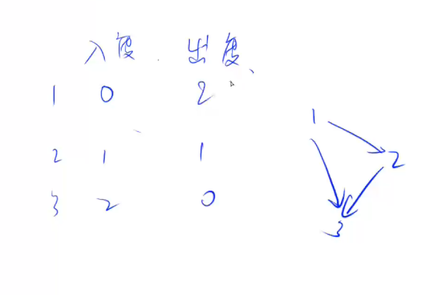

# 拓扑排序

有向图的拓扑序列就是宽度优先遍历的一个运用。    
什么是拓扑序列？    
可以理解为图中每一条路径都是升序排列、从前指向后的，如：1-->2-->3、1-->4-->9，但是2-->3-->1就不是。这同时也解释了无向图没有拓扑序列，有向无环图一定存在拓扑序列。     
## 度数
有向图的每个点都有两个读，一个是**入度**，一个是**出度**：    
**入度**：指有多少条边指向自己    
**出度**：指有多少条边从自己指出     
     
当入度为0时，没有指向自己的边，那么，它就可以作为括扑序列的起点。同样的，出度为0的节点就可以作为括扑序列的终点，这时我们算法的步骤就出来了：
```
queue<--入度为0的节点  //将入度为0的节点入列     
while(queue不空)
{
    t<--队头
    枚举t的所有出边t->j
    {
        删掉t->j == d[j]--
        if d[j] == 0
            queue<--j
    }
}
```
此题使用标准库提供的queue会出现问题，因为此题我们存入列表的元素并不能被删除，所以要么准备一份数组去额外储存存入的节点，要么使用数组模拟。
```cpp
#include <cstring>
#include <iostream>

const int N = 100010, M = 2 * N;
int n, m, idx;
int h[N];	//下标为图节点的编号，值为该编号的节点在数组的哪个位置
int e[M];	//储存值，此题就是节点的编号，下标是在数组中的位置
int ne[M];	//储存next值，下标是在数组中的位置
int d[N];	//记录入度，下标表示编号
int q[N];	//模拟列表
int hh, tt=-1;
void add(int a, int b)
{
	e[idx] = b, ne[idx] = h[a], h[a] = idx++;
}

bool topsort()
{
	for(int i = 1;i<=n;i++)
	{
		if(d[i]==0)
		{
			q[++tt] = i;
		}
	}
	
	while (hh <= tt)
	{
		int t = q[hh++];	//记录路径
		for (int i = h[t]; i != -1; i = ne[i])		//i为图中元素在数组模拟中的下标位置
		{
			int j = e[i];					//取出它在图中的编号
			d[j]--;
			if (d[j] == 0)					//判断入度是否为0
			{
				q[++tt] = j;
			}
		}
		for (int i = 0; i < tt; i++)
			std::cout << q[i]<<" ";
		std::cout << std::endl;
	}
	return tt == n - 1;
}
int main()
{
	std::cin >> n >> m;
	memset(h, -1, sizeof h);
	for(int i = 0;i<m;i++)
	{
		int a, b;
		std::cin >> a >> b;
		add(a, b);
		d[b]++;
	}
	if (topsort())
	{
		for (int i = 0; i < n; i++) {
			std::cout << q[i] << " ";
		}
	}
	else puts("-1");
}
```
