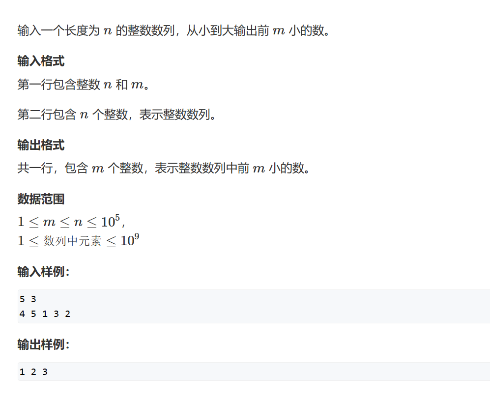
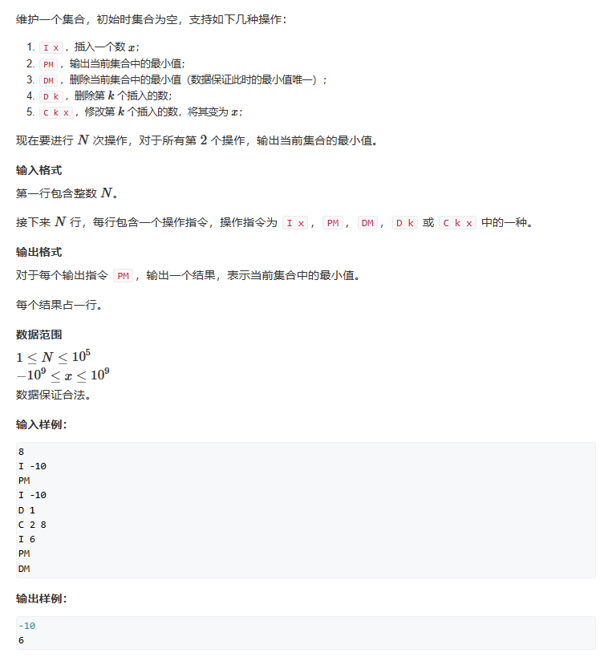

# 堆排序
堆的基本作用：    
1. 维护一个数据集合    
2. 求集合当中的最小值    
3. 删除最小值    
4. 删除任意一个元素    
5. 修改任意一个元素    

堆的本质：一棵完全二叉树，即除了最后一个节点，前面的节点都是满的，最后一个节点从左到右排序    
小根堆的性质：每一个点都是小于等于它的左右儿子，也就是说树根是整个堆的最小值    
存储方式：    
1. 连续数组    
2. 一号点为根节点    
3. x的左儿子为2x，x的右儿子为2x+1     
## 堆的两个基本操作   
### down(x) 
将节点下移：    
根节点与最小的儿子节点交换

### up(x)
将节点上移：    
如果根节点更大，儿子节点与根节点交换   

## 操作实现
### 插入一个数    
head[++size] = x;    
up[size];
### 求集合当中的最小值
head[1]
### 删除最小值
将最后一个元素赋值到根节点，然后down(x)     
head[1] = head[size--];     
down(1);
### 删除任意一个元素
head[k] = head[size--];    
up(k);     //因为覆盖后的值要么比根节点大，要么小，要么正好等于，所以执不执行由函数决定   
down(k); 
### 修改一个元素
head[k] = x;    
up(k);    
down(k);    


## 题一


根据题意，我们只需要将堆头取出，然后将堆头删除即可得到下一个最小值，所以我们只需要实现down()操作     
```cpp
#include <iostream>
#include <algorithm>

const int N = 100010;
int n, m;
int head[N], size = 1;
void down(int x)
{
	int temp = x;
	if (x * 2 <= size && head[x * 2] < head[x])
		temp = x * 2;
	if ((x * 2 + 1) <= size && head[x * 2 + 1] < head[temp])
		temp = x * 2 + 1;       //前两个if是为了求出x及其儿子节点哪个是最小值
	if(x!=temp)
	{
		std::swap(head[x], head[temp]);
		down(temp);
	}
}

int main()
{
	std::cin >> n >> m;
	for (int i = 1; i <= n; ++i)
		std::cin >> head[i];
	size = n;
	for (int i = n/2; i > 0; --i)   //初始化堆，根据堆的构成我们可以得知，n / 2正好指向最后一个有子节点，我们只需要对有子节点进行初始化就能初始化整个堆
		down(i);
	while(m--)
	{
		std::cout << head[1] << " ";
		head[1] = head[size--];
		down(1);
	}
}
```
### 法二优先队列
当然，如果你明白了堆排序的含义，那你会惊奇的发现这不就是优先队列吗？
```cpp
#include <iostream>
#include <queue>
#include <functional>

std::priority_queue<int,std::vector<int>,std::greater<int>> q;
int n, m;

int main()
{
	std::cin >> n >> m;
	while(n--)
	{
		int i;
		std::cin >> i;
		q.push(i);
	}
	while(m--)
	{
		std::cout << q.top() << " ";
		q.pop();
	}
}
```
## 题二

此题的难点在于如何处理 第 ‘k’ 个插入的元素，因为这个条件，我们需要额外增加记录堆元素对应的k值（是第几个插入的元素）—— hp[]，以及需要记录第k个插入的值在堆中的位置 —— ph[]，这将形成一个双向的关系，会混乱我们的思维，需要提前明白它们之间的对应关系。   
```cpp
#include <iostream>
#include <string>
#include <algorithm>

const int N = 100010;
int n,x,value;
int head[N], size = 0,idx=0, ph[N], hp[N]; //size用来记录堆的大小以及堆的插入，idx用来记录插入的顺序
void swap(int a, int b)		//注意a,b的含义是指向堆的位置
{
	//如何理解ph和hp:
	//hp[a] = A, hp[b] = B
	//ph[A] = ph[a], ph[B] = ph[b]
	//所以：ph[hp[a]] = hp[a], ph[hp[b]] = hp[b]
	std::swap(ph[hp[a]],ph[hp[b]]);		//找到堆中a,b对应的值是第几个插入的元素，然后交换它们在堆中的位置
	std::swap(hp[a],hp[b]);				//交换a,b位置
	std::swap(head[a],head[b]);			//交换a,b位置对应的值
	//三者位置可交换，因为本质上它们独立存在
}
void down(int x)
{
	int temp = x;
	if (x * 2 <= size && head[x * 2] < head[x])
		temp = x * 2;
	if ((x * 2 + 1) <= size && head[x * 2 + 1] < head[temp])
		temp = x * 2 + 1;
	if(x!=temp)
	{
		swap(x, temp);		//因为要交换的不仅是值，还必须交换值对应的信息
		down(temp);
	}
}

void up(int x)
{
	if(x>1 && head[x/2] > head[x])
	{
		swap(x, x/2);		//因为要交换的不仅是值，还必须交换值对应的信息
		up(x/2);
	}
}

int main()
{
	std::cin >> n;
	std::string str;
	while(n--)
	{
		std::cin >> str;
		if(str=="I")
		{
			std::cin >> value;
			head[++size] = value;
			ph[++idx] = size;	//存第idx插入的元素在堆的位置
			hp[size] = idx;		//存堆中此位置存的元素是第几个插入
			up(size);
		}else if(str=="PM")
		{
			std::cout << head[1] << std::endl;
		}else if(str == "DM")
		{
			swap(1, size--);
			down(1);
		}else if(str == "D")
		{
			std::cin >> x;	//此处有陷阱，我们不能在swap(ph[x])后继续使用ph[x]，因为此时它指向的head下标已经被交换，故必须提前记录ph[x]
			int k = ph[x];
			swap(ph[x], size--);
			down(k);
			up(k);
		}else
		{
			std::cin >> x >> value;
			head[ph[x]] = value;
			down(ph[x]);
			up(ph[x]);
		}
	}
}
```