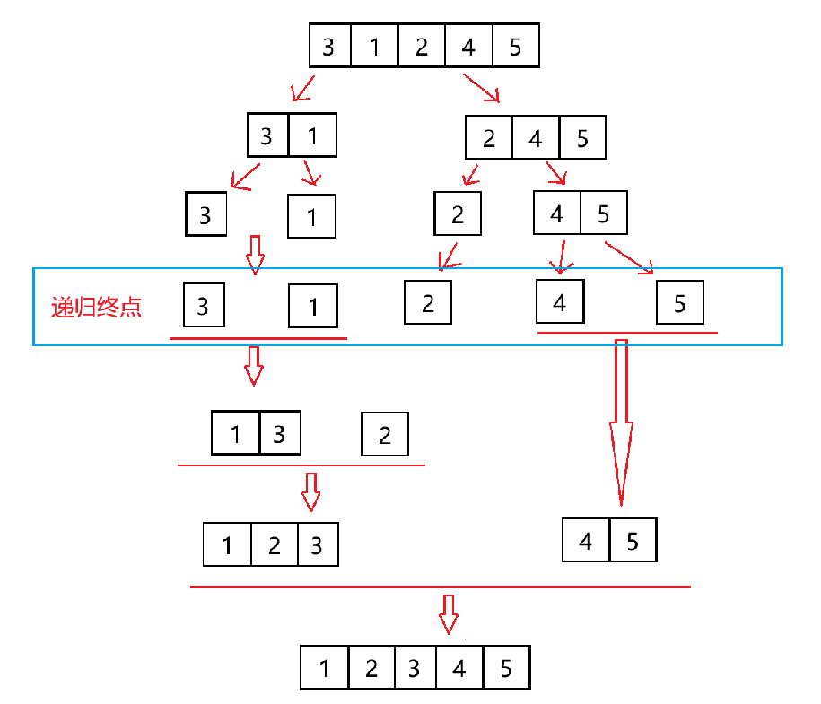
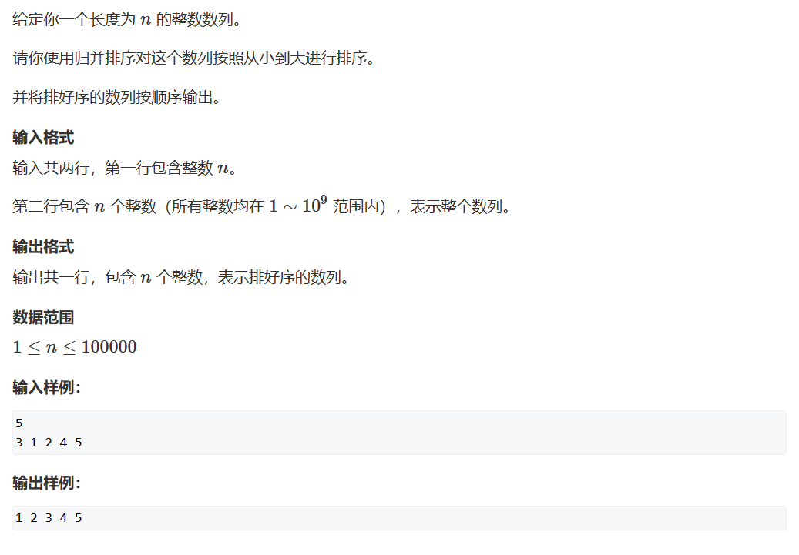
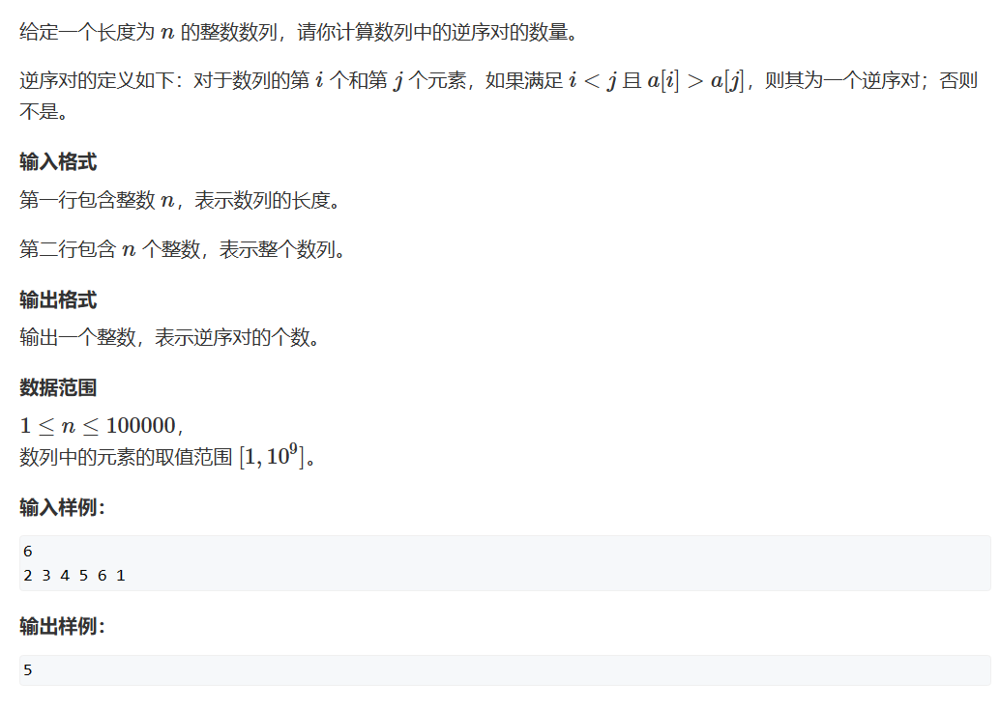
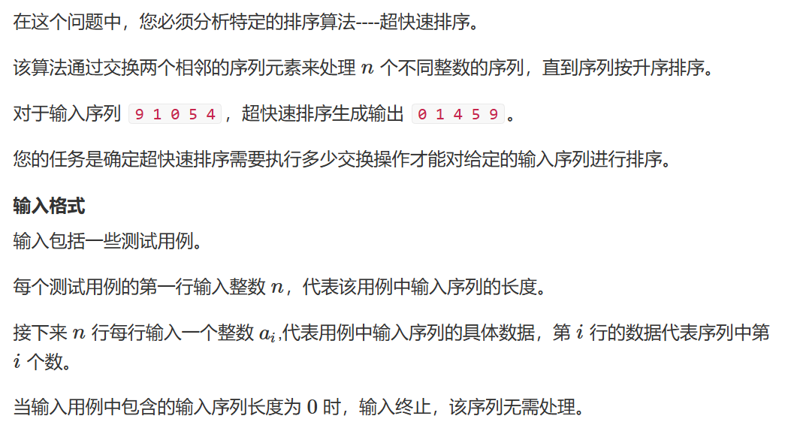
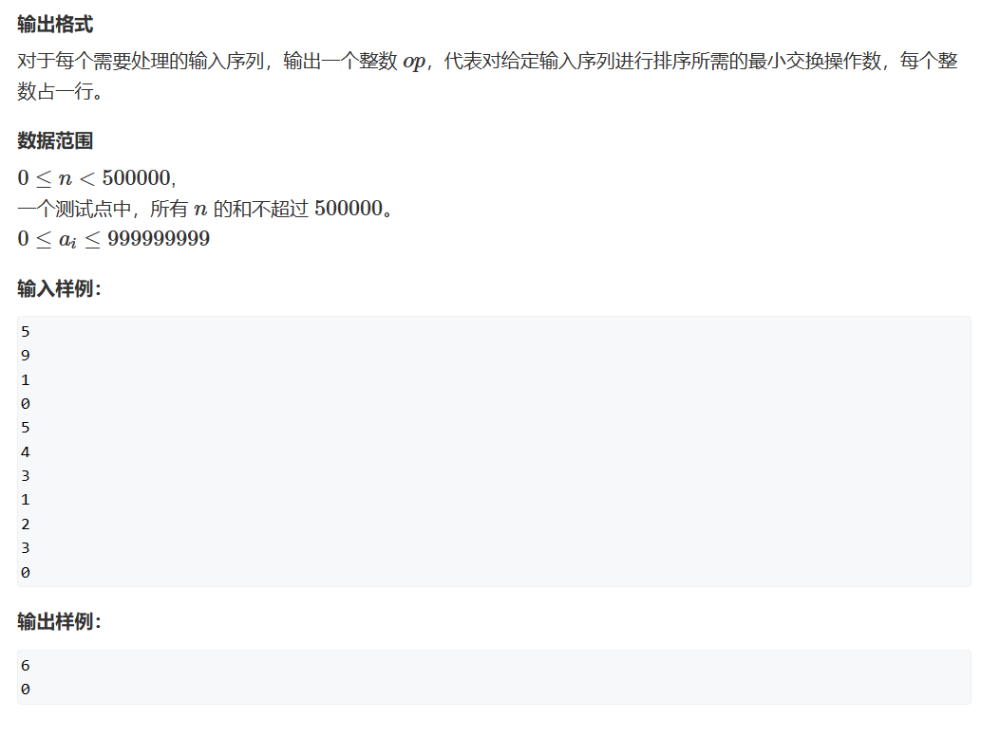

# 归并排序

本章讲解归并排序的原理以及代码实现。

## 原理

归并排序可分为三大步：

一、归：

将数组切片成由单个元素组成的数组

二、排序：

从前到后每两数组进行大小比较

三、并：

按所需顺序存入临时数组，存完后将互相比较的两个数组合并起来



***

如果大家对比过归并排序和快速排序，会发现两者递归的区别，前者在更改数据顺序前进行递归，后者在更改数据顺序后才进行递归，对比记忆能帮大家记住更多知识点。

归并排序和快速排序都使用了递归的方法，所以大家需要注意递归终点的判断，否则会爆栈。

## 题一



代码实现：
```cpp
#include <iostream>
#include <algorithm>

const int N = 100010;

int n;
int q[N],temp[N];

void merge_sort(int q[],int l,int r)
{
    if(l>=r) return;
    int mid = l+r>>1;
    merge_sort(q,l,mid);
    merge_sort(q,mid+1,r);
    int i = l, j = mid+1, k = 0;
    while(i<j)
    {
        while(i<=mid&&j<=r)
            if(q[i]<=q[j]) temp[k++] = q[i++];
            else temp[k++] = q[j++];
        
        while(i<=mid) temp[k++] = q[i++];
        while(j<=r) temp[k++] = q[j++];
        
        for(i = l,k = 0;i<=r;i++,k++) q[i] = temp[k];
    }
    return;
}

int main()
{
    scanf("%d", &n);
    
    for(int i = 0;i<n;i++) scanf("%d",&q[i]);
    
    merge_sort(q,0,n-1);
    
    for (int i = 0; i < n; i ++ ) printf("%d ",q[i]);
}

```

## 题二


***
为什么归并排序会与逆序对有关呢？

我们先回忆一下快速排序的实现：对于x，我们分别将大于和小于它的数放到x的两侧

归并排序中，我们将切片后相邻的数组进行排序合并，那么我们再往外剥一层，可以发现，对于将要进行比较合并的两个数组，他们各自一定是有序的。

那么此时如果我们左半边找到一个i大于右半边的一个j，因为其分别有序的性质，那么从i ~ mid 一定都大于 j这个元素，也就是说此时就有mid + 1 - i个逆序对。
***
有些同学奇怪，我们在交换顺序的过程中会不会导致总的逆序对数量发生变化呢？

答案自然是不会，我们每次合并都是相邻的两组合并，也就是说对于第1、2组，他们合并后还是在第1、2组在的位置，其他没比较过的数据与其的相对位置没有变化，最后一个元素依然在他们的后面。
***

```cpp
#include <iostream>
#include <algorithm>

using LL = long long ;
const int N = 100010;

int q[N],temp[N];
int n;

LL merge_sort(int arr[],int l,int r)
{
    if(l>=r) return 0;
    int mid = l + r>>1;
    LL res = merge_sort(arr, l ,mid) + merge_sort(arr, mid +1,r);
    int i = l,j = mid+1,k = 0;
    while(i<=mid&&j<=r)
    {
        if(arr[i]<=arr[j]) temp[k++] = arr[i++];
        else{
            res += mid+1-i; //核心处
            temp[k++] = arr[j++];
        }
    }
    while(i<=mid) temp[k++] = arr[i++];
    while(j<=r) temp[k++] = arr[j++];
    for(int i = l,k = 0;i<=r;i++,k++) arr[i] = temp[k];
    return res;
}

int main()
{
    scanf("%d", &n);
    
    for(int i = 0;i<n;i++) scanf("%d",&q[i]);
    std::cout<<merge_sort(q,0,n-1);
}
```

## 题三

   


此题仍然是利用归并排序关于逆序对的性质，不过多解释

```cpp
#include <iostream>

const int N = 500010;

int numbers[N];
int temp[N];
int n;

int q_s(int arr[],int l,int r)
{
    if(l>=r) return 0;
    int mid = l + r >> 1;
    int res = q_s(arr, l, mid) + q_s(arr, mid + 1, r);
    int i = l, j = mid + 1, k = 0;
    
    while(i <= mid && j <= r)
    {
        if(numbers[i] <= numbers[j]) temp[k++] = numbers[i++];
        else
        {
            res += mid + 1 - i;
            temp[k++] = numbers[j++];
        }
    }
    while(i<=mid) temp[k++] = numbers[i++];
    while(j<=r) temp[k++] = numbers[j++];
    
    for(i = l,k = 0; i <= r; i++,k++) numbers[i] = temp[k];
    return res;
}


int main()
{
    while(scanf("%d",&n),n) 
    {
        for(int i = 0; i < n; i++ )
            scanf("%d", &numbers[i]);
        printf("%d\n",q_s(numbers, 0, n-1));
    }
}
```