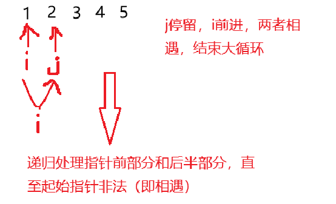

# 快速排序

O(n*logn)

本文章详细介绍快速排序的原理和代码实现

## 原理

快排的原理很简单，随机选定数组中的一个数x，先将小于等于它的数放入一个数组中，然后再将大于等于它的数加到数组尾部，这样我们就将这个元素排到了属于它的位置，这时候我们递归处理被排好的x元素的左半边和右半边，就能得到一个有序的数组，被如下图：


在朴素的版本中，我们需要遍历这个数组然后将元素转移到新的数组以后再赋值回到我们的原始数组，这相对于多进行了一轮操作：


这里向大家介绍双指针的写法，通过头尾指针向对方逼近去寻找需要交换的元素：

1. 头指针 i 指向队头的前一个元素，尾指针 j 指向队尾的后一个元素。有同学可能奇怪，这样会不会导致越界的问题呢？答案是不会，因为我们会先移动再比较，使用C++里的do;while()函数，当然，范围内比较也是没有问题的。
2. 头尾指针向对方逼近，直至头指针找到大于x的值，尾指针找到小于x的值，如果此时头尾指针没有越过或相遇，那么我们交换这两个指针指向的元素，如此循环，直至头尾相遇，此时指针相遇的位置就是排序后x应该处于的位置。
3. 递归处理相遇指针的左侧和右侧。

   
    


为什么这么做是成立的呢？

很简单，一个元素在未排序的数组中，左侧有多少个大于它的数，那么相应的，它的右侧就会有多少小于它的数，所以双指针法只不过是找到它们并将它们放到x相应的左侧和右侧，从而完成相对大小的排序，如此递归下去每个元素能找到自己在有序数组中对应的位置，那么我们就能得到一个有序的数组。

## 题一


代码部分:

```cpp
#include <iostream>
#include <algorithm>

const int N = 100010;

int q[N],n;

void merge_sort(int q[],int l,int r)
{
    if(l>=r) return;
    
    int x = q[l+r>>1],i = l-1,j = r+1;
    while(i<j){
        do i++;while(q[i]<x);
        do j--;while(q[j]>x);
        
        if(i<j) std::swap(q[i],q[j]);
    }
    merge_sort(q,l,j);
    merge_sort(q,j+1,r);

}

int main()
{
    scanf("%d",&n);
    for(int i = 0;i<n;i++) scanf("%d",&q[i]);
    merge_sort(q,0,n-1);
    for(int i = 0;i<n;i++) printf("%d ",q[i]);
}
```
## 题二


利用快排的性质去求第k个值，这里不多解释。

```cpp
#include <iostream>
#include <algorithm>

const int N = 100010;

int q[N], n, find;

int merge_sort(int q[],int l,int r,int k)
{
    if(l>=r) return q[l];
    int x = q[l+r>>1], i = l-1, j = r+1;
    while(i<j)
    {
        do i++;while(q[i]<x);
        do j--;while(q[j]>x);
        if(i<j) std::swap(q[i],q[j]);
    }

    if(j>=k) return merge_sort(q,l,j,k);
    return merge_sort(q,j+1,r,k);
}

int main()
{
    scanf("%d %d", &n,&find);
    for(int i = 0;i<n;i++) scanf("%d",&q[i]);
    std::cout<<merge_sort(q,0,n-1,find-1);
}
```