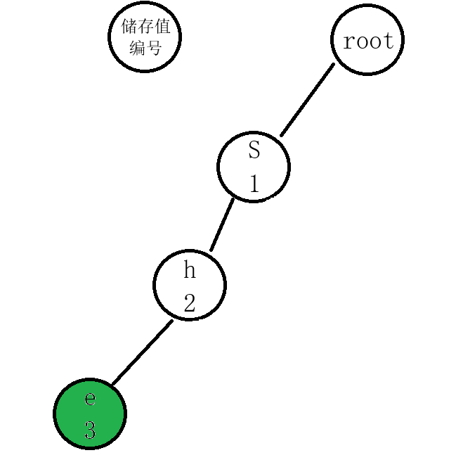
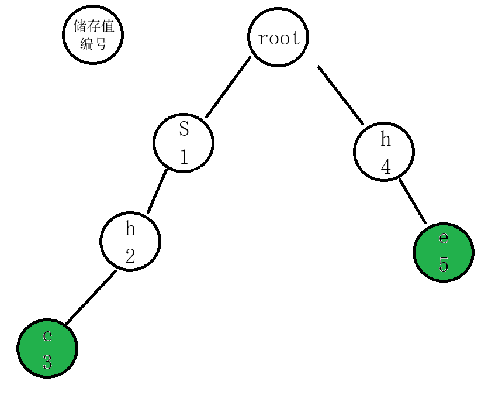
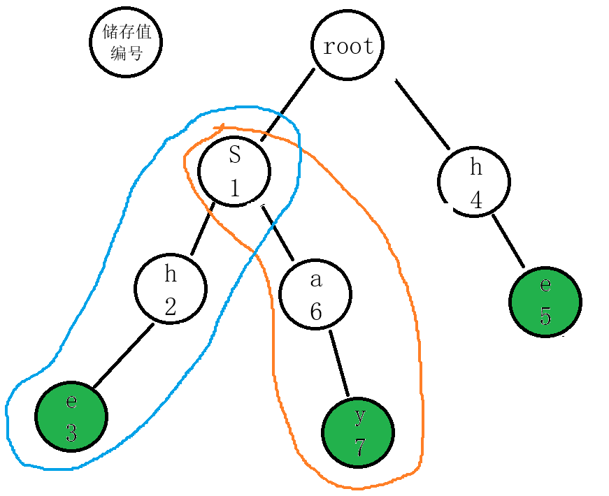
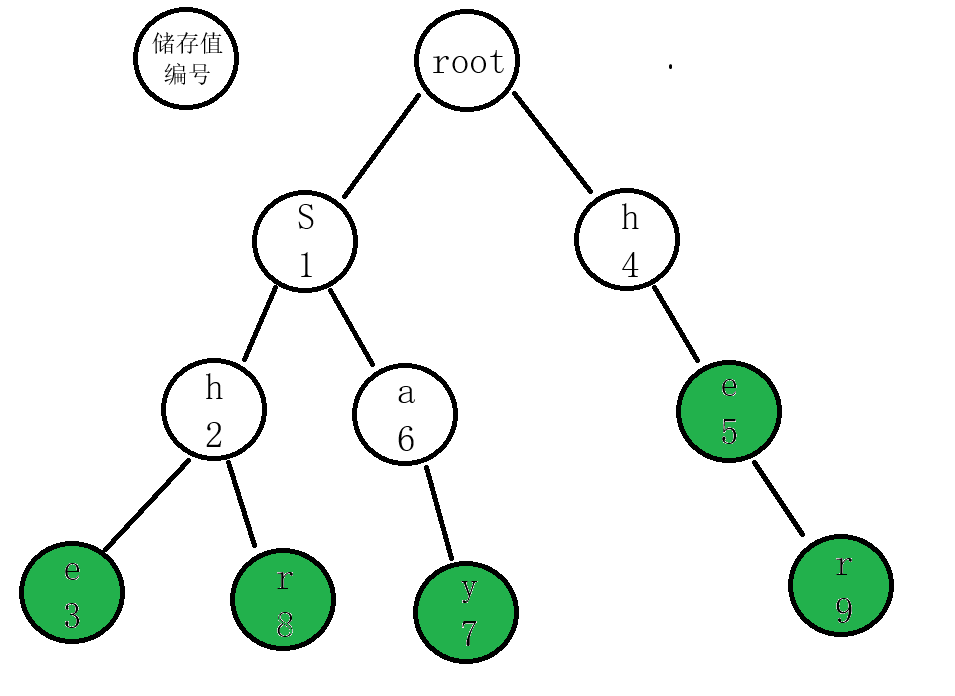
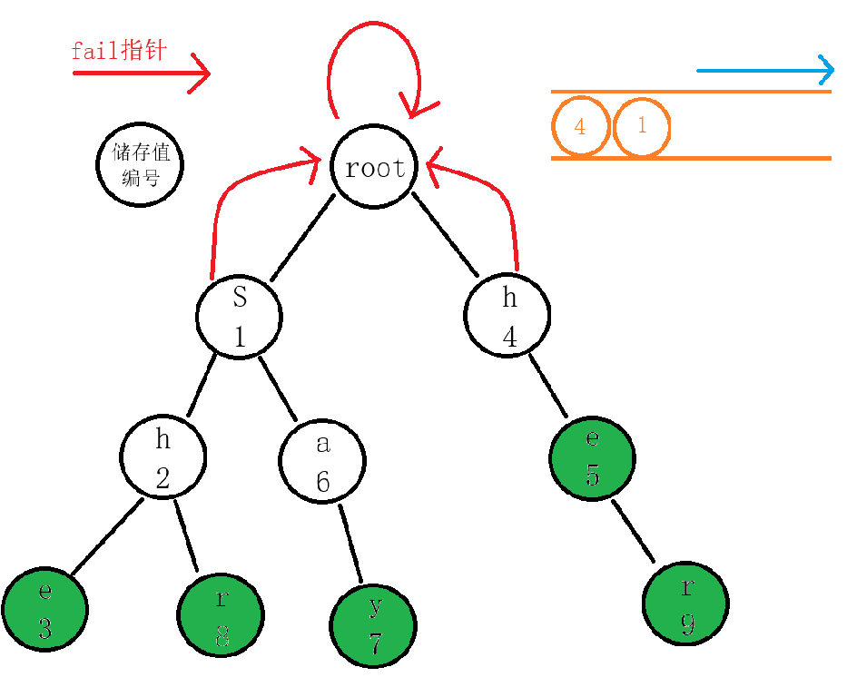
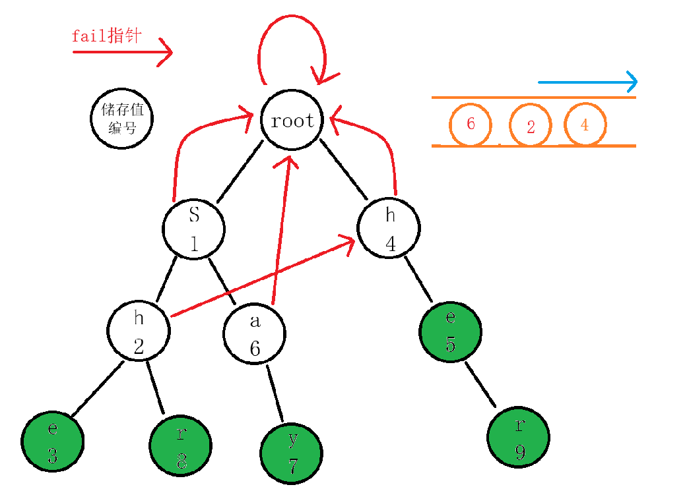
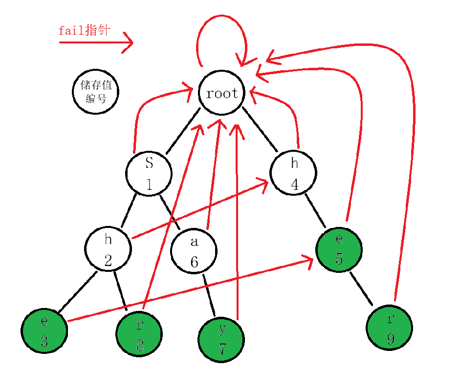
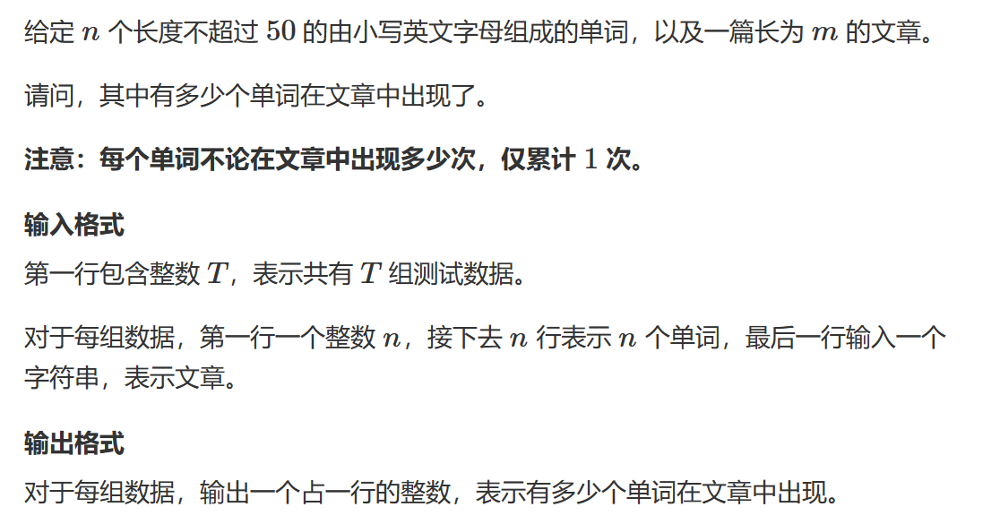
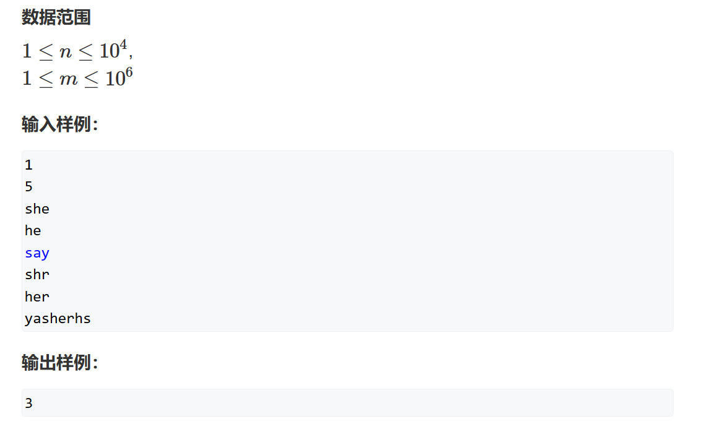

# AC自动机

AC自动机其实就是Trie 树与KMP 的结合。对于KMP，处理的字符串是以线性结构存储，而对于AC自动机是处理树形存储的字符串的匹配问题。

## Trie树

Trie 树是一种可以储存多个字符串的数据结构，它可以压缩字符串的储存并且加快字符串的匹配。

Trie 树的构建方法：

以以下五个字符串（字符串只包含小写字母）为例子

```cpp
she
he
say
shr
her
```

在构建的过程中，我们先将 she 按顺序接下去，我们将每一个单词的结尾标记一下：



然后我们加入第二个单词 he ，这时候我们需要明确Trie树的构建原则：

**从根节点开始，每一层一种字母只能出现一次，如果要接入的单词已经存在，就不用添加，后面的字母接到已有字母的后面**



我们继续接入单词 say ，此时就能看出Trie树的特点了：



在这一次构建中，单词she 和单词say 共用了一个起点s，这样不仅节约了空间，还方便了单词匹配。

最后我们构建出的Trie树长这样子：



随后我们给出代码的实现，代码会有详细注释：

```cpp
#include <iostream>
char str[M];    //用于构建Trie树时传入的字符串参数
int cnt[N * S]; //用于记录i 节点下对应的字母是否作为一个单词的结尾
int idx;    //用于创建节点和标记节点
int tr[N * S][26];  //Trie树

void insert()
{
	int p = 0;  //因为我们从根部开始匹配和插入字符，所以归0
	for (int i = 0; str[i]; i++)
	{
		int t = str[i] - 'a';   //取出需要加入的字符串的字符
		if (!tr[p][t]) tr[p][t] = ++idx;    //如果此字符不存在于p层（或者说是p 为下标的字符，指向t字符的节点不存在），那么我们就将其加入到 Trie树中
		p = tr[p][t];   //记住，tr[p][t] 储存的是当前编号p的节点指向字符t 的节点编号，例如：图中tr[2]['r'-'a'] = 8，也就是 编号为8 储存值为r 的节点。
	}
	cnt[p]++;   //此时我们的单词已经插入到了Trie树中，p指针指向这个单词的最后一个字母，我们标记编号为p的节点为一个单词的结尾，它可以是很多个单词的结尾，所以cnt值可以继续向上递增。
}
int main{
    int n;
    scanf("%d",&n);
    for (int i = 0; i < n; i++)
    {
        scanf("%s", str);
        insert();
    }
}
```

首先我们需要一个用来储存字符串的数组，声明为 Tr[][26]（只有26个小写字符），也就是说每一个字符会占据一个节点，每一个节点有26条边指向下一个对应的字符。

## fail数组

对于KMP 来说，我们有next 数组告诉我们当前字符不匹配时应该跳转的位置。相同的，fail 数组是对于AC自动机来说，字符不匹配时应该跳转的位置。

那我们来回忆一下KMP 的next数组，其记录的就是最长相等前后缀的长度，如果next[len-1]!=-1，则说明字符串有相同的前后缀。

那么对于AC自动机，fail 数组代表两个字符串之间的最长相等前后缀，也就是说，当我的字符串无法匹配当前字符串的字符时，我们会跳到另一个字符串的相同字符，且这个字符是两者之间的最长相等前后缀，这样我们就不需要从根节点重新匹配。

***

而我们的fail数组就是在Trie树上构建的，现在我们来解释一下fail指针的构建过程：

首先，确定遍历方法是BFS也就说层序遍历，我们需要遍历完每一层（每个单词的同一位字母）才进入下一层的遍历，所以我们需要使用一个队列（先进先出），可自己实现也可调用stl库的queue，按自己喜好来即可。

首先我们明确fail指针的寻找过程：**找到该节点的父节点的fail指针指向的节点，然后在这个节点的子节点中寻找是否有相等的元素，有，这个节点的fail指针指向它；没有，就指继续向上跳，直至找到或到达根节点**

***

接下来我们画图来模拟这个过程：

首先我们知道root节点和首字母节点一定都是指向空的（一个字母哪来相等前后缀），所以我们直接将首字母推入队列中，就不从root节点开始了。



我们先将编号为**1**的节点取出来，我们找它的子节点，它的子节点有编号为**2**的**h**节点和编号为**6**的**a**节点，将它们推入队列中。对于空节点，我们让其连接到与父节点的fail指针指向的节点的子节点中相同元素的节点，此时会有两者可能（代码优化的地方就在这里）：

1. 存在这个节点，那么在匹配时我们就会跳到另一个单词。
2. 不存在这个节点，那么匹配时我们继续跳到另一个单词，直到找不到一个能接的单词，就会指向根节点。
（其实这里不重要，但这是原理，还是解释了一下，看不懂没关系）

对于找到的**2**号节点，我们找其父节点**1**号节点的fail指针指向的节点——**0**号**root**节点，其子节点有**1**号元素为**s**的节点和**4**号元素为**h**的节点，**2号节点**与**4**号节点值相同，那么**2**号节点的fail指针就指向**4**号节点。同理，但是**6**号节点找不到相同的节点，但仍然指向那个不存在的空节点，但因为我们之前的操作，空节点指向根节点，那么此时这个节点也将指向空节点。

所以我们总结一下，找到该节点的父节点的fail指针指向的节点，然后在这个节点的子节点中寻找是否有相等的元素，有，这个节点的fail指针指向它；没有，就指继续向上跳，直至找到或到达根节点



接下来只需要重复这个过程即可。

最终的fail指针图如下：



***

代码部分（附逐行详解）：

```cpp
int tr[N * S][26], cnt[N * S], idx;
char str[M];
int q[N * S], fail[N * S];
void build()
{
	//这里是自己实现了队列，大家大可使用stl库里的queue
	int hh = 0, tt = -1;
	for (int i = 0; i < 26; i++)
		if (tr[0][i])	//将每个单词的首字母推入队列中
			q[++tt] = tr[0][i];

	while (hh <= tt)
	{
		//取出之后作为父节点的节点
		int t = q[hh++];
		for (int i = 0; i < 26; i++)
		{
			int p = tr[t][i];
			//如果不存在这个节点，那么此节点会指向另一个匹配单词下存在的同一字母，如果整个树都不存在这样的情况，那最终这个空节点会指向root
			if (!p) tr[t][i] = tr[fail[t]][i];	//这里是优化，做到了路径压缩，和并查集很像，具体的解释就是上面说的原理
			else
			{
				//如果存在这个节点，我们将其推入队列，且让这个单词的fail指针指向父节点fail指针指向的节点的子节点的同一字母节点
				fail[p] = tr[fail[t]][i];
				q[++tt] = p;
			}
		}
	}
}
```

## 示例与使用

### 题一


   

这题就是对AC自动机简单的运用，我们用这题来讲解匹配的过程：

对于匹配的过程，其实和AC自动机fail指针的构建代码很相似（但其实我们上面使用的是Trie 图来构建）

```cpp
//i 指针用于遍历匹配串，j 指针用来遍历Trie 图
 for (int i = 0, j = 0; str[i]; i ++ )
{
	//取出这个字母，方便代码书写，其含义为寻找以t结尾的单词
    int t = str[i] - 'a';
	//取出父节点，从长度为1 的单词开始寻找（一层一层地寻找）
    j = tr[j][t];
	//用p指针向后遍历
    int p = j;
	//如果p非空，也就是说树中有这么一个节点
	//统计结尾标记并且清除结尾标记防止重复统计
    while (p)
    {
        res += cnt[p];
        cnt[p] = 0;
        p = fail[p];
    }
}
```

完整代码：

```cpp
#include <cstring>
#include <iostream>

using namespace std;

const int N = 10010, S = 55, M = 1000010;

int n;
int tr[N * S][26], cnt[N * S], idx;
char str[M];
int q[N * S], fail[N * S];

void insert()
{
	int p = 0;
	for (int i = 0; str[i]; i++)
	{
		int t = str[i] - 'a';
		if (!tr[p][t]) tr[p][t] = ++idx;
		p = tr[p][t];
	}
	cnt[p]++;
}

void build()
{
	int hh = 0, tt = -1;
	for (int i = 0; i < 26; i++)
		if (tr[0][i])
			q[++tt] = tr[0][i];

	while (hh <= tt)
	{
		int t = q[hh++];
		for (int i = 0; i < 26; i++)
		{
			int p = tr[t][i];
			if (!p) tr[t][i] = tr[fail[t]][i];
			else
			{
				fail[p] = tr[fail[t]][i];
				q[++tt] = p;
			}
		}
	}
}

int main()
{
	int T;
	scanf("%d", &T);
	while (T--)
	{
		memset(tr, 0, sizeof tr);
		memset(cnt, 0, sizeof cnt);
		memset(fail, 0, sizeof fail);
		idx = 0;

		scanf("%d", &n);
		for (int i = 0; i < n; i++)
		{
			scanf("%s", str);
			insert();
		}

		build();

		scanf("%s", str);

		int res = 0;
		for (int i = 0, j = 0; str[i]; i++)
		{
			int t = str[i] - 'a';
			j = tr[j][t];

			int p = j;
			while (p)
			{
				res += cnt[p];
				cnt[p] = 0;
				p = fail[p];
			}
		}

		printf("%d\n", res);
	}
	return 0;
}
```
