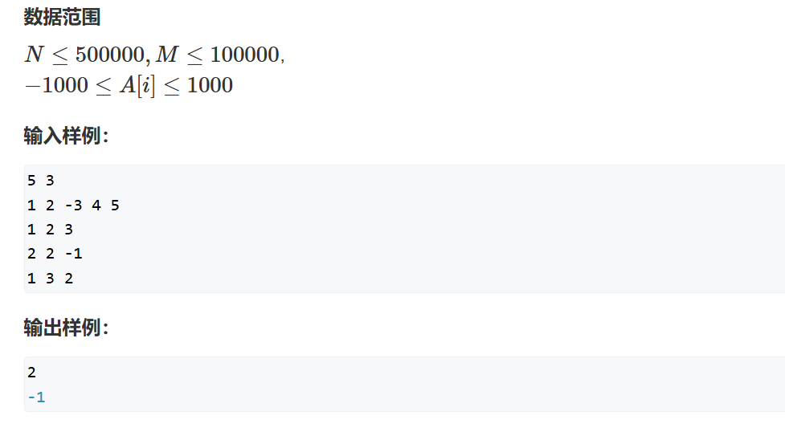
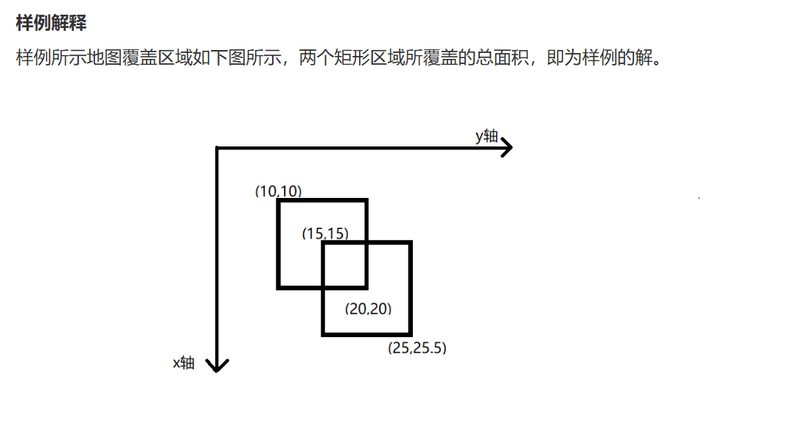
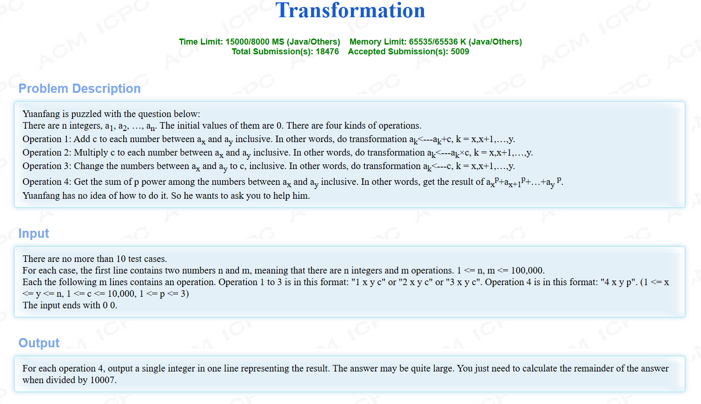

# 线段树

原理：满二叉树，和堆相似，所以可以使用一个一维数组去存储整棵树，更具满二叉树的性质，我们有（假设倒数第二层有$n$个节点）：

1. 除最后一层外我们有$2n-1$个节点。
2. 最后一层最多有$2n$个节点
3. 总的节点数不会超过$4n-1$个节点

故在使用线段树时最少会开$4n$的空间

对于编号选择：
$$
\begin{cases}
    父节点——\frac{x}{2}\\
    左儿子——2x\\
    右儿子——2x+1
\end{cases}
$$

简单的线段树一般有五个操作

1. push_up：由子节点算父节点。
2. build：将一段区间初始化成线段树。
3. modify：修改操作 —— 修改单点或修改区间。
4. query：查询操作，即查询某一段线段树的信息。
5. push_down（懒标记、延迟标记）：由父节点算子节点。

## push_up

传入一个节点编号，用子节点信息计算父节点信息，当需要的数据大于一个时，建议写函数重构且参数为整个节点，第二题会体现到。

## build

$build$ 操作一般用于初始化我们的线段树，如果初始数据是静态的，需要在最后进行 $pushup$ 操作

代码一般形式：
```cpp
//u：当前节点编号
//l：当前区间的左端点
//r：当前区间的右端点
void build(int u, int L, int R)
{
    //将左右端点存入
    tr[u].l = L, tr[u].r = R;

    //如果当前节点为叶子节点，退出
    if(c == k) return;
    //计算当前区间中点
    int mid = L + R >> 1;
    build(u<<1, L, mid);
    build(u<<1|1, mid + 1, R);
    /*
    一般会在此时进行push_up操作
    push_up(u);
    */ 
}
```

## query

时间复杂度：$O(log_n)$

假设查询$[L, R]$ 区间的最大值。

在查询时，我们查询树中每个节点的范围，此时会有两种情况：

1. 树中节点所在范围在$[L, R]$内，即$[T_l, T_r]\subset[L, R]$ —— 直接返回区间$[T_l, T_r]$的属性值。
2. 有交集且交集不等于$[L, R]$，即$[L, R]\cap[T_l,T_r]\neq[L,R]\And \emptyset$ —— 继续递归左右两侧。

为了更清楚地说明查询的逻辑，我们举个例子 + 画图来理解，假设我们查询$[2， 7]之间的最大值$：


根据此图和查询逻辑，我们从头开始搜：

1. 第一层在范围外，加深搜索
2. 第二层的两个节点范围分别包含了所需范围的左端点和右端点，所以向合法范围递归
3. 第三层，范围4——5的节点直接返回其属性值，1——3、6——8继续递归加深
4. 到了第四层我们只剩下范围1——2需要递归加深
5. 如果看过我之前题解的同学能知道，我们直接从递归终点开始看，那么会发现例如区间$[2，3]$的属性值是通过比较区间$[2，2]$与区间$[3，3]$的属性值得出，那么此时会更容易理解代码的逻辑。

当然当查询的不是最大值时，查询逻辑也会有相应变化。

## modify

$modify$ 用于修改线段树中某个元素存储的值，并在修改过后进行整个线段树的数据更新。

## 题一


```cpp
#pragma GCC optimize(2)
#include <iostream>
#include <algorithm>

const int N = 200010;

int m, p;

struct Node
{
	int l, r;
	int v; //区间[l, r]中的最大值
}tr[N * 4];

//计算单个节点
void push_up(int u)
{
	tr[u].v = std::max(tr[u << 1].v, tr[u << 1 | 1].v);
}

//对线段树进行搭建
void build(int u, int L, int R)
{
	//将左右端点存入
	tr[u] = { L,R };

	//如果当前节点为叶子节点，退出
	if (L == R) return;
	//计算当前区间中点
	int mid = L + R >> 1;
    //u << 1 等价于 u * 2，u << 1|1 等价于 u * 2 + 1
    //向左递归建树，向右递归建树
    //相当于将区间不断二分直至区间变点
    //如此就能从递归终点向上处理区间属性，从而解决区间问题
	build(u << 1, L, mid);
	build(u << 1 | 1, mid + 1, R);
	/*
	一般会在此时进行push_up操作
	push_up(u);
	*/
}

//询问线段[L，R] 之间的属性，例如区间最值、区间和等等，一般从头节点开始
int query(int u, int l, int r)
{
    
	if (tr[u].l >= l && tr[u].r <= r) return tr[u].v;
	int mid = tr[u].l + tr[u].r >> 1;
	int v = 0;
	if (l <= mid) v = query(u << 1, l, r);
	if (r > mid) v = std::max(query(u << 1 | 1, l, r), v);
	return v;
}

void modify(int u, int x, int v)
{
	if (tr[u].l == x && tr[u].r == x) tr[u].v = v;
	else
	{
		int mid = tr[u].l + tr[u].r >> 1;
		if (x <= mid) modify(u << 1, x, v);
		else modify(u << 1 | 1, x, v);
		push_up(u);
	}
}

int main()
{
	std::ios::sync_with_stdio(false);
	std::cin.tie(0);
	std::cout.tie(0);

	int n = 0, lasta = 0;
	std::cin >> m >> p;
	build(1, 1, m);

	int x;
	char op;
	while (m--)
	{
		std::cin >> op >> x;
		if (op == 'Q')
		{
			lasta = query(1, n - x + 1, n);
			std::cout << lasta << std::endl;
		}
		else
		{
			modify(1, n + 1, ((long long)lasta + x) % p);
			n++;
		}
	}
}
```

## 题二




这题注意到修改操作只针对当个元素，那么我们就不需要懒标记，沿袭上一题的代码进行更改即可。

## push_up

$pushup$ 操作的更改是解决此题的题眼。根据题意，我们需要获取的是区间[x, r] 中最大连续子段和，那么我们看看从子节点需要获取哪些信息才能获得父节点的信息。


可以想到的有三种情况：

1. 最大字段和在左儿子
2. 最大字段和在右儿子
3. 最大字段和在左儿子右端点和右儿子左端点连接之后的区间


对于前两种可能，我们只需要记录每个区间的最值就能更新，所以这里我们需要储存一个$tmax$ 来代表这个区间的最大连续子段和


而对于第三种情况就比较麻烦，我们需要考虑到子区间的**最大前缀和**和**最大后缀和**，那么我们集需要存储$lmax$ 与 $rmax$ 和区间和 $sum$ 用于更新父节点的这部分信息。

假设我们要更新父节点的 $lmax$ 值也就是最大前缀和（如下图），那么我们可能的取值为左区间的 $lmax$ or 左区间的 $sum$ 加上右区间的 $lmax$

父节点的 $rmax$ 更新逻辑同理


最后我们更新题一的代码为：

```cpp
#pragma GCC optimize(2)
#include <iostream>
#include <cstring>
#include <algorithm>

const int N = 500010;
int q[N];
struct Tree
{
    int l,r;
    int sum,lmax,rmax,tmax;
}tr[4 * N];

//用于方便查询操作需要的重构函数
void pushup(Tree& u,Tree& l,Tree& r)
{
    u.sum = l.sum + r.sum;
    u.lmax = std::max(l.lmax, l.sum + r.lmax);
    u.rmax = std::max(r.rmax, r.sum + l.rmax);
    u.tmax = std::max(std::max(l.tmax,r.tmax),l.rmax + r.lmax);
}

void pushup(int u)
{
    pushup(tr[u],tr[u<<1],tr[u<<1|1]);
}

void build(int u,int l,int r)
{
    tr[u] = {l,r,q[l],q[l],q[l],q[l]};
    if(l>=r) return;
    int center = l + r >> 1;
    build(u<<1,l,center),build(u<<1|1,center + 1,r);
    pushup(u);
    
}

Tree query(int u,int l,int r)
{
    if(tr[u].l>=l&&tr[u].r<=r) return tr[u];
    int center = tr[u].l + tr[u].r >> 1;
    
    if(r<=center) return query(u<<1,l,r);
    else if(l>center) return query(u<<1|1,l,r);
	//当发生第三种情况时我们需要重新处理[l,r] 区间的值，毕竟我们的线段树不存在跨越两区间之间的节点
    else
    {
        auto left = query(u<<1,l,r);
        auto right = query(u<<1|1,l,r);
        Tree res;
        pushup(res,left,right);
        return res;
    }
}

void modify(int u,int x,int v)
{
    if(tr[u].l==x&&tr[u].r==x) tr[u] = {x,x,v,v,v,v};
    else
    {
        int center = tr[u].l + tr[u].r >> 1;
        if(x<=center) modify(u<<1,x,v);
        else modify(u<<1|1,x,v);
        pushup(u);
    }
}
int n,m;
int main()
{
    std::ios::sync_with_stdio(false);
    std::cin.tie(0);
    std::cout.tie(0);
    
    std::cin>>n>>m;
   
    for(int i = 1;i<=n;i++)
    {
        std::cin>>q[i];
    }
    build(1,1,n);
    while (m -- ){
        int op;
        int l,r;
        std::cin>>op>>l>>r;
        
        if(op==1)
        {
             if(l>r) std::swap(l,r);
             auto v = query(1,l,r);
             std::cout<<v.tmax<<std::endl;
        }
        else
        {
            modify(1,l,r);
        }
    }
}
```

## 题三


表面上看这题进行了区间修改，似乎需要用到懒标记，但事实呢？

数学中使用$(a,b)$ 表示$a和b$ 的最大公约数，那么$(a,b,c)$ 是否等于 $(a+x,b+x,c+x)$ 呢？

很明显两者之间是没有什么关系的，所以此题使用懒标记是无法解决问题的。

但是根据数论知识我们知道$(a_1,a_2,a_3,...,a_n) =  (a1,a_2-a_1,a_3-a_2,...,a_n-a_n-1)$

***
**证明：**

设 $d$ 为集合 $A={a_1,a_2,a_3,...,a_n}$ 的一个公约数

那么对于$B={a1,a_2-a_1,a_3-a_2,...,a_n-a_n-1}$ 这个 $d$ 可整除他们中的每一项，那么集合A的公约数集合$\subset$ 集合B的公约数集合，故有：

$$(a_1,a_2,a_3,...,a_n) \leq  (a1,a_2-a_1,a_3-a_2,...,a_n-a_n-1)$$

反过来，设 $t$ 为集合$B={a1,a_2-a_1,a_3-a_2,...,a_n-a_n-1}$ 的一个公约数

对于第二项$a_2-a_1$ 因为 $t|a_1$ 且 $t|(a_2-a_1)$ 那么必有 $t|a_2$ ，同理可归纳 $t|a_i$ ，故有

$$(a_1,a_2,a_3,...,a_n) \geq  (a1,a_2-a_1,a_3-a_2,...,a_n-a_n-1)$$

综上可得：

$$(a_1,a_2,a_3,...,a_n) =  (a1,a_2-a_1,a_3-a_2,...,a_n-a_n-1)$$
***

此时我们就可以发现，对于修改 $[l,r]$ 操作，如果我们使用差分的形式存储我们的信息，那么会被更改的只有第 $l$ 和 $r+1$ 位置上的信息，无论修改的值为多少，$[l+1,r]$ 之间的最大公约数都不会被改变，修改过后的最大公约数只需要通过第 $l$ 个元素与区间 $[l+1,r]$ 的最大公约数求出来即可

```cpp
#pragma GCC optimize(2)
#include <iostream>
#include <cstring>
#include <algorithm>
#include <cmath>

using ll = long long;
const int N = 500010;
ll q[N];
struct Tree
{
    int l,r;
    //sum 是差分数组的和，假设tr[1,l] 那么tr[1,l].sum = q[l]
    //d 存储区间[l,r]最大公约数
    ll sum,d;
    
}tr[4*N];

ll gcd(ll a,ll b)
{
    return b?gcd(b,a%b):a;
}

void pushup(Tree& u,Tree& l,Tree& r)
{
    u.sum = l.sum + r.sum;
    u.d = gcd(l.d,r.d);
}

void pushup(int u)
{
    pushup(tr[u],tr[u<<1],tr[u<<1|1]);
}

void build(int u,int l,int r)
{
    if(l==r) tr[u] = {l,r,q[r]-q[r-1],q[r]-q[r-1]};
    else 
    {
        tr[u].l = l,tr[u].r = r;
        int center = l + r >> 1;
        build(u<<1,l,center),build(u<<1|1,center + 1,r);
        pushup(u);
        
    }
}

void modify(int u,int x,ll v)
{
    if(tr[u].l==x&&tr[u].r==x) tr[u] = {x,x,tr[u].sum+v,tr[u].sum+v};
    else
    {
        int center = tr[u].l + tr[u].r >> 1;
        if(x<=center) modify(u<<1,x,v);
        else modify(u<<1|1,x,v);
        pushup(u);
    }
    
}

Tree query(int u,int l,int r)
{
    if(tr[u].l>=l&&tr[u].r<=r) return tr[u];
    int center = tr[u].l + tr[u].r >> 1;
    if(r<=center) return query(u<<1,l,r);
    else if(l>center) return query(u<<1|1,l,r);
    else
    {
        auto left = query(u<<1,l,r);
        auto right = query(u<<1|1,l,r);
        Tree res;
        pushup(res,left,right);
        return res;
    }
}
int n,m;
int main()
{
    std::ios::sync_with_stdio(false);
    std::cin.tie(0);
    std::cout.tie(0);
    
    std::cin>>n>>m;
    
    for(int i = 1;i<=n;i++) std::cin>>q[i];
    
    build(1,1,n);
    int l,r;
    char op;
    ll x;
    while (m -- )
    {
        std::cin>>op>>l>>r;
        if(op=='Q')
        {
            auto left = query(1,1,l);
            Tree right {0,0,0,0};
            //注意越界
            if(l+1<=r) right = query(1,l+1,r);
            std::cout<<std::abs(gcd(left.sum,right.d))<<std::endl;
        }
        else
        {
            std::cin>>x;
            modify(1,l,x);
            //注意越界
            if(r+1<=n) modify(1,r+1,-x);
        }
    }
}
```

## push_down

在进入下一部分前我们需要学习线段树的另一个重要操作 $pushdown$

$pushdown$ 常常用于对于线段树的区间修改，例如下题中对区间 $[l,r]$ 同时加上一个 $d$ ，这时候如果我们递归下去，去将树上的每个节点都加上一个 $d$ ，那么时间复杂度将会非常高。

所以 $pushdown$ 提供了一种思路 —— 将满足条件的第一个节点打个标记，在查询时如果需要查询到**以这个节点为根节点的子节点**区间时再递归计算子节点的值，否则标记就停留在这个节点，故而$pushdown$ 也被称作懒标记或延迟计算。如图：

假设绿色区域为我们的修改区间，那么我们的被标记节点如图


当我们的查询区间包括了被标记区间，那么标记不会下沉，因为根据我们的查询，我们遇到区间被包含时是之间返回该节点对应信息。


但当查询区间为如图时，懒标记会被下沉（记得下沉过后删除父节点的标记），此时我们的线段树又被更新了一次。


## 题四


那么根据以上 $pushdown$ 操作的介绍，我们知道在查询和修改操作时，如何访问区间是被标记节点的子节点，那么我们就需要进行 $pushdown$ 操作以更新子节点信息。

```cpp
#pragma GCC optimize(2)
#include <iostream>
#include <cstring>
#include <algorithm>
using ll = long long;
const int N = 100010;

struct Tree
{
    int l,r;
    ll sum;
    ll add;
}tr[4 * N];
ll q[N];
void pushup(int u)
{
    tr[u].sum = tr[u<<1].sum + tr[u<<1|1].sum;
}

void pushdown(int u)
{
    auto& root = tr[u];auto& left = tr[u<<1];auto& right = tr[u<<1|1];
    if(root.add)
    {
        left.add += root.add, left.sum += (ll)(left.r - left.l + 1) * root.add;
        right.add += root.add, right.sum += (ll)(right.r - right.l + 1) * root.add;
        root.add = 0;
    }
}

void build(int u,int l,int r)
{
    if(l>=r) tr[u] = {l,r,q[r],0};
    else
    {
        tr[u] = {l,r};
        int center = l + r >> 1;
        build(u<<1,l,center),build(u<<1|1,center + 1, r);
        pushup(u);
    }
}

ll query(int u,int l,int r)
{
    if(tr[u].l>=l&&tr[u].r<=r) return tr[u].sum;
    int center = tr[u].l + tr[u].r >> 1;
    ll v = 0;
    //记得下沉标记
    pushdown(u);
    if(l<=center) v = query(u<<1,l,r);
    if(r>center) v += query(u<<1|1,l,r);
    return v;
}

void modify(int u,int l,int r,int v)
{
    //修改时我们先把被标记区间的sum值更改成正确的值
    if(tr[u].l>=l&&tr[u].r<=r) {
        tr[u].sum += (ll)(tr[u].r - tr[u].l + 1) * v;
        tr[u].add += v;
        
    }
    else
    {
        //记得下沉标记
        pushdown(u);
        int center = tr[u].l + tr[u].r >> 1;
        if(l<=center) modify(u<<1,l,r,v);
        if(r>center) modify(u<<1|1,l,r,v);
        pushup(u);
    }
}

int n,m;

int main()
{
    std::ios::sync_with_stdio(false);
    std::cin.tie(0);
    std::cout.tie(0);
    
    std::cin>>n>>m;
    for(int i = 1;i<=n;i++) std::cin>>q[i];
    build(1,1,n);
    while (m -- )
    {
        char op;
        int l,r;
        ll v;
        std::cin>>op>>l>>r;
        if(op=='Q')
        {
            std::cout<<query(1,l,r)<<std::endl;
        }
        else
        {
            std::cin>>v;
            modify(1,l,r,v);
        }
    }
}
```

## 题五




其实事实上线段树 + 扫描线的解法不难理解，本文主要解释代码中难以理解的部分。

### 1、ys数组的作用

因为坐标系中我们的点并非一定为整数，所以理论上这个空间无法被完全分割，所以我们将所有出现过的 $y$ 离散（任意$y_i$可能出现过不止一次，所以记得去重）出来，以形成一个映射表，如图：


### 2、tr[i].l 与 tr[i].r 的含义

在之前的题目中，tr[i].l ~ tr[i].r 为 tr[i] 代表的区间，但此题则不一样，对于此题，tr[i].l 代表的其实是区间[ ys[tr[i].l ], ys[tr[i].r-1]]，是不是被绕进去了，看下图：


所以这里同时也解释了为什么在计算被覆盖长度的时候需要取 ys[tr[i].r + 1]以及在扫描的时候右端点节点需要 -1 了。

### 3、为什么线段树的总长度为 0 ~ ys.size() - 2

首先这题线段树得左端点是ys[0]，下标为0，所以从0开始，所以我们的右端点终点其实下标是 ys.size() - 1。

再者，线段树的l、r 储存的是线段而不是点，所以可以想到线段上10个点可以取出9条线段，故而右端点再减一。

或者可以理解为因为最后一个端点无法再往后取一个有效的线段而无法作为有效值使用。

### 4、如何理解cnt

cnt 作用是标记，标记这个tr[i] 下的tr[u].l ~ tr[u].r被全部覆盖，无论cnt是多少，只要大于0就有这层含义。

### 5、为什么不需要pushdown

因为对于此题我们只需要从上往下看，代码体现也就是我们只需要tr[1] 也就是树根的值。

如果还不理解的话看下图：


图中可以看到我们看不到被标记节点的子节点，我们的pushup并不会影响我们获取正确的答案，再说明一下，pushdown被称为懒标记和延迟更新很大程度是因为被标记节点的父节点信息并不受其被标记子节点的数据影响。

```cpp
#pragma GCC optimize(2)
#include <iostream>
#include <cstring>
#include <algorithm>
#include <vector>
#include <iomanip>
using ll = long long;

const int N = 10010;
std::vector<double> ys;
struct Tree
{
    int l,r;
    int cnt;
    double len;
}tr[8*N];

struct Segment
{
    double x;
    double y1,y2;
    int k;
    bool operator<(const Segment& t) const 
    {
        return x<t.x;
    }
}seg[2*N];

int find(double y)
{
    return std::lower_bound(ys.begin(),ys.end(),y) - ys.begin();
}

void pushup(int u)
{
    if(tr[u].cnt)
    {
        tr[u].len = ys[tr[u].r+1] - ys[tr[u].l];
    }
    else if(tr[u].l!=tr[u].r)
    {
        tr[u].len = tr[u<<1].len + tr[u<<1|1].len;
    }else
    {
        tr[u].len = 0;
    }
}

void build(int u,int l,int r)
{
    tr[u] = {l,r,0,0};
    if(l!=r)
    {
        int center = l + r >> 1;
        build(u<<1,l,center), build(u<<1|1,center + 1,r);
    }
}

void modify(int u,int l,int r,int k)
{
    if(tr[u].l>=l&&tr[u].r<=r)
    {
        tr[u].cnt += k;
    }
    else
    {
        int center = tr[u].l + tr[u].r >> 1;
        if(l<=center) modify(u<<1,l,r,k);
        if(r>center) modify(u<<1|1,l,r,k);
    }
    pushup(u);
}

int n;
int main()
{
    std::ios::sync_with_stdio(false);
    std::cin.tie(0);
    std::cout.tie(0);
    
    
    int T = 1;
    while(std::cin>>n,n)
    {
        ys.clear();
        for(int i = 0,j=0;i<n;i++)
        {
            double x1,y1,x2,y2;
            std::cin>>x1>>y1>>x2>>y2;
            seg[j++] = {x1,y1,y2,1};
            seg[j++] = {x2,y1,y2,-1};
            ys.push_back(y1),ys.push_back(y2);
        }
        std::sort(ys.begin(),ys.end());
        ys.erase(std::unique(ys.begin(),ys.end()),ys.end());
        
        build(1,0,ys.size()-2);   
        std::sort(seg,seg + 2*n);
        double res = 0;
        for(int i = 0;i<2*n;i++)
        {
            if(i) res += tr[1].len * (seg[i].x - seg[i-1].x);
            modify(1,find(seg[i].y1),find(seg[i].y2)-1,seg[i].k);
        }
        
        std::cout<<"Test case #"<<T++<<std::endl;
        std::cout<<"Total explored area: "<<std::fixed<<std::setprecision(2)<<res<<std::endl<<std::endl;
    }
}
```

## 题六


此题相对于第四题是多了一个乘的操作，也就是说会有两个懒标记一个记录乘数，一个记录加数。

难点在于确定对于更新操作是**先乘后加**还是**先加后乘**

当然现在我们知道是先乘后加，但是为了方便理解讨论一下先加后乘

### 先加后乘

对于加数的更新，若：
$$t.add = (t.add + add) * mul$$
$$$$


```cpp
#pragma GCC optimize(2)
#include <iostream>
#include <cstring>
#include <algorithm>

using ll = long long;
const int N = 100010;

ll q[N];
int n,m;
ll p;
struct Tree
{
    int l,r;
    ll sum,add,mul;
    
}tr[4*N];

void eval(Tree& t,ll add,ll mul)
{
    t.sum = (t.sum * mul + (t.r-t.l + 1) * add) % p;
    t.mul = t.mul * mul % p;
    t.add = (t.add * mul + add) % p;
}

void pushup(int u)
{
    tr[u].sum = (tr[u<<1].sum + tr[u<<1|1].sum) % p;
}

void build(int u,int l,int r)
{
    if(l>=r) tr[u] = {l,r,q[l],0,1};
    else
    {
        tr[u] = {l,r,0,0,1};
        int center = l + r >> 1;
        build(u<<1,l,center), build(u<<1|1,center + 1,r);
        pushup(u);
    }
}

void pushdown(int u)
{
    eval(tr[u<<1],tr[u].add,tr[u].mul);
    eval(tr[u<<1|1],tr[u].add,tr[u].mul);
    tr[u].add = 0,tr[u].mul = 1;
}

ll query(int u,int l,int r)
{
    if(tr[u].l>=l&&tr[u].r<=r) return tr[u].sum;
    
    pushdown(u);
    int center = tr[u].l + tr[u].r >> 1;
    ll res = 0;
    if(l<=center) res = query(u<<1,l,r);
    if(r>center) res =(res + query(u<<1|1,l,r)) % p;
    return res;
}

void modify(int u,int l,int r,ll add,ll mul)
{
    if(tr[u].l>=l&&tr[u].r<=r)
    {
        eval(tr[u],add,mul);
    }
    else
    {
        pushdown(u);
        int center = tr[u].l + tr[u].r >> 1;
        if(l<=center) modify(u<<1,l,r,add,mul);
        if(r>center) modify(u<<1|1,l,r,add,mul);
        pushup(u);
    }
}

int main()
{
    std::ios::sync_with_stdio(false);
    std::cin.tie(0);
    std::cout.tie(0);
    
    std::cin>>n>>p;
    for(int i = 1;i<=n;i++)
    {
        std::cin>>q[i];
    }
    build(1,1,n);
    
    std::cin>>m;
    while (m -- )
    {
        int op;
        int l,r;
        ll add,mul;
        std::cin>>op>>l>>r;
        if(op==1)
        {
            std::cin>>mul;
            modify(1,l,r,0,mul);
        }
        else if(op == 2)
        {
            std::cin>>add;
            modify(1,l,r,add,1);
        }else
        {
            std::cout<<query(1,l,r)<<std::endl;
        }
    }
}
```

## 题七


杭电多校第三场的题，很逆天的是此题在比赛中的时间限制是 $1s$，但是使用差分暴力居然能过？？？我的评价是逆天数据，本来以为是纯考线段树的题，结果有人过了想了半天差分到底怎么优化就没做出来。

题面其实很裸了，我们的目标是思考我们的线段树还需要维护哪些数据以达到我们的要求，因为涉及序列的递增与递减，所以我们首先需要记录区间的左端点和右端点的值，其次，我们需要标记每一个区间的属性：严格递增、严格递减、相等序列或尖峰序列。

此题难点就在于如何更新，其实本题重点就在于 $pushup$ 的更新。

```cpp
#pragma GCC optimize(2)
#include <iostream>
#include <cstring>
#include <algorithm>
using ll = long long;
const int N = 1e5 + 7;

struct Tree
{
	int l, r;
	ll add;
	ll rightone;
	ll leftone;
	int up;
	int down;
	int eq;
	int top;
	friend std::ostream& operator<<(std::ostream& os, const Tree& p);
}tr[4 * N];
ll q[N];


void pushup(Tree& u,Tree& l,Tree& r)
{
	//上升序列
	u.l = l.l,u.r=r.r,u.leftone = l.leftone, u.rightone = r.rightone,u.add = 0,u.up = 0,u.down=0,u.eq=0,u.top=0;
	if (l.up && r.up)
	{
		if (l.rightone < r.leftone)
		{
			u.up = 1;
		}
	}
	
	//下降序列
	if (l.down && r.down)
	{
		if (l.rightone > r.leftone)
		{
			u.down = 1;
		}
	}

	//相等序列
	if (l.eq && r.eq)
	{
		if (l.rightone == r.leftone)
		{
			u.eq = 1;
		}
	}

	//尖峰序列，需要注意题目给定了尖峰序列一定是长度不小于3的，那么我们就需要特判这样更方便找出尖峰序列
	if(u.r - u.l >= 2)
	{
        //需要枚举三种可能的情况：前增后减、前尖后减和前增后尖
		if(l.up&&r.down)
		{
            //当长度为3时会出现其中一个区间长度为1的时候，因为赋初始值时长度为1的区间既是递增区间也是递减区间和相等区间
			if (r.r == r.l && l.rightone > r.leftone) u.top = 1;
			else if (l.l == l.r && l.rightone < r.leftone) u.top = 1;
			else if(r.r!=r.l&&l.l!=l.r&&l.leftone!=r.leftone)
			{
				u.top = 1;
			}
		}
		else if(l.top&&r.down)
		{
			if(l.rightone>r.leftone)
			{
				u.top = 1;
			}
		}
		else if(l.up&&r.top)
		{
			if(l.rightone<r.leftone)
			{
				u.top = 1;
			}
		}
	}
}

void pushup(int u)
{
	pushup(tr[u], tr[u << 1], tr[u << 1 | 1]);
}

void pushdown(int u)
{
	auto& root = tr[u]; auto& left = tr[u << 1]; auto& right = tr[u << 1 | 1];
	if (root.add)
	{
		left.add += root.add, left.leftone += root.add,left.rightone+=root.add;
		right.add += root.add, right.leftone += root.add, right.rightone += root.add;
		root.add = 0;
	}
}

void build(int u, int l, int r)
{
	if (l >= r) tr[u] = { l,r,0,q[r],q[r],1,1,1,0};
	else
	{
		tr[u] = { l,r ,0,q[l],q[r]};
		int center = l + r >> 1;
		build(u << 1, l, center), build(u << 1 | 1, center + 1, r);
		pushup(u);
	}
	
}

Tree query(int u, int l, int r)
{
	if (tr[u].l >= l && tr[u].r <= r) return tr[u];
	int center = tr[u].l + tr[u].r >> 1;
	pushdown(u);
	if (r <= center) return query(u << 1, l, r);
	else if (l > center) return query(u << 1 | 1, l, r);
	else
	{
		auto left = query(u << 1, l, r);
		auto right = query(u << 1 | 1, l, r);
		Tree res;
		pushup(res, left, right);
		return res;
	}
	
}

void modify(int u, int l, int r, ll v)
{
	//修改时我们先把被标记区间的相关值更改成正确的值
	if (tr[u].l >= l && tr[u].r <= r) {
		//tr[u].sum += (ll)(tr[u].r - tr[u].l + 1) * v;
		tr[u].leftone += v, tr[u].rightone += v;
		tr[u].add += v;
	}
	else
	{
		//记得下沉标记
		pushdown(u);
		int center = tr[u].l + tr[u].r >> 1;
		if (l <= center) modify(u << 1, l, r, v);
		if (r > center) modify(u << 1 | 1, l, r, v);
		pushup(u);
	}
}
std::ostream& operator<<(std::ostream& os, const Tree& p)  
{
	std::cout << "l:" << p.l << "  r:" << p.r<<" leftone:"<<p.leftone<<" rightone:"<<p.rightone<<" down:"<<p.down <<" up:"<<p.up<<" eq:"<<p.eq<<" top:"<<p.top << std::endl;
	return os;
}

int n, m;

int main()
{
	std::ios::sync_with_stdio(false);
	std::cin.tie(0);
	std::cout.tie(0);
	
	std::cin >> n;
	
	for (int i = 1; i <= n; i++) std::cin >> q[i];
	build(1, 1, n);
	std::cin >> m;

	while (m--)
	{
		
		int op;
		int l, r;
		ll v;
		std::cin >> op >> l >> r;
		if (op==1)
		{
			std::cin >> v;
			modify(1, l, r, v);
		}
		else
		{
			
			auto t = query(1, l, r);
			
			if(op==2)
			{
				std::cout << t.eq << std::endl;
			}else if(op==3)
			{
				std::cout << t.up << std::endl;
			}else if(op==4)
			{
				std::cout << t.down << std::endl;
			}else
			{
				std::cout << t.top << std::endl;
			}
		}
	}
	return 0;
}
```

## 题八



题意：给四个操作:
1. 操作$1$ 为$l ~ r$ 增加$c$
2. 操作$2$ 为$l ~ r$ 乘以$c$
3. 操作$3$ 为$l ~ r$ 变成$c$
4. 操作$4$ 求$l ~ r$ 区间中的$p$ 次方和$（1\leq p\leq 3）$

题解：相当于在求区间和的基础上多了求区间平方和和区间立方和，需要维护的值多了平方和和立方和，可以知道的是维护平方和需要一次方的值，维护立方和需要一次方和二次方的值，那么在$pushup$ 和$pushdown$ 的时候需要升次的次序求值维护这几个值。

```cpp
#pragma GCC optimize(2)
#include<iostream>

using ll = long long;

const int N = 1e5 + 5;
const int MOD = 10007;

struct Tree {
	int l, r;
	ll sum1, sum2, sum3, mul, add;
}tr[N*4];

void build(int rt, int l, int r) {
	tr[rt].l = l, tr[rt].r = r;
	tr[rt].sum1 = tr[rt].sum2 = tr[rt].sum3 = tr[rt].add = 0;
	tr[rt].mul = 1;

	if (l == r)return;

	int mid = l + r >> 1;
	build(rt << 1, l, mid);
	build(rt << 1 | 1, mid + 1, r);
}

void eval(int rt, ll x, ll b) {
	int len = tr[rt].r - tr[rt].l + 1;
	tr[rt].sum3 = (((x * x * x) % MOD * tr[rt].sum3) % MOD + ((b * b * b) % MOD * len) % MOD + (((ll)3 * x * b * b) % MOD * tr[rt].sum1) % MOD + (((ll)3 * x * x * b) % MOD * tr[rt].sum2) % MOD) % MOD;
	tr[rt].sum2 = ((x * x * tr[rt].sum2) % MOD + ((ll)2 * x * b * tr[rt].sum1) % MOD + (b * b * len) % MOD) % MOD;
	tr[rt].sum1 = ((x * tr[rt].sum1) % MOD + b * len % MOD) % MOD;
	tr[rt].mul = (tr[rt].mul * x) % MOD;
	tr[rt].add = (tr[rt].add * x + b) % MOD;
}

void pushdown(int rt) {
	if (tr[rt].mul != 1 || tr[rt].add) {
		eval(rt << 1, tr[rt].mul, tr[rt].add);
		eval(rt << 1 | 1, tr[rt].mul, tr[rt].add);
		tr[rt].mul = 1, tr[rt].add = 0;
	}
}
void modify(int rt, int l, int r, ll x, ll b) {
	if (tr[rt].l >= l && tr[rt].r <= r) {
		eval(rt, x, b);
		return;
	}
	pushdown(rt);
	int mid = tr[rt].l + tr[rt].r >> 1;
	if (l <= mid) modify(rt << 1, l, r, x, b);
	if (r > mid) modify(rt << 1 | 1, l, r, x, b);
	tr[rt].sum1 = (tr[rt << 1].sum1 + tr[rt << 1 | 1].sum1) % MOD;
	tr[rt].sum2 = (tr[rt << 1].sum2 + tr[rt << 1 | 1].sum2) % MOD;
	tr[rt].sum3 = (tr[rt << 1].sum3 + tr[rt << 1 | 1].sum3) % MOD;
}
ll query(int rt, int l, int r, int p) {
	if (tr[rt].l >= l && tr[rt].r <= r) {
		if (p == 1)return tr[rt].sum1;
		else if (p == 2)return tr[rt].sum2;
		else return tr[rt].sum3;
	}
	int mid = tr[rt].l + tr[rt].r >> 1;
	pushdown(rt);
	ll ans = 0;
	if (l <= mid)ans = (ans + query(rt << 1, l, r, p)) % MOD;
	if (r > mid)ans = (ans + query(rt << 1 | 1, l, r, p)) % MOD;
	return ans;
}
int main() {
	int n, m, p, x, y, z;

	while (std::cin>>n>>m,n&& m) {
		build(1, 1, n);
		while (m--) {
			std::cin>>p>>x>>y>>z;
			if (p == 1) {
				modify(1, x, y, 1, z);
			}
			else if (p == 2) {
				modify(1, x, y, z, 0);
			}
			else if (p == 3) {
				modify(1, x, y, 0, z);
			}
			else {
				std::cout<< query(1, x, y, z) % MOD <<"\n";
			}
		}
	}
}
```