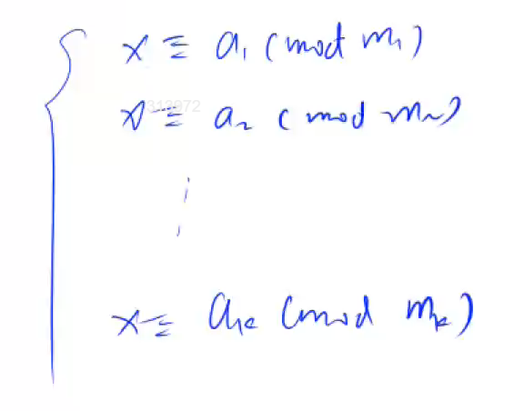

# 中国剩余定理
定义：给定一组两两互质的质数$m
_1$，$m_2$，$m_3$，...，$m_k$，求一个满足线性方程组的x值

此时，我们设：     
$M$ = $m_1*m_2*m_3*...*m_k$      
$M_i$ = $\frac{M}{m_i}$     
$M_i^{-1}$ 表示$M$ mod $m_i$ 的逆元（$M * M_i^{-1}$ mod $m_i = 1$）      
***
所以我们可得x的通式为：    
**$x$ = $a_1*M_1*M_1^{-1}+a_2*M_2*M_2^{-1}+...+a_k*M_k*M_k^{-1}$**    
***
以上，被称为中国剩余定理

## 题一

此题类似于中国剩余定理，但问题来了，我们的$m$之间没有两两互质的限制条件，但是，我们仍然可以通过中国剩余定理的推导过程来做这道题。     
但是这题对我来说需要补充一定的数论知识，在这里我将我补充的记录下来：
### 初等数论之求解二元不定方程
**定理1**    
设二元一次不定方程    
$$ax+by=c\qquad(1)$$


(其中a, b, c是整数, 且a, b都不是0), 假定有一组整数解，$x=x_0,y=y_0$
则原式的一切整数的通解可以表示成

$$\begin{cases} x = x_0 + \frac{b}{(a,b)}t,\\\qquad\qquad\qquad\quad (t\in z)\\ y=y_0+\frac{a}{(a,b)}t,\end{cases}$$
**定理2**    
(1)式有整数等价于 $(a,b)|c$

```cpp
#include <iostream>

using LL = long long;

LL exgcd(LL a,LL b,LL& x,LL& y)
{
	if(!b)
	{
		x = 1, y = 0;
		return a;
	}
	int d = exgcd(b, a % b, y, x);
	y -= (a) / b * x;
	return d;
}

int main()
{
	int n;
	std::cin >> n;

	bool has_answer = true;
	LL a1, m1;
	std::cin >> a1 >> m1;
	for(int i = 0;i<n;i++)
	{
		LL a2, m2;
		std::cin >> a2 >> m2;

		LL k1, k2;
		LL d = exgcd(a1, a2, k1, k2);		//此时d = gcd(a1,a2)
		if((m2-m1)%d)
		{
			has_answer = false;
			break;
		}
		k1 *= (m2 - m1) / d;
		LL t = a2 / d;
		k1 = (k1 % t + t) % t;

		m1 = a1 * k1 + m1;
		a1 = std::abs(a1 / d*a2);
	}
	if(has_answer)
	{
		std::cout << (m1 % a1 + a1) % a1 << std::endl;
	}
	else
		puts("-1");
}
```