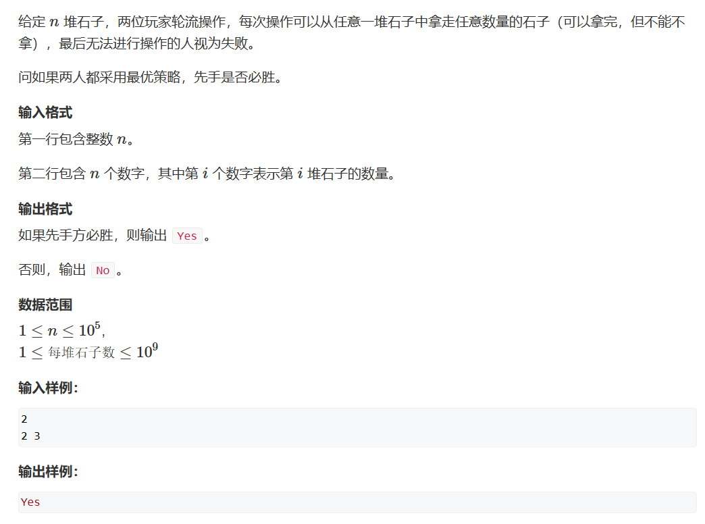
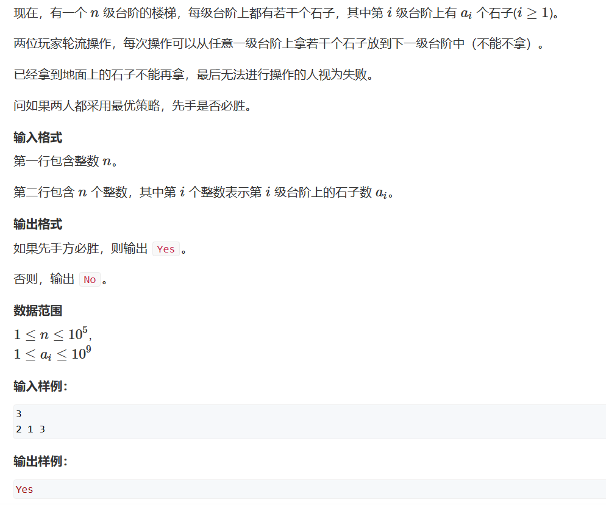
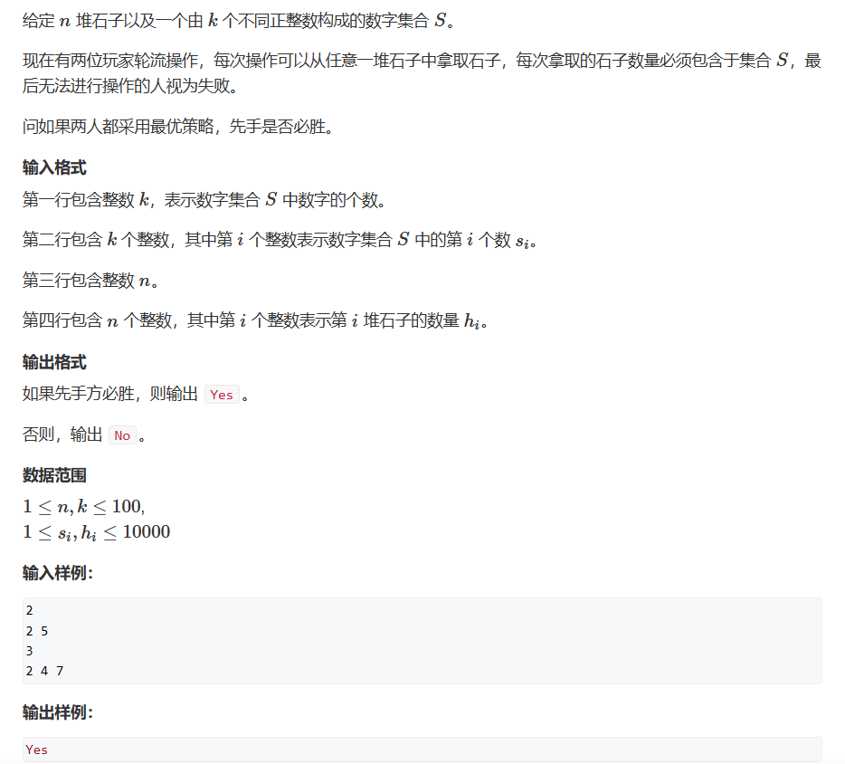
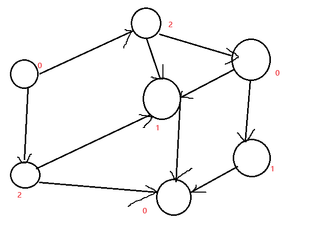
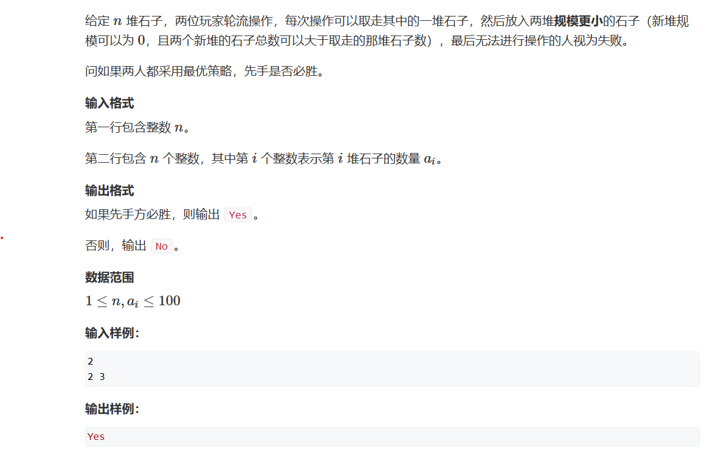

# 博弈论

## 必胜态与必败态
(先手)必败态：无论怎么操作，剩下的状态都是必胜状态   
(先手)必胜态：进行一次操作后，使得剩下的状态变成必败状态
## 题一：NIM游戏


**定理：NIM博弈先手必胜，当且仅当A1^A2^A3^...^An! = 0**

如题设给的示例：
先手者从堆2中取出一个，使得两堆的数量相等，之后，先手者只需要镜像地从石堆里拿出后手者取的石头，那么必定使得后手者输

这样，我们的代码只需要求所有石子的异或值即可：

$$
A_1\bigoplus A_2\bigoplus A_3\bigoplus ...\bigoplus A_n  =\begin
{cases}
0\qquad \qquad终点\\    
x\neq 0\qquad 一定可以通过从某一堆中拿走若干个石子使得答案为0   
\end{cases}
$$

如何证明呢？   
首先我们假设：$x$的二进制表示中最高的一位1在第$k$位，那么$A_1\sim A_n$中一定存在奇数个$A_i$的二进制第$k$位是1

那么我们知道$A_i\bigoplus x<A_i$是一定成立的（自己举个例子试试就知道了），之后，我们从$A_i$中拿走$A_i-(A_i\bigoplus x)$个石子，那么我们的$A_i$就会变成$A_i\bigoplus x$那么就相当于：
$$A_1\bigoplus A_2\bigoplus A_3\bigoplus ...\bigoplus A_n\bigoplus x = x\bigoplus x = 0$$
***
以上是我们求值的方法，接下来我们要证明：先手者如此操作后，进入镜像对取，无论后手者怎么选，他一定会是必败态：

我们使用反证法：我们假设——当$A_1\bigoplus A_2\bigoplus A_3\bigoplus ...\bigoplus A_n=0$时，无论后手者怎么取，更新答案一定等于0

1. 我们将原式与更新式异或，那么就只剩下$A_i\bigoplus A_i' = 0$，
2. 那就代表着$A_i = A_i'$，就出现了矛盾（因为$A_i'<A_i但一定不等于A_i$），
3. 那么我们就能证明出，当$A_1\bigoplus A_2\bigoplus A_3\bigoplus ...\bigoplus A_n=0$时，无论后手者怎么取，更新答案一定不等于0。也就是说，当先手者如此操作后，无论后手者怎么选，他一定会是必败态，先手者一定会成为必胜态。
***

***
那么最后，我们只需要判断先手者初始值是否为0（先手即进入镜像对取）即可：
```cpp
#include <iostream>
int main()
{
	int n,res,t;
	std::cin >> n>>res;
	n--;
	while(n--)
	{
		std::cin >> t;
		res ^= t;
	}
	if (!res)
		std::cout << "No";
	else
		std::cout << "Yes";
}
```

## 题二

此题的先手必胜策略为：奇数级台阶上的石子$A_1\bigoplus A_2\bigoplus A_3\bigoplus ...\bigoplus A_{2n-1}=x\neq 0$

证明：

1. 假设$x\neq 0$，那我们必定存在一种取法使得$x=0$；
2. 此时如果对手从偶数级台阶取石子，那我们将其移到下一台阶的石子再移向下一个台阶，那么我们的奇数级台阶的状态不变；
3. 此时如果对手从奇数级台阶取石子，那么抛回去给先手者的$x一定\neq 0$，此时又回到1中，当然，我们知道这个取法就是从其他任意一个奇数级阶梯移走相同数量的石子即可。

```cpp
#include <iostream>

int main()
{
    int n,res,t;
    std::cin>>n>>res;
    n--;
    while(n--)
    {
        std::cin>>t;
        if(n&1)
            res^=t;
    }
    if(res)
        std::cout<<"Yes";
    else
        std::cout<<"No";
}
```

## 题三



先定义一个运算：   
Mex运算：设$S$表示一个非负整数集合。定义$mex(S)$为求出不属于集合$S$的最小非负整数的运算，即:$mex(S) = min{x}$，$x$属于自然数，且$x$不属于$S$

定义一个函数：   
SG函数：在有向图游戏中，对于每个节点$x$，设从$x$出发共有$k$条有向边，分别到达节点$y_1,y_2,....,y_k$ 的SG函数值构成的集合再执行$mex(S)$运算的结果，即：
$$SG(x) = mex(SG(y_1),SG(y_2),...,SG(y_k))$$
特别的，整个有向图游戏G的SG函数值被定义为有向图游戏起点s的SG函数值，即$SG(G)=SG(S)$

定义完这两种运算后，我们举个例子：

我们先设没有出度的节点为0，那么根据SG函数，我们可以看到每一个节点的值都是能到达节点的数值之外的最小的自然数，并且每个非0节点都能到达数值为0的节点，但数值为0的节点无法到达数值为0的节点

所以最后我们只需要判断
$$SG(x_1)\bigoplus SG(x_2)\bigoplus ...\bigoplus SG(x_n)$$
的值就可以了

代码：
```cpp
#include <iostream>
#include <cstring>
#include <unordered_set>

const int N = 110, M = 10010;
int n, m;
int s[N], f[M];
int sg(int x)
{
	if (f[x] != -1) return f[x];	//如果已经有这个值了，返回就行
	std::unordered_set<int> S;
	for (int i = 0; i < m; i++)
	{
		int sum = s[i];
		if (x >= sum) S.insert(sg(x - sum));
	}
	for (int i = 0;; i++)
		if (!S.count(i))        //这里就是我们优化的地方
			return f[x] = i;	//将这个节点对应的sg值赋给它，这里我们的f数组并不需要初始化，因为我们是从递归终点开始赋值，那么只要是同一个数为根节点，那么它们所生成的数也是一致的，那么同一个数的sg值也是一样的
}

int main()
{
	int res = 0;
	std::cin >> m;
	for (int i = 0; i < m; i++)
		std::cin >> s[i];
	std::cin >> n;
	memset(f, -1, sizeof f);    //初始化我们的f数组，-1默认都没访问过
	for (int i = 0; i < n; i++)
	{
		int x;
		std::cin >> x;
		res ^= sg(x);
	}
	if (res) std::cout << "Yes";
	else std::cout << "No";
}
```

## 题四



此题先解释一下题意：n堆石子随便拿走一堆石子，然后再新增加两堆石子，但单堆的石子数不能等于或多于拿走的那一堆，可以为0。按照题意一直往后分，当没有石堆或每个石堆都只有一个石子时游戏结束。

那么我们只需要求每个堆的$SG(x)$值就可以了

```cpp
#include <iostream>
#include <cstring>
#include <unordered_set>

const int N = 110;

int n,f[N];

int sg(int x)
{
	if (f[x] != -1) return f[x];
	std::unordered_set<int> S;
	for (int i = 0; i < x; i++)
		for (int j = 0; j <= i; j++)
			S.insert(sg(i) ^ sg(j));
	for (int i = 0;; i++)
		if (!S.count(i))
			return f[x] = i;
}
int main()
{
	std::cin >> n;
	memset(f, -1, sizeof f);

	int res = 0;
	while(n--)
	{
		int t;
		std::cin >> t;
		res ^= sg(t);
	}
	if (res) puts("Yes");
	else puts("No");
}
```


## 公平组合游戏ICG

若一个游戏满足：

1. 两名玩家交替行动
2. 在游戏进程的任意时刻，可以执行的合法行动与轮到哪名玩家无光
3. 不能行动的玩家判负

则称该游戏为一个公平组合游戏。
NIM博弈属于公平组合游戏，但城建的棋类游戏，比如围棋，就不是公平组合游戏。因为围棋交战双方只能分别使用黑子和白子，胜负判断也比较复杂，不满足条件二和三。
