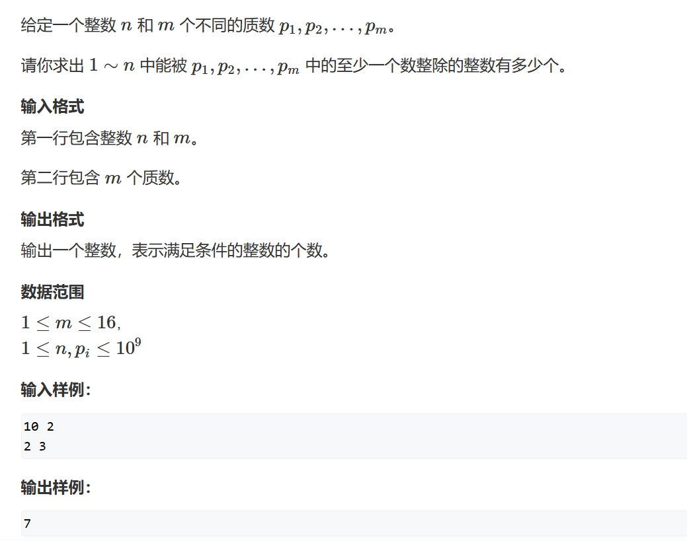
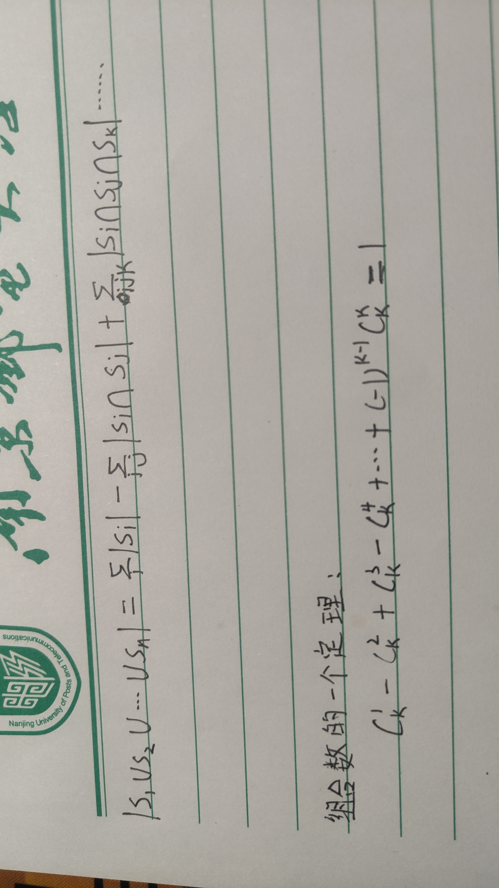

# 容斥原理

## 题一



容斥原理总结下来一个公式：

这里的加减很奇妙，是$(-1)^{n-1}$

因为$p$是质数，那么它在1~n中最多出现$\frac{n}{p_1}$个，如：
$$S_1 = \frac{n}{p_1}$$
同时，因为$p$都是质数，那么代表它们互质，那么能同时被$p_ip_k...$整除的数，其实就是$n$除以它们的最小公倍数，而最小公倍数就是它们之间相乘，如：
$$S_1\cap S_2= \frac{n}{p_1p_2}$$ 

接下来我们就可以考虑枚举的方式了，我们可以选择DFS去暴力枚举，但其实像这样的出现全部枚举时，我们会使用另外一种方法：位运算枚举

## 位运算枚举

我们一共有$n$个集合，那么$2^n-1$恰好能表示我们哪几个集合选，哪几个不选，例如在$i=7时，我们的二进制数 = 1101$此时就表示我们选择了$S_1\cap S_3\cap S_4$此时我们确定加减，由我们之前的推导可知，奇数项的交集是$+$ ，偶数项的交集是$-$

所以最后我们写出我们的代码，这题主要是化简的思路难想：
```cpp
#include <iostream>

const int N = 20;
using LL = long long;
int n, m;
int p[N];

int main()
{
	std::cin >> n >> m;
	for (int i = 0; i < m; i++) std::cin >> p[i];

	int res = 0;
	for(int i = 1;i<1<<m;i++)
	{
		int t = 1;	    //当前质数的乘积
		int cnt = 0;    //包含的1的数量，也就是集合的数量
		for(int j = 0;j<m;j++)
		{
			if (i >> j & 1)
			{
				cnt++;
				if((LL)t*p[j]>n)    //如果我们除数大于被除数，很自然我们就没有这个数
				{
					t = -1;
					break;
				}
				t *= p[j];
			}
		}
		if(t!=-1)
		{
			if (cnt % 2) res += n / t;  //偶数个集合为+
			else res -= n / t;          //奇数个集合为-
		}
	}
	std::cout << res;
}
```

