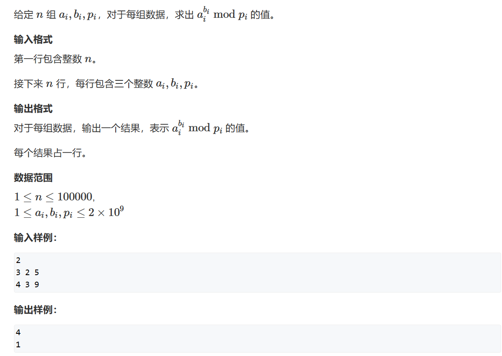

# 快速幂
O(logn)    
## 题一

在类似求一个指数模上一个数值时，如果我们将其一个一个乘起来，那么时间复杂度将是O(n) ，对于一个大幂数这是一个很糟糕的算法，此时我们就应该使用快速幂算法，它的时间复杂度被大大压缩到O(logn)     


```cpp
using LL = long long;
LL power(int a,int b,int c)
{
    LL res = 1;
    while(b)
    {
        if(b & 1) res = res * a % c;
        b >>= 1;
        a = a * (LL)a % c;
    }
    return res;
}
```

## 题二

什么是逆元？    

对于a / b，如果答案是一个整数，那么如果我们能找到一个数x，使得a * x与a / b同时mod m相等，那么我们称x为b mod m的逆元。    
我们将x记作$b^{-1}$(这个$b^{-1}$可不是1/b)    
化简可得：


在此题中，我们的m是一个质数，且m与b互质，那么由费马定理可知：    
$b^{p-1}$ = 1 (mod p)即     
b * $b^{p-2}$ = 1 (mod p)      

那么最后，我们的问题就变成了求 **$b^{p-2}$**
```cpp
#include <iostream>

using LL = long long;
LL power(int a,int b,int c)
{
	LL res = 1;
	while(b)
	{
		if (b & 1) res = res * a % c;
		b >>= 1;
		a = a * (LL)a % c;
	}
	return res;
}
int main()
{
	int n;
	std::cin >> n;
	while(n--)
	{
		int a, b;
		std::cin >> a >> b;
		LL res = power(a, b - 2, b);
		if (a % b == 0) std::cout << "impossible\n";
		else std::cout << res << std::endl;
	}
}
```


