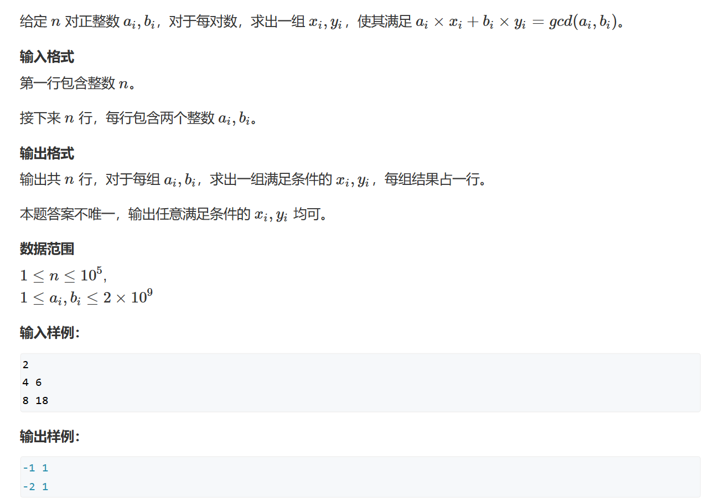

# 扩展欧几里得算法
其实就是辗转相除法    
对于辗转相除法的证明，和扩展欧几里得算法的证明，可参考文章
https://zhuanlan.zhihu.com/p/100567253?utm_campaign=&utm_medium=social&utm_oi=1265773278007767040&utm_psn=1687548005023055872&utm_source=qq
## 裴蜀定理
定义：对任意一对正整数a, b，那么一定存在非零整数x, y，使得$ax + by = k*gcd(a, b)\qquad k\geq 0 \bigcap k\in z$ （指a 和b 的最大公约数的倍数）    
ax + by = d 那么d 一定是最大公约数的倍数     
同时a % b = a - (a / b) * b，因为计算机不会打开括号约分数，那么a / b会向下取整     
***
小注：
***
## 题一

```cpp
#include <iostream>


int exgcd(int a,int b,int& x,int& y)
{
	if (!b)
	{
		x = 1, y = 0;
		return a;
	}
	int d = exgcd(b, a % b, y, x);
	y -= a / b * x;
	return d;
}

int main()
{
	int n;
	scanf("%d", &n);

	while(n--)
	{
		int a, b,x,y;
		scanf("%d%d", &a, &b);
		exgcd(a, b, x, y);
		std::cout << x << " " << y << std::endl;
	}
}
```
