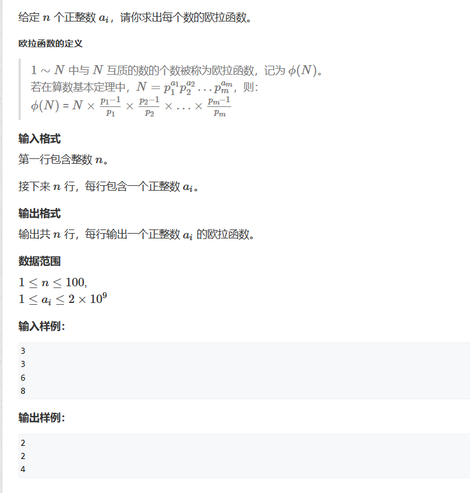
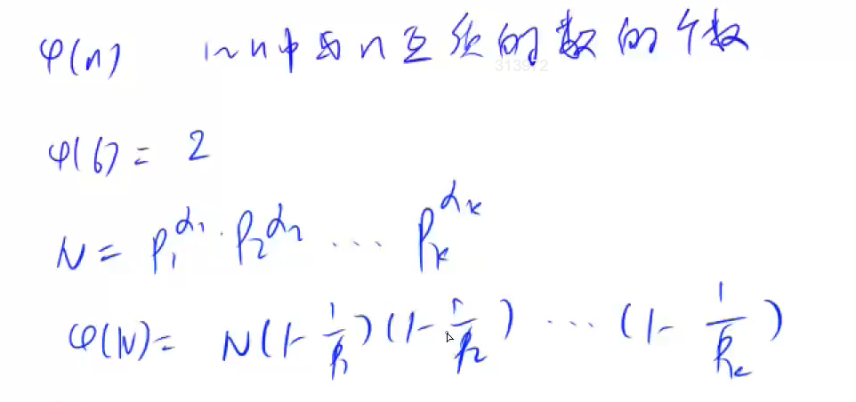

# 欧拉函数
O($\sqrt{n}$)    
## 题一

欧拉函数的定义：
1 ~ N 中与N 互质的个数被称为欧拉函数，记为$\Phi$(N)

```cpp
#include <iostream>
int n;
int main()
{
	std::cin >> n;
	while(n--)
	{
		int a;
		std::cin >> a;
		int res = a;
		for(int i = 2;i<=a/i;i++)
			if(a%i==0)
			{
				res = res/i * (i - 1);
				while (a % i == 0) a /= i;
			}
		if (a > 1) res = res / a * (a - 1);
		std::cout << res << std::endl;
	}
}

```

## 题二
