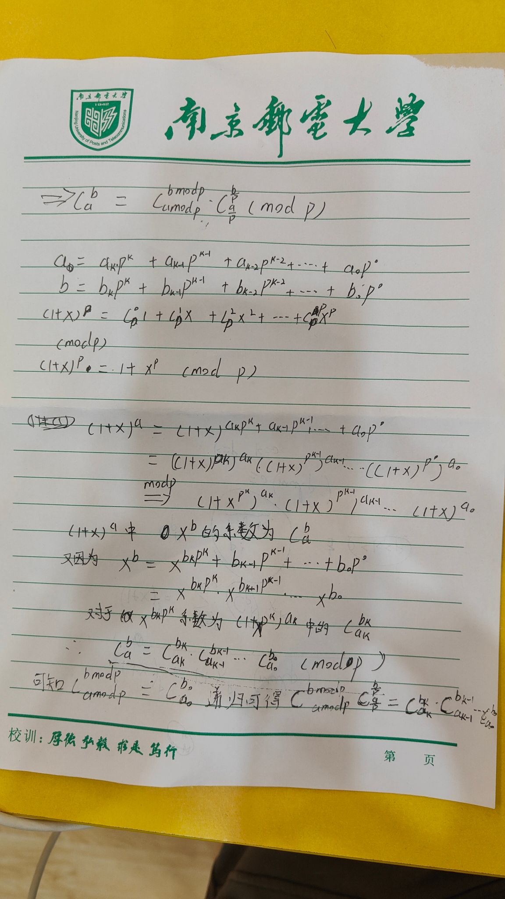

# 求组合数

在做求组合数的题目时，我们需要注意以题目给的数据范围来选择不同的方式

## 题一


我们知道在组合数中有这么一个公式：

$$C^a_b = C^b_{a-1} + C^{b-1}_{a-1} $$

不理解这个公式？   
我们从a个人中需要选出b个班委，此时我们可以将问题分成两个部分来解决：    
1. 已经内定某个人是班长，那么我们只需要从a-1个人中再选出b-1班委
2. 已经内定某个人不能是班长（被排挤辣！），那么我们只能从a-1个人中选出我们需要的b个班委

那么我们使用两重循环就可以预处理出所有$C^a_b$的值，我们需要的时候查表就行（空间换时间）

```cpp
#include <iostream>
const int MOD = 1e9+7,N=2010;
int n;
int c[N][N];
void init()     //初始化
{
	for (int i = 0; i < N; i++)
		for (int j = 0; j <= i; j++)
			if (!j) c[i][j] = 1;        //Cn0是1
			else c[i][j] = (c[i - 1][j] + c[i - 1][j - 1])%MOD;
}
int main()
{
    init();
	std::cin >> n;
	while(n--)
	{
		int a, b;
		std::cin >> a >> b;
		std::cout << c[a][b] << std::endl;
	}
}
```

## 题二
注：此题数据标注有错，一定要设置为10w+
***


题一与题二的区别是什么呢？    
数据大小变了，上题是2000个数据，这次为10000（不为10w是为了照顾java），在这个量级下，如果继续使用题一的公式走DP的思路那么会TLE，此时我们的预处理思路就需要优化。      

由
$$C^b_a = \frac{a!}{b!*(a-b)!} $$

可知，我们需要的是
$$C^b_a\quad mod\quad c$$

但是
$$\frac{a!}{b!*(a-b)!}\quad mod\quad c \neq \frac{a!\quad mod\quad c }{b!*(a-b)!\quad mod\quad c}$$

所以我们需要将除法转换为乘法，那么我们就需要求得$b!\quad mod\quad c$ 的逆元与$(a-b)!\quad mod\quad c$ 的逆元，从而转换为：   
$$a!*b!^{-1}*(a-b)!^{-1}\quad mod\quad c$$

而由费马小定理：
$$a^{p-1}\quad mod\quad p =1 \qquad (p与a互质)$$
我们可知：
$$a^{c-2}就是a的逆元$$

从而，我们写出代码此题需要注意算式中及时地进行类型转换：
```cpp
#include <iostream>
using LL = long long;
const int N = 100010,MOD = 1e9+7;
int n,fact[N],infact[N];

int qmi(int a,int b)
{
	int res = 1;
	while(b)
	{
		if (b & 1) res = (LL)res * a % MOD;
		a = (LL)a * a % MOD;
		b >>= 1;
	}
	return res; 
}

void init()
{
	fact[0] = infact[0] = 1;
	for(int i = 1;i<N;i++)
	{
		fact[i] = (LL)fact[i - 1] * i % MOD;
		infact[i] = (LL)infact[i - 1] * qmi(i, MOD - 2) % MOD;
	}
}

int main()
{
	init();
	std::cin >> n;
	while(n--)
	{
		int a, b;
		std::cin >> a >> b;
		std::cout << (LL)fact[a] * infact[b]%MOD * infact[a - b] % MOD<<"\n";
	}
}
```

## 题三


此题需要注意数的范围超级大！

这题需要用到Lucas定理

### Lucas定理

O(plogNlogp)

$$C_a^b \quad mod\quad p= C_{amodp}^{bmodp}*C_{a/p}^{b/p}\quad mod\quad p$$

这就是Lucas定理    
证明：   
令（将a、b转换为p进制数）：   
$$a=a_kp^k+a_{k-1}p^{k-1}+...+a_0p^0\qquad(1)$$
$$b=b_kp^k+b_{k-1}p^{k-1}+...+b_0p^0\qquad(2)$$
又因为二项式展开定理：
$$(1+x)^p=C_p^0+xC_p^1+x^2C_p^2+...+x^pC_p^p\qquad(3)$$
由于p是质数，所以p中是不包含小于p的质因子的，所以当上式对p取模后，右式除第一项和最后一项外将被全部消掉！
那么我们就能得到这样一个等式：
$$(1+x)^p{^k}\quad mod\quad p^k = 1+x^p{^k}$$

对于(1)、(2)和(3)可化下式：

$$(1+x)^a\quad mod\quad p = (1+x)^a*((1+x)^{p^1})^{a_1}*((1+x)^{p^2})^{a_2}*...*((1+x)^{p^k})^{a_k}\quad mod\quad p\\=(1+x)^{a_0}*(1+x^p)^{a_1}*(1+x^{p^2})^{a_2}*...*(1+x^{p^k})^{a_k}\quad (4)$$

那么我们从$a$个$(1+x)$中选出$b$个&x&来，那我们$x^b$的系数就为$C_a^b$，又因为(2)(4)可知：
$$x^b = x^{b_kp^k+b_{k-1}p^{k-1}+...+b_0p^0}$$
那么：
$$x^{{b_k}p^k}是(1+x^{p^k})^{a_k}中的C_{a_k}^{b_k}*x^{{b_k}{p^k}}$$

$$C_a^b\quad mod\quad p =C_{a_k}^{b_k}C_{a_k-1}^{b_k-1}...C_{a_1}^{b_1}C_{a_0}^{b_0} $$

这里我们写的详细一些：     
我们已经将$a、b$转换为了$p$进制，那么$a\quad mod\quad p$的结果就是余数，表现出来就是$a_0$，同理$b\quad mod\quad p = b_0$，再说的简单一点，我们将$a、b$对$p、p^2、p^3、....、p^k$迭代取模，这些数的乘积就是$C_{a_k}^{b_k}C_{a_k-1}^{b_k-1}...C_{a_1}^{b_1}C_{a_0}^{b_0}$，其实就是Lucas定理不断递归下去得到的最终结果。

手写证明：


最终代码，在这里感谢伍老师在lucas定理证明上给予的帮助
```cpp
#include <iostream>
using LL = long long;
const int N = 30;
int fact[N], infact[N];
int n;

int qmi(int a,int b,int c)
{
	int res = 1;
	while(b)
	{
		if (b & 1) res = (LL)res * a % c;
		a = (LL)a * a % c;
		b >>= 1;
	}
	return res;
}

int C(int a,int b,int c)	//计算组合数
{
	if (b > a) return 0;
	int res = 1;
	for(int i = 1,j = a;i<=b;i++,j--)	//模拟阶乘
	{
		res = (LL)res * j % c;
		res = (LL)res * qmi(i, c - 2, c) % c;	//使用逆元思想和费马小定理来简化计算
	}
	return res;
}

int lucas(LL a,LL b,int c)
{
	if (a < c && b < c) return C(a, b,c);
	return (LL)C(a % c, b % c, c) * lucas(a / c, b / c, c) % c;	//递归过程，如之前的证明，我们只需要将每一次的余数用来求C，然后累积即可
}

int main()
{
	std::cin >> n;
	while(n--)
	{
		LL a, b;
		int c;
		std::cin >> a >> b >> c;
		std::cout << lucas(a, b, c) << std::endl;
	}
}
```

## 题四
$O(n\sqrt{n})$


对于此题，我们先将$C_a^b$分解质因数

$$C_a^b=\frac{a*(a-1)*...*a(a-b+1)}{b*(b-1)*...*1}\\
\quad\\
=p_1^{\alpha_1}p_2^{\alpha_2}*...*p_k^{\alpha_k}$$

如何计算呢？

在$\frac{a!}{b!(a-b)!}\quad mod\quad p$中，我们先算出分子中有多少个$p$，分母中又有多少个$p$，那么质因数$p$地个数就是它两相减

那么我们又怎么知道$a!$中有多少个$p$呢？

由我们题三中将$a$按$p$进制转换地过程可以知道：
$$N(a_p) = [\frac{a}{p}]+[\frac{a}{p^2}]+[\frac{a}{p^3}]+...+[\frac{a}{p^k}]\qquad (p^k<a)$$
(以上除法均为向下取整)
所以，其实我们的答案就等于所有质因数的乘积，因为答案会很大，所以我们使用高精度乘法：

```cpp
#include <iostream>
#include <vector>
const int N = 5010;
int primes[N], cnt;
int sum[N];
bool st[N];
void get_primes(int n)  // 线性筛质数
{
	for (int i = 2; i <= n; i++)
	{
		if (!st[i]) primes[cnt++] = i;
		for (int j = 0; primes[j] <= n / i; j++)
		{
			st[primes[j] * i] = true;
			if (i % primes[j] == 0) break;
		}
	}
}
std::vector<int> mul(std::vector<int>& A,int b)
{
	std::vector<int> C;
	int t=0;
	for(int i = 0;i<A.size();i++)
	{
		t += A[i] * b;
		C.push_back(t % 10);
		t /= 10;
	}
	while(t)
	{
		C.push_back(t % 10);
		t /= 10;
	}
	return C;
}

int get(int n,int p)	//求n!中包含的p的个数
{
	int res = 0;
	while(n)
	{
		res += n / p;
		n /= p;
	}
	return res;
}
int main()
{
	int a, b;
	std::cin >> a >> b;

	get_primes(a);

	for(int i = 0;i<cnt;i++)
	{
		int p = primes[i];
		sum[i] = get(a,p) - get(b,p) - get(a - b,p);	//计算有多少个质数primes[i]
	}
	std::vector<int> res;
	res.push_back(1);

	for (int i = 0; i < cnt; i++)
		for (int j = 0; j < sum[i]; i++)
			res = mul(res, primes[i]);	//将所有质数乘起来
	for (int i = res.size() - 1; i >= 0; i++)
		std::cout << res[i];

	std::cout << 0;
}
```

## 题五


此题我们将问题转换：求有几条到达点(n, n)路径使得在路途的任意一点右转数量（用0表示）大于向上走（用1表示）


这样，我们只需要保证我们所有的点都在两点连线的线上或下方即可，那么我们采用补集的思想去求我们的答案——求路径出现在两点连线上方的路径

我们一共有n段路，但是我们只需要做出$\frac{n}{2}$次选择，所以我们路径的总数是
$$C_n^{n/2}$$

此时如果我们将轴线向上移动一个单位，以其为我们的对称轴：


我们规定，当我们的路线穿过红色对称性时同时画出它的对称路径，那么，我们会发现，所有穿过红色对称性到达点(n, n)的路径都会一一对应最终到达点(n-1, n+1)的路径，这样，我们就可以确定经过红色线的路径总数一定为：
$$C_n^{(n/2) -1}$$

为了简化计算我们将设置为：
$$res = C_{2n}^{n}-C_{2n}^{n-1}$$

对于这个等式，我们可以进一步化简：
$$res = C_{2n}^{n}-C_{2n}^{n-1}\\
=\frac{(2n)!}{(n!)^2}-\frac{(2n)!}{(n-1)!(n+1)!}\\
=\frac{(2n)!(n+1)}{(n!)(n+1)!}-\frac{(2n)!n}{(n)!(n+1)!}\\
=\frac{(2n)!}{(n!)(n+1)!}\\
=\frac{1}{(n+1)}\frac{(2n)!}{(n!)^2}\\
=\frac{1}{n+1}C_{2n}^n$$

所以我们化得等式：
$$res = C_{2n}^{n}-C_{2n}^{n-1}=\frac{1}{n+1}C_{2n}^n$$

以上被称为卡特兰数

我们仍然采用快速幂和费马小定理求逆元，以转换我们得算式，最后我们写出代码：
```cpp
#include <iostream>
using LL = long long;
const int MOD = 1e9 + 7;
int n;
int qmi(int a,int b,int c)
{
	int res = 1;
	while(b)
	{
		if (b & 1) res = (LL)res * a % c;
		a = (LL)a * a % c;
		b >>= 1;
	}
	return res;
}

int main()
{
	std::cin >> n;

	int res = 1;
	for (int i = 2*n; i >= n+1; i--) res = (LL)res * i % MOD;

	for (int i = 1; i <= n; i++) res = (LL)qmi(i, MOD - 2, MOD) * res % MOD;

	res = (LL)res * qmi(n + 1, MOD - 2, MOD) % MOD;

	std::cout << res;
	
}
```


