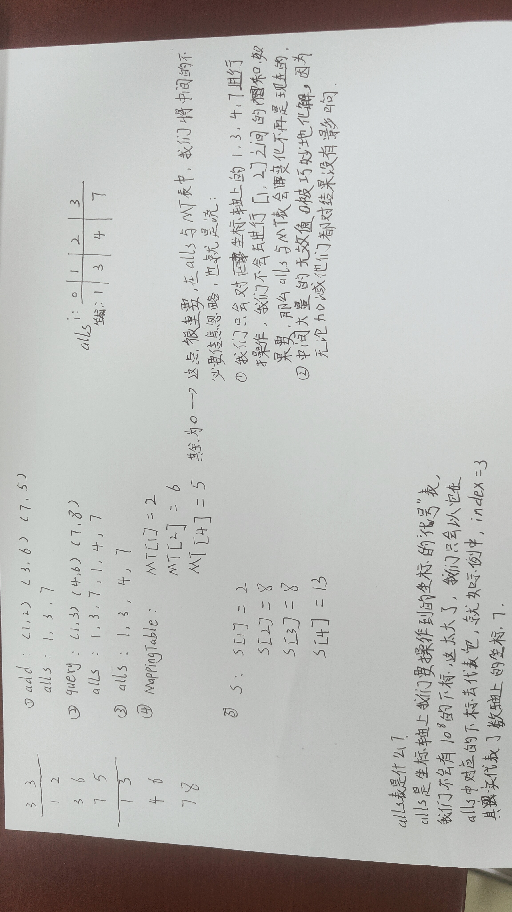

# 离散化
一般运用于将离散的区间整合到一个有序的区间中。我们直接看题目

根据题目，我首先写出了自己的方法：
```cpp
#include <iostream>
#include <vector>
#include <utility>
#include <algorithm>
int main()
{
	long long n, m;
	std::cin >> n >> m;
	std::vector<std::pair<long long, int>> list;
	std::pair<long long, int> temp;
	while(n--)
	{
		std::cin >> temp.first >> temp.second;
		list.push_back(temp);
	}
	std::sort(list.begin(), list.end(), [](auto& l,auto& r) { return l.first < r.first; });
	//list.erase(std::unique(list.begin(), list.end(),[](auto& l, auto& r) {return l.second == r.second; }),list.end());
	long long l, r;
	while(m--)
	{
		std::cin >> l >> r;
		auto leftItr = std::find_if(list.begin(), list.end(), [&](auto& it) {return it.first >= l; });
		auto rightItr = std::find_if(list.begin(), list.end(), [&](auto& it) {return it.first > r; });
		rightItr-=1;
		int sum = 0;
		for(;leftItr!=list.end()&&leftItr<=rightItr;++leftItr)
		{
			sum += leftItr->second;
		}
		std::cout << sum <<std::endl;
	}
}
```
理所当然的，超时了。   

这时就得看题解了，题解的方法是离散化，与哈希表的思路很相似：
```cpp
#include <iostream>
#include <vector>
#include <algorithm>
#include <utility>
const int N = 300010;
int n, m;
int MappingTable[N], s[N];
std::vector<int> alls;
std::vector<std::pair<int, int>> add, query;
int find(int x)	//目的是找到第一个大于等于x的位置
{
	int l = 0, r = alls.size()-1;
	while(l<r)
	{
		int center = l + r >> 1;
		if (alls[center] >= x)
			r = center;
		else
			l = center + 1;
	}
	return r+1; //+1的目的是从1开始映射，也可不加，但是从0开始映射可能在思路是会比较复杂
}
int main()
{
	std::cin >> n >> m;
	for (int i = 0; i < n; ++i)    //1
	{
		int x, c;
		std::cin >> x>> c;
		add.push_back({ x, c });

		alls.push_back(x);
	}
	for(int i = 0;i<m;++i)          //2
	{
		int l, r;
		std::cin >> l >> r;
		query.push_back({ l,r });

		alls.push_back(l);
		alls.push_back(r);
	}

	std::sort(alls.begin(), alls.end());
	alls.erase(std::unique(alls.begin(), alls.end()),alls.end());       //3

	for(auto& it : add)     //4
	{
		int x = find(it.first);
		MappingTable[x] += it.second;
	}

	for (int i = 1; i <= alls.size(); ++i)      //5
		s[i] = s[i - 1] + MappingTable[i];

	for(auto item:query)        //前缀和的输出
	{
		int l = find(item.first), r = find(item.second);
		std::cout << s[r] - s[l - 1] << std::endl;
	}
}
```
***
贴图！

为了避免看不懂我的字，手打一遍：   
4.中：MappingTable的其余值为0，这点很重要，在alls与MT表中，我们将中间的不必要信息忽略了，也就是说：   
① 我们只会对坐标轴上的1，3，4，7进行操作，我们不会去进行[1, 2]直接的和，如果需要，那么我们的alls与MT表就必须发生变化。    
② 中间大量的无效值0被巧妙地化解，因为无论加减他们都对结果没有影响，我们只在意那些需要操作地坐标。
***
## alls表是什么？   
alls是坐标轴上我们要操作到地坐标的“代号”表，我们不会有10的8次方的下标，它太大了，我们只会以它在alls中对应的下标去代表它，就如实例中，index = 3，其实际上代表了数轴上的坐标 7 。
***
## 为什么N = 300010?   
根据题意，n与m的范围都在10的5次方以内，也就是100000以内，那么题意就是会有n+2m的数据要先存入alls中（排序去重之前），那么就最多会有300000也就是30w的数据，多出来的10是为了防止不必要的越界。
***
## 为什么要排序+去重？    
因为一个坐标只能对应一个alls的下标，所以我们需要先去重，排序是为了方便二分查找的使用，否则乱糟糟的，谁知道谁代表谁呢？
***
