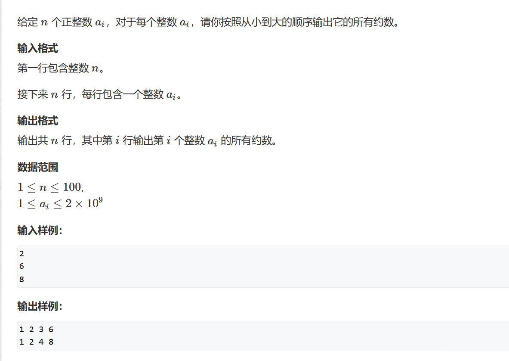

# 约数
## 题一

如果正常从1遍历到n，那么一定TLE，那此时可以想到一个数的因数最多到std::sqrt(x)，又因为因数是对称地成对地出现，我们用一个数组去存储然后倒序输出即可     
自己的写法：
```cpp
#include <iostream>
#include <cmath>
const int N = 110;
int nums[N];
int nums_back[N];
int main()
{
    int n;
    std::cin>>n;
    for(int i =0;i<n;i++)
        std::cin>>nums[i];
    int idx = 0;
    while(idx<n)
    {
        int count = 0;
        int Sqrt = std::sqrt(nums[idx]);
        for(int i = 1;i<=Sqrt;i++)
            if(nums[idx]%i==0){
                std::cout<<i<<" ";
                nums_back[count++] = nums[idx]/i;
            }
        for(int i = count-1;i>=0;i--)
          { 
              if(nums_back[i]!=Sqrt)
                std::cout<<nums_back[i]<<" ";
          }
        idx++;
        std::cout<<std::endl;
    }
}

```
y总法：
```cpp
#include <iostream>
#include <algorithm>
#include <vector>

using namespace std;

vector<int> get_divisors(int x)
{
    vector<int> res;
    for (int i = 1; i <= x / i; i ++ )
        if (x % i == 0)
        {
            res.push_back(i);
            if (i != x / i) res.push_back(x / i);
        }
    sort(res.begin(), res.end());
    return res;
}

int main()
{
    int n;
    cin >> n;

    while (n -- )
    {
        int x;
        cin >> x;
        auto res = get_divisors(x);

        for (auto x : res) cout << x << ' ';
        cout << endl;
    }

    return 0;
}
```
总的来说个人觉得比y总的快一些，y总调用的push_back函数以及排序都是消耗时间的

## 题二

此题需要补充一些数学知识：     

为什么约数个数要+1呢？因为每一个P（质因数）都有0~$\alpha$种共$\alpha$+1种选择的方法，根据组合方式，我们就能有如图约数个数。
```cpp
#include <iostream>
#include <unordered_map>
const int N = 110, mod = 1e9 + 7;
using LL = long long ;
std::unordered_map<int, int> Primes;    //用hash表存最小质因数集合的个数
int main()
{
	int n;
	std::cin >> n;

	for (int i = 0; i < n; i++)
	{
		int a;
		std::cin >> a;
		for (int j = 2; j <= a / j; j++)
			while(a%j==0)
			{
				a /= j;
				Primes[j]++;
			}
		if (a > 1) Primes[a]++;
	}
	LL res = 1;
	for (auto& prime : Primes) res = res * (prime.second+1) % mod;
	std::cout << res;
}
```

## 题三

```cpp
#include <iostream>
#include <unordered_map>
const int N = 110, mod = 1e9 + 7;
using LL = long long ;
std::unordered_map<int, int> Primes;
int main()
{
	int n;
	std::cin >> n;

	for (int i = 0; i < n; i++)
	{
		int a;
		std::cin >> a;
		for (int j = 2; j <= a / j; j++)
			while(a%j==0)
			{
				a /= j;
				Primes[j]++;
			}
		if (a > 1) Primes[a]++;
	}
	LL res = 1;
	for (auto& prime : Primes)		//相信大伙都看得懂吧（）
	{
		LL l = prime.first;
		LL r = prime.second;
		LL temp = 1;
		while (r--) temp = (temp * l + 1) % mod;
		res = res * temp % mod;
	}
	std::cout << res;
}
```

## 题四 —— 最大公因数 ：欧几里得法 （辗转相除法）

辗转相除法，不用多说了吧QAQ
```cpp
#include <iostream>
int main()
{
	int n;
	std::cin >> n;
	while(n--)
	{
		int a, b;
		std::cin >> a >> b;
		while(a%b)
		{
			int c = a % b;	//c较小
			a = b;
			b = c;
		}
		std::cout << b<<std::endl;
	}
}
```