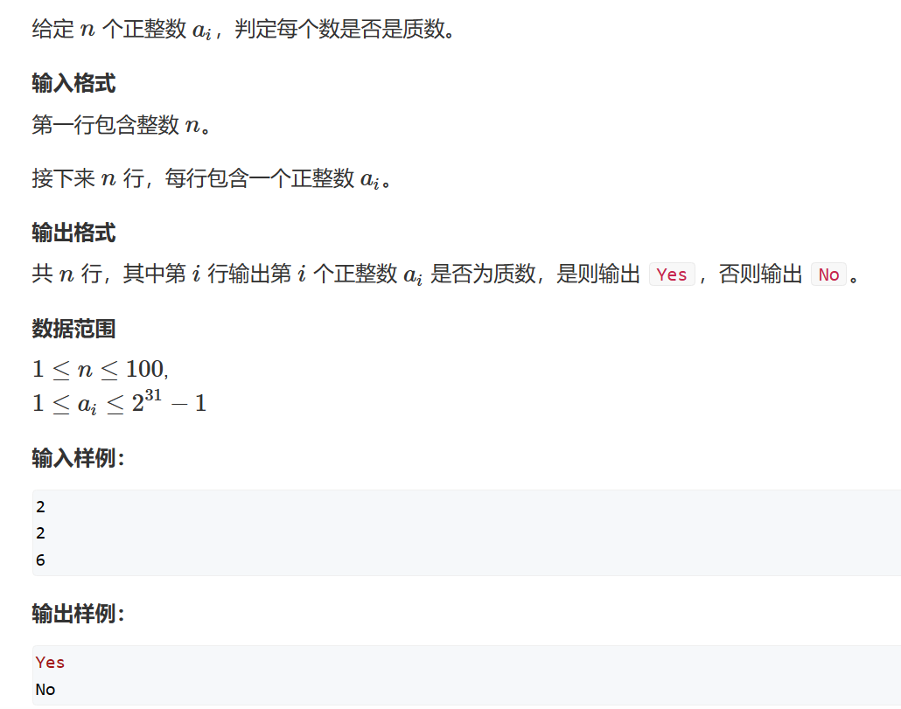
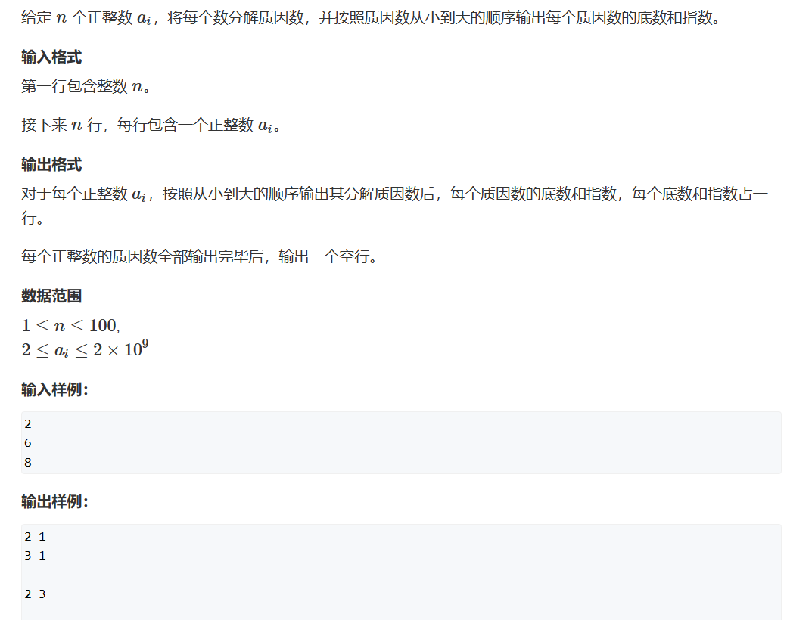

# 质数
质数、素数，一个东西，也就是除了本身和1不能整除自己的数，质数有哪些性质呢？     
1. 1~n 中一共有 n/lnn 个质数    
2. 一个数的因数总是成对出现，如果i是n的因数，那么n/i一定也是n的因数，所以，一个可以用 i<=n/i 来作为判断质数的阈值    

## 题一

```cpp
#include <iostream>

const int N = 110;
int n;
bool isPrime_1(int x)     //最慢
{
    if(x<2) return false;
    for(int i=2;i<n;i++)
    {
        if(x%i==0) return false;
    }
    return true;
}
bool isPrime_2(int x)     //简单优化
{
    if(x<2) return false;
    for(int i=2;i<=x/2;i++) 
    {
        if(x%i==0) return false;
    }
    return true;
}
bool isPrime_3(int x)     //最快
{
    if(x<2) return false;
    for(int i=2;i<=x/i;i++)
    {
        if(x%i==0) return false;
    }
    return true;
}
int main()
{
    std::cin>>n;
    while(n--)
    {
        int x;
        std::cin>>x;
        
        if(isPrime_3(x)) std::cout<<"Yes"<<std::endl;
        else std::cout<<"No"<<std::endl;
    }
}
```
***
讨论：判断条件可以使用std::sqrt(x)、i*i<=x吗？    
1. 如果提前使用一个变量储存sqrt(x)是可以的，但是如果判断条件为i<=std::sqrt(x)反而是降低效率的，因为每次判断都要调用std::sqrt()，当然，在Release模式下则不会
2. i*i会出现越界现象，如果i = INT32_MAX，那么+1后i越界变成了负数就<n了
***

## 题二

```cpp
#include <iostream>

const int N = 110;
int n;

void Prime(int x)
{
    for(int i = 2;i<=x/i;i++)
    {
        if(x%i==0)
        {
            int cnt = 0;
            while(x%i==0)
            {
                x/=i;
                cnt++;
            }
            std::cout<<i<<" "<<cnt<<std::endl;
      
        }
    }
    if(x>1) std::cout<<x<<" "<<1<<std::endl;
    std::cout<<std::endl;
}

int main()
{
    std::cin>>n;
    while(n--)
    {
        int x;
        std::cin>>x;
        Prime(x);
    }
}
```
## 质数筛
常常，我们需要筛出1~n包含的质数，这里提供三种方法：     
### 一、朴素筛 O(n*logn)
将质数取出后我们，任何数的倍数一定是合数，那我们把这个数的所有倍数删掉即可
```cpp
int count_Prime1(int n)
{
    int cnt=0;
    for(int i = 2;i<=n;i++)     //普通筛
    {
        if(!st[i]) Prime[cnt++] = i;
        for(int j = 2*i;j<=n;j+=i)
            st[j] = true;
    }
    return cnt;
}
```
### 二、埃氏筛 O(n*loglogn)
埃氏筛，所有合数都能作为一个质数的倍数，那么我们只需要将质数的倍数删掉即可
```cpp
int count_Prime2(int n) //埃氏筛
{
    int cnt = 0;
    for(int i = 2;i<=n;i++)
    {
        if(!st[i])
        {
            Prime[cnt++] = i;
            for(int j = 2*i;j<=n;j+=i)
                st[j] = true;
        }
    }
    return cnt;
}
```

### 线性筛 O(n)

线性筛以最小质因数为单位，每次筛掉的合数是以这个数为最小质因数的合数

```cpp
int count_Prime3(int n)     //线性筛
{
    int cnt = 0;
    for(int i = 2;i<=n;i++)
    {
        if(!st[i]) Prime[cnt++] = i;
        for(int j=0;Prime[j]<=n/i;j++)  //超过n的数我们不筛
        {
            st[Prime[j]*i] = true;  //以Prime[j]为最小质因数的合数被筛掉了
            if(i%Prime[j]==0) break;    //如果不在i%Prime[j] == 0时结束，那么当进行到Prime[j+1]时我们会删掉以Prime[j]为质因数的合数，但是实际上这个合数的最小质因数是Prime[j+1]，这样的话在下一轮大循环就会重复删除这个数
        }
    }
    return cnt;
}
```


